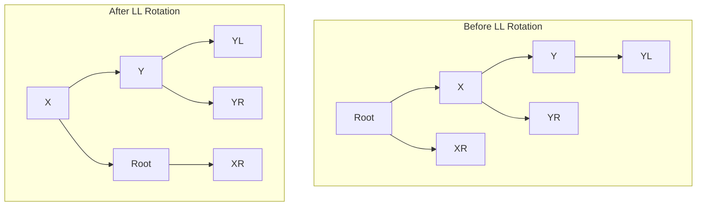



An AVL tree is a self-balancing **binary search tree** where the difference in heights between the left and right subtrees
(called the balance factor) is **at most 1** for every node.
- Empty Node is -1
- BF = Left Subtree - Right Subtree


# Rotations
- **LL → L goes Left**: A right heavy subtree is balanced by rotating to the left.
- **RR → R goes Right**: A left heavy subtree is balanced by rotating to the right.
- **LR → L first, then R**: Rotate left at the child, then right at the parent.
- **RL → R first, then L**: Rotate right at the child, then left at the parent.

# LL Rotations

```    
Right Child becomes the left child after LL rotation     
         *        *
        /          \
       /     =>     \
      /\            /\
```

### Simple LL Rotation
```
Before LL Rotation:              After LL Rotation:

        3                             2
       /                             / \
      2                             1   3
     /
    1
```

### Full LL rotation
```
Before LL Rotation:              After LL Rotation:

        Root                          X
        /                           /   \
       X                           Y     Root
      / \                         / \    /
     Y   XR                      YL  YR XR
    / \
   YL  YR
```



# RR Rotations

### Simple RR rotation
```
Right Child becomes the left child after RR rotation

      Before RR Rotation:              After RR Rotation:
        1                               2 (new Root)
         \                            /   \
          2                          1     3
           \
            3
```

```
Right Child becomes the left child after RR rotation
    *                  *       
     \                /           
      \     =>       /          
      /\            /\
```

### Full RR Rotation
```
Before RR Rotation:       After RR Rotation:

Root                          X (new Root)
   \                        /    \
    X                    Root     Y
   / \                      \    /  \
 XL    Y                    XL  YL  YR
     /  \
   YL    YR
```

# LR Rotation
```
Right rotation at the Left Child, then Left rotation at the root

Before Rotation:               Right Rotation at Left Child:              Left Rotation at Root:

    3                             3                                    2 (new root)
   /                             /                                   /    \
  1                             2 (new root of subtree)           1      3
   \                           / 
    2                         1
```

```java
public AVLNode leftRightRotate(AVLNode root) {
    root.setLeft(rightRotate(root.getLeft()));
    return leftRotate(root);
}
```

# RL Rotation

```
Before Rotation:     After Left Rotation at 3:      After Right Rotation at 1:

    1                        1                              2
     \                        \                           /   \
      3                        2                        1      3
     /                          \
    2                            3
```