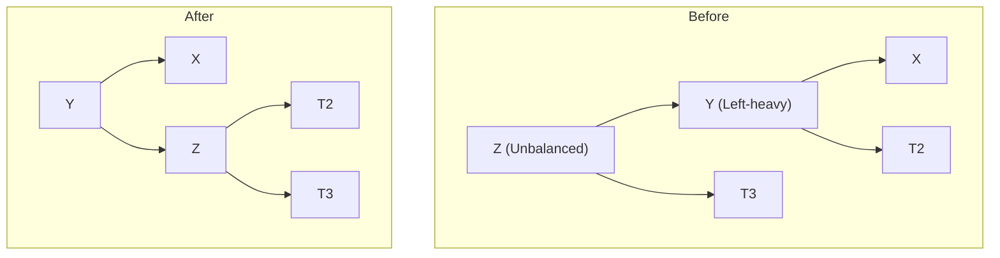
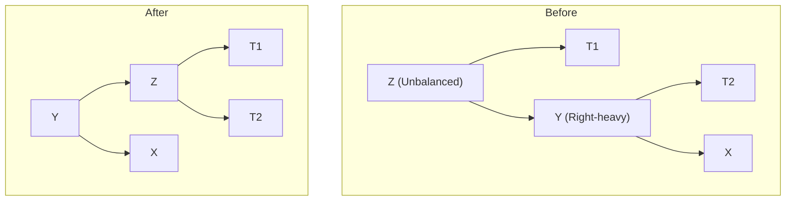



# 1. Right Rotation (RR)

```mermaid!
graph TD
    subgraph Before
        A["Z (Unbalanced)"]
        A --> B["Y (Left-heavy)"]
        A --> C["T3"]
        B --> D["X"]
        B --> E["T2"]
    end

    subgraph After
        F["Y"]
        F --> G["X"]
        F --> H["Z"]
        H --> I["T2"]
        H --> J["T3"]
    end
```

# 2. Left Rotation (LL)

```mermaid!
graph TD
    subgraph Before
        A["Z (Unbalanced)"]
        A --> B["T1"]
        A --> C["Y (Right-heavy)"]
        C --> D["T2"]
        C --> E["X"]
    end

    subgraph After
        F["Y"]
        F --> G["Z"]
        F --> H["X"]
        G --> I["T1"]
        G --> J["T2"]
    end
```
