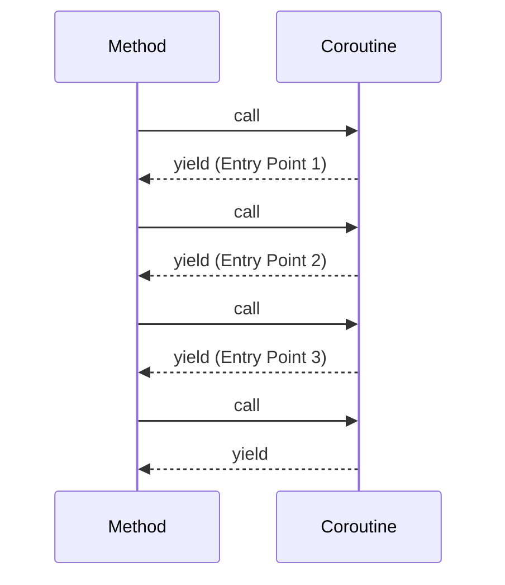

## History of multithreads

Java 1 : Threads -> one set of API for all machines. hardware independent

Java 5 : ExecutorServices API -> Pool of threads
* Issue 1: Pool induced deadlock
* One thread breaks the problem and throws in the pool and waits foe the result to come back
* All the threads in pool just divided the work, and no thread left to take care of the problem

Java 7 : Fork Join pool
* Work-stealing : the threads that divides problem, also solves one of the divided part

Java 8 : ParallelStreams and CompletableFutures
* uses Java 7 FJP
* Common Fork join pool

Java 21 : Virtual Threads
* Game changer 

# Defining Threads
By default, the platform threadsa re NON-DAEMON Threads, unless its explicitly marked daemon.

If any non daemon thread is running, the JVM will not shut it down even if the main thread has terminated.
[T1ThreadRunsParentDies.java](https://github.com/nitinkc/JavaConcepts/blob/main/src/main/java/nitin/multithreading/aBasics/T1ThreadRunsParentDies.java)
### extending Thread
Invoke
```java
// start a thread from a Thread
Thread thread = new SimpleThread();
thread.start();
```
Define
```java
class SimpleThread extends Thread {
    @Override
    public void run() {
    }
}
```

### Implementing Runnable
invoke the thread
```java
Runnable runnable = new SimpleRunnable();
Thread thread = new Thread(runnable);
```
Definition
```java
class SimpleRunnable implements Runnable {
    @Override
    public void run() {
    }
}
```

### Using Fluent API
Staring Daemon thread
```java
// start a daemon thread using Fluent API
Runnable r = new SimpleRunnable();
Thread thread = Thread.ofPlatform().name("Simple").daemon(true).start(r);
```

### Using Lambda
No need to explicitly use `thread.join()` as the Labmda (from the caller Thread) would get executed priort to moving onto the next line
```java
Thread.ofPlatform().start(() -> {
        TimeUnit.SECONDS.sleep(5);
});
```

### Using method Reference
```java
Thread thr = new Thread(MethodReferenceClass::doSomething);

Thread.ofPlatform().start(MethodReferenceClass::doSomething);
```

# Thread methods
get current thread
```java
Thread.currentThread();
```
interrupt
```java
thread.interrupt();
boolean isInterrupted= thread.isInterrupted();
```

join
```java
thread.join();
```
sleep
```java
thread.sleep(Duration.ofSeconds(2));
```
Set Daemon Status
```java
thread.setDaemon(true);
```

Unfortunately, the recommended approach (if you're using any of the application servers like Tomcat and WebLogic) is **none of the above**.
Creating platform threads is **highly discouraged**.
{: .notice--danger}

> BREATHER

Platform Thread is an expensive resource. Each thread is allocated 1 MB of memory by default.

Yet another problem is that starting a platform thread will take some time which might lead to performance issues.

The solution for both the problems is to create a thread pool (every application server creates). Tomcat, for example, would create 200 threads dedicated for user requests by default.

The size of the thread pool that is used in Spring Boot with Tomcat
- by default, Tomcat uses a threadpool size of 200.
- It means that If 250 concurrent users hit spring boot application, 50 of them are going to wait for a platform thread to process their request
- a user request for an application server would be handed over to an **already created thread** in a thread pool, rather than creating a brand new one.

# Fundamental shift in the thinking
Instead of creating a new thread to do a particular task, think about submitting a task to a threadpool

Thinking in this way allows us to separate the task from how the task will be executed.
> Telling what to do not HOW to do

We call this the execution policy of the task, which the idea behind the Java Futures. The thread pool contains a number of threads based on some policy

# Future

- Several callers can submit their tasks.
- These tasks get executed by the threads **inside the thread pool**.
- But note that after submission, the caller gets what is called as the **future**, which is a **logical reference to the executing task**.
- The task submission itself does not wait, but simply queues the request to the thread pool and returns back immediately with the future.

Now, each one of these concepts require a representation in Java.

In terms of interfaces for Tasks 
- [Runnable](https://docs.oracle.com/en/java/javase/21/docs/api/java.base/java/lang/Runnable.html#run()) and
- [Callable](https://docs.oracle.com/en/java/javase/21/docs/api/java.base/java/util/concurrent/Callable.html#call())
Any Java class which implements one of these Java interfaces is considered a task(could be a Lambda as both are functional interfaces)

interface which represents the abstraction of a thread pool is
- Executor Service

The applications will use the executor service interface to submit runnable or callable tasks.
{: .notice--info}

### Runnable vs Callable
[Runnable](https://docs.oracle.com/en/java/javase/21/docs/api/java.base/java/lang/Runnable.html#run())
doesn't return anything (`void`) nor does it explicitly indicate a check exception. 

Whereas [Callable](https://docs.oracle.com/en/java/javase/21/docs/api/java.base/java/util/concurrent/Callable.html#call())
returns an object of type `T` and throws exception

###  [Executor Service](https://docs.oracle.com/en/java/javase/21/docs/api/java.base/java/util/concurrent/ExecutorService.html#method-summary)
```java
public interface ExecutorService extends Executor, AutoCloseable{
    Future<?> submit(Runnable task);//Submits a Runnable task for execution and returns a Future representing that task.
    default void close();//Initiates an orderly shutdown in which previously submitted tasks are executed, but no new tasks will be accepted.
    void shutdown();//Initiates an orderly shutdown in which previously submitted tasks are executed, but no new tasks will be accepted.
    List<Runnable> shutdownNow();//Attempts to stop all actively executing tasks, halts the processing of waiting tasks, and returns a list of the tasks that were awaiting execution.
    .....
}
```
Note here that the executor service interface also implements AutoCloseable
- if you wrap executor service in a try with resources block, then the close() method will be automatically called.
- good use in virtual threads.


### ExecutorCompletionService

to handle the results of the tasks as they happen instead of get()

# Futures Limitations
Cannot create Asynchronous pipeline (Reactive style of programming) 
- (its imperative style. Have to tell what to do and how to do)

Cannot Complete a future

Limited Functionality

# CompletableFutures

```java
// Create a Completable Future
        CompletableFuture<String> future = new CompletableFuture<>();


```

# Problems with CompletableFutures

Railway track pattern is good in concept, but in implementation, 
* cognitive load : since there is skipping to then's or exceptionally's or the return type.

# Continuations and Coroutines

Don't want a Thread be blocked on a task. thread should be able to switch between the tasks

when a task is sleeping, thread should be able to do other things


**Subroutine** : Just a function, no state. Function you call and get a response.
@startuml
participant Method as A
participant Subroutine as B
participant Coroutine

    activate A

    A -> B: call Subroutine
    activate B #FFBBBB
    Note right of B: One Entry point.
    B --> A: return response
    deactivate B
skinparam sequenceMessageAlign center

activate Coroutine #green
A -> Coroutine: call
Note right of Coroutine: Entry point 1
activate Coroutine #gold
activate A #Red
Coroutine -> A: yield
deactivate Coroutine

A -> Coroutine: call
Note right of Coroutine: Entry point 2
activate Coroutine #gold
Coroutine -> A: yield 
deactivate Coroutine

A -> Coroutine: call
Note right of Coroutine: Entry point 3
activate Coroutine #gold
Coroutine -> A: yield 
deactivate Coroutine
deactivate A

@enduml

**Coroutine** : Cooperative Routine - no entry point, no exit point. Just like a conversations. Kind of weave in and 
weave out of the functions.


**Continuations** : Data structure that helps to restore the context of a call between calls to a coroutine
* Should be a data structure that you benefit from but should not be directly accessed. Be in the background.
* Continuations in Java are behind the scenes.

when a method yields using Continuation.yield() method, the Stack Frames and Code Pointer get stored in the related Continuation.

a Continuation can be run from inside another Continuation


```java
 private static final ContinuationScope SCOPE = new ContinuationScope("scope");
    // --add-exports java.base/jdk.internal.vm=ALL-UNNAMED in the gradle build package
    //Package 'jdk.internal.vm' is declared in module 'java.base', which does not export it to the unnamed module
    public static void main(String[] args) throws Exception {
        logShortMessage("Main method : START");

        Continuation continuation = new Continuation(SCOPE, ContinuationsAsCoroutines::continuationMethod);
        while (!continuation.isDone()) {//Run as long as Continuations are running.
            continuation.run();//Run with each Continuation.yield method
            logShortMessage("##### Continuation loop #####");
            Thread.sleep(Duration.ofSeconds(3));
        }
        logShortMessage("Main method : END");
    }


    private static void continuationMethod() {
        logShortMessage("continuationMethod : enter");
        Incrementer incrementer = new Incrementer(1, zonedDateTimeStr(ZonedDateTime.now()));

        logShortMessage("State 1 : " + incrementer);
        //Restores the state
        Continuation.yield(SCOPE);//Run until here and send the control back to the main method

        //Restore from previous point, Resumes the state
        modifyIncrementer(incrementer);
        logShortMessage("State 2 : " + incrementer);
        Continuation.yield(SCOPE);
    }
```


Virtual threads occupy very small amount of memory and uses the concept of mounting and unmounting in terms of 
context switching when Sleep or blocking operation is involved.

Thread can switch between tasks


//Do not confuse ExecutorService with pooling
 bvc
No sense to pool virtual threads

VirtualThreads are like qtips - use and throw

```log
DONE in : Main thread Thread[#1,main,5,main]
entering task1 Thread[#1,main,5,main]
entering task2 Thread[#1,main,5,main] #when the task 1 goes to sleep, same thread picks up task2
exiting task2 Thread[#1,main,5,main]
exiting task1 Thread[#1,main,5,main] - Value of x = 90 #When the coroutine comes back to task1, it remembers the 
state and prints the value. This is done via continuations
```