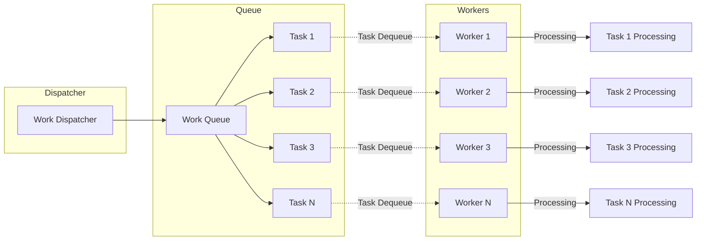
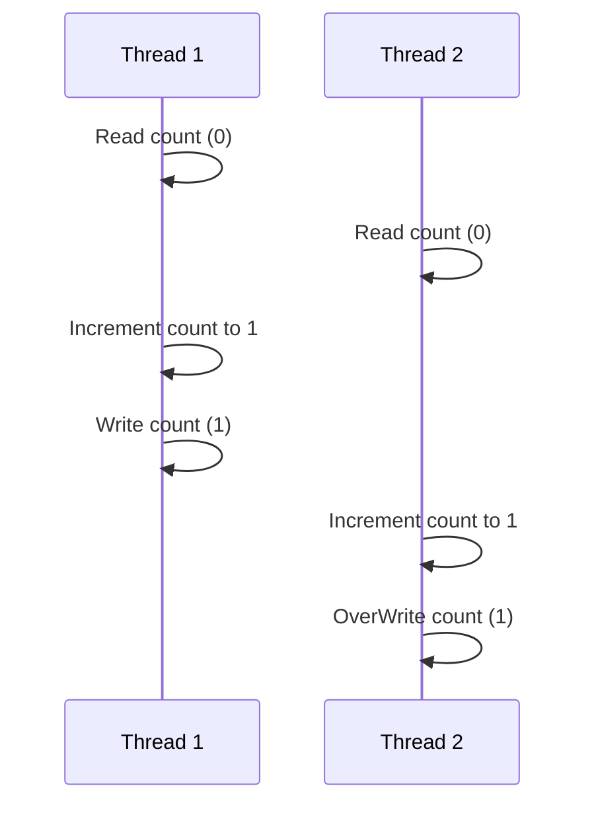
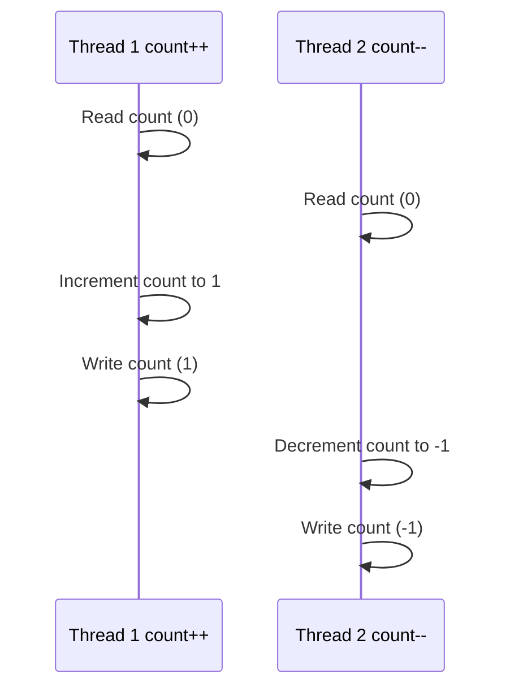




**What are Resources?**
- Variables
- Data structures (Objects)
- File or Connection handles
- Message queues or Work Queues
- Any Object

Heap is shared, Stack is for each thread so variables on the Stack is not sharable.



# Atomic Operation
- All-or-Nothing: The operation completes fully or does not start at all.
- Indivisibility: No other operations can interleave or interrupt the atomic operation.

In the given example, `counter++` is **not an atomic operation** as it involves 3 steps
- Fetch the current value of counter from memory.
- Increment the fetched value by 1.
- Store the incremented value back into counter.

If two threads execute counter++ simultaneously, they could both fetch the same 
initial value of counter, increment it, and then store the same new value, resulting in one increment instead of two. This is **a race condition**.
```java
private int counter;
 public void increment() {
    counter++;
}

public void decrement() {
    counter--;
}
```
We can Ensure Atomicity: 
- Using synchronized
  - on the method - monitor
  - using synchronized block - more granularity & flexibility but verbose
- Using AtomicInteger

```java
SharedClass sharedObject = new SharedClass();
Thread thread1 = new Thread(() -> sharedObject.increment());
Thread thread2 = new Thread(() -> sharedObject.decrement());

class SharedClass {
    private int counter = 0;

    public synchronized void increment() {
        this.counter++;
    }

    public synchronized void decrement() {
        this.counter--;
    }
}
```
When thread1 is executing `sharedObject.increment();` thread2 cannot execute `sharedObject.decrement();.
And when thread2 is executing sharedObject.decrement();thread1 cannot execute sharedObject.increment();
That is because both methods are synchronized, and belong to the same object (counter).


# Critical Section

As a general rule, you shouldn't expect to be creating your own interfaces, just to work with lambdas. 

The vast majority of likely operations, whether they have zero, one, or two arguments, including things dealing with
primitive return types, or primitive arguments, have probably been built for you.

And you should use the features of the java.util.function package when you need to create lambdas.

Concurrent systems -> different threads communicate with each other

Distributed Systems -> different processes communicate.

Concurrency vs parallelism

Reentrant Locks and Semaphores are introduced in Java 1.5

* Reentrant Locks (Mutex) allows only one thread in a critical section.
* Semaphore allows a fixed number of threads to access a critical section.

# Race Condition
- Condition when multiple threads accessing a shared resource
- At least one thread is modifying the shared resources
- The timing of thread scheduling may cause incorrect results
- the core of the problem is non-atomic operations performed on the shared resource

Interleaved Execution with Thread 1 and Thread 2: **NO COMMUNICATION**

Both threads incrementing



One thread incrementing, one decrementing


### Race Condition Solution
identify and protect the critical section by a synchronized block.

One thread incrementing, one decrementing
```java
//Run by increment thread
public synchronized void increment() {
    count++;
}
//Run by decrement thread
public synchronized void decrement() {
    count--;
}
```
# Data Race
Is `x` strictly greater then `y`
```java
private int x = 0, y = 0;

public void increment() {
    x++;//Does this run before y++ 
    y++;
}
// Check for the above hypothesis
public void checkForDataRace() {
    if (y > x) 
        System.out.println("y > x - Data Race is detected");
}
```
One thread running incrementing over and over again. One checker thread just to see if Data Race occurs.

Compiler and CPU may execute the instruction Out of order (if the instructions are independent) to optimize performance
- The logical correctness of the code is always maintained

**The compiler re-arranges the instructions for better**
- branch prediction (optimized loops, `if` statements etc.)
- Vectorization - parallel instruction execution (SIMD)
- Prefetching instructions - better cache performance

The CPU rearranges the code for better hardware units utilization

The following can't be rearranged as all instructions are interdependent
- lead to unexpected, paradoxical and incorrect results.
```java
x = 1;
y = x * 2;
```

the may be arranged by CPU or Compiler
```java
x++; y++;
//OR
y++; x++;
```

### Data Race - Solution
Establish a `Happens-Before` semantics by
- synchronization of methods
- volatile shared variables 

#### Volatile
- volatile variables are **stored in main memory** and their changes are visible to all threads immediately. 
  - The volatile keyword **prevents the CPU from caching** the variable’s value in a local register or cache.
- The volatile keyword **does not guarantee atomicity** for compound operations (e.g., incrementing a variable, count++). 
  - It only ensures that the latest value of the variable is visible across threads. 
  - For atomic operations, additional synchronization or atomic classes (like AtomicInteger) are needed.

volatile also provides a **guarantee about the ordering** of operations:

**`Happens-Before` Relationship**: Writes to a volatile variable establish a happens-before relationship with subsequent reads of that variable. 
- This means that any write to a volatile variable **happens-before any subsequent read** of that variable, ensuring proper visibility and ordering of operations.

**No Reordering**: The Java Memory Model guarantees that reads and writes to volatile variables **cannot be reordered** with respect to other 
reads and writes to volatile variables.

```java
volatile int sharedVar = 0;
public void task(){
  ...//All instructions WILL be execute before
  read/write(sharedVar);
  ...//All instructions will be executed after
}
```

**Implementation Details**
Here’s how the volatile keyword is typically implemented:

**Memory Barriers:** The Java Virtual Machine (JVM) uses memory barriers (or fences) to enforce the visibility and ordering guarantees. These barriers prevent the CPU and memory subsystem from reordering reads and writes to volatile variables.
- Store Barrier: Ensures that writes to volatile variables are not reordered with preceding writes.
- Load Barrier: Ensures that reads of volatile variables are not reordered with following reads.

synchronized - solves both race and data condition, but has performance penalty

Volatile 
- solves race condition for read/write from long and double
- solved all data races by guaranteeing order

Rule of thumb

Every shared variable (modified by at least one thread) should be either
- Guarded by a synchronized block (or any type of lock) OR
- declared volatile

# Locks
When we have multiple shared resources, should we use one lock for all the shared resources or individual lock
for each resource

**Coarse grain locking** - simplicity, but performance is not good.
- lots of suspended threads

**Fine-grained locking** - more control, but can cause deadlocks
- more programmatic control but prone to errors.


### Deadlocks
Problems when multiple locks are held.

**Mutual Exclusion** -  only one thread can have exclusive access to a resource at a given moment.

**Hold and Wait** - at least one thread is holding the resource and is waiting for another resource.

**Non-Preemptive Allocation** - a resource cannot be released until the thread using it is done using it.

**Circular Wait** - one thread holding resource A and waiting for another resource and vice versa.

Easiest solution to avoid deadlocks is to **break the Circular Wait condition**. 

Enforcing strict order on lock acquisition prevents deadlocks.
- lock resource in the same order everywhere
Deadlock detection : 

1. Watchdog

In microcontrollers, this watchdog is implemented by a low level routine that periodically
checks the status of a particular register.

That register needs to be updated by every thread, every few instructions, and if the watchdog detects
that this register hasn't been updated, it knows that the threads are not responsive and will simply
restart them in a similar way.

2. Thread Interruption  (not possible with synchronized)

3. tryLock Operations (not possible with synchronized)

## ReentrantLock
Works same as `synchronized` keyword applied to an object 
- but requires explicit locking and unlocking
  - prone to errors if forget to unlock, or if there is an exception after locking adn before unlocking
  - **SOLUTION** : always lock in the try block and unlock in the finally block
  - this pattern also helps when you want to unlock after `return` statement

##### Reentrancy
The same thread can acquire the read or write lock multiple times without causing a deadlock.
- For example, if a thread already holds the write lock, it can acquire it again without blocking.

##### Fairness
By default, it uses a non-fair policy where thread scheduling is not guaranteed to follow any specific order. 
- However, a fair version can be used where threads are granted locks in the order they requested them, which can help prevent thread starvation.

```java
Lock lock = new ReentrantLock();

public int task() {
    lock.lock();
    try {
      // Critical section
      return doTask();//returns an integer
    } finally {//Guaranteed to execute
        lock.unlock();//with return statements, thsi is the only way to unlock 
    }
}
```
With this extra complexity we have more control over lock & more Lock operations

### Queries
- `int getQueueLength()` : Returns an estimate of the number of threads waiting to acquire the lock.
- `Thread getOwner()` : Returns the thread currently holding the lock, or null if no thread holds the lock.
- `boolean isHeldByCurrentThread()` : Returns true if the current thread holds the lock.
- `boolean isLocked()` : Returns true if the lock is currently held by any thread.

By default,
both `synchronized` keyword and `ReentrantLock()` does not provide a fairness guarantee. 
- But, `ReentrantLock(true)` can be used to enforce fairness
- may affect the throughput as maintaining fairness comes with a cost.

### LockInterruptibly
- Useful with Watchdog for deadlock detection and recovery
- Waking up threads to do cleanup
```java
try{
    //lock.lock();
    lock.lockInterruptibly();
        ...
} catch(InterruptedException){
    if(Thread.currentThread().isInterrupted()){
        doCleanUp&Exit();
    }
}
```

### lock() and tryLock()
- never blocks
- Attempts to acquire the lock immediately.
- If the lock is available, it is acquired and the method returns true.
- If the lock is not available, it returns false immediately **without blocking** or waiting.

**Use Cases**
- tryLock(): When immediate feedback is needed without waiting. eg Video/Image processing, Trading systems, UI Applications
- tryLock(long time, TimeUnit unit): When waiting for a limited time is acceptable and you want to handle lock acquisition with a timeout.

Regular lock 
```java
lock.lock();//sleeps when the lock is not free
try{
   // Critical section
} finally() {
    lock.unlock();
}
```

##### Summary
```java
ReentrantLock lock = new ReentrantLock();
public void update(int key, int value) {
  lock.lock();
  try {
    writeToDatabase(key, value); //slow
  } finally {
    lock.unlock();
  }
}

public int read(int key) {
  lock.lock();
  try {
    return readFromDatabase(key); //slow
  } finally {
    lock.unlock();
  }
}
```

for `ReentrantLock lock = new ReentrantLock();`

How many threads can execute writeToDatabase(key, value); in the same time? Ans : 1
- The lock protects the critical section from concurrent access

How many threads can execute readFromDatabase(key); in the same time?
- Only **one thread** can access that method since it's guarded by a lock

## ReentrantReadWriteLock

`Synchronized` and `ReentrantLock` do not allow **multiple readers** to access a shared resource concurrently

But when read operatiosn are predominant or when read operations are not fast
- read from many variables
- read from complex data structure

Under these circumstances, mutual exclusion negatively impacts performance

```java
ReadWriteLock lock = new ReentrantReadWriteLock();
Lock readLock = lock.readLock();
Lock writeLock = lock.writeLock();
```
#### Read Lock
**Multiple threads can hold the read lock** simultaneously as long as no thread holds the write lock. 
- This is useful for scenarios where multiple threads need to read data concurrently without modifying it.

```java
public int read(int key) {
  readLock.lock();
  try {
    return readFromDatabase(key); //slow
  } finally {
    readLock.unlock();
  }
}
```

#### Write Lock:
Only one thread can hold the write lock at a time, and no other threads (either read or write) can acquire the lock. 
- This ensures exclusive access to the resource for modifications.

```java
public void update(int key, int value) {
  writeLock.lock();
  try {
    writeToDatabase(key, value); //slow
  } finally {
    writeLock.unlock();
  }
}
```
How many threads can execute `writeToDatabase(key, value);` in the same time?
- That method is guarded by a write lock, and only one thread can acquire a write lock at a time

How many threads can execute `readFromDatabase(key);`, at most at the same time?
- Since the method is guarded by a read lock. Many threads can acquire that lock as long as no other thread is holding the write lock

# Inter-thread Communications
basdkjsadnas

# Semaphore
[English meaning](https://www.merriam-webster.com/dictionary/semaphore)

Can be used to restrict the number of "users" to a particular resource or a group of resources

Unlike the locks that allows only one "user/thread" per resource.

Initializes a Semaphore with a given number of permits. The number of permits indicates how many threads can access the resource simultaneously.  
```java
Semaphore semaphore = new Semaphore(int permits);
```

##### Acquire and release a permit**

Acquires a permit from the semaphore, **blocking until a permit is available**. 
- Throws InterruptedException if the current thread is interrupted while waiting.

```java
try {
        semaphore.acquire();
// critical section
} catch (InterruptedException e) {
        Thread.currentThread().interrupt(); // restore interrupt status
} finally {//To ensure the release even if there is exception in the critical section
        semaphore.release();
}
```

##### tryAcquire()

```java
//if (semaphore.tryAcquire()) {//without time
if (semaphore.tryAcquire(1, TimeUnit.SECONDS)) {
    try {
        // critical section
    } finally {
        semaphore.release();
    }
} else {
    // handle failure to acquire permit
}
```

### Semaphore vs lock
Lock is a special case of Semaphore which `number_of_permits=1`

- Semaphore doen't have notion of owner thread
- Same thread can acquire the semaphore multiple times
- the binary semaphore (initialized with permits = 1) is **not reentrant**
  - if the same thread acquires it and tries to reaquire, its stuck and relies on other thread to release the semaphore

Semaphore can be released by any thread. 
- Even can be released by a thread that hasn't actually acquired it.
- That creates a bug as it allows 2 threads inside critical section which is not possible at all with locks

But Semaphore is great choice for other solutions for the problems such as Producer consumer problem

| Feature                           | Semaphore                                     | Lock                                                                                                                                                                                                                                         |
|-----------------------------------|-----------------------------------------------|----------------------------------------------------------------------------------------------------------------------------------------------------------------------------------------------------------------------------------------------|
| **Purpose**                       | Controls access to a resource by **maintaining a set number of permits**. | Ensures **only one thread can access a resource or critical section** at a time. Provides mutual exclusion.                                                                                                                                  |
| **Basic Operation**               | **Acquire**: Threads acquire permits before accessing the resource. If no permits are available, threads **block** until a permit becomes available.<br>**Release**: Threads release permits when done with the resource, allowing other waiting threads to acquire permits. | **Lock**: A thread acquires the lock to access the resource. If the lock is held by another thread, the current thread blocks until the lock is released.<br>**Unlock**: The thread releases the lock, allowing other threads to acquire it. |
| **Permit Count vs. Binary State** | A semaphore with 3 permits allows up to 3 threads to access the resource simultaneously. | A lock allows only one thread to enter a critical section.                                             |
| **Fairness**                      | Can be used in a fair manner, though fairness is not always guaranteed. | Some locks (e.g., `ReentrantLock` with fairness parameter set to true) can be configured to be fair, ensuring that threads acquire the lock in the order they requested it.                                                                  |
| **Lock as Special Case**       | A lock is a special case of a semaphore with `number_of_permits=1`.                                | N/A                                                                                                        |
| **No Owner Notion**            | Semaphore does not have a notion of an owner thread.                                               | Lock has an owner thread and ensures only the thread that acquired the lock can release it.                |
| **Reentrancy**                 | The same thread can acquire the semaphore multiple times.<br>**Binary Semaphore**: The binary semaphore (initialized with permits = 1) is **not reentrant**; if the same thread acquires it and tries to reacquire, it is stuck and relies on other threads to release the semaphore. | Reentrant locks (e.g., `ReentrantLock`) allow the same thread to acquire the lock multiple times.          |
| **Release by Any Thread**      | Semaphore permits can be released by any thread, even if it did not acquire the permit. This can create bugs as it allows multiple threads to enter a critical section simultaneously. | Locks can only be released by the thread that acquired them, ensuring exclusive access to the critical section. |
| **Example Use Cases**             | **Database Connection Pool**: Limiting the number of concurrent connections to a database.<br>**Thread Pool Management**: Limiting the number of concurrent threads executing tasks. | **Critical Section**: Ensuring that only one thread can modify a shared data structure or resource at a time.<br>**Atomic Operations**: Preventing race conditions when performing complex operations on shared resources.                   |

## Producer Consumer Problem
Able to have many producers and many consumers, and allow the consumers to apply back pressure on the producers, if the producers produce faster than the consumers can consume.


```java
final int QUEUE_CAPACITY = 10;
Semaphore emptySemaphore = new Semaphore(QUEUE_CAPACITY);
Semaphore fullSemaphore = new Semaphore(0);
ReentrantLock lock = new ReentrantLock();
Queue<Integer> queue = new ArrayDeque<>(); 
```


Producer
```java
 while (true) {
    emptySemaphore.acquire(); // Wait for an empty slot
      lock.lock(); // Lock access to the queue
        int item = produceItem(); // Produce an item
        queue.add(item); // Add item to the queue
      lock.unlock(); // Release the lock
    fullSemaphore.release(); // Signal that an item is available
}
```

Consumer
```java
while (true) {
    fullSemaphore.acquire(); // Wait for an available item
      lock.lock(); // Lock access to the queue
        int item = queue.remove(); // Remove item from the queue
        consumeItem(item); // Process the item
      lock.unlock(); // Release the lock
    emptySemaphore.release(); // Signal that an empty slot is available
```

# Condition Variables
Semaphore as particular example of condition variable `Is number of Permits > 0`
- if condition is not met thread-1 goes to sleep until another thread changes the semaphore's state.

Condition variable is always associated with a lock.
Lock ensures **atomic** check and modification of the shared variables involved in the condition.

```java
Lock lock  = new ReentrantLock();
Condition condition = lock.newCondition();
```

Example signalling
```java
Lock lock  = new ReentrantLock();
Condition condition = lock.newCondition();
//Shared resources
String username = null, password = null;
```

`await()` unlocks the lock, wait until signal or some time
```java
lock.lock();
try{
    while(username == null || password == null)
        //condition.await();
        condition.await(1, TimeUnit.SECONDS);
} finally {
    lock.unlock();
}
performTask();
```

`signal()` wakes up a single thread, waiting on the condition variable
```java
lock.lock();
try{
    username = getUserFromUiTextBox();
    password = getPasswordFromUiTextBox();
    condition.signal();
}finally(){
    lock.unlock();
}
```

# Lock Free Algorithms

Whats wrong with Locks ?
DEADLOCKS

Priority inversion


Why we need locks?

Multiple threads accessing shared resources

At least one thread is modifying the shared resources

Non-Atomic operation (eg. count++) - A single Java operation turns into one or more hardware operation

- fetch current value of count
- perform count+1
- reassign back to count

Lock free solutions 
- utilizes operations guaranteed to be one hardware operation
- A single hardware operation 
  - is Atomic by definition and thus
  - threadsafe
- 

# Atomic Operations in Java
Read/Assignment on all primitive types (except for long and double)
Read/Assigment on all references
Read/Assignment on all Volatile long and double


Avoid DataRaces

MAke all shared variables that you want to read or write Volatile
Read/Assignment on all Volatile Primitive types and references

# Atomic Classes in Java
Atomic classes in Java Concurrent atomic package

internally uses the unsafe class which provides access to low level, native methods

[Java Docs](https://docs.oracle.com/en/java/javase/21/docs/api/java.base/java/util/concurrent/atomic/package-summary.html)

# Synchronization Mechanisms in Java

### 1. Mutex (Lock) - ReentrantLock
A ReentrantLock is a more flexible lock than the built-in synchronized block.

**Advantages**:
- Can be unlocked in a different method or class from where it was locked.
- Provides more control over the lock (e.g., timed lock, interruptible lock).
- can maintain fairness `ReentrantLock(true)` but may come with a cost of throughput.
  use unlock in finally block so that it is always guaranteed that the resource is unlocked.


**Use Case**: When you need advanced locking features not provided by the synchronized block.

### 2. ReadWriteLock - ReentrantReadWriteLock
A ReadWriteLock allows multiple threads to read a resource concurrently but only one thread to write.

2 Types
**Advantages**:
- Improves performance in scenarios where reads are more frequent than writes.

**Use Case**: When you have a resource that is frequently read but infrequently written.

Since the method is guarded by a read lock. Many threads can acquire that lock as long as no other thread is holding the write lock

### 3. CountDownLatch
A CountDownLatch is used to make one or more threads wait until a set of operations being performed in other threads completes.

**Advantages**:
- Allows threads to wait for a specific condition to be met.

**Use Case**: Waiting for multiple threads to complete initialization tasks before proceeding.

### 4. CyclicBarrier
A CyclicBarrier allows a set of threads to wait for each other to reach a common barrier point.
- guarantee that some portion of the work is done by all threads before the rest of the work is performed.


### 5. Exchanger
An Exchanger allows two threads to exchange data with each other.

Advantages:
- Useful for thread communication where each thread provides data to the other.

Use Case: Pairwise data exchange between threads.

### 6. Phaser
A Phaser is a more flexible version of CountDownLatch and CyclicBarrier.

Advantages:
- Supports dynamic registration of parties and multiple phases of synchronization.

Use Case: Complex synchronization scenarios with multiple phases and dynamic participants.

### 7. StampedLock
A StampedLock is a lock that offers three modes for controlling read/write access.

Advantages:
- Provides an optimistic read mode, which can improve performance for read-heavy scenarios.

Use Case: When you need high-performance read access with occasional writes.

### 8. Condition Variables
Condition variables are used with locks to allow threads to wait for certain conditions to be met.

Advantages:
- Allows for complex waiting conditions.

Use Case: When threads need to wait for specific conditions before proceeding.

### 9. Atomic Variables
Atomic variables (e.g., AtomicInteger, AtomicLong, AtomicReference) provide lock-free thread-safe operations on single variables.

Advantages:
- Lower overhead compared to using locks.

Use Case: When you need to perform atomic operations on a single variable without the overhead of locking.


> Synchronization mechanisms like CountDownLatch and CyclicBarrier can be applicable in distributed systems.

Their usage and considerations differ compared to their usage in single-process applications. 
