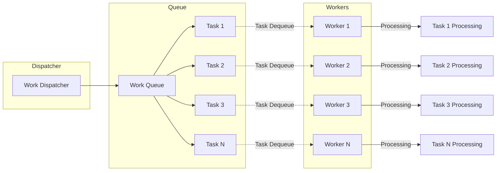

**What are Resources?**
- Variables
- Data structures (Objects)
- File or Connection handles
- Message queues or Work Queues
- Any Object

Heap is shared, Stack is for each thread so variables on the Stack is not sharable.



# Atomic Operation
- All-or-Nothing: The operation completes fully or does not start at all.
- Indivisibility: No other operations can interleave or interrupt the atomic operation.

In the given example, `counter++` is **not an atomic operation** as it involves 3 steps
- Fetch the current value of counter from memory.
- Increment the fetched value by 1.
- Store the incremented value back into counter.

If two threads execute counter++ simultaneously, they could both fetch the same 
initial value of counter, increment it, and then store the same new value, resulting in one increment instead of two. This is **a race condition**.
```java
private int counter;
 public void increment() {
    counter++;
}

public void decrement() {
    counter--;
}
```
We can Ensuring Atomicity: 
- Using synchronized
  - on the method - monitor
  - using synchronized block - more granularity & flexibility but verbose
- Using AtomicInteger

```java
SharedClass sharedObject = new SharedClass();
Thread thread1 = new Thread(() -> sharedObject.increment());
Thread thread2 = new Thread(() -> sharedObject.decrement());

class SharedClass {
    private int counter = 0;

    public synchronized void increment() {
        this.counter++;
    }

    public synchronized void decrement() {
        this.counter--;
    }
}
```
When thread1 is executing `sharedObject.increment();` thread2 cannot execute `sharedObject.decrement();.
And when thread2 is executing sharedObject.decrement();thread1 cannot execute sharedObject.increment();
That is because both methods are synchronized, and belong to the same object (counter).


# Critical Section

As a general rule, you shouldn't expect to be creating your own interfaces, just to work with lambdas. 

The vast majority of likely operations, whether they have zero, one, or two arguments, including things dealing with
primitive return types, or primitive arguments, have probably been built for you.

And you should use the features of the java.util.function package when you need to create lambdas.

Concurrent systems -> different threads communicate with each other

Distributed Systems -> different processes communicate.

Concurrency vs parallelism

Reentrant Locks and Semaphores are introduced in Java 1.5

* Reentrant Locks (Mutex) allows only one thread in a critical section.
* Semaphore allows a fixed number of threads to access a critical section.


# Synchronization Mechanisms in Java

### 1. Mutex (Lock) - ReentrantLock
A ReentrantLock is a more flexible lock than the built-in synchronized block.

**Advantages**:
- Can be unlocked in a different method or class from where it was locked. 
- Provides more control over the lock (e.g., timed lock, interruptible lock).

**Use Case**: When you need advanced locking features not provided by the synchronized block.

### 2. ReadWriteLock - ReentrantReadWriteLock
A ReadWriteLock allows multiple threads to read a resource concurrently but only one thread to write.

**Advantages**:
- Improves performance in scenarios where reads are more frequent than writes.

**Use Case**: When you have a resource that is frequently read but infrequently written.

### 3. CountDownLatch
A CountDownLatch is used to make one or more threads wait until a set of operations being performed in other threads completes.

**Advantages**:
- Allows threads to wait for a specific condition to be met.

**Use Case**: Waiting for multiple threads to complete initialization tasks before proceeding.

### 4. CyclicBarrier
A CyclicBarrier allows a set of threads to wait for each other to reach a common barrier point.

Advantages:
- Reusable, meaning it can be reset and used again after the waiting threads are released.

Use Case: When you need threads to wait for each other at multiple points in a program.

### 5. Exchanger
   An Exchanger allows two threads to exchange data with each other.

Advantages:
- Useful for thread communication where each thread provides data to the other.

Use Case: Pairwise data exchange between threads.

### 6. Phaser
A Phaser is a more flexible version of CountDownLatch and CyclicBarrier.

Advantages:
- Supports dynamic registration of parties and multiple phases of synchronization.

Use Case: Complex synchronization scenarios with multiple phases and dynamic participants.

### 7. StampedLock
A StampedLock is a lock that offers three modes for controlling read/write access.

Advantages:
- Provides an optimistic read mode, which can improve performance for read-heavy scenarios.

Use Case: When you need high-performance read access with occasional writes.

### 8. Condition Variables
Condition variables are used with locks to allow threads to wait for certain conditions to be met.

Advantages:
- Allows for complex waiting conditions.

Use Case: When threads need to wait for specific conditions before proceeding.

### 9. Atomic Variables
Atomic variables (e.g., AtomicInteger, AtomicLong, AtomicReference) provide lock-free thread-safe operations on single variables.

Advantages:
- Lower overhead compared to using locks.

Use Case: When you need to perform atomic operations on a single variable without the overhead of locking.


> Synchronization mechanisms like CountDownLatch and CyclicBarrier can be applicable in distributed systems.

Their usage and considerations differ compared to their usage in single-process applications. 