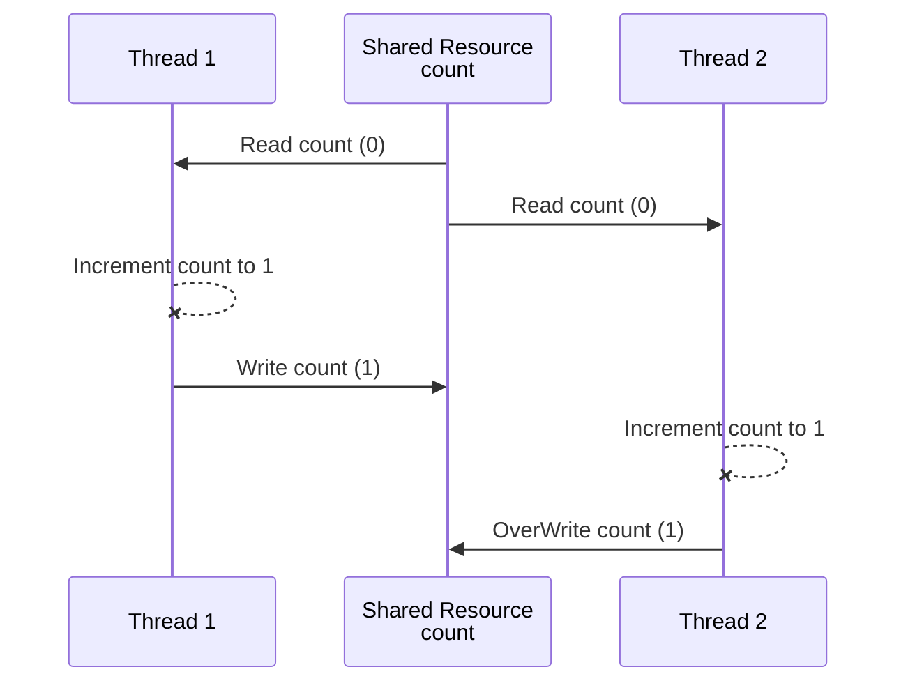
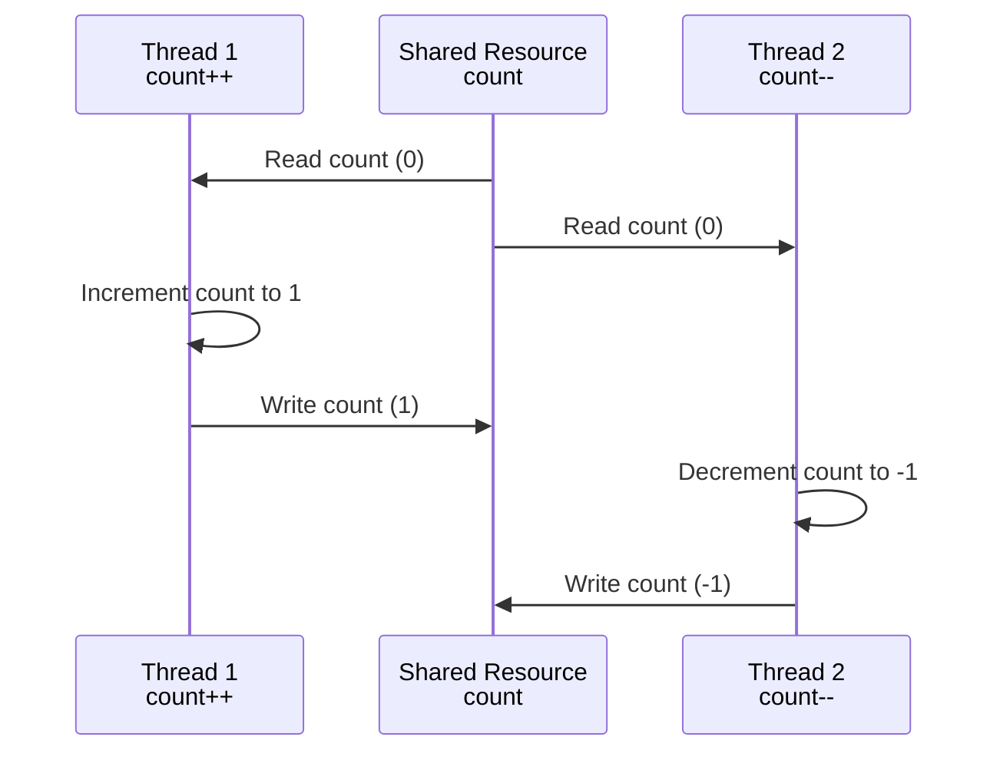



**What are Shared Resources?**
- Variables (Class level, static etc)
- Data structures (Objects)
- File or Connection handles
- Message queues or Work Queues
- Any Other Object

Heap is shared.
Stack is created for each thread so variables on the Stack aren’t shared.

Concurrent systems -> different threads communicate with each other

Distributed Systems -> different processes communicate.

Reentrant Locks and Semaphores are introduced in Java 1.5
* Reentrant Locks (Mutex) allows only one thread in a critical section.
* Semaphore allows a fixed number of threads to access a critical section.

# Atomic Operation
**All-or-Nothing**: The operation either completes fully or doesn’t start at all.
 
**Indivisibility**: No other operations can interleave or interrupt the atomic operation.

In the given example, `counter++` or `counter--` are **not atomic operation** as it involves 3 steps
- Fetch the current value of counter from memory.
- Increment the fetched value by 1.
- Store the incremented value back into counter.
  ```java
  private int counter;
  public void increment() {
      counter++;
  }
  
  public void decrement() {
      counter--;
  }
  ```
  
If two threads execute `counter++` simultaneously, they could both fetch the same
initial value of counter, increment it, and then store the same new value, resulting in one increment instead of two. 

This is a **race condition**.

# Critical Section
Critical Sections are parts of code that access shared resources and must be protected to prevent concurrent access issues.

- **Synchronized** Methods and Synchronized Blocks (with lock object) ensure that only one thread can access a critical section at a time.
- **ReentrantLocks** offer more control and flexibility compared to synchronized blocks.
- **Concurrent Collections** are thread-safe and can simplify handling shared data without manual synchronization.
  - **Examples**: ConcurrentHashMap, CopyOnWriteArrayList, BlockingQueue

# Race Condition
- Multiple threads accessing shared resources
- At least one thread is modifying the shared resources
- The timing of thread scheduling may cause incorrect results
- the core of the problem is **non-atomic operations** performed on the shared resource

**Non-Atomic operation** - A single Java operation(eg. count++) turns into two or more hardware operation
  - fetch current value of count
  - perform count+1
  - reassign back to count

### Interleaved Execution with a shared resource. 

**Both thread incrementing with NO COMMUNICATION**



**One thread incrementing, one decrementing**



### Race Condition Solution
**Ensuring Atomicity**

Identify and protect the critical section
- Using synchronized keyword
  - on the method - monitor
  - using synchronized block - more granularity & flexibility but verbose
- Using AtomicInteger

```java
//Run by increment thread
public synchronized void increment() {
    count++;
}
//Run by decrement thread
public synchronized void decrement() {
    count--;
}
```
- When thread1 is executing `increment();` thread2 can’t execute `decrement();`
- And when thread2 is executing `decrement();`thread1 can’t execute `increment();`

That is because both methods are synchronized, and belong to the same object (counter).

# Data Race
Is `x` strictly greater than `y`?
```java
private int x = 0, y = 0;
public void increment() {
    x++;//Does this always run before y++? 
    y++;
}
// Check for the above hypothesis
public void checkForDataRace() {
    if (y > x) 
        System.out.println("y > x - Data Race is detected");
}
```
- One thread running `increment()` method in a loop
- One checker thread just to see if Data Race occurs.

### Code rearrangement
Compiler and CPU **may** execute the instruction **Out of order** (if the instructions are independent) to optimize performance
- The logical correctness of the code is always maintained

[Java Compilation Optimization](https://nitinkc.github.io/java/compiler-code-optimization/)

**The compiler re-arranges the instructions for better**
- branch prediction (optimized loops, `if` statements etc.)
- Vectorization - parallel instruction execution (SIMD)
- Prefetching instructions - better cache performance

**The CPU rearranges the code for better** 
- hardware units utilization

The following can't be rearranged as all instructions are interdependent
- `y` depends on `x` and `z` depends on `y`ß
```java
x = 1;
y = x * 2;
z = y + 1;
```

The following code may be arranged by the Compiler or CPU
- leading to unexpected, paradoxical, and incorrect results.
```java
x++; y++;
//OR
y++; x++;
```

### Data Race - Solution
Establish a `Happens-Before` semantics by
- synchronization of methods
  - solves both race and data condition but has a performance penalty
- [volatile shared variables](https://nitinkc.github.io/java/Volatile/)
  - solves race condition for read/write from long and double
  - solves all data races by guaranteeing order

##### Rule of thumb
Every shared variable (modified by at least one thread) should be either
- Guarded by a synchronized block (or any type of lock) OR
- declared volatile

# Locks
When we have multiple shared resources, we can use
- one lock for all the shared resources 
  - **Coarse grain locking** - simplicity, but performance is not good.
  - lots of suspended threads
- individual lock for each resource
  - **Fine-grained locking** - more control, but can cause deadlocks
  - more programmatic control but prone to errors.

### Deadlocks
Problem when multiple locks are held.

For a deadlock to occur, all 4 conditions need to be met simultaneously.

| **Concept**                   | **Description**                                                                 |
|:------------------------------|:--------------------------------------------------------------------------------|
| **Mutual Exclusion**          | Only one thread can have exclusive access to a resource at a given moment.      |
| **Hold and Wait**             | At least one thread is holding a resource and is waiting for another resource.  |
| **Non-Preemptive Allocation** | A resource cannot be released until the thread using it is finished with it.    |
| **Circular Wait**             | A situation where one thread is holding resource A and waiting for resource B,  \ 
|                               | while another thread holds resource B and is waiting for resource A.            | 

The easiest solution to avoid deadlocks is to **break the Circular Wait condition**. 

Enforcing strict order on lock acquisition prevents deadlocks.
- lock resources in the same order everywhere



### Deadlock detection  

##### 1. Watchdog
In microcontrollers, this watchdog is implemented by a low level routine that periodically
checks the status of a particular register.

That register needs to be updated by every thread, every few instructions, and if the watchdog detects
that this register hasn't been updated, it knows that the threads aren’t responsive and will simply
restart them in a similar way.

##### 2. Thread Interruption (not possible with synchronized)

##### 3. tryLock Operations (not possible with synchronized)

# ReentrantLock
[https://nitinkc.github.io/java/multithreading/reentrant-lock/](https://nitinkc.github.io/java/multithreading/reentrant-lock/)

# Inter-thread Communications
basdkjsadnas

# Semaphore


# Lock Free Algorithms

What's wrong with Locks?
- DEADLOCKS
- slow critical section (if one thread holds the lock for long. The slowest thread determines the speed)
- Priority inversion when 2 threads share a lock, but the low-priority thread keeps getting scheduled ahead of more priority
  - Low-priority thread acquires the lock and is preempted (schedule out)
  - High-priority thread can’t progress because the low-priority thread is not scheduled to release the lock.
- Thread not releasing the lock (Kill Tolerance)
  - Thread dies, gets interrupted, or forgets to release the lock
  - Leaves all other threads hanging forever
  - Unrecoverable, just like deadlocks
  - To avoid, need to write more complex error-prone code.
- Performance overhead in having contention over a lock
  - Thread A acquires a lock
  - Thread B tries and gets blocked
  - Thread B is scheduled out (context switch)
  - Later Thread B is scheduled back (another context switch)
  - overhead for latency-sensitive applications (stock market data)


Lock free solutions 
- uses operations guaranteed to be executed as a single hardware operation
- A single hardware operation 
  - is Atomic by definition and thus
  - threadsafe


##  Atomic Operations in Java
Read/Assignment on all primitive types (except for long and double)
Read/Assigment on all references
Read/Assignment on all Volatile long and double


## Avoid DataRaces

Make all shared variables that you want to read or write Volatile
- ead/Assignment on all Volatile Primitive types and references

# Atomic Classes in Java
Atomic classes in Java Concurrent atomic package

internally uses the unsafe class which provides access to low level, native methods

[Java Docs](https://docs.oracle.com/en/java/javase/21/docs/api/java.base/java/util/concurrent/atomic/package-summary.html)

### AtomicInteger
```java
int initialValue = 0;
AtomicInteger atomicInteger = new AtomicInteger(initialValue);

//Increments by 1, 
int previousValue = atomicInteger.getAndIncrement();//return the PREVIUOS value
int updatedValue = atomicInteger.incrementAndGet();// return the NEW-VALUE

//Similarly for decrement

//addAndGet(delta), getAndAdd(delta) increments or decrements by delta(delta can be negative)
```
Pros
- Simplicity
- no synchronization or locks needed
- no race conditions or data races

Cons
- Only the operation itself is atomic
- There will still be race condition between 2 separate atomic operations

```java
int initialValue = 0;
AtomicInteger atomicInteger = new AtomicInteger(initialValue);

int a = atomicInteger.incrementAndGet();
int b = atomicInteger.addAndGet(-1); // SUBJECTED TO RACE CONDITION
```

Summary

AtomicInteger is a great tool for concurrent counting, without the complexity of using a lock

AtomicInteger should be used only when atomic operations are needed.
- it's on par and sometimes more performant than regular integer with lock protection

# AtomicReference<T>


# Synchronization Mechanisms in Java
[https://nitinkc.github.io/java/multithreading/synchronization-mechanism-java/](https://nitinkc.github.io/java/multithreading/synchronization-mechanism-java/)