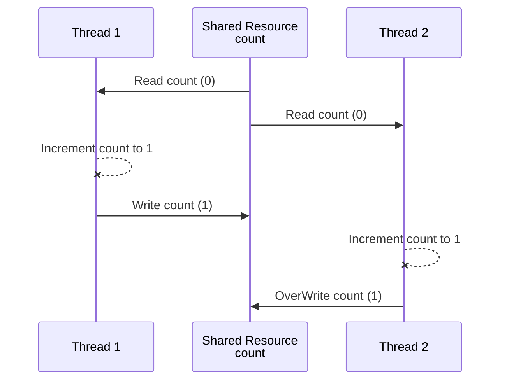
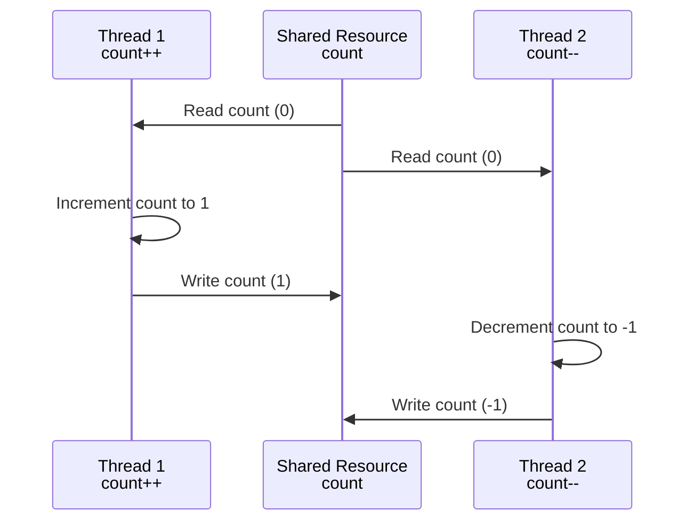



**What are Resources?**
- Variables
- Data structures (Objects)
- File or Connection handles
- Message queues or Work Queues
- Any Object

Heap is shared, Stack is for each thread so variables on the Stack is not shared.

# Atomic Operation
- All-or-Nothing: The operation completes fully or doesn’t start at all.
- Indivisibility: No other operations can interleave or interrupt the atomic operation.

In the given example, `counter++` is **not an atomic operation** as it involves 3 steps
- Fetch the current value of counter from memory.
- Increment the fetched value by 1.
- Store the incremented value back into counter.
  ```java
  private int counter;
   public void increment() {
      counter++;
  }
  
  public void decrement() {
      counter--;
  }
  ```
If two threads execute `counter++` simultaneously, they could both fetch the same
initial value of counter, increment it, and then store the same new value, resulting in one increment instead of two. 

This is **a race condition**.

### Ensuring Atomicity 
- Using synchronized keyword
  - on the method - monitor
  - using synchronized block - more granularity & flexibility but verbose
- Using AtomicInteger

```java
SharedClass sharedObject = new SharedClass();
Thread thread1 = new Thread(() -> sharedObject.increment());
Thread thread2 = new Thread(() -> sharedObject.decrement());

class SharedClass {
    private int counter = 0;

    public synchronized void increment() {
        this.counter++;
    }

    public synchronized void decrement() {
        this.counter--;
    }
}
```
When thread1 is executing `sharedObject.increment();` thread2 can’t execute `sharedObject.decrement();`

And when thread2 is executing `sharedObject.decrement();`thread1 can’t execute `sharedObject.increment();`

That is because both methods are synchronized, and belong to the same object (counter).

# Critical Section

Concurrent systems -> different threads communicate with each other

Distributed Systems -> different processes communicate.

Reentrant Locks and Semaphores are introduced in Java 1.5

* Reentrant Locks (Mutex) allows only one thread in a critical section.
* Semaphore allows a fixed number of threads to access a critical section.

# Race Condition
- Condition when multiple threads accessing a shared resource
- At least one thread is modifying the shared resources
- The timing of thread scheduling may cause incorrect results
- the core of the problem is **non-atomic operations** performed on the shared resource

Interleaved Execution (incrementing a shared resource) with Thread 1 and Thread 2 with **NO COMMUNICATION**



**One thread incrementing, one decrementing**



### Race Condition Solution
identify and protect the critical section by a synchronized block.
```java
//Run by increment thread
public synchronized void increment() {
    count++;
}
//Run by decrement thread
public synchronized void decrement() {
    count--;
}
```

# Data Race
Is `x` strictly greater than `y`?
```java
private int x = 0, y = 0;
public void increment() {
    x++;//Does this run before y++ 
    y++;
}
// Check for the above hypothesis
public void checkForDataRace() {
    if (y > x) 
        System.out.println("y > x - Data Race is detected");
}
```
- One thread running `increment()` method
- One checker thread just to see if Data Race occurs.

Compiler and CPU may execute the instruction Out of order (if the instructions are independent) to optimize performance
- The logical correctness of the code is always maintained

[https://nitinkc.github.io/java/compiler-code-optimization/](https://nitinkc.github.io/java/compiler-code-optimization/)

**The compiler re-arranges the instructions for better**
- branch prediction (optimized loops, `if` statements etc.)
- Vectorization - parallel instruction execution (SIMD)
- Prefetching instructions - better cache performance

**The CPU rearranges the code for better** 
- hardware units utilization

The following can't be rearranged as all instructions are interdependent
```java
x = 1;
y = x * 2;
```

this code may be arranged by Compiler or CPU
- lead to unexpected, paradoxical, and incorrect results.

```java
x++; y++;
//OR
y++; x++;
```

### Data Race - Solution
Establish a `Happens-Before` semantics by
- synchronization of methods
  - solves both race and data condition but has a performance penalty
- [volatile shared variables](https://nitinkc.github.io/java/Volatile/)
  - solves race condition for read/write from long and double
  - solves all data races by guaranteeing order

##### Rule of thumb
Every shared variable (modified by at least one thread) should be either
- Guarded by a synchronized block (or any type of lock) OR
- declared volatile

# Why do we need locks?
- Multiple threads accessing shared resources
- At least one thread is modifying the shared resources
- Non-Atomic operation (eg. count++) - A single Java operation turns into one or more hardware operation
  - fetch current value of count
  - perform count+1
  - reassign back to count

When we have multiple shared resources, we can use
- one lock for all the shared resources 
  - **Coarse grain locking** - simplicity, but performance is not good.
  - lots of suspended threads
- individual lock for each resource
  - **Fine-grained locking** - more control, but can cause deadlocks
  - more programmatic control but prone to errors.

### Deadlocks - Problems when multiple locks are held.

## Key Concepts in Resource Management

| **Concept**                   | **Description**                                                                 |
|:------------------------------|:--------------------------------------------------------------------------------|
| **Mutual Exclusion**          | Only one thread can have exclusive access to a resource at a given moment.      |
| **Hold and Wait**             | At least one thread is holding a resource and is waiting for another resource.  |
| **Non-Preemptive Allocation** | A resource cannot be released until the thread using it is finished with it.    |
| **Circular Wait**             | A situation where one thread is holding resource A and waiting for resource B,\ 
|| while another thread holds resource B and is waiting for resource A.            | 


The easiest solution to avoid deadlocks is to **break the Circular Wait condition**. 

Enforcing strict order on lock acquisition prevents deadlocks.
- lock resources in the same order everywhere

### Deadlock detection  

##### 1. Watchdog

In microcontrollers, this watchdog is implemented by a low level routine that periodically
checks the status of a particular register.

That register needs to be updated by every thread, every few instructions, and if the watchdog detects
that this register hasn't been updated, it knows that the threads aren’t responsive and will simply
restart them in a similar way.

##### 2. Thread Interruption (not possible with synchronized)

##### 3. tryLock Operations (not possible with synchronized)

## ReentrantLock
Works same as `synchronized` keyword applied to an object 
- but requires explicit locking and unlocking
  - prone to errors if forget to unlock, or if there is an exception after locking and before unlocking

**SOLUTION** : always lock in the try block and unlock in the finally block
  - this pattern also helps when you want to unlock after `return` statement

##### Reentrancy
The same thread can acquire the read or write lock multiple times without causing a deadlock.
- For example, if a thread already holds the write lock, it can acquire it again without blocking.

##### Fairness
By default, it uses a non-fair policy where thread scheduling is not guaranteed to follow any specific order. 
- However, a fair version can be used where threads are granted locks in the order they requested them, which can help prevent thread starvation.

```java
Lock lock = new ReentrantLock();

public int task() {
    lock.lock();
    try {
      // Critical section
      return doTask();//returns an integer
    } finally {//Guaranteed to execute
        lock.unlock();//with return statements, this is the only way to unlock 
    }
}
```
With this extra complexity we have more control over lock & get more Lock operations

#### Queries
- `int getQueueLength()` : Returns an estimate of the number of threads waiting to acquire the lock.
- `Thread getOwner()` : Returns the thread currently holding the lock, or null if no thread holds the lock.
- `boolean isHeldByCurrentThread()` : Returns true if the current thread holds the lock.
- `boolean isLocked()` : Returns true if the lock is currently held by any thread.

By default,
both `synchronized` keyword and `ReentrantLock()` **does not** provide a fairness guarantee. 
- But, `ReentrantLock(true)` can be used to enforce fairness
- may affect the throughput as maintaining fairness comes with a cost.

### LockInterruptibly
- Useful with Watchdog for deadlock detection and recovery
- Waking up threads to do cleanup
```java
try{
    //lock.lock();
    lock.lockInterruptibly();
        ...
} catch(InterruptedException){
    if(Thread.currentThread().isInterrupted()){
        doCleanUp&Exit();
    }
}
```

### lock() and tryLock()
- never blocks
- Attempts to acquire the lock immediately.
- If the lock is available, it is acquired and the method returns true.
- If the lock is not available, it returns false immediately **without blocking** or waiting.

**Use Cases**
- tryLock(): When immediate feedback is needed without waiting. eg Video/Image processing, Trading systems, UI Applications
- tryLock(long time, TimeUnit unit): When waiting for a limited time is acceptable and you want to handle lock acquisition with a timeout.

Regular lock 
```java
lock.lock();//sleeps when the lock is not free
try{
   // Critical section
} finally() {
    lock.unlock();
}
```

##### Summary
```java
ReentrantLock lock = new ReentrantLock();
public void update(int key, int value) {
  lock.lock();
  try {
    writeToDatabase(key, value); //slow
  } finally {
    lock.unlock();
  }
}

public int read(int key) {
  lock.lock();
  try {
    return readFromDatabase(key); //slow
  } finally {
    lock.unlock();
  }
}
```

for `ReentrantLock lock = new ReentrantLock();`

How many threads can execute writeToDatabase(key, value); in the same time? Ans : 1
- The lock protects the critical section from concurrent access

How many threads can execute readFromDatabase(key); in the same time?
- Only **one thread** can access that method since it's guarded by a lock

## ReentrantReadWriteLock

`Synchronized` and `ReentrantLock` do not allow **multiple readers** to access a shared resource concurrently

But when read operatiosn are predominant or when read operations aren’t fast
- read from many variables
- read from complex data structure

Under these circumstances, mutual exclusion negatively impacts performance

```java
ReadWriteLock lock = new ReentrantReadWriteLock();
Lock readLock = lock.readLock();
Lock writeLock = lock.writeLock();
```
#### Read Lock
**Multiple threads can hold the read lock** simultaneously as long as no thread holds the write lock. 
- This is useful for scenarios where multiple threads need to read data concurrently without modifying it.

```java
public int read(int key) {
  readLock.lock();
  try {
    return readFromDatabase(key); //slow
  } finally {
    readLock.unlock();
  }
}
```

#### Write Lock:
Only one thread can hold the write lock at a time, and no other threads (either read or write) can acquire the lock. 
- This ensures exclusive access to the resource for modifications.

```java
public void update(int key, int value) {
  writeLock.lock();
  try {
    writeToDatabase(key, value); //slow
  } finally {
    writeLock.unlock();
  }
}
```
How many threads can execute `writeToDatabase(key, value);` in the same time?
- That method is guarded by a write lock, and only one thread can acquire a write lock at a time

How many threads can execute `readFromDatabase(key);`, at most at the same time?
- Since the method is guarded by a read lock. Many threads can acquire that lock as long as no other thread is holding the write lock

# Inter-thread Communications
basdkjsadnas

# Semaphore
[English meaning](https://www.merriam-webster.com/dictionary/semaphore)


Can be used to restrict the **number of "users"** to a particular resource or a group of resources

Unlike the **locks that allows only one** "user/thread" per resource.

Initializes a Semaphore with a given number of permits. The number of permits indicates how many
threads can access the resource simultaneously.  
```java
Semaphore semaphore = new Semaphore(int permits);
```

##### Acquire and release a permit

Acquires a permit from the semaphore, **blocking until a permit is available**. 
- Throws InterruptedException if the current thread is interrupted while waiting.

```java
try {
        semaphore.acquire();
// critical section
} catch (InterruptedException e) {
        Thread.currentThread().interrupt(); // restore interrupt status
} finally {//To ensure the release even if there is exception in the critical section
        semaphore.release();
}
```

##### tryAcquire()

```java
//if (semaphore.tryAcquire()) {//without time
if (semaphore.tryAcquire(1, TimeUnit.SECONDS)) {
    try {
        // critical section
    } finally {
        semaphore.release();
    }
} else {
    // handle failure to acquire permit
}
```

### Semaphore vs lock
Lock is a special case of Semaphore which `number_of_permits=1`

- Semaphore doen't have notion of owner thread
- Same thread can acquire the semaphore multiple times
- the binary semaphore (initialized with permits = 1) is **not reentrant**
  - if the same thread acquires it and tries to reaquire, its stuck and relies on other thread to release the semaphore

Semaphore can be released by any thread. 
- Even can be released by a thread that hasn't actually acquired it.
- That creates a bug as it allows 2 threads inside critical section which is not possible at all with locks

But Semaphore is great choice for other solutions for the problems such as Producer consumer problem

| Feature                           | Semaphore                                     | Lock                                                                                                                                                                                                                                         |
|-----------------------------------|-----------------------------------------------|----------------------------------------------------------------------------------------------------------------------------------------------------------------------------------------------------------------------------------------------|
| **Purpose**                       | Controls access to a resource by **maintaining a set number of permits**. | Ensures **only one thread can access a resource or critical section** at a time. Provides mutual exclusion.                                                                                                                                  |
| **Basic Operation**               | **Acquire**: Threads acquire permits before accessing the resource. If no permits are available, threads **block** until a permit becomes available.<br>**Release**: Threads release permits when done with the resource, allowing other waiting threads to acquire permits. | **Lock**: A thread acquires the lock to access the resource. If the lock is held by another thread, the current thread blocks until the lock is released.<br>**Unlock**: The thread releases the lock, allowing other threads to acquire it. |
| **Permit Count vs. Binary State** | A semaphore with 3 permits allows up to 3 threads to access the resource simultaneously. | A lock allows only one thread to enter a critical section.                                             |
| **Fairness**                      | Can be used in a fair manner, though fairness is not always guaranteed. | Some locks (e.g., `ReentrantLock` with fairness parameter set to true) can be configured to be fair, ensuring that threads acquire the lock in the order they requested it.                                                                  |
| **Lock as Special Case**       | A lock is a special case of a semaphore with `number_of_permits=1`.                                | N/A                                                                                                        |
| **No Owner Notion**            | Semaphore does not have a notion of an owner thread.                                               | Lock has an owner thread and ensures only the thread that acquired the lock can release it.                |
| **Reentrancy**                 | The same thread can acquire the semaphore multiple times.<br>**Binary Semaphore**: The binary semaphore (initialized with permits = 1) is **not reentrant**; if the same thread acquires it and tries to reacquire, it is stuck and relies on other threads to release the semaphore. | Reentrant locks (e.g., `ReentrantLock`) allow the same thread to acquire the lock multiple times.          |
| **Release by Any Thread**      | Semaphore permits can be released by any thread, even if it did not acquire the permit. This can create bugs as it allows multiple threads to enter a critical section simultaneously. | Locks can only be released by the thread that acquired them, ensuring exclusive access to the critical section. |
| **Example Use Cases**             | **Database Connection Pool**: Limiting the number of concurrent connections to a database.<br>**Thread Pool Management**: Limiting the number of concurrent threads executing tasks. | **Critical Section**: Ensuring that only one thread can modify a shared data structure or resource at a time.<br>**Atomic Operations**: Preventing race conditions when performing complex operations on shared resources.                   |

## Producer Consumer Problem
Able to have many producers and many consumers, and allow the consumers to apply back pressure on the producers, if the producers produce faster than the consumers can consume.


```java
final int QUEUE_CAPACITY = 10;
Semaphore emptySemaphore = new Semaphore(QUEUE_CAPACITY);
Semaphore fullSemaphore = new Semaphore(0);
ReentrantLock lock = new ReentrantLock();
Queue<Integer> queue = new ArrayDeque<>(); 
```


Producer
```java
 while (true) {
    emptySemaphore.acquire(); // Wait for an empty slot
      lock.lock(); // Lock access to the queue
        int item = produceItem(); // Produce an item
        queue.add(item); // Add item to the queue
      lock.unlock(); // Release the lock
    fullSemaphore.release(); // Signal that an item is available
}
```

Consumer
```java
while (true) {
    fullSemaphore.acquire(); // Wait for an available item
      lock.lock(); // Lock access to the queue
        int item = queue.remove(); // Remove item from the queue
        consumeItem(item); // Process the item
      lock.unlock(); // Release the lock
    emptySemaphore.release(); // Signal that an empty slot is available
```

# Condition Variables
Semaphore as particular example of condition variable `Is number of Permits > 0`
- if condition is not met thread-1 goes to sleep until another thread changes the semaphore's state.

Condition variable is always associated with a lock.
Lock ensures **atomic** check and modification of the shared variables involved in the condition.

```java
Lock lock  = new ReentrantLock();
Condition condition = lock.newCondition();
```

Example signalling
```java
Lock lock  = new ReentrantLock();
Condition condition = lock.newCondition();
//Shared resources
String username = null, password = null;
```

`await()` unlocks the lock, wait until signal or some time
```java
lock.lock();
try{
    while(username == null || password == null)
        //condition.await();
        condition.await(1, TimeUnit.SECONDS);
} finally {
    lock.unlock();
}
performTask();
```

`signal()` wakes up a single thread, waiting on the condition variable
```java
lock.lock();
try{
    username = getUserFromUiTextBox();
    password = getPasswordFromUiTextBox();
    condition.signal();
}finally(){
    lock.unlock();
}
```

# Lock Free Algorithms

What's wrong with Locks?
- DEADLOCKS
- slow critical section (if one thread holds the lock for long. The slowest thread determines the speed)
- Priority inversion when 2 threads share a lock, but the low-priority thread keeps getting scheduled ahead of more priority
  - Low-priority thread acquires the lock and is preempted (schedule out)
  - High-priority thread can’t progress because the low-priority thread is not scheduled to release the lock.
- Thread not releasing the lock (Kill Tolerance)
  - Thread dies, gets interrupted, or forgets to release the lock
  - Leaves all other threads hanging forever
  - Unrecoverable, just like deadlocks
  - To avoid, need to write more complex error-prone code.
- Performance overhead in having contention over a lock
  - Thread A acquires a lock
  - Thread B tries and gets blocked
  - Thread B is scheduled out (context switch)
  - Later Thread B is scheduled back (another context switch)
  - overhead for latency-sensitive applications (stock market data)


Lock free solutions 
- uses operations guaranteed to be executed as a single hardware operation
- A single hardware operation 
  - is Atomic by definition and thus
  - threadsafe


##  Atomic Operations in Java
Read/Assignment on all primitive types (except for long and double)
Read/Assigment on all references
Read/Assignment on all Volatile long and double


## Avoid DataRaces

Make all shared variables that you want to read or write Volatile
- ead/Assignment on all Volatile Primitive types and references

# Atomic Classes in Java
Atomic classes in Java Concurrent atomic package

internally uses the unsafe class which provides access to low level, native methods

[Java Docs](https://docs.oracle.com/en/java/javase/21/docs/api/java.base/java/util/concurrent/atomic/package-summary.html)

### AtomicInteger
```java
int initialValue = 0;
AtomicInteger atomicInteger = new AtomicInteger(initialValue);

//Increments by 1, 
int previousValue = atomicInteger.getAndIncrement();//return the PREVIUOS value
int updatedValue = atomicInteger.incrementAndGet();// return the NEW-VALUE

//Similarly for decrement

//addAndGet(delta), getAndAdd(delta) increments or decrements by delta(delta can be negative)
```
Pros
- Simplicity
- no synchronization or locks needed
- no race conditions or data races

Cons
- Only the operation itself is atomic
- There will still be race condition between 2 separate atomic operations

```java
int initialValue = 0;
AtomicInteger atomicInteger = new AtomicInteger(initialValue);

int a = atomicInteger.incrementAndGet();
int b = atomicInteger.addAndGet(-1); // SUBJECTED TO RACE CONDITION
```

Summary

AtomicInteger is a great tool for concurrent counting, without the complexity of using a lock

AtomicInteger should be used only when atomic operations are needed.
- it's on par and sometimes more performant than regular integer with lock protection

# AtomicReference<T>


