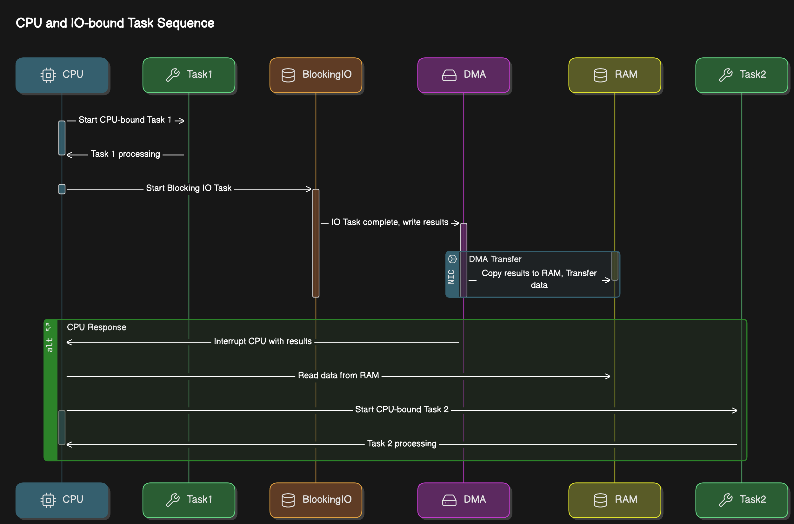
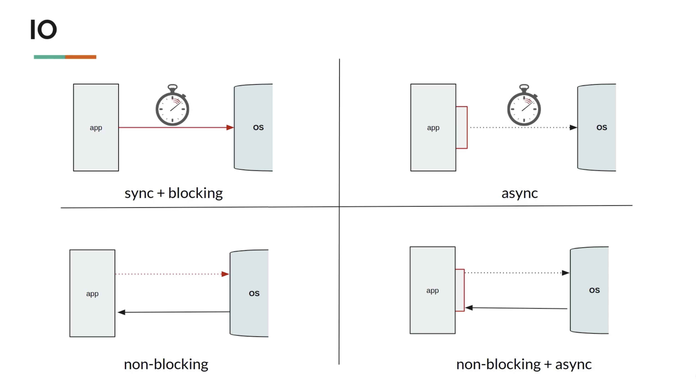



**Concurrency** : looking for a new job, while working on the current job, during office hours.

**Parallelism** : maintaining 2 jobs, with 2 managers, without telling either manager

**Asynchronous** : While Brewing coffee, read emails and get back to coffee when it's done.


# What is IO

The CPU can access the memory directly at any time, so our program can read from or write to variables from the memory without the operating system's involvement.

On the other hand, the CPU doesn't have direct access to peripheral devices (mouse, keyboard, NIC, Monitor, Disk drive), 

CPU can communicate with the controller of each device to either send it some data, or receive some data 

During the time that the specific device is doing its work, or when the device is idle.

request to the network hasn't yet arrived, the CPU can continue running other tasks.


### IO Bound Application
```java
public List<Dto> getData(RequestBody req){
    Request request = parseIncomingRequest(req);//CPU Bound task
    Data data = service.getDataFromDb(request);//IO Bound Task, Thread is blocked until the task is done
    List<Dto> dtoList = mapper.map(data);//CPU Bound task
    return dtoList;
}
```
**The CPU has nothing to do**.

# Parallel vs Concurrent
**Parallelism**
- Walk and Talk in parallel, exactly at the same time (in 2 cores of a CPU)
```
                       v
                       | [Time Slice v]
thread1-talk   T   T   T   T
thread2-walk   W       W
time  t=0--------------^-------------------->t
```

**Concurrency**
Talk & Drink, but not at the Same time. 
- hold one task and resume it once another is done
```java
                     v                    v
                     |Time slice          |Another timeslice
thread1 - Talk   T   T    T   | T   T   T |  T  T
thread2 - Drink      |        D           D
time  t=0------------^--------^-----------^-------->t
```


# Parallel vs Asynchronous
Asynchronous means `Non Blocking`
* **Non Blocking** : when you make a method call, you don't have to wait for it to complete
* Does not block the **thread of execution** and wait to finish.
* however, **tasks** are always blocking (default behaviour of a thread)

For a Thread to be non-blocking, these 2 properties should meet
- **responsiveness** : main thread should always **delegate** and be available for next step
  * Eg: Click on download button and then cancel
    * if main thread takes care of downloading, then the cancel button is blocked until the download is finished
- **Pre-emptible** : the ability of a system or thread to be interrupted or preempted by other tasks or threads. 
  - In a preemptible system, a running thread can be paused or stopped by the system scheduler to allow other threads or processes to execute.

Both parallel and Async processes run in a separate thread (other than main thread)
{: .notice--info}

For parallel, the thread needs to **JOIN** i.e. the slowest process/thread will determine the overall speed.
* pen refills (10), cap(20 per hour0  ) and body(50 body per hours) example. Total pens per hour = 10

For Asynchronous, not waiting for completion, but when results does arrive, move on to do other things with it.
    * use the call back to receive response
    * or use a promise

## Asynchronous Task Execution Engine 
> Executor Service was introduced in Java 1.5

Execution Engine has
- Work Queue (Blocking Queue)
- Completion Queue
- Thread Pool

As soon as the work is **placed** in the work queue, you get **Future**.

Future is a proxy or reference of the result that **will be returned** in the Future

Fork Join Framework (used in parallel stream behind the scenes) -> Java 7 (Extends ExecutorService)

# Async & non blocking programming Features

### Call back
(Callback Hell) - When the response is received, execute the function

* ```java
    doSomething(data, response -> {...})
    ```
* CallBack lacks consistency
* Really hard to compose call backs
* hard to deal with error

> Callback hell to Promises

### Promise 
When done with the task, update through the promise by any one of the three states
- Pending
- Resolved
- Rejected

Promise has 2 channels -> data channel & error channel

## Railway Track pattern

Treat error as another form of data and as first class citizens

```java
data track  -----f------f     recovering from exception       f--or continue with then methods-----
                          \                                  /
error track ----------------f---can retrun default data-----f----or handle exception---------------
```

```java
HappyPath==========================D==========D=======================
data -> function -> Promise -> f-> P -> f  -> P -> f -> P -> f-> P -> f       
UnhappyPath===========================================Exception==E=======

```

# CompletableFuture

CompletableFutures in Java is the same as Promise in Javascript

##### Javascript code
Javascript is dynamically typed


| Current State | Next State | Function called            |
|:--------------|:-----------|:---------------------------|
| resolved      | resolved   | next then in the pipeline  | 
| resolved      | rejected   | next catch in the pipeline |
| rejected      | resolved   | next then in the pipeline  |
| rejected      | resolved   | next catch in the pipeline |

##### Java
Java is statically typed, so we have to provide the type of CompletableFuture in the declaration



### CompletableFuture - ThreadPool

By Default Completable future uses the **Common ForkJoinPool**. 
Which means that the number of threads in a common forkjoin pool is equal to the number of cores
in the machine `Runtime.getRuntime().availableProcessors()`

Common ForkJoinPool is shared by

* ParallelStreams
* CompletableFuture

And thus, **user defined thread pool** is also an option to avoid for resource waiting scenarios arising from common thread pool.

CompletableFuture started on a different Pool (mypool) altogether.
* It's a good idea to use a different Thread pool if the tasks are IO bound. 
* The Fork Join Pool must be used only CPU intensive task

Define User-defined thread pool
```java
int numberOfCores = Runtime.getRuntime().availableProcessors();
ExecutorService pool = Executors.newFixedThreadPool(numberOfCores);
// Usually the Thread pool would be created upfront
ExecutorService pool = Executors.newCachedThreadPool();
ForkJoinPool pool = new ForkJoinPool(10);

finally {
   pool.close();
}
```
Pass the pool into async methods (thenApplyAsync, thenAcceptAsync)
```java
ExecutorService pool = Executors.newCachedThreadPool();
CompletableFuture<Double> future =  CompletableFuture.supplyAsync(() -> compute(), pool);
CompletableFuture<Double> doubleCompletableFuture = future.thenApplyAsync(data -> data * 2, pool);
CompletableFuture<Void> voidCompletableFuture = doubleCompletableFuture.thenAcceptAsync(data -> getPrintln(data),pool);
```
# Creating a new CompletableFuture
### supplyAsync() - with return Data
CompletableFuture<V>


### runAsync() - No Return data
CompletableFuture<Void>


### new CompletableFuture<>() 
Creating a pipeline and then completing


##### complete(T value):
* allows to manually complete a CompletableFuture with a specific result value.
* to provide a result explicitly, bypassing the actual asynchronous computation.



# Stages of Completable futures
When one stage completes, another one starts and it keeps running

### supplyAsync()
* Factory method
* used to initiate asynchronous computations (tasks)
* takes **Supplier** as the input
* returns `CompletableFuture<T>()` of type T

### thenApply() & thenApplyAsync()
* Completion Stage method
* used for applying transformations, takes a Function
* thenApply deals with **Function that returns** a value
* returns `CompletableFuture<T>()` of TypeT

### thenAccept() & thenAcceptAsync
* CompletionStage method
* used for chaining asynchronous tasks. Has the capability to use the results of previous async task and perform
  actions on it
* takes **Consumer** as the input
* returns `CompletableFuture<Void>()` type Void

### Exceptionally

With the use of **exceptionally** if the execution of the task is
* OK, go to the next THEN
* exception, go to the next EXCEPTIONALLY,
  * BUT with proper type handling. The return type of Exceptionally has to be of the proper type.
  * Write the exception code generically and use that so that it aligns to the data type properly.

  

### thenCombine()
**Use Case** : When there is a need to bring data from multiple microservices and combine them

* used to combine Independent Completable Futures (two asynchronous tasks)
  * For Example : if a service makes 2 calls to independent services, then the total latency will be MAX(service1, 
  service2) instead of SUM(service1, service2)
* Takes two arguments - `thenCombine(CompletionStage, BiFunction)`
  * CompletionStage,
  * BiFunction
* Returns a CompletableFuture



### thenCompose()
* compose() is used for transforming the result of one CompletableFuture into another CompletableFuture.
* used to chain two asynchronous operations where the second depends on the result of the first.
* The function provided to compose() maps the result of the first CompletableFuture to a new CompletableFuture.
* thenCompose depends on the completion of the dependent Future task
* Completion Stage method
* Input is a `Function` functional interface, Transform data from one form to another
* returns **CompletableFuture<T>** here T is the type of the result of the second CompletableFuture. 
* The resulting CompletableFuture is a flattened chain.

**compose()** --> sequencing dependent asynchronous tasks, 
**thenCombine()** --> combine the results of two independent asynchronous tasks into a single result
{: .notice--primary}

### join() - Blocking Until Completion
**Ensuring All Steps Complete:**
The CompletableFuture operations you chain (e.g., thenApply, exceptionally, thenAccept, thenRun) will execute asynchronously.

If the main thread exits before these operations complete, you won’t see their output.
`join()` ensures that the main thread waits for the entire chain of operations to finish.
* to obtain the result of the asynchronous computation when it's done.
* similar to the `get()` method, but doesn't throw checked exceptions.
* waits indefinitely for the computation to finish
  * returns the result
  * or throws any unhandled exception if one occurs.
```java
CompletableFuture<Integer> future = CompletableFuture.supplyAsync(() -> 100);
int result = future.join(); // Get the result when the computation is complete
//Blocks the main thread until the supplyAsync is done
```

### get() & getNow() INSTEAD use thenAccept()
get() is a blocking call; The best thing to do with GET is to for**GET**. INSTEAD use thenAccept()
* like join(), the get() method is also used to obtain the result of the asynchronous computation when it's done.
* Unlike join(), the get() method can throw checked exceptions, specifically `InterruptedException` and
  `ExecutionException`, which need to be handled.
* use get() if there is a need to explicit handling for interruptions and want to differentiate between exceptions and interruptions.
* if it's so important to use get, **use getNow()** with a default value

- getNow() is impatient non-blocking and moves on with a value if there is no immediate response
- If there is delay prior to getNow call then the getNow may return the correct value.

```java
CompletableFuture<Integer> future = CompletableFuture.supplyAsync(() -> 100);
try {
    int result = future.get(); // Get the result and handle exceptions
    int data = future.getNow(-99.0);//need to provide a value if the value is absent
    future.thenAccept(data -> getPrintln(data));
} catch (InterruptedException e) {
    System.out.println("Thread was interrupted");
    Thread.currentThread().interrupt(); // Preserve interruption status
  } catch (ExecutionException e) {
    System.out.println("Caught exception: " + e.getCause()); // Print actual cause
  }
```

### TimeOut - 2 functions

##### completeOnTimeout
if the CompletableFuture doesn't complete within the specified timeout, it will be completed with the provided default 
value.

```java
private static void successOnTimeOut(CompletableFuture<Integer> future) {
  future.completeOnTimeout(5, 1, TimeUnit.SECONDS);//Does not keep the pipeline in PENDING state
        // for more than a second. the value doesn't arrive in 1 sec (timeout) then resolve it, via the default value
}
```
##### orTimeout
If the CompletableFuture times out, it is canceled, and the resulting CompletableFuture is considered completed 
exceptionally with a TimeoutException.

* it can interrupt the underlying task if it takes too long to complete. 

```java
private static void failureOnTimeOut(CompletableFuture<Integer> future) {
    future.orTimeout(1, TimeUnit.SECONDS);//Does not keep the pipeline in PENDING state
    //for more than a second. the value doesn't arrive in 1 sec (timeout) then cancel it, and completes it exceptionally with a TimeoutException
}
```

### allOf() 
**Note** :: `allOf(..)` does not "wait" for all tasks to complete. It simply returns a CompletableFuture



### whenComplete()
whenComplete does not allow for transformation of the result.
it is primarily used for handling completion and any associated exceptions.


### anyOf()
Returns the first one succeeded. 
```java
CompletableFuture
        .anyOf(future1, future2, future3, future4)
        .thenAccept(result -> {
            System.out.println("Handling Accept :: " + result);
        })
        .exceptionally(throwable -> {
            System.out.println("Handling Failure :: " + throwable);
            return null;
        })
        .join();
```

### completedFuture()
**Purpose**: This method creates a CompletableFuture that is already completed with the specified value.

**Usage**: It is used when you have a result that is already available and want to wrap it in a CompletableFuture without additional asynchronous computation.

**Behavior**: The resulting CompletableFuture is instantly completed with the given value, meaning that any operations on this CompletableFuture will execute immediately (or as soon as possible).


# Streams API vs Async API

| Functional Interface | Method         | Streams API | Async API     |
|:---------------------|:---------------|:------------|:--------------|
| Predicate &lt;T>     | boolean test() | filter()    |               |
| Function<T,R>        | R apply(T k)   | map()       | thenApply()   |
| Consumer&lt;T>       | void accept(T) | forEach()   | thenAccept()  |
| Supplier&lt;T>       | T get()        | Factories   | supplyAsync() |

# Streams vs CompletableFuture

| Streams                  | CompletableFuture                       | 
|:-------------------------|:----------------------------------------|  
| Zreo, one or more data   | zero or one                             |
| only data channel        | data channel or error channel           |
| pipeline & lazy          | pipeline & lazy                         |
| Exception - nope         | error channel                           |
| forEach                  | thenAccept (consumes data)              |
| map                      | thenApply - perform transformation      |
| ((( zip )))              | thenCombine                             |
| flatMap (returns Stream) | thenCompose (returns CompletableFuture) |