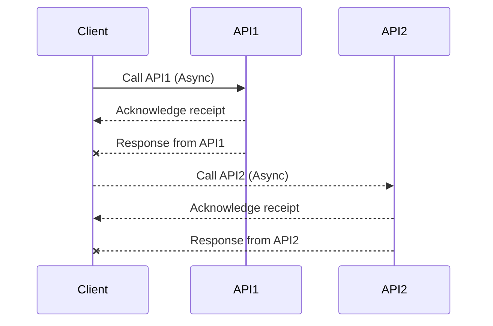



Java 21 Virtual Threads and Structured Concurrency
 
# Task Types
IO Bound

CPU Bound

## Handling the user requests 

A couple of different architectures used by application servers for handling the user requests.

- process per request model (CGI - Common Gateway Interface)[https://en.wikipedia.org/wiki/Common_Gateway_Interface]
- thread per request model

In the 1990s, a popular mechanism for handling user requests was the CGI, the common gateway interface.
In this architecture, when a user sends a request to the web server, the web server will invoke the associated CGI script
as a separate **process**.

Once the response is sent back, the process is destroyed and this is an overhead.

This is an issue because a process in an operating system is considered heavyweight, starting and terminating a process for every request is inefficient.

So because of this, a variation of CGI was created and that is called fast CGI.
- like having a pool of processes, and the user request is routed to one of the available processes.
- There is no extra time spent on starting up a new process because it's already up.


# Concurrency and Parallelism

##  Parallelism
- Multiple dependent sub tasks - all executing at the same time
- Multiple cores involved
- No parallelism in single core

```markdown
      Task
      |
  --------------
  |    |    |    |
Sub Sub  Sub  Sub
task task task task
  1    2    3    4
  |    |    |    |
Core Core Core Core
  1    2    3    4
```

### Synchronous call

```message!
sequenceDiagram
    participant Client
    participant API1
    participant API2
    participant ExternalSystem

    Client ->> API1: Call API1
    API1 -->> Client: Response from API1
    Client ->> API2: Call API2
    API2 -->> Client: Response from API2

    Note over API1, ExternalSystem: Blocking I/O operation
    API1 ->> ExternalSystem: Request data
    ExternalSystem -->> API1: Response data
    API1 -->> Client: Response from API1
```
### Aynchronous calls
- Futures and Callbacks



In Java 1MB of Stack is allocated for each thread. That's mandated by the OS because , the Java thread is backed by the OS thread, which requires memory up front.

Note: the Java threads are basically a thin layer on top of the OS Threads, so creating a Java thread creates an underlying OS thread under the hood.

# Non blocking IO
Typically a thread waits when an IO operation takes place within a thread, which is a performance blocker

Blocking IO
- blocking I/O, also known as synchronous I/O

Non Blocking IO

- socket reads/writes - used by DB calls, REST Calls, anything to do with the networks 
- file reads/writes
- concurrent locks


Reactive Programming : to overcome scalability problems with IO


# Project Loom 
Most fundamental change in Java

The Virtual thread starts as a Daemon thread where as the platform thread starts as a non-daemon thread

The JVM Shutsdown when there are no non-daemon threads running.

error with platform thread with large number of threads
```
[3.536s][warning][os,thread] Failed to start thread "Unknown thread" - pthread_create failed (EAGAIN) for attributes: stacksize: 1024k, guardsize: 4k, detached.
[3.536s][warning][os,thread] Failed to start the native thread for java.lang.Thread "Thread-8158"
```

With Virtual threads, each worker corrosponds to one platform thread. 
Each worker just runs and leaves adn picks other task, thus starting and ending of a same methods can be done in different threads.


the virtual thread #31 is started by the worker2 but is ended by the worker4.
```markdown
Start::executeBusinessLogic : VirtualThread[#31]/runnable@ForkJoinPool-1-worker-2
Start::executeBusinessLogic : VirtualThread[#29]/runnable@ForkJoinPool-1-worker-1
END::executeBusinessLogic : VirtualThread[#31]/runnable@ForkJoinPool-1-worker-4
END::executeBusinessLogic : VirtualThread[#29]/runnable@ForkJoinPool-1-worker-3
```

Virtual Threads are scheduled on a platform thread (aka carrier thread) for its CPU bound operation.

The big advantage is that when we use virtual threads, the OS thread is released automatically during an IO operation.

# Virtual Thread creation

### Using static thread method
- can't name a thread 
```java
var t = Thread.startVirtualThread(() -> executeBusinessLogic())

//Make sure that the thread terminates before moving on
t.join();

//Proceed sequentially after thread completes its task
```

### Create a virtual thread builder object

Builder is not Thread Safe
```java
OfVirtual ofVirtualBuilder = Thread.OfVirtual.name("my_virtual_thread",0);

//Start the threads
Thread t1 = ofVirtualBuilder.start(() -> executeBusinessLogic());
Thread t2 = ofVirtualBuilder.start(() -> executeBusinessLogic());

t1.join(); t2.join();

VirtualThreadBuilder builder = new VirtualThreadBuilder();

Thread thread1 = builder.name("VirtualThread-1")
        .priority(Thread.MAX_PRIORITY)
        .startVirtualThread(() -> executeBusinessLogic());

thread1.join();
System.out.println("Thread 1 has completed.");
```

### Using Thread factory
 is thread safe

```java
ThreadFactory threadfactory = new Thread.ofVirtual().name("myThread",0).factory();

// Start two virtual threads using the factory 
Thread t1 = threadfactory.newThread(() -> executeBusinessLogic());
t1.start();

Thread t2 = threadfactory.newThread(() -> executeBusinessLogic());
t2.start();

// Make sure the threads terminate 
t1.join();
t2.join();
```

### Using the virtual thread executor service
```java
// Create an Virtual Thread ExecutorService 
// try with resource will make sure all Virtual threads are terminated 
try (ExecutorService srv = Executors.newVirtualThreadPerTaskExecutor()) {
    // Submit two tasks to the Executor service 
    srv.submit(() -> executeBusinessLogic());
    srv.submit(() -> executeBusinessLogic());
    
}
```

### Thread Per Task Executor Service
```java
// Create a Virtual Thread factory with custom name
ThreadFactory factory = Thread.ofVirtual().name("myThread", 0).factory();

// Create an ExecutorService for this factory
try (ExecutorService srv = Executors.newThreadPerTaskExecutor(factory)) {
    // Submit two tasks to the Executor service 
    srv.submit(() -> executeBusinessLogic());
    srv.submit(() -> executeBusinessLogic());
}
```

##### try with resource block

simplifies the code because no need to join the threads.

Waiting for all threads to complete involves
- creating an array of threads and 
- joining with each of them explicitly. 

In JDK 21 (officially supporting Virtual threads), the ExecutorService is "Autocloseable". 
which means if you use the try with resource block, the close method will be called on the ExecutorService 
at the end of the block and this will wait till all the virtual threads are terminated.

This is one example of "Structured Concurrency" where we wait for all threads started within a block to complete, 
so that there are no rogue runaway threads.

# Scenario
When there are multiple independent tasks to be completed, all as part of one thread, without blocking the thread
> Concurrently run many tasks within a thread in non-blocking fashion


combination of using virtual threads to write sequential code and futures/CompletableFutures for concurrent code is both readable and powerful
{: .notice--primary}

Whenever we need a new thread, we simply create a new virtual thread without worrying about resources as virtual threads are cheap and efficient.

There is no harm in writing blocking code within a virtual thread (as it managed and released by the JVM).

Since there are no platform thread which holds on to the resources.

Writing non-blocking code with Reactive frameworks like project Reactor or CompletableFutures makes the readability hard

But, if we want sophisticated mechanisms to deal things in pipeline with exception handling and error handling mechanism, the Completable futures is a good optipn

```java
private String concurrentCallCompletableFuture() {
    try (ExecutorService service = Executors.newVirtualThreadPerTaskExecutor()) {//Start a thread
        // CompletableFuture for dbCall with enhanced error handling
        CompletableFuture<String> dbCallFuture = CompletableFuture
                .supplyAsync(() -> Business.blockingDbCall(2), service)
                .exceptionally(ex -> {//Handle exception and move on with a default value
                    System.err.println("Exception occurred in dbCall: " + ex.getMessage());
                    return "Default dbCallResult (Exception)";
                });

        // CompletableFuture for getBrewer with error handling
        CompletableFuture<String> getBrewerFuture = ................

        // CompletableFuture for getBeer with error handling
        CompletableFuture<String> getBeerFuture = ................
        
        // Combine results of all CompletableFuture
        String output = CompletableFuture.allOf(dbCallFuture, getBrewerFuture, getBeerFuture)
                .thenApplyAsync(voidResult -> {
                    String result1 = dbCallFuture.join();
                    String result2 = getBrewerFuture.join();
                    String result3 = getBeerFuture.join();
                    return STR."[\{result1},\{result2},\{result3}]";
                }, service)
                .join();//This join does not bloc the Platform Thread

        return output;
    }
}
```


