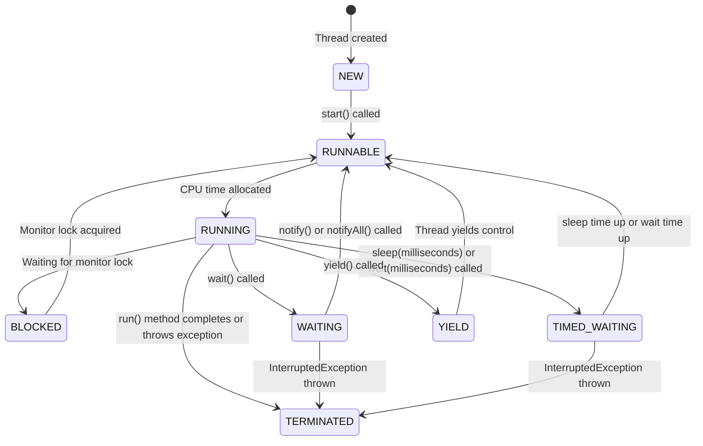



# Why we need Threads
**Responsiveness (achieved by Concurrency)**
- Critical with applications with user interface
- Concurrency = Multitasking in the context: Responsiveness can be achieved by using multiple threads, with a separate thread for each task
- NOTE: We don't need multiple cores to achieve Concurrency

**Performance (achieved by Parallelism)**
- illusion with one core, truly parallel with multicore processors
- Completing a complex task much faster

```
Core2 | Task3 -> Task4 -> Task3 -> Task4 -> Task3
Core1 | Task1 -> Task2 -> Task1 -> Task2 -> Task1
```

Caveat : Multithreaded Programming is fundamentally different from single threaded programming
{: .notice--primary}


# Process
```
+-------------------------------------------------------+
|                   Process (Context)                   |
+-------------------------------------------------------+
|  Files, Heap and Code is shared by among all threads  |
|  +---------+  +---------+    +----------------+       |
|  |  PID    |  |         |    |  Main Thread   |       |
|  |  Mode   |  |  Files  |    +----------------+       |
|  |  ....   |  |         |    |     Stack.     |       |
|  |  ....   |  |         |    +----------------+       |
|  |         |  +---------+    |Instruction Ptr |       |
|  |         |                 +----------------+       |
|  |         |                                          |
|  |         |  +---------+     +----------------+      |
|  |         |  |         |     |   Thread 1     |      |
|  |         |  |   Data  |     +----------------+      |
|  |         |  |  (Heap) |     |    Stack.      |      |
|  |Priority |  |         |     +----------------+      |
|  |         |  +---------+     |Instruction Ptr |      |
|  |         |                  +----------------+      |
|  |         |  +---------+     +----------------+      |
|  |         |  |         |     |    Thread 2    |      |
|  |         |  |  Code   |     +----------------+      |
|  |         |  |         |     |    Stack.      |      |
|  |         |  |         |     +----------------+      |
|  |         |  +---------+     |Instruction Ptr |      |
|  |         |                  +----------------+      |
|  +---------+                         ...              |
+-------------------------------------------------------+
```
**Instruction Pointer** 
- Associated with each thread
- address of the next instruction to execute

**Multiple Threads in EACH PROCESS Share**
  - the Process's open Files,
  - the Process's metadata
  - Heap and
  - Code
  
# Context Switching

```
+-------------------+  +-------------------+  +-------------------+  +-------------------+
| Process ID : 458  |  | Process ID : 5821|   | Process ID : 4585 |  | Process ID :33782 |
+-------------------+  +-------------------+  +-------------------+  +-------------------+
| +-------+ +-----+ |  | +------+ +------+ |  | +------+ +------+ |  | +--------------+  |
| |Thread1| |Thread2|  | |Thread1| |Thread2|  ||Thread1| |Thread2||  | |   Thread1    |  |
| +-------+ +-----+ |  | +------+ +------+ |  | +------+ +------+ |  | +--------------+  |
|                   |  | +------+ +------+ |  |                   |  |                   |
|                   |  | |Thread| |Thread| |  |                   |  |                   |
|                   |  | |  3   | |  4   | |  |                   |  |                   |
|                   |  | +------+ +------+ |  |                   |  |                   |
+-------------------+  +-------------------+  +-------------------+  +-------------------+
```

OS has to schedule & run one thread, stop it and then run another thread. 
- Stop thread1
- Schedule thread1 out
- Schedule Thread 2 in 
- Start thread 2

This is called **Context Switching**

This is not a cheap operation and is the price of Multitasking(concurrency)
- same as human beings - takes time to focus on next task after switching from first
- Store data of current outgoing thread
- restore data of the incoming thread (back into CPU and memory)

### Issues with Context Switch
Large number of threads causes **Thrashing** (Spending more time in management than real productive work)

- Threads consumes less resources than Processes

Context Switching between **threads from the same process** is **CHEAPER** than context switch between different processes
{: .notice--primary}

# Thread Scheduling
Each OS implements its own Thread Scheduling Algorithm

[Linux Schedulers](https://developer.ibm.com/tutorials/l-completely-fair-scheduler/)
Assume 2 processes(A,B) with two threads(1,2) each running in a single core processor
- the 4 tasks each have an arrival order and length of execution time.

| Thread | Arrival Order | CPU Time (anticipated) |
|:-------|:--------------|:-----------------------|
| A1     | 0             | 4                      | 
| A2     | 1             | 3                      | 
| B1     | 2             | 2                      | 
| B2     | 3             | 1                      | 

### First Come First Serve Scheduling
```
Time 0        Time 1        Time 2        Time 3
+------------+------------+------------+------------+
| A1 executes| A2 executes| B1 executes| B2 executes|
+------------+------------+------------+------------+
```

**Problems**
- **Thread Starvation** - for the short process due to long running processes

### Shortest Job First Scheduling
Shortest Job First (SJF) scheduling algorithm selects the process with the shortest 
execution time from the ready queue. 

It can be either **preemptive** (Shortest Remaining Time First) or **non-preemptive**.

**Timeline Illustration with SJF (Non-preemptive)**

```
Time 0        Time 1        Time 2        Time 3        Time 4        Time 5        Time 6        Time 7        Time 8        Time 9        Time 10
+------------+------------+------------+------------+------------+------------+------------+------------+------------+------------+------------+
| A1 executes (4 units) | B2 executes (1 unit)   | B1 executes (2 units)   | A2 executes (3 units)   |
+------------+------------+------------+------------+------------+------------+------------+------------+------------+------------+------------+
```

**Problems**
If there are many short jobs, the longer jobs, now, can face starvation.

### How it really works
OS divides the time into Epochs (moderately size pieces)

In each Epoch, the OS allocated different time slice for each thread

Notice: not all the threads get to run or complete in each epoch.

The decision on how to allocate the time for each thread is based on a dynamic priority(The operating system maintains for each thread).
$$ \text Dynamic Priority = \text Static Priority + Bonus $$
- The static priority is set by the developer ahead of time.
- And the bonus is adjusted by the operating system in every epoch for each thread

This way the operating system will give preference to interactive and real time threads that need more immediate attention.
And in the same time, it will give preference to computational threads that **did not complete**, or did not get enough time to run in previous
epics to prevent starvation.

# Thread Vs Process

**Prefer Multithreaded architecture when**
- tasks share a lot of Data
- Threads are much faster to create and destroy
- Faster Context switches between threads of same process

**Prefer Multi-Process architecture when**
- Security and Stability is of higher importance
  - Separate processes are completely isolated from each other
- Tasks are unrelated to each other


## History of multithreading in Java
**Java 1:** Threads 
- one set of API for all machines. hardware independent

**Java 5** : ExecutorServices API -> Pool of threads
* Issue 1: Pool induced deadlock
* One thread breaks the problem and throws in the pool and waits foe the result to come back
* All the threads in pool just divided the work, and no thread left to take care of the problem

**Java 7** : Fork Join pool
* Work-stealing : the threads that divides problem, also solves one of the divided part

**Java 8** : ParallelStreams and CompletableFutures
* uses Java 7 FJP
* Common Fork join pool

**Java 21** : Virtual Threads
* Game changer
* [https://nitinkc.github.io/java/java21-virtualthreads/](https://nitinkc.github.io/java/java21-virtualthreads/)


# Thread Lifecycle
[https://docs.oracle.com/javase/8/docs/api/java/lang/Thread.State.html](https://docs.oracle.com/javase/8/docs/api/java/lang/Thread.State.html)



**NEW**: The thread is created but not yet started.

**RUNNABLE**: The thread is ready to run but waiting for CPU time.

**RUNNING**: The thread is actively executing.

**BLOCKED**: The thread is waiting for a monitor lock.

**WAITING**: The thread is waiting indefinitely for another thread's action.

**TIMED_WAITING**: The thread is waiting for another thread's action for a specified time.

**YIELD**: The thread is yielding control to allow other threads to execute.

**TERMINATED**: The thread has completed execution or has been interrupted.

## Yield Explanation
When a thread calls yield(), it suggests to the thread scheduler that it might 
be a good time to switch to another thread. 

The thread transitions from RUNNING to RUNNABLE, allowing other threads to be scheduled for execution. 

However, it's not guaranteed that the current thread will stop running immediately or that other threads will be scheduled right away.

# Tidbits

`Thread.sleep(1000)` instructs the operating system to **not schedule** the current thread until the given time passes.

During that time, the thread is not consuming any CPU.