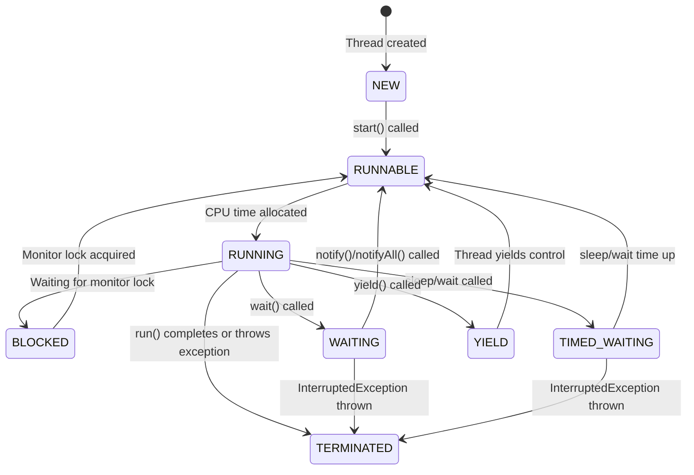
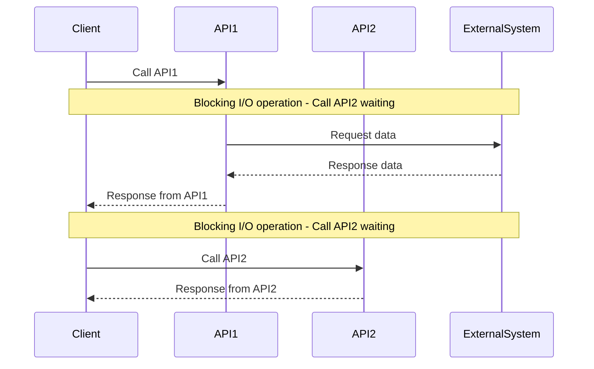
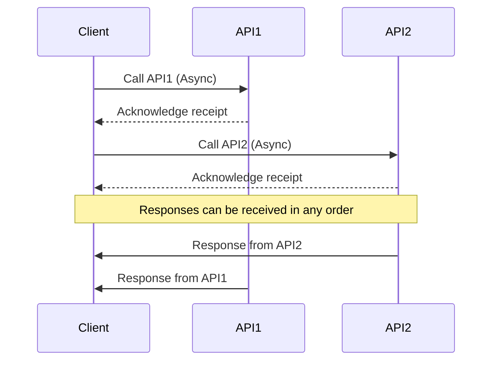



**Concurrency** : looking for a new job, while working on the current job,
during office hours.

**Parallelism** : maintaining 2 jobs, with 2 managers, without telling either
manager

**Asynchronous** : While Brewing coffee, read emails and get back to coffee when
it's done.

In Java **1MB of Stack** is allocated for each thread. The OS mandates that
because,
the Java thread is backed by the OS thread, which requires memory up front.

Note: the Java threads are basically a thin layer on top of the OS Threads, so
creating a Java thread creates an underlying OS
thread under the hood.
{: .notice--info}

# Why we need Threads

**Responsiveness (achieved by Concurrency)**

- Critical with applications with user interface
- Concurrency = Multitasking in the context:
    - Responsiveness can be achieved by using multiple threads, with a separate
      thread for each task
- NOTE: We don't need multiple cores to achieve Concurrency

> Consider one thread serving one request at a time

**Performance (achieved by Parallelism)**

- illusion with one core, truly parallel with multicore processors
- Completing a complex task much faster

```
Core2 | Task3 -> Task4 -> Task3 -> Task4 -> Task3
Core1 | Task1 -> Task2 -> Task1 -> Task2 -> Task1
```

Caveat: Multithreaded Programming is fundamentally different from
single-threaded programming
{: .notice--primary}

# Process & Threads

All threads **share** Files, Heap, and Code

[Image Code Link](https://app.eraser.io/workspace/tRdPDXKngDIyHNQeiKZE?origin=share)

{:width="400" height="300"}

**Instruction Pointer**

- address of the next instruction to execute
- Associated with each thread

**Multiple Threads in EACH PROCESS Share**

- the Process's open Files,
- the Process's metadata
- Heap and
- Code

### Context Switching

The CPU switches from executing in the **context of one thread** to executing in
the context of another is **Context Switching**

OS has to:-

- Stop thread1 **saving**
    - the local data,
    - program pointer etc. of the current thread
- Schedule thread1 **out**
- Schedule Thread 2 **in** by **loading**
    - the local data,
    - program pointer etc. of the next thread to execute.
- Start thread 2

This is not an economical operation and is the price (tradeoff) with
Multitasking(concurrency)

- same as human beings—takes time to focus on the next task after switching from
  the first
- Store data of the current outgoing thread
- restore data of the incoming thread (back into CPU and memory)

### Issues with Context Switch

A large number of threads causes **Thrashing** (Spending more time in management
than real productive work)

- Threads consume fewer resources than Processes

Context Switching between **threads from the same process** is **CHEAPER** than
context switch between different processes
{: .notice--primary}

[Code Link](https://app.eraser.io/workspace/EoAeHbbnoamTb2aJzyMN?origin=share)


### Summary

**Prefer Multithreaded architecture when**

- tasks share a lot of Data
- Threads are much faster to create and destroy
- Faster Context switches between threads of same process

**Prefer Multi-Process architecture when**

- Security and Stability is of higher importance
    - Separate processes are completely isolated from each other
- Tasks are unrelated to each other

# Thread Scheduling

Each OS implements its own Thread Scheduling Algorithm

Scheduling can be either

- **preemptive** (forcing the current task out) - Shortest Remaining Time First
    - forcibly interrupt and suspend the currently running task to switch to
      another task
- **non-preemptive** (waits for the current task to finish first).

Assume 2 processes(A,B) with two threads(1,2) each running in a single core
processor

- the 4 tasks each have an arrival order and length of execution time.

| Thread | Arrival Order | CPU Time |
|:------:|:-------------:|:--------:|
|   A1   |       0       |    4     | 
|   A2   |       1       |    3     | 
|   B1   |       2       |    2     | 
|   B2   |       3       |    1     | 

### First-Come, First-Serve Scheduling

| Time 0 | Time 1 | Time 2 | Time 3 | Time 4 | Time 5 | Time 6 | Time 7 | Time 8 | Time 9 |
|:------:|:------:|:------:|:------:|:------:|:------:|:------:|:------:|:------:|:------:|
|   A1   |   A1   |   A1   |   A1   |   A2   |   A2   |   A2   |   B1   |   B1   |   B2   |

**Problems**

- **Thread Starvation** - for the short process due to long-running processes

### Shortest Job First Scheduling

Shortest Job First (SJF) scheduling algorithm selects the process with the
shortest
execution time from the ready queue.

**Timeline Illustration with SJF (Non-preemptive)**

First, finishing the current job in hand(A1)

|        Time 0        | Time 1 | Time 2 | Time 3 | Time 4 |    Time 5    | Time 6 |      Time 7       | Time 8 | Time 9 |
|:--------------------:|:------:|:------:|:------:|:------:|:------------:|:------:|:-----------------:|:------:|:------:|
|          A1          |   A1   |   A1   |   A1   |   B2   |      B1      |   B1   |        A2         |   A2   |   A2   |
| A1 - 4 units of task |        |        |        | 1 unit | B1 - 2 units |        | A2 - 3 units task |        |        |

**Problems**
If there are many short jobs, the longer jobs, now, can face starvation.

### How it really works

[Inside the Linux 2.6 Completely Fair Scheduler](https://developer.ibm.com/tutorials/l-completely-fair-scheduler/)

- OS divides the time into Epochs (moderately size pieces)
- In each Epoch, the OS allocated different time slice for each thread

> Not all the threads get to run or complete in each epoch.

The decision on how to allocate the time for each thread is based on a dynamic
priority (The operating system maintains for each thread).
$$ \text Dynamic Priority = \text Static Priority + Bonus $$

- The static priority is set by the developer ahead of time.
- And the bonus is adjusted by the operating system in every epoch for each
  thread

This way the operating system will give preference to interactive and real-time
threads that need more immediate attention.
And in the same time, it will give preference to computational threads that *
*did not complete**, or did not get enough time to run in previous
epics to prevent starvation.

# Thread Lifecycle

[https://docs.oracle.com/en%2Fjava%2Fjavase%2F22%2Fdocs%2Fapi%2F%2F/java.base/java/lang/Thread.State.html](https://docs.oracle.com/en%2Fjava%2Fjavase%2F22%2Fdocs%2Fapi%2F%2F/java.base/java/lang/Thread.State.html)



| **State**         | **Description**                                                         |
|:------------------|:------------------------------------------------------------------------|
| **NEW**           | The thread is created but not yet started.                              |
| **RUNNABLE**      | The thread is ready to run but waiting for CPU time.                    |
| **RUNNING**       | The thread is actively executing.                                       |
| **BLOCKED**       | The thread is waiting for a monitor lock.                               |
| **WAITING**       | The thread is waiting indefinitely for another thread’s action.         |
| **TIMED_WAITING** | The thread is waiting for another thread’s action for a specified time. |
| **YIELD**         | The thread is yielding control to allow other threads to execute.       |
| **TERMINATED**    | The thread has completed execution or has been interrupted.             |

### Yield

When a thread calls yield(), it suggests to the thread scheduler that it might
be a good time to switch to another thread.

- The thread transitions **from RUNNING to RUNNABLE**, allowing other threads to
  be scheduled for execution.
- However, it's **not guaranteed** that
    - the current thread will stop running immediately or
    - other threads will be scheduled right away.

### Sleep

`Thread.sleep(1000)` instructs the operating system to **not schedule** the
current thread until the given time passes.

During that time, the thread is not consuming any CPU.

# History of multithreading in Java

**Java 1:** Threads

- one set of API for all machines. hardware independent

**Java 5** : ExecutorServices API -> Pool of threads

* Issue 1: Pool-induced deadlock
* One thread breaks the problem and throws in the pool and waits foe the result
  to come back
* All the threads in pool just divided the work, and no thread left to take care
  of the problem

**Java 7** : Fork Join pool

* Work-stealing: the thread that divides the problem also solves one of the
  divided part

**Java 8** : ParallelStreams and CompletableFutures

* uses Java 7 FJP
* Common Fork join pool

**Java 21** : Virtual Threads

* Game
  changer [Virtual Threads Docs](https://docs.oracle.com/en/java/javase/21/core/virtual-threads.html)
* [https://nitinkc.github.io/java/java21-virtualthreads/](https://nitinkc.github.io/java/java21-virtualthreads/)

# Handling the user requests - Architecture

A couple of different architectures are used by application servers for handling
the user requests.

- process-per-request model (old, CGI - Common Gateway
  Interface)[https://en.wikipedia.org/wiki/Common_Gateway_Interface]
- thread per request model

### Process-per-request model

In the 1990s, a popular mechanism for handling user requests was the CGI(common
gateway interface)

In this architecture, when a user sends a request to the web server, the web
server will invoke the associated CGI script
as a separate **process**.

- Once the response is sent back, the process is destroyed and this is an
  overhead.
- This is an issue because a process in an operating system is considered
  heavyweight, starting and terminating a process for every request is
  inefficient.

To solve this, a variation of CGI was created and called **fast CGI**.

- similar to having a pool of processes, and the user request is routed to one
  of the available processes.
- There is no extra time spent on starting up a new process because it's already
  up.

### Thread-Per-Request Model

In the thread-per-request model, each incoming request is assigned a separate
thread.

- This thread handles the request, performs the necessary processing, and then
  completes.
- it allows concurrent handling of multiple requests by allocating a dedicated
  thread for each request

##### Apache Tomcat

- Tomcat is a popular open-source web server and servlet container that follows
  the thread-per-request model.
- Tomcat maintains a pool of worker threads.
    - When a request arrives, a thread from the pool is assigned to handle the
      request.
    - Once the request is processed and a response is generated, **the thread is
      returned to the pool for reuse**.

### Thread-Per-Task Threading model

##### Issues

- Does not give optimal performance
    - when a thread is blocking IO, it cannot be used
    - Requires us to allocate more threads
    - Consuming more resources
    - Adding context switch overhead
-

### Thread-Per-Core with Non-Blocking-IO

- provides optimal performance
-

# Task Types

- IO Bound ()
- CPU Bound (Compute-intensive)

# What is IO

The CPU can access the memory directly at any time, so our program can read from
or write to
variables from the memory without the operating system's involvement.

The CPU doesn't have direct access to **peripheral devices** (mouse, keyboard,
NIC, Monitor, Disk drive).
CPU can communicate with the **device-controller** of each device to either send
it some data or receive some data from it.

During the time that the specific IO device is doing its work, or when the
device is idle, or the
response from the network hasn't arrived yet, the CPU can continue running other
tasks.

There is Direct Memory Access (DMA) involved, acting as a buffer between
Peripheral controller, RAM and CPU

[Diagram Code](https://app.eraser.io/workspace/T6P7KpKfUkWkbqsVJbqC?origin=share)

{:width="400" height="300"}

### IO Bound Application

```java
public List<Dto> getData(RequestBody req){
    Request request = parseIncomingRequest(req);//CPU Bound task
    Data data = service.getDataFromDb(request);//IO Bound Task, Thread is blocked until the task is done
    List<Dto> dtoList = mapper.map(data);//CPU Bound task
    return dtoList;
}
```


# Blocking vs Non blocking IO

**IO opearations**

- socket reads/writes - used by DB calls, REST Calls, anything to do with the
  networks
- file reads/writes - disk/slower memory access
- concurrent locks - enforcing synchronization

Reactive Programming : to overcome scalability problems with IO
{: .notice--info}

### Blocking IO aka synchronous I/O

In Blocking-I/O operations, a thread that performs an I/O operation (such as
reading from a file or network socket) is
**blocked** until the operation completes.

- During this time, the thread cannot perform other tasks.
- This is a performance blocker

**Synchronous call** considering API2 depending on the results of the API1.



### Non Blocking IO aka Asynchronous

In non-blocking I/O operations, a thread initiates an I/O operation and
continues executing other code while the
I/O operation is processed asynchronously.

- This can improve performance and scalability, especially in systems with high
  I/O operations.

**Asynchronous calls** Considering API1 and API2 to be mutually exclusive

- Futures and Callbacks



In terms of Thread, blocking va non-blocking tasks would look like


# Concurrency and Parallelism

**Parallelism with dividable large task**

- Multiple dependent sub-tasks (larger task divided into smaller similar
  tasks) - all executing at the same time
- Multiple CPU cores involved
- No parallelism in a single core

[Diagram](https://app.eraser.io/workspace/ptDSaZUOMF3oJpPoCun3)


**Parallelism in Independent Tasks**

- Walk and Talk in parallel (2 independent tasks), exactly at the same time
- 2 threads in 2 cores of the CPU

```
                       v
                       | [Time Slice v]
thread1-talk   T   T   T   T
thread2-walk   W       W
time  t=0--------------^-------------------->t
```

**Concurrency**
Talk & Drink, but not at the Same time.

- hold one task and resume it once another is done
- can happen on a single core (2 threads in one core)

```java
                     v                    v
                     |Time slice          |Another timeslice
thread1 - Talk   T   T    T   | T   T   T |  T  T
thread2 - Drink      |        D           D
time  t=0------------^--------^-----------^-------->t
```


# Asynchronous

Asynchronous means `Non Blocking`

- when you make a method call, you don't have to wait for it to complete
- Do not block the **thread of execution** and wait to finish.
- however, **tasks** are always blocking (default behavior of a thread)

For a Thread to be non-blocking, these **2 properties** should meet

- **responsiveness** : main thread should always **delegate** and be available
  for next step
    * Eg: Click on download button and then move on to doing other stuff.
        * if the main thread takes care of downloading, then the application is
          blocked until the download is finished.
- **Pre-emptible** : the ability of a system or thread to be **interrupted** or
  **preempted** by other tasks or threads.
    - In a preemptible system, a running thread can be paused or stopped by the
      system scheduler to allow other threads or processes to execute.

Both parallel and Async processes run in a separate thread (other than the
main-thread)
{: .notice--info}

For parallelism, the thread needs to **JOIN** i.e.

- the slowest process/thread determines the overall speed.
- per hour production - refills(10), cap(20) and body(50).
    - Total pens per hour = 10

Asynchronous, do not wait for completion, but when results arrive, move on to do
other things with the results.

* use the **call back** to receive response
* or use a **promise**

## Asynchronous Task Execution Engine

> Executor Service was introduced in Java 1.5

Execution Engine has

- Work Queue (Blocking Queue)
- Completion Queue
- Thread Pool

As soon as the work is **placed** in the work queue, you get **Future**.

Future is a proxy or reference of the result that **will be returned** in the
Future

Fork Join Framework (used in parallel stream behind the scenes) -> Java 7 (
Extends ExecutorService)

# Async & non blocking programming Features

### Call back

Callback - When the response is received, execute the function

```java
    doSomething(data, response -> {...})
```

* CallBack lacks consistency
* Really hard to compose call backs
* hard to deal with error

> Creates Callback hell

### Promise

When done with the task, update through the promise by any one of the three
states

- Pending
- Resolved
- Rejected

Promise has 2 channels -> data channel & error channel

#### Railway Track pattern

Treat error as another form of data and as first class citizens

```java
data track  -----f------f     recovering from exception       f--or continue with then methods-----
                          \                                  /
error track ----------------f---can retrun default data-----f----or handle exception---------------
```

```java
HappyPath==========================D==========D=======================
data -> function -> Promise -> f-> P -> f  -> P -> f -> P -> f-> P -> f       
UnhappyPath===========================================Exception==E=======
```

# Daemon vs Non-Daemon threads

| **User Threads**                                                                                                    | **Daemon Threads** (Backgroud threads)                                                                                |
|:--------------------------------------------------------------------------------------------------------------------|:----------------------------------------------------------------------------------------------------------------------|
| JVM **waits** for user threads to finish their work. It **will not exit** until all user threads finish their work. | JVM will not wait for daemon threads to finish their work. It will exit as soon as all main thread finish their work. |
| User threads are high priority threads.                                                                             | Daemon threads are low priority threads.                                                                              |
| JVM will not force the user threads to terminate. It will wait for user threads to terminate themselves.            | JVM will force the daemon threads to terminate if all user threads have finished their work.                          |