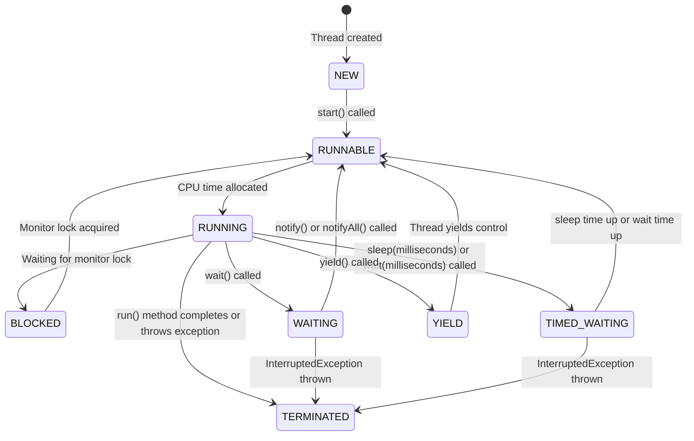



**NEW**: The thread is created but not yet started.

**RUNNABLE**: The thread is ready to run but waiting for CPU time.

**RUNNING**: The thread is actively executing.

**BLOCKED**: The thread is waiting for a monitor lock.

**WAITING**: The thread is waiting indefinitely for another thread's action.

**TIMED_WAITING**: The thread is waiting for another thread's action for a specified time.

**YIELD**: The thread is yielding control to allow other threads to execute.

**TERMINATED**: The thread has completed execution or has been interrupted.

## Yield Explanation
When a thread calls yield(), it suggests to the thread scheduler that it might 
be a good time to switch to another thread. 

The thread transitions from RUNNING to RUNNABLE, allowing other threads to be scheduled for execution. 

However, it's not guaranteed that the current thread will stop running immediately or that other threads will be scheduled right away.
