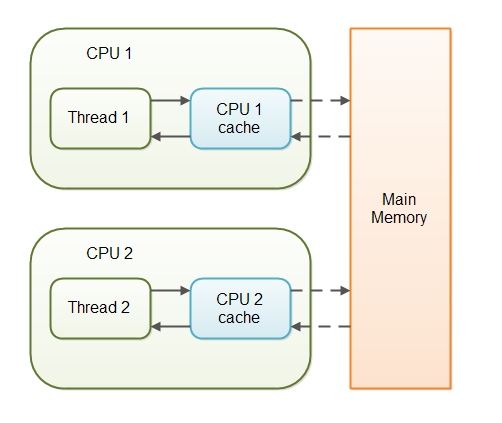
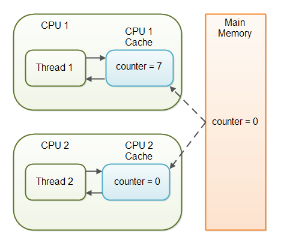



# Volatile
- volatile variables are **stored in main memory** and their changes are visible to all threads immediately.
    - The volatile keyword **prevents the CPU from caching** the variable’s value in a local register or cache.
- The volatile keyword **does not guarantee atomicity** for compound operations (e.g., incrementing a variable, count++).
    - It only ensures that the latest value of the variable is visible across threads.
    - For atomic operations, additional synchronization or atomic classes (like AtomicInteger) are needed.

volatile also provides a **guarantee about the ordering** of operations:

**`Happens-Before` Relationship**: Writes to a volatile variable establish a happens-before relationship with subsequent reads of that variable.
- This means that any write to a volatile variable **happens-before any subsequent read** of that variable, ensuring proper visibility and ordering of operations.

**No Reordering**: The Java Memory Model guarantees that reads and writes to volatile variables **cannot be reordered** with respect to other
reads and writes to volatile variables.

```java
volatile int sharedVar = 0;
public void task(){
  ...//All instructions WILL be execute before
  read/write(sharedVar);
  ...//All instructions will be executed after
}
```

**Implementation Details**
Here’s how the volatile keyword is typically implemented:

**Memory Barriers:** The Java Virtual Machine (JVM) uses memory barriers (or fences) to enforce the visibility and ordering guarantees. These barriers prevent the CPU and memory subsystem from reordering reads and writes to volatile variables.
- Store Barrier: Ensures that writes to volatile variables aren’t reordered with preceding writes.
- Load Barrier: Ensures that reads of volatile variables aren’t reordered with following reads.

[Shared Multiprocessor Architecture](https://www.baeldung.com/java-volatile#shared-multiprocessor-architecture)

|                           Other Variables                           |                         One Possible State                         |
|:-------------------------------------------------------------------:|:------------------------------------------------------------------:|
|   |  | 