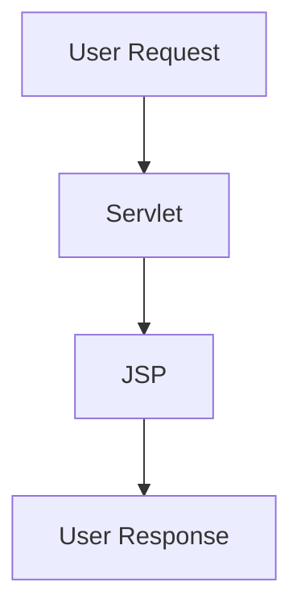
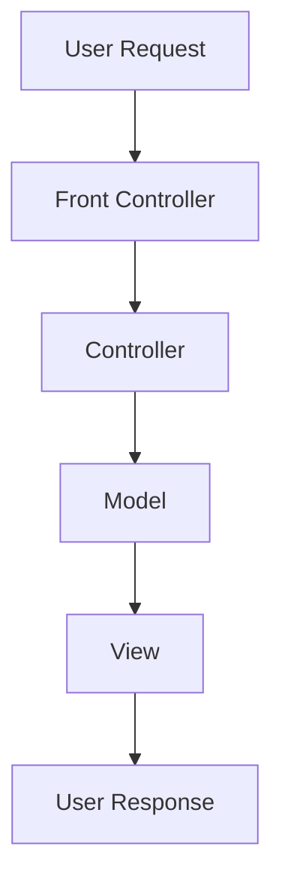
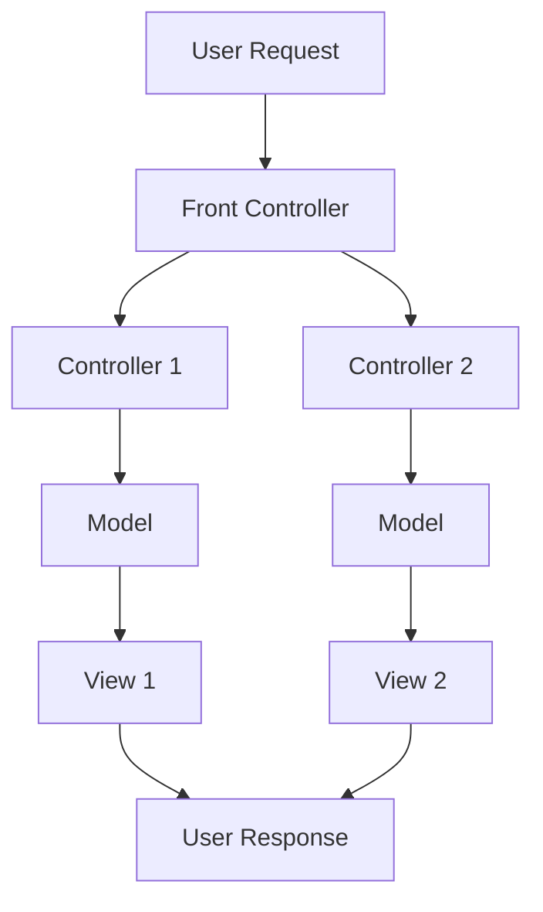



# Design Patterns vs Software Architecture Patterns

[Gang of 4 Book](https://www.google.com/books/edition/Design_Patterns/6oHuKQe3TjQC?hl=en&gbpv=0)
is Targeted towards **stand alone application** implement in **OOP languages**

**Benefits:-**

- Better Code Organization
- Reusability
- Extensibility
- High Developer productivity

**Drawback:-**

- limited to single application/library
- Only for Object Oriented Language
- "Design Patterns" are not very helpful in architecting **Large Scale System**
  using **multiple independently deployable** components.
- Doesn't handle
    - Performance
    - User Experience
    - Error Handling
    - Processing Big Data and high network Traffic

Cloud Software Architect's job
> Building Reliable Systems using Unreliable Components

# Model 1 Architecture

In the Model 1 Architecture, the JSPs handle both the presentation and some
business logic directly.

- All JSP's

# Model 2 Architecture (MVC)

In Model 2, also known as MVC (Model-View-Controller), the architecture is
divided
into three main components: Model, View, and Controller.

# Model 2 Front Controller Architecture

In this variation, a single Front Controller routes requests to appropriate
controllers,
which then interact with the Model and View.

# Scalability Patterns

## Load Balancing Pattern

Components:

- Source
- Dispatcher (Load Balancer)
- Workers

Auto Scalable Load Balancing Service (Dispatcher) distributes the traffic

- Can be Cloud managed service (suited with dealing with external traffic)
- Message Broker / Distributed Message Queue as a Load Balancer (under right use
  case) (suited for internal services)
    - that right use case is when communication between publisher & the consumer
      service is **one directional & asynchronous**

**Algorithms**

- Round Robin
    - Good with stateless services
    - doesnt work when there is an active session (stateful services)
- Sticky Session / Session Affinity
    - maintains cookie and load balancer redirects the request to the same
      server everytime
    - works great for short session
- Least Connections
    - Good for Long term connections like SQL, LDAP
- Consistent Hashing

#### Auto Scaling

Each instance has an **agent** (background process) running that keep track of
the health of the instance (Network, CPU, Memory etc)

Using the data collected from the agents, Auto Scaling Policies can be defined

## Pipes & Filters Pattern

- Data Source : Origin of incoming Data
- Data Sink : Final Destination of the Data

example of injesting/processing video/audio upload

Important Considerations

- Complexity and Overhead
- Statelessness of each processing component
- not a good fit for distributed Data transactions

## Scatter & Gather Pattern

# Deployment & Production Testing - Patterns

## Rolling Deployment Pattern

## Blue-Green Deployment