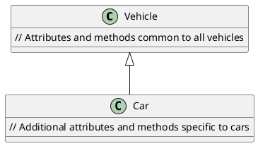
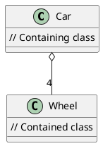
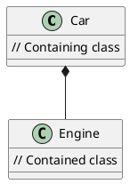
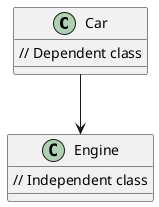
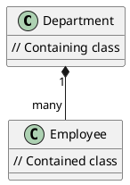
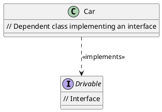



# Composition

* Also known as whole-part relationship
* has - a relationship
* primarily for code re-use (both state and behaviour) - for inheritache
* Composition is about delegating. Delegating certain aspects of its functional behaviour of A to B
```java
class A{
    public void foo(){
        
    }
}

class B{
    public void bar(){
        
    }
}
```

A -> B

Runtime time instance of A has a reference to a run time instance of B


# 1 Generalization/Inheritance - IS-A (Empty Arrowhead):

Denoted by an **empty arrowhead** pointing from the subclass (child) to the superclass (parent).

Indicates an **"is-a"** relationship, where the subclass inherits attributes and behaviors from the superclass.

For example, if class B inherits from class A, you would draw a line with an empty arrowhead from class B to class A.

```java
// Parent class
public class Vehicle {
    // Attributes and methods common to all vehicles
}

// Child class inheriting from Vehicle
public class Car extends Vehicle {
    // Additional attributes and methods specific to cars
}
```

plant uml



# 3 Aggregation (Empty Diamond) -

Denoted by an empty diamond at the end of a line pointing from the containing class to the contained class.

Represents a **"whole-part"** relationship where the contained class is a part of the containing class but can exist independently.

The contained class can be shared among multiple containing classes.

For example, if class A aggregates class B, you would draw a line with an empty diamond from class A to class B.
```java
// Contained class
public class Wheel {
    // Attributes and methods of the wheel
}

// Containing class
public class Car {
    private List<Wheel> wheels; // Aggregation relationship

    public Car(List<Wheel> wheels) {
        this.wheels = wheels; // Assigning wheels passed as parameter
    }
}
```



# 2 Composition (Filled-in Diamond):

Denoted by a filled-in diamond at the end of a line pointing from the containing class to the contained class.

Represents a **strong relationship** where the contained class is a part of the containing class and cannot exist independently.

Typically used when the contained class has **a lifecycle dependent** on the containing class (typically with a new keyword).

For example, if class A contains an instance of class B, you would draw a line with a filled-in diamond from class A to class B.

```java
// Contained class
public class Engine {
    // Attributes and methods of the engine
}

// Containing class
public class Car {
    private Engine engine; // Composition relationship

    public Car() {
        this.engine = new Engine(); // Creating engine instance within Car
    }
}
```




# 4 Dependency (Dashed Line with Arrow):

Denoted by a dashed line with an arrow pointing from the dependent class to the independent class.

Represents a using or **"uses-a"** relationship, where one class depends on another class for its implementation.

Dependencies are typically indicated by method parameters, local variables, or return types.

For example, if class A depends on class B, you would draw a dashed line with an arrow from class A to class B.

```java
// Dependent class
public class Car {
    public void drive(Engine engine) { // Dependency on Engine class
        // Implementation of drive method using Engine
    }
}
```



# Multiplicity:

Denotes the number of instances of one class related to the number of instances of another class.

Represented with a number at one end of the line and a "*" (asterisk) at the other end.

For example, "1" at one end and "*" at the other end of the line indicate that one instance of one class is related to zero or more instances of another class.

```java
// Example of multiplicity in a relationship
public class Department {
    private List<Employee> employees; // One-to-many relationship

    public Department(List<Employee> employees) {
        this.employees = employees;
    }
}
```



# Using << >> for Annotations:

Used to indicate properties or qualifiers of a relationship or dependency.

Often used with dependencies to specify the nature of the relationship, such as <<interface>>, <<implementation>>, <<association>>, etc.

For example, if class A implements interface B, you would write "<<implements>>" near the dashed line between class A and interface B.


```java
// Dependent class implementing an interface
public class Car implements Drivable { // <<implements>> annotation
    // Implementation of methods from Drivable interface
}
```




**Association:**

Association -> Aggregation -> Composition

Association represents a relationship between two or more classes, where objects of one class are connected to objects of another class.

##### Characteristics:
It's a general relationship without any specific ownership or lifecycle dependency.

Can be **one-to-one**, **one-to-many**, or **many-to-many**.

Typically represented by a line connecting the classes with no special annotations.

Example: A Department class may be associated with an Employee class to represent that employees belong to different departments.

## Aggregation:

Definition: Aggregation is a **special form of association** where one class is a part of another class.

**Characteristics:**

Represents a **"whole-part" relationship** where the parts can exist independently of the whole.

The part class can be shared among multiple whole classes.

Often indicated by a line with an empty diamond (◊) at the whole end.

Example: A Car class may have wheels, where wheels are parts of the car but can exist independently.

## Composition:

Definition: Composition is a **stronger form of aggregation** where the part cannot exist independently of the whole.

Characteristics:
Represents a strong ownership relationship where the part class is a part of the whole class.

The part **class's lifecycle** is controlled by the whole class.

Indicated by a line with a filled diamond (◆) at the whole end.

Example: A House class may have rooms, where rooms are parts of the house and cannot exist without the house.
Here's a mnemonic to help remember the difference:

Association: Think of it as a connection between classes, like a friendship.

Aggregation: Think of it as a **"has-a"** relationship, where one class has
(but doesn't own) instances of another class.

Composition: Think of it as a "composed of" relationship,
where one class is composed of (and owns) instances of another class.


