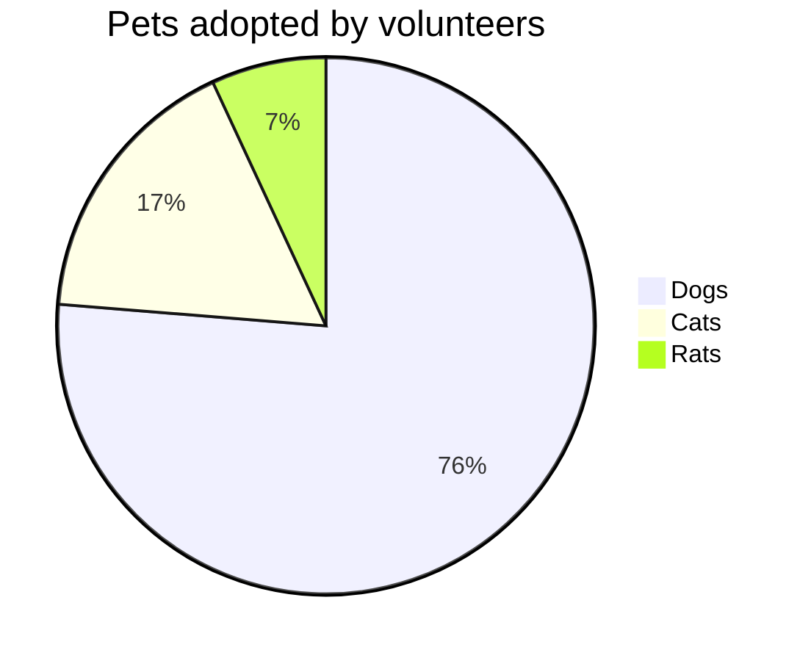



Class of an object v/s type of object

Type -> Abstraction

Type (Interface) -> is the ability to describe a behaviour or a contract between a client and provider without bothering about implementation symantics


Class: Blue print of an obhject
- codification of logic &
- encapsulation of state
- STATE + BEHAVIOUR

Runtime object will have both type and class

In java, first class support for abstraction like interface

```java
List<Integer> list = new ArrayList<Integer>();

//LHS = type        |  RHS Class
```

# Key takeaway & basis for most GOF patterns
- program to an interface, not an implementation
- favor object composition over class inheritance
  - Better to do delegation using object composition rather than use class inheritance

@startmermaid
pie title Pets adopted by volunteers
    "Dogs" : 386
    "Cats" : 85
    "Rats" : 35
@endmermaid

```plantuml!
Bob -> Alice : hello
```


