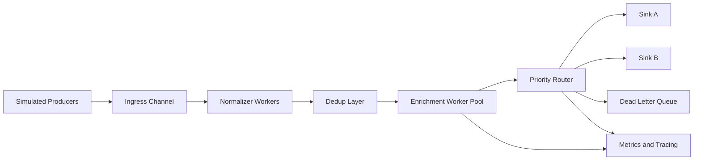



This post is about **ideation first**.
The goal is to pick **one Go application idea** that is:

- easy to run on a laptop,
- easy to test locally,
- rich enough to cover real production concurrency concerns,
- broad enough for **advanced engineering roles** and **architect-level learning**.

If you build only one serious Go learning project for concurrency, this is the one I would recommend.

## The App Idea in One Line

Build a **Concurrency Control Tower**: a local-first event processing platform that simulates many upstream systems, 
ingests work concurrently, enriches it, deduplicates it, prioritizes it, and routes it to downstream consumers under deadlines, backpressure, retries, and partial failures.

You can think of it as a mix of:

- job processing system,
- alert aggregation service,
- webhook/event gateway,
- mini real-time operations platform.

## Why This Is a Great Go Learning App

This single app can naturally teach almost every important Go concurrency concept without needing a huge infrastructure setup.

### Why it is easy to run

- It can run as **one local binary**.
- Upstream producers can be **simulated** instead of depending on real third-party APIs.
- Downstream consumers can be **mock sinks** like console, file, HTTP endpoint, or in-memory queue.
- You can create deterministic workloads for testing.

### Why it is powerful for learning

This app forces you to handle real-world questions such as:

- How many concurrent workers should process events?
- What happens when a downstream service is slow?
- How do you cancel work when a request deadline expires?
- How do you prevent goroutine leaks?
- When should you use channels, mutexes, or atomics?
- How do you test race conditions and deadlocks?
- How do you expose observability for concurrency bottlenecks?

## The Business Story

Imagine a platform that receives events from many systems:

- payments,
- orders,
- fraud signals,
- user activity,
- inventory updates,
- SLA violations,
- infrastructure alerts.

The system must:

1. ingest events concurrently,
2. normalize them,
3. enrich them with metadata,
4. deduplicate noisy duplicates,
5. prioritize urgent items,
6. route them to the right sink,
7. retry transient failures,
8. shed load when the system is overloaded,
9. expose metrics and traces for operators.

This is realistic enough to feel production-grade, but still small enough to build incrementally.

## Why This App Covers Go Concurrency So Well

## Level 1: Basic Go Concurrency Concepts

| Concept | How the app uses it | Why it matters |
|:--|:--|:--|
| Goroutines | Each producer, processor, sink, and monitor runs concurrently | Teaches lightweight task execution |
| Channels | Events move between stages through channels | Teaches safe communication and ownership transfer |
| Buffered channels | Internal queues between stages | Teaches backpressure and queue sizing |
| `select` | Handle event receive, timeout, cancel, and shutdown | Teaches multiplexed coordination |
| `close(ch)` | Signal producer completion and graceful shutdown | Teaches lifecycle ownership |
| `sync.WaitGroup` | Wait for all workers to stop cleanly | Teaches coordinated shutdown |
| `context.Context` | Request deadlines, cancellation, service shutdown | Teaches structured cancellation |

## Level 2: Intermediate Go Concurrency Concepts

| Concept | How the app uses it | Why it matters |
|:--|:--|:--|
| Worker pools | Event enrichment, validation, and routing workers | Teaches bounded concurrency |
| Fan-out / fan-in | Split events across workers and merge results | Teaches scalable pipelines |
| `sync.Mutex` | Shared in-memory cache, stats map, dedup registry | Teaches shared-state protection |
| `sync.RWMutex` | Read-heavy rule/config access | Teaches reader-writer tradeoffs |
| `sync.Once` | Config/bootstrap initialization | Teaches safe one-time init |
| `sync/atomic` | Fast counters for throughput, drops, active workers | Teaches low-level concurrency control |
| Semaphore pattern | Limit calls to slow enrichers or downstream sinks | Teaches resource protection |
| Retry with backoff | Reprocess transient failures | Teaches resilience under concurrency |
| Graceful shutdown | Drain queues and finish in-flight work | Teaches production-safe lifecycle management |

## Level 3: Advanced Go Concurrency Concepts

| Concept | How the app uses it | Why it matters |
|:--|:--|:--|
| Structured concurrency | Group related tasks and cancel siblings on failure | Teaches bounded lifetimes and leak prevention |
| Backpressure policies | Block, buffer, drop, or reject when overloaded | Teaches system stability design |
| Load shedding | Drop low-priority work during spikes | Teaches SLO-oriented engineering |
| Priority queues | Urgent events go first | Teaches fairness vs business urgency |
| Cancellation propagation | Kill all sub-work when parent request expires | Teaches deadline-aware architecture |
| Race detection | Validate shared state correctness | Teaches correctness discipline |
| Profiling and tracing | Detect contention, leaks, and slow stages | Teaches observability-driven tuning |
| Failure injection | Simulate timeouts, slowness, duplicate events, poison messages | Teaches chaos-aware design |

## Architecture Sketch

## Why This App Is Better Than a Toy Example

Toy examples teach syntax.
This app teaches **engineering decisions**.

A toy channel example might only show producer-consumer.
This app teaches:

- when to buffer,
- when not to buffer,
- how to control concurrency,
- how to design cancellation,
- how to build safe shutdown,
- how to make tradeoffs under load,
- how to debug concurrency in production.

That is the gap between beginner learning and architect-level learning.

## Suggested Modules in the App

### 1. Event Producer Simulator

Simulate many event sources with different behaviors:

- fast producer,
- bursty producer,
- slow producer,
- flaky producer,
- duplicate-heavy producer,
- out-of-order producer.

This gives you rich concurrency behavior without needing external systems.

### 2. Ingress and Validation Layer

Responsibilities:

- receive events,
- validate shape,
- reject malformed messages,
- assign correlation IDs,
- attach deadlines.

Go lessons:

- goroutine per connection/request style,
- cancellation propagation,
- bounded queues.

### 3. Deduplication Layer

Responsibilities:

- detect duplicates,
- coalesce repeated alerts,
- prevent duplicate downstream work.

Go lessons:

- `Mutex` vs `RWMutex`,
- TTL cache,
- atomic counters for dedup hits,
- race detector usage.

### 4. Enrichment Worker Pool

Responsibilities:

- call mock services,
- fetch metadata,
- enrich events with business context.

Go lessons:

- worker pools,
- semaphore to limit slow calls,
- retry with backoff,
- timeout per enrichment step,
- partial failure handling.

### 5. Prioritization and Routing Engine

Responsibilities:

- rank by severity,
- apply routing rules,
- send high-severity work first.

Go lessons:

- fan-in,
- priority-aware queueing,
- tradeoffs between fairness and urgency,
- backpressure when sinks are slow.

### 6. Sink Layer

Possible sinks:

- console sink,
- file sink,
- local HTTP sink,
- mock pager sink,
- dead letter sink.

Go lessons:

- graceful shutdown,
- sink isolation,
- timeout and retry boundaries,
- preventing one sink from blocking the whole pipeline.

### 7. Metrics and Observability Layer

Expose:

- active goroutines,
- queue depth,
- dropped events,
- retries,
- processing latency,
- dedup ratio,
- per-sink error rate.

Go lessons:

- `pprof`,
- tracing,
- contention detection,
- bottleneck analysis.

## Concurrency Problems This App Can Deliberately Reproduce

This is where the app becomes a real learning lab.

### You can intentionally create and then solve:

- goroutine leaks,
- blocked senders,
- blocked receivers,
- deadlocks,
- race conditions,
- unbounded queue growth,
- priority inversion,
- slow-consumer backlog,
- retry storms,
- duplicate processing,
- partial shutdown bugs,
- stuck workers,
- mis-sized worker pools,
- starvation of low-priority tasks.

That makes this app much more valuable than a neat demo.

## Why Go Is a Very Good Fit for This App

## 1. Goroutines make concurrency cheap by default

This app wants many small concurrent units:

- many producers,
- many workers,
- many timers,
- many in-flight events,
- many independent cancellation paths.

In Go, that style is natural.
You do not begin by asking, "Which thread pool should own this?"
You begin by expressing the workflow and then bounding it where necessary.

## 2. Channels give a natural pipeline model

The app is fundamentally a pipeline.
Go channels map directly to that shape.

That means the learning is clean:

- stage boundaries are explicit,
- ownership transfer is explicit,
- shutdown semantics are explicit,
- backpressure is visible.

## 3. `context.Context` makes cancellation part of the design

Production systems live or die by deadlines and cancellation.

This app needs:

- request timeouts,
- global shutdown,
- per-stage timeout,
- cancellation on overload,
- cancellation when downstream results are no longer useful.

Go gives you one consistent mechanism for all of that.

## 4. The standard library is unusually strong for this use case

You can learn a lot before needing heavy frameworks:

- `net/http`,
- `context`,
- `sync`,
- `sync/atomic`,
- `runtime`,
- `pprof`,
- `testing`,
- `httptest`.

That is a big advantage for learning system design without framework noise.

## Why the Same App Is Less Ideal in Java for This Specific Learning Goal

This is not a claim that Java cannot build it.
Java absolutely can, especially modern Java.

But for **this exact learning app**, Go is usually the cleaner teaching tool.

## Important Nuance First

Modern Java has become much stronger here:

- `ExecutorService`,
- `CompletableFuture`,
- concurrent collections,
- `ForkJoinPool`,
- virtual threads,
- structured concurrency direction in newer Java.

So the claim is **not** "Java is bad at concurrency."
The better claim is:

> For a local-first, concurrency-heavy learning platform, Go often exposes the core concurrency ideas with less ceremony and less accidental complexity.

## Where Java Feels Heavier for This App

### 1. More concurrency model choices create more teaching noise

In Java, the same app can be built through several styles:

- plain threads,
- thread pools,
- blocking queues,
- futures,
- completable futures,
- reactive streams,
- virtual threads,
- framework-managed async execution.

That flexibility is powerful, but for learning it can create confusion.

In Go, the main building blocks are much more opinionated:

- goroutines,
- channels,
- mutexes,
- atomics,
- context.

That smaller surface area helps you learn the essence first.

### 2. Pool-first thinking often appears earlier in Java

In older and mainstream Java concurrency design, engineers often start with:

- choosing pool size,
- choosing queue type,
- deciding rejection policy,
- managing future composition,
- handling interruption carefully.

Those are valuable production concerns, but they can distract from core workflow modeling.

In Go, you can first model the pipeline naturally and then bound concurrency only where it matters.

### 3. Cancellation and async composition are often more fragmented in Java

Java has multiple cancellation and coordination idioms depending on style:

- interruption,
- future cancellation,
- executor shutdown,
- completable future chains,
- structured concurrency in newer versions,
- framework-specific cancellation behavior.

Go tends to teach one dominant mental model:

- pass `context.Context`,
- listen for `Done()`,
- stop work cooperatively,
- release resources,
- return promptly.

That consistency is excellent for learning production discipline.

### 4. Shared-memory designs are easier to fall into in Java

Java developers often default to shared-state designs first because the ecosystem makes that path familiar:

- synchronized blocks,
- locks,
- concurrent maps,
- atomics around shared objects.

Go nudges you more strongly toward pipeline and ownership-transfer design.
That does not remove locks, but it often reduces unnecessary shared-state coupling.

### 5. Troubleshooting can feel conceptually broader in Java

For the same app, Java may ask you to reason across a broader toolkit:

- thread pools,
- work queues,
- lock contention,
- future chains,
- framework behavior,
- GC and allocation pressure,
- reactive operator behavior if you go that route.

Go also has deep runtime behavior, but the first layer is often easier to reason about.

## Java Problems This App Often Surfaces

Again, these are not unique to Java, but they often become more visible there for this style of project.

| Problem Area | What often happens in Java | Why Go feels cleaner here |
|:--|:--|:--|
| Thread management | More attention on thread pools and queue policy early | Goroutines are lightweight and easy to compose |
| Async composition | `Future` / `CompletableFuture` chains can become harder to trace | Channels and `select` keep control flow explicit |
| Cancellation | Interruption and cancellation patterns vary by abstraction | `context` gives one dominant mechanism |
| Shared state | Easy to drift into lock-heavy designs | Channels encourage ownership boundaries |
| Boilerplate | More interfaces/executor wiring for the same learning scenario | Less ceremony for small-to-medium concurrent systems |
| Testing | Asynchronous chain behavior can become verbose to simulate | Goroutines + channels + local mocks are easy to drive |

## Where Java Still Has Strength

To keep this comparison honest, Java has major strengths too:

- mature ecosystem,
- excellent profiling tools,
- very rich concurrency APIs,
- strong performance tuning culture,
- virtual threads narrow the ergonomic gap significantly,
- ideal fit when your platform is already deeply JVM-centric.

So if your target company is JVM-heavy, building a second version in Java later could be a very strong learning exercise.

## What Makes This App Architect-Level Instead of Just Developer-Level

Architect-level learning means you do not stop at syntax or even local correctness.
You reason about:

- throughput vs latency,
- overload behavior,
- isolation boundaries,
- failure containment,
- graceful degradation,
- observability,
- operability,
- extensibility,
- correctness under non-determinism.

This app gives you all of those.

## Architecture Questions This App Forces You to Answer

- Should each stage be push-based or pull-based?
- Where should backpressure happen?
- Which stages must be bounded?
- Which failures should retry, and which should fail fast?
- How should low-priority work be shed under overload?
- Should dedup happen before or after enrichment?
- Which metrics define health?
- How do you isolate slow sinks from fast sinks?
- How do you prevent one bad tenant from consuming all capacity?

These are architecture questions, not just coding questions.

## A Good Learning Progression for This App

### Phase 1: Small and local

Build:

- 2 producers,
- 1 channel pipeline,
- 1 worker pool,
- 1 sink,
- graceful shutdown.

Learn:

- goroutines,
- channels,
- `select`,
- `WaitGroup`,
- `context` basics.

### Phase 2: Production-safe core

Add:

- retries,
- per-stage deadlines,
- dedup layer,
- metrics,
- race-detector clean shared state.

Learn:

- mutexes,
- atomics,
- semaphore pattern,
- timeout design,
- leak prevention.

### Phase 3: Architect-level behaviors

Add:

- multiple sinks,
- priority routing,
- load shedding,
- structured concurrency,
- chaos/failure injection,
- profiling and bottleneck analysis.

Learn:

- backpressure strategy,
- cancellation trees,
- overload management,
- observability-led tuning,
- failure isolation.

## How to Test This App Without Huge Infrastructure

This is one of the best parts of the idea.

You can test it using:

- simulated producers,
- in-memory queues,
- `httptest` servers,
- deterministic fake clocks,
- race detector,
- benchmark tests,
- failure injection toggles.

That means the project stays easy to run while still teaching serious production concerns.

## Best Resume and Interview Value

If implemented well, this one app helps you discuss:

- worker pools,
- rate limiting,
- backpressure,
- structured cancellation,
- fault isolation,
- observability,
- performance testing,
- concurrency correctness,
- production incident prevention.

That is much stronger than saying, "I learned goroutines from a toy producer-consumer demo."

## The Core Learning Promise of This Idea

This app teaches the exact thing many engineers miss:

> Concurrency is not just about making code run in parallel.
> It is about controlling work, failure, time, memory, ownership, and system stability.

Go is a very good language for learning that lesson because it keeps the concurrency model visible.

## Final Recommendation

If your goal is:

- strong Go concurrency foundations,
- production-grade engineering judgment,
- system design maturity,
- architect-level discussion ability,
- easy local execution and testing,

then build this app idea first.

A good working title could be:

- **Concurrency Control Tower**
- **EventFlow Lab**
- **SignalMesh**
- **GoPulse Router**
- **OpsStream**

## Quick Takeaways

- A **Concurrency Control Tower** is one of the best single-project ideas for learning Go concurrency deeply.
- It is simple enough to run locally, but rich enough to reproduce real production failure modes.
- Go is especially suitable because goroutines, channels, and `context` align naturally with this architecture.
- Java can absolutely build it, but for this learning objective it usually brings more abstraction choices and more ceremony earlier.
- This idea teaches both coding and architecture, which is exactly what advanced engineering roles expect.

