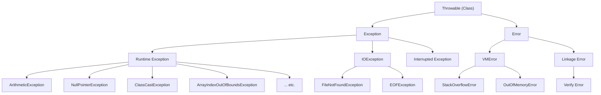



### Latest Java Questions?
- what is compact constructor?
- Can records have a constructor?
- Where can final fields be changed?
- What does list.copyOf() do with an immutable list
- Can record have static fields and methods?
- Difference between Switch Statement vs Switch Expression

**Security Related**

1. Data Hiding
2. Abstraction
3. Encapsulation
4. Tightly Encapsulated Class
   **Code Reusability**
5. IS-A Relationship (Inheritance)
6. HAS-A Relationship
   **sdsd**
7. Method Signature
8. Overloading
9. Overriding
10. Static Control Flow
11. Instance Control Flow
12. Constructors
    **Advanced OOP Features**
13. Coupling
14. Cohesion
15. Type Casting

- OOPS ()
    + **Encapsulation** (Accessors and Mutators)
    + **Abstraction** (crisply defined conceptual boundaries, relative to the
      perspective of the viewer — G. Booch)
    + **Inheritance**
    + **Polymorphism**
- Inheritance
    + Overloading vs overriding
    + multiple inheritance
    + method hiding
    + can static be inherited.
- Abstraction
    + Interface
        * variables in interface
        * default interface
        * 100% Abstraction
    + Abstraction instantiation?
    + Use Abstraction when there is some relation
    + Use Interface when there is no relation
    +
- Polymorphism
    + Runtime Polymorphism vs compile time polymorphism
    + Polymorphism as a way to have multiple inheritance

- Thread
    + Ways to implement a Thread
    + Concurrency package
    + Volatile
- Collections
    + List
        * ArrayList
        * LinkedList
        * 
-------------------------

### 4 OOPS principal in Java
**Summary**
- **Encapsulation** - encapsulation means data hiding. (By using private keyword)
- **Abstraction** - Abstraction means hiding the implementation (Using Interface)
- **Inheritance** - Inheritance is a process where child class acquires the properties of super class, and
- **Polymorphism** - Property of an object to take on different forms
    - **Compile time polymorphism** - using ~~Method overloading~~ by implements
    - **Runtime polymorphism** - Method overriding - by extends.


**Data Hiding** : By declaring data member or variable private,
    - internal data cannot be accessed by outside. By declaring data member or
      variable private, we achieve Data hiding.

**Abstraction** : By using Interfaces and Abstract class
    * Hiding internal implementation, eg ATM GUI Screen
    * Advantage :
        * Security as internal implementation is not exposed
        * without affecting outside, internal implementation can be
          changed/optimized. Thus enhancement becomes easy
        * Improved maintainability
        * Provides easy to use the system
    * Partial Abstraction : Abstract Class
    * Full Abstraction : Interface

**Encapsulation** : Process of Binding data members and their corresponding behavior such that
    * the methods operate on the data as opposed to the users of the class
      accessing the fields
    * Getters and Setters (Accessors and Modifiers)
    * Implemented with private instance fields which has public methods to
      access the fields directly
    * Encapsulation = Data Hiding + Abstraction
    * Adv : security
    * Disadv : increases code length and slows down execution

Tightly encapsulated class : iff all variabe are private

Complete Encapsulation : By declaring all members private

Partial Encapsulation : By declaring public or protected

If a parent class is not tightly encapsulated then no child class is tightly
encapsulated

#### IS-A Relationship (Inheritance)**
- implemented my "extends" keyword.
- Adv : Code reusability
- Entire java API is implemented based on inheritance.
- Every java class extends from Object class which has most common and basic
  methods required for all java classes. Hence, we can say “Object ” class is
  root class of all java methods.
- **Dynamic polymorphism** in Java is achieved by method **overriding**
- *As the method to call is determined at runtime, this is called dynamic binding or late binding.*

**Class Hierarchy**
```java
public class Animal {
    private int age;
    public void animalMethod() {
        System.out.println("Animal.animalMethod");
}

class Dog extends Animal {
    public void dogMethod() {
      System.out.println("Dog.dogMethod");
    }
}
```

**Runner**
```java
/* Animal has animalMethod(), Dog extends Animal and has dogMethod() */
Animal p = new Animal();
p.animalMethod();// Valid
// p.dogMethod();// Compile time error: Cannot find symbol

Dog c = new Dog();
c.animalMethod();// valid, as child inherits from parent
c.dogMethod();// valid as child provides implementation dogMethod

Animal pc = new Dog();// Polymorphic Call
pc.animalMethod();// valid as pc is of type Parent
// pc.dogMethod();// invalid, CE : Cannot find symbol
```

- Parent class reference can hold child class object, **BUT** only parent class
specific methods are available, Child class methods are not available.

**No Multiple Inheritance**

A Java class cannot extend more than one class at a time. Thus Java does not
support multiple inheritance. Only multilevel inheritance (Object ->
Throwable -> RunTimeException) is allowed. 

Multiple Interfaces can be implemented as the implementation is explicitly provided by the implementing class

##### Multiple inheritance and The Diamond Problem

The diamond problem is an **ambiguity** that arises when two classes B and C
 inherit from A, and class D inherits from both B and C. If a method in D calls a
 method defined in A (and does not override the method), and B and C have
 overridden that method differently, then from which class does it inherit: B, or
 C?

**Cyclic Inheritance is not allowed**
A extends B and B extends A not allowed

#### HAS-A Relationship (more commonly used than IS-A)
- aka Composition or Aggregation
- No specific keyword, but mostly "new" is used (for instance method)
- Advantage : Code reusability
- Disadvantage : code dependency

    ```java
    Class Engine{
        // Engine related functionality
    }
    
    Class Car{
        Engine e = new Engine();
        .....
        ....
    }
    ```

The Car `HAS-A` engine reference

#### **Composition - Strong Association**
Without existence of container object, if there is no existence of
contained objects then container and contained objects are said to be **strongly associated** and this strong association is known as composition.

University is Container Object
Department : Contained Object

Without University, no department exist

#### **Aggregation - Weak Association**
Without existence of container object, if there is a chance of existence of contained objects then container and contained objects are said to be *
*loosely/weakly associated** and this loose association is known as aggregation.

A “department” has several “professors”. Without existence of “departments”
there is good chance for the “professors” to exist. Hence “professors” and
“department” are loosely associated and this loose association is known as
Aggregation.

#### IS-A vs HAS-A

For **Total functionality** of a class, IS-A Relationship (Person Class functionality is required in total to the Student Class)

For **Part of the functionality** of a class is expected, use HAS-A relationship. 

If Test class has 100 methods and only few are needed in Demo class, create an
object of test and use t.m1(), t.m2() etc.

#### Coupling
The **degree of dependency** between the components is called Coupling.

If dependency is more then it is called Tightly Coupled and if dependency is less, loosely coupled

### Difference between Final, Finally, Finalize
- finally cleanup activities for try catch
- finalize() cleanup activities related to objects.

**final**
- constant –> modifier (can’t be changed once declared)
- a method –> no over-riding in child class
- a class –> no extend (inheritance), no child class

**finally**
-   Associated with try catch block
    ```java
    try {
      //keep risky code
    } catch (Exception e) {
      //Exception Handling Code
    } finally {
      //Clean up code
    }
    ```

**finalize() : Method in Object Class**
- Always invoked by Garbage Collector just before destroying the object
- to perform cleanup activities (like database connection close, socket close)

---

### String, StringBuffer and StringBuilder
- **String** objects are immutable (every equality with string object creates a
   new object)
    ```java
    String a = new String("Nitin");//Immutable Object
    String b = "Nitin";// When we use double quotes to create a string,
    // it first looks for the string with the same value in the String Pool. If found it just returns the reference.
    // It does so for conserving memory FLYWAY DESIGN PATTERN.
    
    String s4 = new String("nitin");
    String s5 = new String("nitin");
    /* String s4 and s5 are two different String objects lying in the "Heap" */
    
    //another string is created. Since, not referenced it is eligible for GC
    a.concate(Chaurasia);//Eligible for GC as not referenced
  
    sop(a);// Nitin
    ```

- **StringBuffer** objects are mutable
    ```java
    StringBuffer sb = new StringBuffer("Nitin");
    sb.append("Chaurasia");
    sop(sb);//nitin chaurasia
    ```

StringBuffer (since java 1.0) is Synchronized, thus thread safe, thus low
performance (only one thread operates on the object at a time, others has to
wait)

- **StringBuilder** (from 1.5)
same as StringBuffer (constructors and methods) except **non-synchronized**, thus no thread safety but Relatively high performance.

**Conclusion** :
- String : fixed content, immutable (won't change frequently)
- StringBuffer : content not fixed and thread safety is required.
- StringBuilder : content not fixed and thread safety is NOT required.

-----

### Difference Between == and .equals

- == reference comparison (address comparison)
- .equals() is used for content comparison (in general). Can be overridden to
  compare reference if needed

For all Wrapper Classes, String Classes and Collection Classes, .equals() is
overridden for _**content comparison**_

----------------

### Modifiers in java

They can be broken into two groups:

- Access control modifiers ( public, private, protected, default)
- Non-access modifiers (final, abstract, static, synchronized, strictfp,
  transient, native, volatile)

| Modifier    | Class | Package | Subclass | World |
|:------------|:------|:--------|:---------|:------|
| public      | Y     | Y       | Y        | Y     |
| protected   | Y     | Y       | Y        | N     |
| no modifier | Y     | Y       | N        | N     |
| private     | Y     | N       | N        | N     |

| MODIFIER      | DESCRIPTION                                                                                                |
|:--------------|:-----------------------------------------------------------------------------------------------------------|
| public        | Visible to the world                                                                                       |
| private       | Visible to the class                                                                                       |
| protected     | Visible to the package and all subclasses                                                                  |
| static        | Used for creating class methods and variables                                                              |
| final         | Used for finalizing implementations of classes, variables, and methods                                     |
| abstract      | Used for creating abstract methods and classes                                                             |
| synchronized	 | Used in threads and locks the method or variable so it can only be used by one thread at a time            |
| volatile      | Used in threads and keeps the variable in main memory rather than caching it locally in each thread static |

Anything can be declared inside anything!!

- Access Specifiers (public, private, protected and <default>) vs Access
  Modifiers
- Old language constructs… In java there is no terminology. All (12) are
  considered and modifiers

--------

### Interface vs Abstract vs Concrete class

Brief summary
- Interface: a contract; supports default/static methods (Java 8) and private helper methods (Java 9+).
- Abstract class: partial implementation + shared state for related classes.
- Concrete class: fully implemented, instantiable type.
- Interface types: marker (tag), functional (SAM), protocol/capability, sealed (restricted implementors).
- Rules: interface fields are implicitly `public static final`; default method conflicts must be resolved by the implementing class.

Full notes and examples: [Default method in Interface]().

-----

### System.out.println()

```java
Class MySystem{
  static string out = "nitin";
}

MySystem.out.length(); //Compare it to
System.out.println("nitin");
```

- System is a Class
- out is a static variable of type PrintStream in System class
- println() is a method present in PrintStream.

--------

### public static void main

- Main method name can be set to a desired name by configuring
  JVM [JVM Customization]

```
JVM {
public static void nitin(String[] a)
}
```

- public : to be called by JVM from anywhere
- static : even without existing Object, JVM can call the main method. Also main
  method is not related to any object.
- void : no return to JVM.
- main : configured JVM
- String[] args : command line argument.
- overloading is possible (PSVM (int b)), but JVM will only call string args
  method (method hiding)

Inheritance is also applicable. the JVM first search main in child class or else
it will execute the main method from the parent class.

If both Parent and child methods are same and “static”, this is **method hiding…
not overriding** (only child class method is executed).

Appears that overriding is applicable, but because of the static nature, its
method hiding.

- Inheritance and overloading is applicable
- overriding is not, instead method hiding.
- Java 1.7 enhancements - earlier “NoSuchMethodError : main”, now a more
  meaningful error
- main method is mendatory, even though class has static block. Before, static
  block will be executed (and if System.exit(0), the program will terminate as
  well), and then NoSuchMethodError will be flashed.
- if both static block followed by main method is present, then everything works
  as normal in both cases
- Thus without even writing main, until Java 1.6, something can be printed on
  the console. from 1.7 onwards, main in compulsory.

-------

### Overloading VS Overriding

**Method signature in Java = Method Name + Argument (type and order or arguments)**
- Return type is not part of method signature in java

**Binding** : Relating a method call to a method

##### Overloading
- methods with **same name but different argument**.
- Method resolution is done by compiler based on reference type (of the
  argument)
- In overloading only method name (same) and argument type (different, at
  least order) matters. ***Return types, access modifiers are not considered***
- Thus method overloading is also known as
    - Compile time Polymorphism
    - Static Binding
    - Early Binding
- Reference type plays very important role during compile time

```java
class Test {
    void select(Animal a) { System.out.println("Animal"); }
    void select(Monkey m) { System.out.println("Monkey"); }
}

// Monkey Extends Animal
Animal a = new Monkey();
Test test = new Test();

test.select(a); // prints "Animal" because overload is chosen at compile time
```

#### Compile-time binding (overload resolution) process
1. Compiler looks at the reference type: `Animal`.
2. It picks the best matching method from the overload set using the reference type.
3. The chosen method is fixed in the bytecode (`select(Animal)`), even if the runtime object is `Monkey`.

- **Automatic Promotion in overloading** - if argument reference type is not
  matched, compiler automatically promotes the type before throwing error.
  `byte->short->int->float->double`
    ```java
    class PromotionDemo {
        void pick(int x) { System.out.println("int"); }
        void pick(double x) { System.out.println("double"); }
    }
    
    byte b = 10;
    short s = 20;
    
    PromotionDemo d = new PromotionDemo();
    d.pick(b); // byte -> int, prints "int"
    d.pick(s); // short -> int, prints "int"
    ```

#### ***Overriding (Runtime polymorphism, dynamic polymorphism, late binding)***

- When child class definition is different than parent class (eg: marriage()
  method in child vs parent)
- Method resolution is done by JVM based on runtime object
- co-varient return types are allowed (return can be same as Parent’s method,
  after Java 1.5)

***In overriding: EVERYTHING should be same.***

Polymorphic call

```Java
Parent p = new Child();
// p can invoke only parents methods
// polymorphism call - use parent reference to hold any child class object
```

Non polymorphic call

```Java
Child c = new Child();
// c can invoke both parent and child methods
// can hold only child type of object
```

8. Overriding

-
- Same signature, child and parent but different implementation
- Method resolution takes care by JVM based on runtime Object and hence it is
  also called Runtime Polymorphism, Dynamic Binding or Late Binding.
- Dynamic Binding : all instance methods, Virtual methods are bounded during
  runtime object
- No concept of compile time polymorphism.
- Dynamic binding makes polymorphism possible. Compiler is not able to resolve
  the call. JVM binds based on runtime Object

```java
//Child extends from Parent and overrides method m1()

Parent pc = new Child();
pc.m1();
// the compiler happily complies as m1 is present is Parent. During run time, since m1() of child is overridden, the m1() of child class is invoked.
```

Rules for Overriding

- In override, return type must be same until 1.4. From v1.5, we can return "
  Covariant Return types"
- Java allow overriding by changing the return type, but only Covariant return
  type are allowed.
- private and final cannot be overridden
- static methods cannot be overridden BUT no contribution in Polymorphism (no
  dynamic binding).
- static methods are class methods access to them is always resolved during
  compile time only using the compile time type information.
- Accessing static method using object references is a bad practice (we must
  access static variable using Class Name) and just an extra liberty given by
  the java designers
- Also static method in subclass is hidden (if extended) by static method of
  parent class
- Cannot reduce visibility

Example -
return type of SuperClass’s myMethod is SuperClass but
SubClass’s myMethod returns SubClass.

-------

### Control Flow in try-catch-finally block
***Finally will always execute***

- after jumping from try in between multiple statements, rest of statements of
  try won't be executed. Thus keep the length of try block as small as possible)
- there are chances of exception in catch or finally block as well, and it will
  then be an abnormal termination.
- if no exception, try and finally will execute
- if abnormal termination due to exception in try or catch block, then also
  finally will execute.

  
### Checked vs Unchecked Exception


#### Error vs Exception

- Throwable (Class) has two child classes
    - Exception
        - Recoverable (file not found, catch {use local file and continue..})
        - Programming faults
    - Error (Unchecked)
        - Non recoverable
        - lack of system resources (out of memory etc)
        - 
#### Checked Exception
- Checked by compiler for smooth execution of the program at runtime
- Ex : HallTicketMissingException, PenNotWorkingException, FileNotFoundException
- if programmer doesn’t handle checked exceptions there will be compile time error. in other
  words, programmer **has to handle** the exception.
- **Must be caught** try-catch block or thrown (throws clause in the method definition)
- `Throwable -> Exception ->Runtime exception` and its child classes, 
  - Throwable->Error` and its child classes are unchecked exceptions.
  - Rest all are checked.
- Further classified as fully checked or partially checked

##### Partially Checked vs Fully Checked Exception

FullyChecked exception
- iff all the child classes are checked

PartiallyChecked exception
- if some of child classes are Unchecked while some are checked. Thus Exception
  Class is partially checked as Runtime Exception class is Unchecked and
  IOException class is checked

The only partially checked exception in Java are
1. Exception
2. Throwable

#### Unchecked Exception
- not checked by Compiler (Arithmatic, NullPointer)
- Compiler won’t check if the programmer handled the exception.
- Runtime Exception class is unchecked, rest all checked like IOException in
  Exception class)

***Both occur at runtime.***

***Runtime Exception and its child classes, Error and its child classes are
unchecked. Except this, all are checked exceptions.***

---

### Var-Arg Methods
Declare a method with variable number of Arguments
- Since V1.5
- `method(int... x)` & `method(int x...)` - ONLY TWO WAYS OF DECLARATION
- Only one Var-Arg parameter is allowed, also it should be **last** 
  - `methodName(String s, int... x)`
- internally it's implemented by 1D Array
- var-arg will get the least priority. similar to default in Switch
- USE : instead of writing multiple similar methods of same type, var args can
  be used. 
  - eg : List.of() has 10 methods and a var args to accommodate all
    choices. 
- var-arg is an expensive operation internally

-----

### Generics (J 1.5 onwards)

Main Purpose of Generics is to

* Provide Type-Safety
* and Resolve Type Casting Problems with Collections at compile time instead of getting runtime errors

**Type Safety** :
Arrays are type safe by default, eg. we cannot insert non String objects in a
String array. While in ArrayList, without generics, we can insert an int as well
as string, as any object can be inserted. 

Thus, collections are not type safe by default.

**Type Casting** :
While retrieving the data from an Arraylist, if not generic, type casting is
necessary as it returns an object
