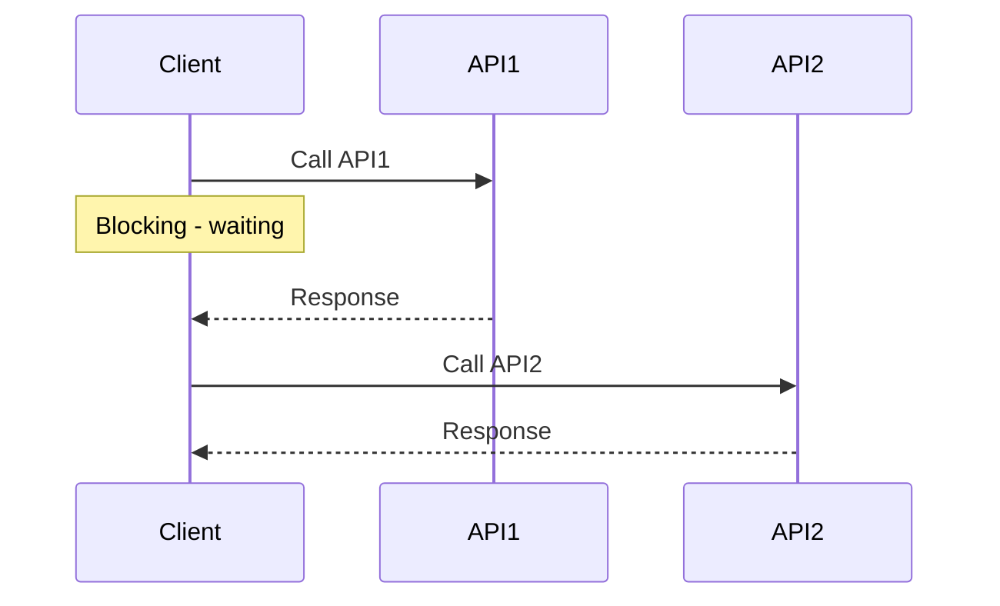
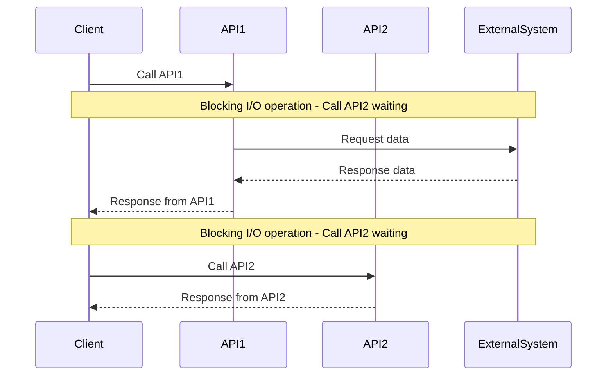
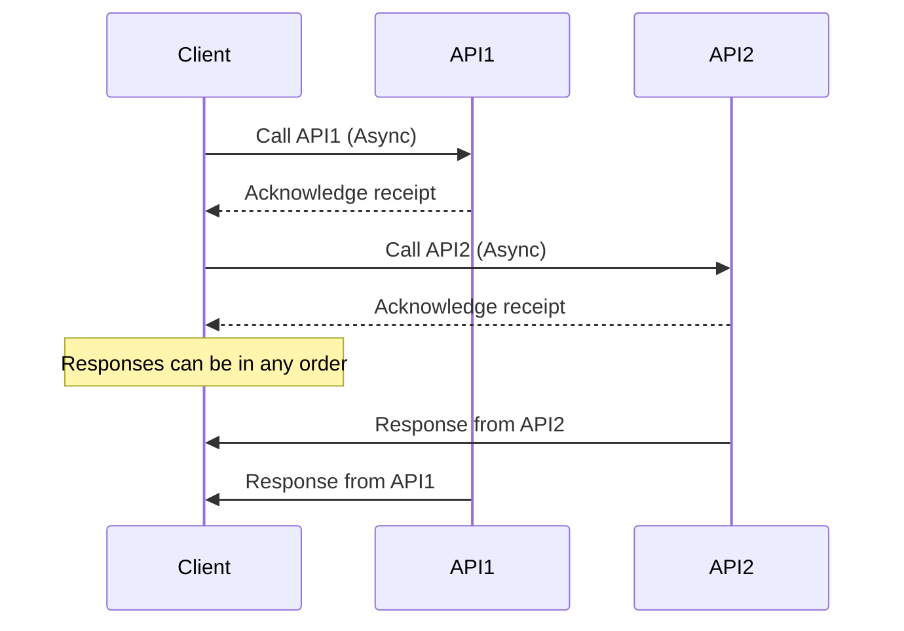
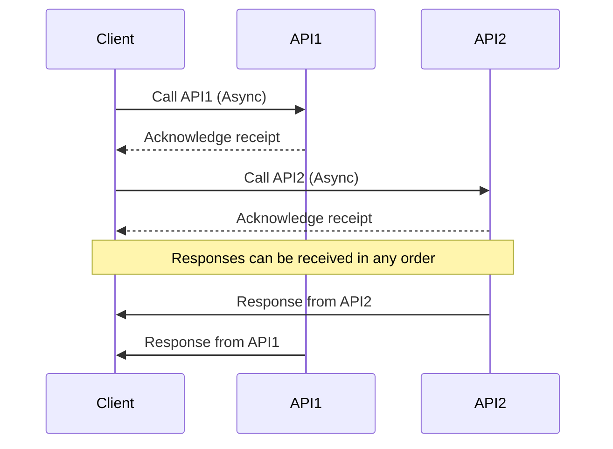
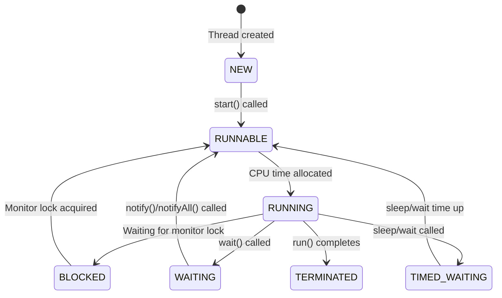
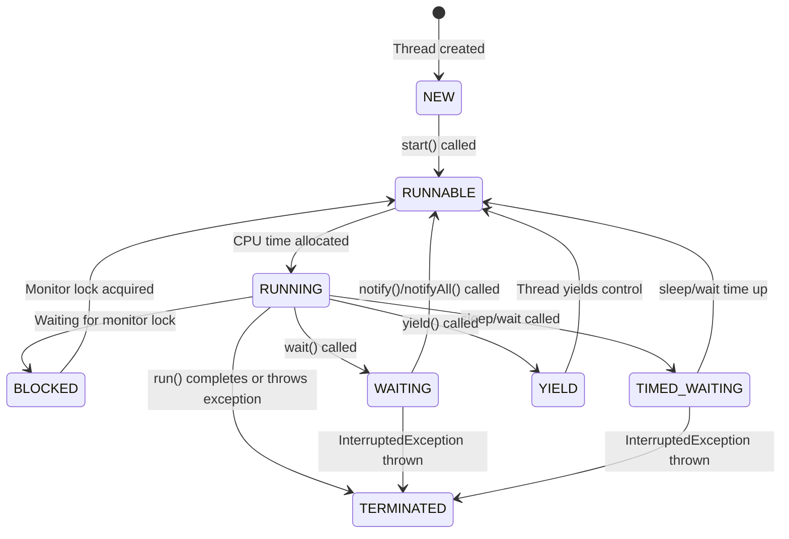



## Core Concepts

### Concurrency
> **Looking for a new job while working on the current job, during office hours.**

**Concurrency** = Managing multiple tasks at the same time (not necessarily simultaneously)
- Multiple tasks making progress
- Can happen on a single core
- Tasks may interleave, not run in parallel
- **No parallelism needed** to achieve concurrency
- Concurrency = Multitasking in the context

**Concurrency Visualization:**
Talk & Drink, but not at the Same time.
- hold one task and resume it once another is done
- can happen on a single core (2 threads in one core)

```
Concurrency (Single Core):
                     v                    v
                     |Time slice          |Another timeslice
thread1 - Talk   T   T    T   | T   T   T |  T  T
thread2 - Drink      |        D           D
time  t=0------------^--------^-----------^-------->t
```


### Parallelism
> **Maintaining 2 jobs, with 2 managers, without telling either manager.**

**Parallelism** = Executing multiple tasks simultaneously
- Multiple dependent/independent sub-tasks executing at the same time
- **Requires multiple CPU cores**
- No true parallelism in a single core
- Walk and Talk in parallel (2 independent tasks at exactly the same time)

**Parallelism with Multiple Cores:**
```
Core2 | Task3 -> Task4 -> Task4 -> Task3 -> Task3
Core1 | Task1 -> Task2 -> Task1 -> Task2 -> Task1
```

**Parallelism with Dividable Large Task:**
- Multiple dependent sub-tasks (larger task divided into smaller similar tasks) - all executing at the same time
- Multiple CPU cores involved
- No parallelism in a single core

[Diagram](https://app.eraser.io/workspace/ptDSaZUOMF3oJpPoCun3)


**Parallelism in Independent Tasks:**
- Walk and Talk in parallel (2 independent tasks), exactly at the same time
- 2 threads in 2 cores of the CPU

```
                       v
                       | [Time Slice v]
thread1-talk   T   T   T   T
thread2-walk   W       W
time  t=0--------------^-------------------->t
```

### Asynchronous
> **While brewing coffee, read emails and get back to coffee when it's done.**

**Asynchronous** = Non-blocking
- When you make a method call, you don't have to wait for it to complete
- Do not block the **thread of execution** and wait to finish
- However, **tasks** are always blocking (default behavior of a thread)

**Two Properties for Non-Blocking:**
1. **Responsiveness**: Main thread should always **delegate** and be available for next step
   - Eg: Click on download button and then move on to doing other stuff.
   - If the main thread takes care of downloading, then the application is blocked until the download is finished.
2. **Pre-emptible**: The ability of a system or thread to be **interrupted** or **preempted** by other tasks or threads
   - In a preemptible system, a running thread can be paused or stopped by the system scheduler to allow other threads or processes to execute.

Both parallel and async processes run in a separate thread (other than main-thread).
{: .notice--info}

**For Parallelism - JOIN:**
- The thread needs to **JOIN** i.e. the slowest process/thread determines the overall speed
- Per hour production - refills(10), cap(20) and body(50)
  - Total pens per hour = 10

**Asynchronous Handling:**
- Do not wait for completion, but when results arrive, move on to do other things with the results
- Use the **callback** to receive response
- Or use a **promise**

---

## Process vs Thread

### Process
An **independent program** with its own memory space.
- Self-contained execution environment
- Has its own heap memory, code, and open files
- Process-level isolation for security

### Thread
A **lightweight unit of execution** within a process.
- Smallest unit of execution within a process
- Multiple threads share heap memory of the process
- Each thread has its own **stack** and **instruction pointer**

All threads **share** Files, Heap, and Code

[Image Code Link](https://app.eraser.io/workspace/tRdPDXKngDIyHNQeiKZE?origin=share)

{:width="400" height="300"}

```
┌─────────────────────────────────────────┐
│              PROCESS                     │
│  ┌─────────────────────────────────────┐ │
│  │           Heap Memory               │ │
│  │   (Shared among all threads)        │ │
│  └─────────────────────────────────────┘ │
│                                          │
│  ┌──────────┐ ┌──────────┐ ┌──────────┐ │
│  │ Thread 1 │ │ Thread 2 │ │ Thread 3 │ │
│  │  Stack   │ │  Stack   │ │  Stack   │ │
│  │   PC     │ │   PC     │ │   PC     │ │
│  └──────────┘ └──────────┘ └──────────┘ │
└─────────────────────────────────────────┘
```

### Instruction Pointer
- Address of the next instruction to execute
- Associated with each thread

### What Threads Share (Multiple Threads in EACH PROCESS Share)
- Process's open **Files**
- Process's **metadata**
- **Heap** memory
- **Code** segment

### What Each Thread Has
- Own **Stack** (local variables, method calls)
- Own **Instruction Pointer/Program Counter**
- Own **Thread state**

### Comparison

| Feature | Process | Thread |
|---------|---------|--------|
| Memory | Separate memory space | Shared memory within process |
| Communication | IPC (Inter-Process Communication) | Direct via shared memory |
| Creation overhead | High | Low |
| Context switch | Expensive | Relatively cheap |
| Isolation | Completely isolated | Share process resources |

> **Note**: In Java, **1MB of Stack** is allocated for each thread. The OS mandates this because the Java thread is backed by the OS thread, which requires memory up front.

Note: The Java threads are basically a thin layer on top of the OS Threads, so creating a Java thread creates an underlying OS thread under the hood.
{: .notice--info}

---

## Why We Need Threads

### 1. Responsiveness (Achieved by Concurrency)
- Critical for applications with user interface
- Using multiple threads with a separate thread for each task
- Responsiveness can be achieved by using multiple threads, with a separate thread for each task
- **We don't need multiple cores to achieve concurrency**

> Consider one thread serving one request at a time

### 2. Performance (Achieved by Parallelism)
- Illusion with one core, truly parallel with multicore processors
- Completing complex tasks much faster

Caveat: Multithreaded Programming is fundamentally different from single-threaded programming
{: .notice--primary}

### When to Prefer Multithreaded Architecture
- Tasks share a lot of data
- Threads are much faster to create and destroy
- Faster context switches between threads of same process

### When to Prefer Multi-Process Architecture
- Security and Stability is of higher importance
  - Separate processes are completely isolated from each other
- Tasks are unrelated to each other

---

## Java Memory Model

### Shared Resources
- Variables (Class level, static, etc.)
- Data structures (Objects)
- File or Connection handles
- Message queues or Work Queues
- Any Other Object

### Memory Visibility

```
┌───────────────────┐    ┌───────────────────┐
│    Thread 1       │    │    Thread 2       │
│  ┌─────────────┐  │    │  ┌─────────────┐  │
│  │ CPU Cache   │  │    │  │ CPU Cache   │  │
│  │ flag = true │  │    │  │ flag = false│  │ ← Stale value!
│  └──────┬──────┘  │    │  └──────┬──────┘  │
└─────────┼─────────┘    └─────────┼─────────┘
          │                        │
          ▼                        ▼
    ┌─────────────────────────────────────┐
    │           Main Memory               │
    │          flag = true                │
    └─────────────────────────────────────┘
```

- **Heap Memory** is shared
- **Stack** is created for each thread, so variables on Stack aren't shared
- CPU caches can cause visibility issues (solved by `volatile`)

> **Concurrent systems** → different threads **communicate** with each other  
> **Distributed Systems** → different processes **communicate**

---

## Thread Scheduling

Each OS implements its own Thread Scheduling Algorithm

### Scheduling Types

Scheduling can be either:
- **preemptive** (forcing the current task out) - Shortest Remaining Time First
  - Forcibly interrupt and suspend the currently running task to switch to another task
- **non-preemptive** (waits for the current task to finish first)

### Context Switching

The CPU switches from executing in the **context of one thread** to executing in the context of another is **Context Switching**.

**OS must:**
1. Stop thread1 **saving**
   - the local data,
   - program pointer etc. of the current thread
2. Schedule thread1 **out**
3. Schedule Thread 2 **in** by **loading**
   - the local data,
   - program pointer etc. of the next thread to execute
4. Start thread 2

**Cost**: This is not an economical operation and is the price (tradeoff) with Multitasking (concurrency)
- Same as human beings—takes time to focus on the next task after switching from the first
- Store data of the current outgoing thread
- Restore data of the incoming thread (back into CPU and memory)

Context Switching between **threads from the same process** is **CHEAPER** than context switch between different processes
{: .notice--primary}

[Code Link](https://app.eraser.io/workspace/EoAeHbbnoamTb2aJzyMN?origin=share)


### Issues with Context Switch - Thrashing

A large number of threads causes **Thrashing** - spending more time in management than real productive work.
- Threads consume fewer resources than Processes

### Scheduling Algorithms

Assume 2 processes(A,B) with two threads(1,2) each running in a single core processor
- The 4 tasks each have an arrival order and length of execution time.

| Thread | Arrival Order | CPU Time |
|:------:|:-------------:|:--------:|
|   A1   |       0       |    4     | 
|   A2   |       1       |    3     | 
|   B1   |       2       |    2     | 
|   B2   |       3       |    1     | 

#### First-Come, First-Serve Scheduling

| Time 0 | Time 1 | Time 2 | Time 3 | Time 4 | Time 5 | Time 6 | Time 7 | Time 8 | Time 9 |
|:------:|:------:|:------:|:------:|:------:|:------:|:------:|:------:|:------:|:------:|
|   A1   |   A1   |   A1   |   A1   |   A2   |   A2   |   A2   |   B1   |   B1   |   B2   |

**Problem**: **Thread Starvation** - for the short process due to long-running processes.

#### Shortest Job First (SJF)
Selects the process with the shortest execution time from the ready queue.

**Timeline Illustration with SJF (Non-preemptive)**

First, finishing the current job in hand (A1):

|        Time 0        | Time 1 | Time 2 | Time 3 | Time 4 |    Time 5    | Time 6 |      Time 7       | Time 8 | Time 9 |
|:--------------------:|:------:|:------:|:------:|:------:|:------------:|:------:|:-----------------:|:------:|:------:|
|          A1          |   A1   |   A1   |   A1   |   B2   |      B1      |   B1   |        A2         |   A2   |   A2   |
| A1 - 4 units of task |        |        |        | 1 unit | B1 - 2 units |        | A2 - 3 units task |        |        |

**Problem**: If there are many short jobs, longer jobs can face starvation.

#### How It Really Works (Linux CFS)

[Inside the Linux 2.6 Completely Fair Scheduler](https://developer.ibm.com/tutorials/l-completely-fair-scheduler/)

- OS divides time into **Epochs** (moderately sized pieces)
- In each Epoch, OS allocates different time slices for each thread
- Not all threads get to run or complete in each epoch

> Not all the threads get to run or complete in each epoch.

The decision on how to allocate the time for each thread is based on a dynamic priority (The operating system maintains for each thread).

$$ \text{Dynamic Priority} = \text{Static Priority} + \text{Bonus} $$

- The static priority is set by the developer ahead of time
- The bonus is adjusted by the operating system in every epoch for each thread

This gives preference to:
- Interactive and real-time threads that need more immediate attention
- Computational threads that **did not complete**, or did not get enough time to run in previous epochs to prevent starvation

---

## Task Types

### I/O-Bound Tasks
Tasks that spend most time waiting for I/O operations.

### IO Bound Application

```java
public List<Dto> getData(RequestBody req){
    Request request = parseIncomingRequest(req);  // CPU Bound task
    Data data = service.getDataFromDb(request);   // I/O Bound Task - Thread blocked until the task is done!
    List<Dto> dtoList = mapper.map(data);         // CPU Bound task
    return dtoList;
}
```


**I/O Operations Include:**
- Socket reads/writes (DB calls, REST calls, network)
- File reads/writes (disk/slower memory access)
- Concurrent locks (enforcing synchronization)

### CPU-Bound Tasks (Compute-Intensive)
Tasks that use CPU continuously for calculations.

**Important**: Virtual threads don't improve latency for CPU operations!

### What is I/O?

The CPU can access the memory directly at any time, so our program can read from or write to variables from the memory without the operating system's involvement.

The CPU **doesn't have direct access** to **peripheral devices** (mouse, keyboard, NIC, Monitor, Disk drive).
- CPU can communicate with the **device-controller** of each device to either send it some data or receive some data from it.
- During the time that the specific IO device is doing its work, or when the device is idle, or the response from the network hasn't arrived yet, the CPU can continue running other tasks.

There is **Direct Memory Access (DMA)** involved, acting as a buffer between Peripheral controller, RAM and CPU.

[Diagram Code](https://app.eraser.io/workspace/T6P7KpKfUkWkbqsVJbqC?origin=share)

{:width="400" height="300"}

---

## Blocking vs Non-Blocking I/O

**IO operations:**
- Socket reads/writes - used by DB calls, REST Calls, anything to do with the networks
- File reads/writes - disk/slower memory access
- Concurrent locks - enforcing synchronization

Reactive Programming: to overcome scalability problems with IO
{: .notice--info}

### Blocking I/O (Synchronous)

In Blocking-I/O operations, a thread that performs an I/O operation (such as reading from a file or network socket) is **blocked** until the operation completes.
- During this time, the thread cannot perform other tasks.
- This is a **performance blocker**

**Synchronous call** considering API2 depending on the results of the API1:



**Extended Synchronous Call Diagram:**



### Non-Blocking I/O (Asynchronous)

In non-blocking I/O operations, a thread initiates an I/O operation and continues executing other code while the I/O operation is processed asynchronously.
- This can improve performance and scalability, especially in systems with high I/O operations.
- Uses **Futures and Callbacks**

**Asynchronous calls** considering API1 and API2 to be mutually exclusive:



**Extended Async Diagram:**



In terms of Thread, blocking vs non-blocking tasks would look like:


> **Reactive Programming**: To overcome scalability problems with I/O

---

## Threading Architecture Models

A couple of different architectures are used by application servers for handling user requests:
- Process-per-request model [old, CGI - Common Gateway Interface](https://en.wikipedia.org/wiki/Common_Gateway_Interface)
- Thread-per-request model

### Process-Per-Request Model (CGI - 1990s)

In the 1990s, a popular mechanism for handling user requests was the CGI (Common Gateway Interface).

In this architecture, when a user sends a request to the web server, the web server will invoke the associated CGI script as a separate **process**.
- Once the response is sent back, the process is destroyed and this is an overhead.
- This is an issue because a process in an operating system is considered heavyweight, starting and terminating a process for every request is inefficient.

**Fast CGI** (Solution):
- Similar to having a pool of processes, and the user request is routed to one of the available processes
- There is no extra time spent on starting up a new process because it's already up

### Thread-Per-Request Model

In the thread-per-request model, each incoming request is assigned a separate thread.
- This thread handles the request, performs the necessary processing, and then completes.
- It allows concurrent handling of multiple requests by allocating a dedicated thread for each request

#### Apache Tomcat

- Tomcat is a popular open-source web server and servlet container that follows the thread-per-request model.
- Tomcat maintains a pool of worker threads.
  - When a request arrives, a thread from the pool is assigned to handle the request.
  - Once the request is processed and a response is generated, **the thread is returned to the pool for reuse**.

**Tomcat Default**: 
- Thread-pool size of **200**
- If 250 concurrent users hit the application, 50 will wait
- A user request for an application server would be handed over to an **already created thread** in a thread pool, rather than creating a brand new one.

### Thread-Per-Task Model

**Issues:**
- Does not give optimal performance
  - When thread is blocking on I/O, it cannot be used
  - Requires us to allocate more threads
  - Consumes more resources
  - Adds context switch overhead

### Thread-Per-Core with Non-Blocking-I/O
- Provides optimal performance
- Used by reactive frameworks

---

## History of Java Multithreading

| Version | Feature | Details |
|---------|---------|---------|
| **Java 1** | Threads | One API for all machines, hardware independent |
| **Java 5** | ExecutorService API | Pool of threads. **Issue**: Pool-induced deadlock - One thread breaks the problem and throws in the pool and waits for the result to come back. All the threads in pool just divided the work, and no thread left to take care of the problem |
| **Java 7** | Fork Join Pool | Work-stealing: the thread that divides the problem also solves one of the divided part |
| **Java 8** | ParallelStreams, CompletableFutures | Uses FJP, Common Fork Join Pool |
| **Java 21** | Virtual Threads | Game changer for I/O-bound applications. [Virtual Threads Docs](https://docs.oracle.com/en/java/javase/21/core/virtual-threads.html) |

---

## Thread Lifecycle States

[Java 22 Doc - Thread.State.html](https://docs.oracle.com/en/java/javase/22/docs/api/java.base/java/lang/Thread.State.html)



**Extended State Diagram with YIELD:**



| **State** | **Description** |
|:----------|:----------------|
| **NEW** | The thread is created but not yet started. |
| **RUNNABLE** | The thread is ready to run but waiting for CPU time. |
| **RUNNING** | The thread is actively executing. |
| **BLOCKED** | The thread is waiting for a monitor lock. |
| **WAITING** | The thread is waiting indefinitely for another thread's action. |
| **TIMED_WAITING** | The thread is waiting for another thread's action for a specified time. |
| **YIELD** | The thread is yielding control to allow other threads to execute. |
| **TERMINATED** | The thread has completed execution or has been interrupted. |

### Yield

When a thread calls `yield()`, it suggests to the thread scheduler that it might be a good time to switch to another thread.

- The thread transitions **from RUNNING to RUNNABLE**, allowing other threads to be scheduled for execution.
- However, it's **not guaranteed** that:
  - The current thread will stop running immediately or
  - Other threads will be scheduled right away.

### Sleep

`Thread.sleep(1000)` instructs the operating system to **not schedule** the current thread until the given time passes.

During that time, the thread is not consuming any CPU.

---

## Daemon vs Non-Daemon Threads

A daemon thread is a thread that runs in the background and does not prevent the JVM from exiting.
- When all **non-daemon** threads finish, the JVM can shut down, even if daemon threads are still running.
- Daemon threads are typically used for background services like garbage collection or background monitoring.

In Java, by default, all threads are **non-daemon threads** (unless explicitly modified).
- The Java Virtual Machine (JVM) will not terminate until all non-daemon threads have finished executing.
- This is true even if the main thread has terminated.

| **User Threads** | **Daemon Threads** (Background threads) |
|:-----------------|:-------------------------------|
| JVM **waits** for user threads to finish their work. It **will not exit** until all user threads finish their work. | JVM will not wait for daemon threads to finish their work. It will exit as soon as all main threads finish their work. |
| User threads are high priority threads. | Daemon threads are low priority threads. |
| JVM will not force the user threads to terminate. It will wait for user threads to terminate themselves. | JVM will force the daemon threads to terminate if all user threads have finished their work. |

---

## Asynchronous Task Execution Engine

> Executor Service was introduced in Java 1.5

Execution Engine has:
- Work Queue (Blocking Queue)
- Completion Queue
- Thread Pool

As soon as the work is **placed** in the work queue, you get **Future**.

Future is a proxy or reference of the result that **will be returned** in the Future.

Fork Join Framework (used in parallel stream behind the scenes) -> Java 7 (Extends ExecutorService)

---

## Async & Non-Blocking Programming Features

### Callback

Callback - When the response is received, execute the function

```java
doSomething(data, response -> {...})
```

* Callback lacks consistency
* Really hard to compose callbacks
* Hard to deal with error

> Creates Callback hell

### Promise

When done with the task, update through the promise by any one of the three states:
- Pending
- Resolved
- Rejected

Promise has 2 channels -> data channel & error channel

#### Railway Track Pattern

Treat error as another form of data and as first class citizens

```
data track  -----f------f     recovering from exception       f--or continue with then methods-----
                          \                                  /
error track ----------------f---can return default data-----f----or handle exception---------------
```

```
HappyPath==========================D==========D=======================
data -> function -> Promise -> f-> P -> f  -> P -> f -> P -> f-> P -> f       
UnhappyPath===========================================Exception==E=======
```

---

## Summary

✅ **Concurrency** = Managing multiple tasks (can be single core)  
✅ **Parallelism** = Executing multiple tasks simultaneously (needs multiple cores)  
✅ **Asynchronous** = Non-blocking execution  
✅ **Threads share heap** but have own stack  
✅ **Context switching** is expensive but cheaper within same process  
✅ **I/O-bound** tasks benefit most from threading  
✅ **CPU-bound** tasks need limited threads (= cores)  
✅ **1MB Stack** per Java thread (backed by OS thread)  
✅ **Thrashing** = too many threads, more management than work

---

*Next: [Part 2: Thread Creation Methods →](/java/multithreading/concurrency/02-thread-creation-methods/)*


