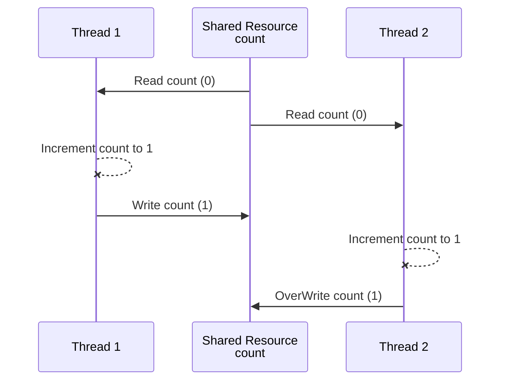
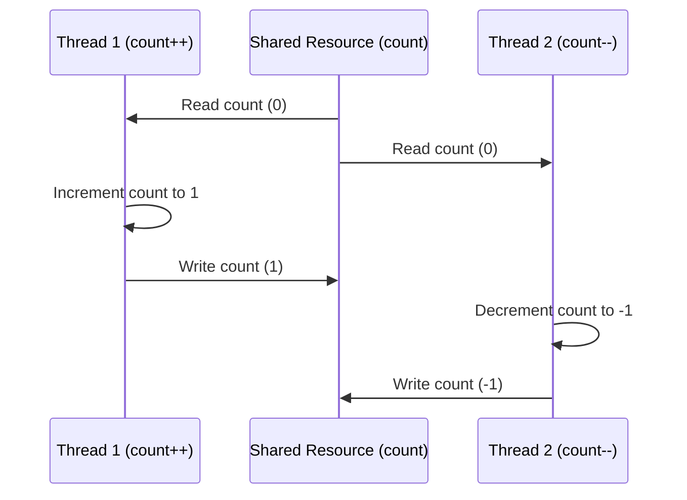
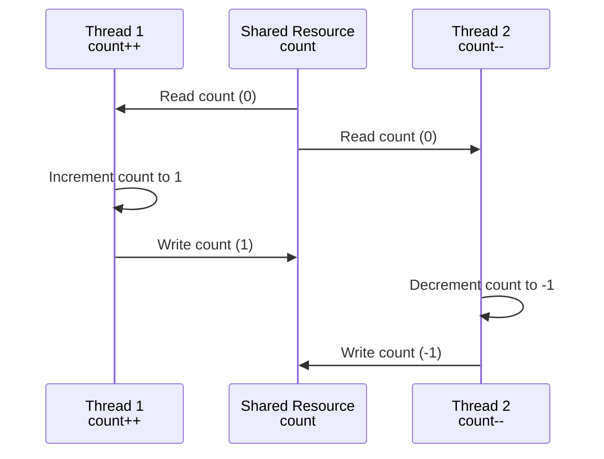



# Part 4: Race Conditions & Critical Sections

This part dives deep into the problems that arise when multiple threads access shared resources - race conditions and data races.

---

## Shared Resources

### What Can Be Shared?

- **Variables** (Class level, static, etc.)
- **Data structures** (Objects)
- **File or Connection handles**
- **Message queues or Work Queues**
- **Any Other Object**

### Memory Sharing

- **Heap Memory** is shared among all threads
- **Stack** is created for each thread, so variables on Stack aren't shared

### Concurrent vs Distributed Systems

> Concurrent systems -> different threads **communicate** with each other <br>
> Distributed Systems -> different processes **communicate**.

### Historical Note

Reentrant Locks and Semaphores are introduced in Java 1.5

* Reentrant Locks (Mutex) allows only one thread in a critical section.
* Semaphore allows a fixed number of threads to access a critical section.

### The Risk

When multiple threads access shared resources:
- **Without proper synchronization** → Race conditions
- **Without proper visibility** → Data races

---

## Atomic Operations

### Definition

**Atomic Operation**: An operation that completes in a single step relative to other threads.

- **All-or-Nothing**: The operation either completes fully or doesn't start at all
- **Indivisibility**: No other operations can interleave or interrupt the atomic operation

### What's Atomic in Java?

**Atomic by default:**
- Read & Assignment on all primitive types (**except** long and double)
- Read & Assignment on all references
- Read & Assignment on all **volatile** long and double

### What's NOT Atomic?

**`counter++` is NOT atomic!** It involves 3 steps:

```java
// This looks like one operation but it's actually THREE:
counter++;

// Step 1: READ - Fetch the current value of counter from memory
// Step 2: TEMP WRITE - Increment the fetched value by 1
// Step 3: ASSIGNMENT - Store the incremented value back into counter
```

This is why `counter++` is a **non-atomic operation** and prone to race conditions.

### Non-Atomic Operation Explained

**Non-Atomic operation** - A single Java operation (eg. count++) turns into two or more hardware operations:

- fetch current value of count
- perform count+1
- reassign back to count

```java
private int counter;
public void increment() {
    counter++;
}

public void decrement() {
    counter--;
}
```

If two threads execute `counter++` simultaneously, they could both fetch the same initial value of counter, increment it, and then store the same new value, resulting in one increment instead of two.

This is a **race condition**.

---

## Race Conditions

### Definition

A **race condition** occurs when:
1. Multiple threads accessing **shared resources**
2. At least one thread is **modifying** the shared resources
3. The timing of thread scheduling may cause **incorrect results**
4. The core problem is **non-atomic operations** on shared resource

### Interleaved Execution with a Shared Resource

### Visual Example: Both Threads Incrementing (Text Diagram)

```
Thread 1                    Thread 2
─────────────────────────────────────────────
1. Read counter (0)
2. Increment (0→1)          1. Read counter (0)  ← Same value!
3. Write counter (1)        2. Increment (0→1)
                            3. Write counter (1)  ← Lost update!

Expected: counter = 2
Actual: counter = 1 (LOST UPDATE!)
```

### Visual Example: Both Threads Incrementing with NO COMMUNICATION (Mermaid)



### Visual Example: One Incrementing, One Decrementing



**Result**: Final value is -1, but should be 0!

### Visual Example: One Incrementing, One Decrementing (Alternative Mermaid)



### Code Example

```java
// PROBLEM: counter++ is NOT atomic (read→increment→write)
private int counter = 0;

public void increment() {
    counter++;  // Race condition!
}

public void decrement() {
    counter--;  // Race condition!
}
```

📁 *Code: `raceCondition/dSynchronization/S0NonSyncProblems.java`*

### Race Condition Solution

**Ensuring Atomicity**

Identify and protect the critical section:

- Using synchronized keyword
    - on the method - monitor
    - using synchronized block - more granularity & flexibility but verbose
- Using AtomicInteger

---

## Critical Sections

### Definition

**Critical Section**: Parts of code that access shared resources and must be protected to prevent concurrent access issues.

### Visualization

```
Thread 1        Critical Section        Thread 2
    │               │                       │
    ├──────────────▶│ counter++             │
    │               │ (LOCKED)              │
    │               │◀──────────────────────┤ Wait...
    │               │                       │
    ├───────────────┤ Exit                  │
    │               │──────────────────────▶│
    │               │ counter++             │
```

### Protection Methods

1. **Synchronized** Methods and Synchronized Blocks (with lock object) ensure that only one thread can access a critical section at a time.
2. **ReentrantLocks** offer more control and flexibility compared to synchronized blocks.
3. **Atomic Variables** - for simple operations
4. **Concurrent Collections** are thread-safe and can simplify handling shared data without manual synchronization.
    - **Examples**: ConcurrentHashMap, CopyOnWriteArrayList, BlockingQueue

### Mutual Exclusion

When using synchronized:
```java
// Run by increment thread
public synchronized void increment() {
    count++;
}

// Run by decrement thread
public synchronized void decrement() {
    count--;
}
```

- When thread1 is executing `increment()`, thread2 can't execute `decrement()`
- When thread2 is executing `decrement()`, thread1 can't execute `increment()`
- Both methods are synchronized and belong to the **same object** (counter)

That is because both methods are synchronized, and belong to the same object (counter).

📁 *Code: `raceCondition/dSynchronization/S0NonSyncProblemsSolved.java`*

---

## Data Race

### Definition

A **Data Race** is different from a race condition. It's about **instruction ordering** and **visibility**.

### Example Question

Is `x` strictly greater than `y`?

```java
private int x = 0, y = 0;

public void increment() {
    x++;  // Does this always run before y++?
    y++;
}

// Check for the above hypothesis
public void checkForDataRace() {
    if (y > x) 
        System.out.println("y > x - Data Race is detected");
}
```

**Scenario:**
- One thread running `increment()` method in a loop
- One checker thread just to see if Data Race occurs

**Surprising Result**: `y > x` can happen! Why?

---

## Code Rearrangement

### Why Does Data Race Occur?

Compiler and CPU **may execute instructions out of order** (if the instructions are independent) to optimize performance.

- The logical correctness of the code is always maintained

[Java Compilation Optimization](https://nitinkc.github.io/java/compiler-code-optimization/)

### Logical Correctness is Maintained

- Within a single thread, the visible result is correct
- But **across threads**, the intermediate states can be visible

### What Compiler Rearranges For

**The compiler re-arranges the instructions for better:**

- **Branch prediction** (optimized loops, `if` statements, etc.)
- **Vectorization** - parallel instruction execution (SIMD)
- **Prefetching instructions** - better cache performance

### What CPU Rearranges For

**The CPU rearranges the code for better:**

- Better hardware units utilization

### Example: Cannot Be Rearranged

The following can't be rearranged as all instructions are interdependent:

- `y` depends on `x` and `z` depends on `y`

```java
// y depends on x, z depends on y - can't be swapped
x = 1;
y = x * 2;
z = y + 1;
```

### Example: Can Be Rearranged

The following code may be arranged by the Compiler or CPU - leading to unexpected, paradoxical, and incorrect results:

```java
// These are INDEPENDENT - can be swapped!
x++;
y++;
// OR
y++;
x++;
```

### The Problem

Code rearrangement can lead to:
- Unexpected results
- Paradoxical states
- Incorrect behavior in multithreaded programs

---

## Solutions Overview

### For Race Conditions

**Ensure Atomicity** - Identify and protect the critical section:

1. **Using `synchronized` keyword**
   - On the method (monitor)
   - Using synchronized block (more granularity & flexibility)

2. **Using AtomicInteger**

### For Data Races

**Establish `Happens-Before` semantics:**

1. **Synchronization of methods**
   - Solves both race and data condition
   - **Performance penalty**

2. **Volatile shared variables**
   - Solves race condition for read/write from long and double
   - Solves all data races by guaranteeing order
   - [volatile shared variables](https://nitinkc.github.io/java/Volatile/)

### Rule of Thumb

> Every shared variable (modified by at least one thread) should be either:
> - **Guarded by a synchronized block** (or any type of lock) **OR**
> - Declared **volatile**

### Choosing the Right Tool

```
Need thread safety?
├── Single flag? → volatile
├── Single counter? → AtomicInteger
├── Multiple variables together? → synchronized
└── Complex operations? → Lock (ReentrantLock)
```

### Comparison of Solutions

| Solution | Race Condition | Data Race | Performance |
|----------|---------------|-----------|-------------|
| synchronized | ✅ Solved | ✅ Solved | Slower (blocking) |
| volatile | ❌ Not for compound ops | ✅ Solved | Fast (no blocking) |
| AtomicInteger | ✅ For single var | ✅ Solved | Fast (CAS) |
| ReentrantLock | ✅ Solved | ✅ Solved | Flexible |

---

## Key Takeaways

### Race Condition Conditions
1. Multiple threads accessing shared resources
2. At least one thread modifying
3. Non-atomic operations
4. Timing-dependent incorrect results

### Data Race Conditions
1. Code rearrangement by compiler/CPU
2. Memory visibility issues
3. Can cause y > x even when x++ runs before y++

### Prevention

| Problem | Solution |
|---------|----------|
| Race Condition | synchronized, Locks, Atomic variables |
| Data Race | volatile, synchronized |
| Both | synchronized (but with performance cost) |

---

## Summary

✅ **Shared resources** include heap variables, objects, files, connections  
✅ **`counter++` is NOT atomic** - it's three operations  
✅ **Race condition** = wrong results due to interleaved non-atomic ops  
✅ **Critical section** = code accessing shared resources (must protect)  
✅ **Data race** = visibility/ordering issues due to code rearrangement  
✅ **Rule**: Every shared variable needs synchronized OR volatile

---

*Next: [Part 5: Synchronization Mechanisms →](/java/multithreading/concurrency/05-synchronization-mechanisms/)*
