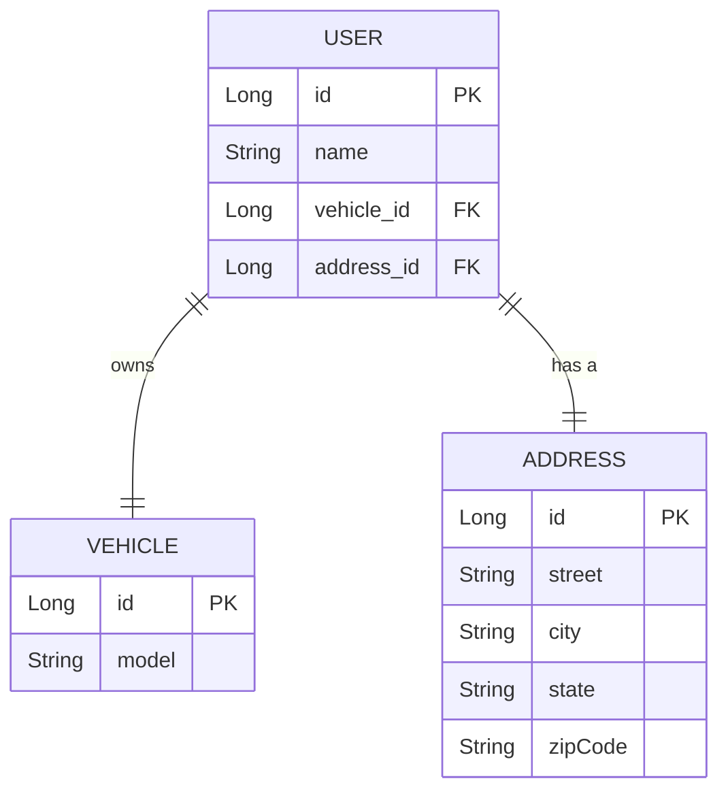
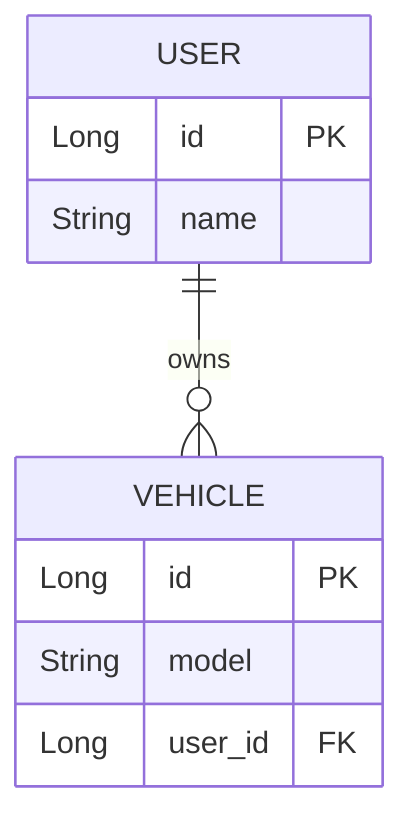
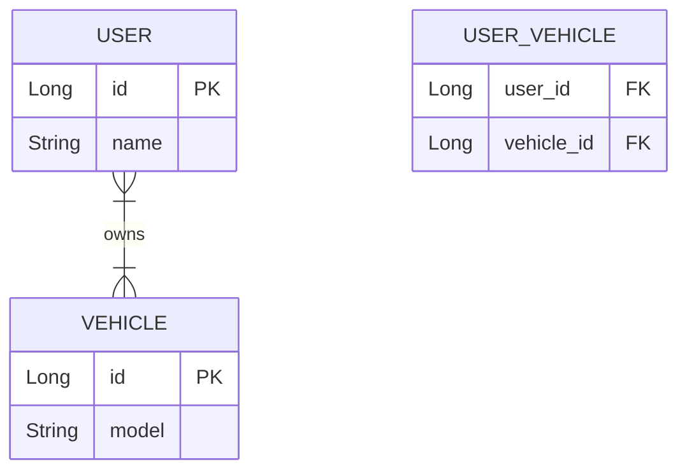
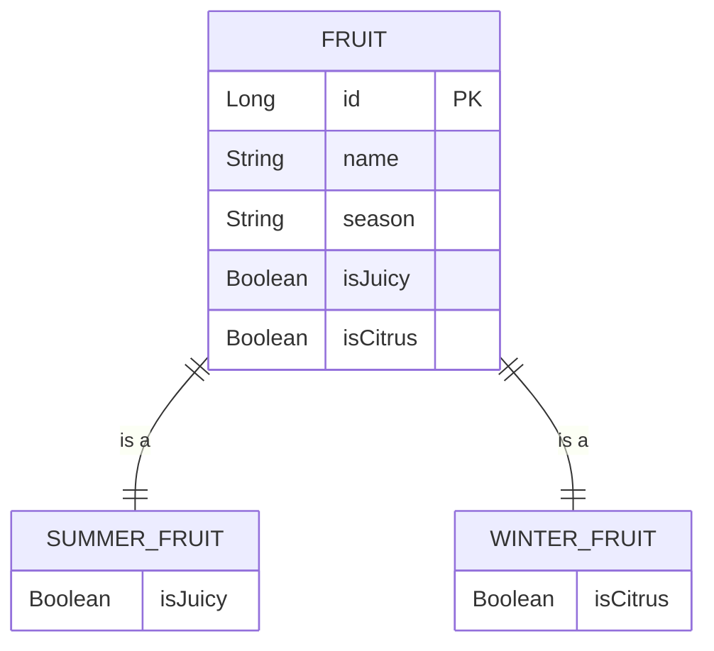



# Important Annotations

- @Entity : The class name gets Set as the table name in DB
- @Table(name = "MyName") - Customized name. If not given the table name will be the name of the class

- Renaming Annotations
...- @Column(name="User_Id") - resets the name of the column to User_Id in the Database
  
- @Embeddable - the class that is needeed (sub)
- @Embedded - the class where enbaddable is to be used

# HAS-A Relationship (Composition)

### one-to-one relationship



```java
@Data @Entity
@Table(name = "users")
public class User {
    @Id @GeneratedValue(strategy = GenerationType.IDENTITY)
    private Long id;
    private String name;

    @OneToOne(cascade = CascadeType.ALL)
    @JoinColumn(name = "vehicle_id", referencedColumnName = "id")
    private Vehicle vehicle;

    @OneToOne(cascade = CascadeType.ALL)
    @JoinColumn(name = "address_id", referencedColumnName = "id")
    private Address address;
}

@Table(name = "vehicles")
public class Vehicle {
    @Id @GeneratedValue(strategy = GenerationType.IDENTITY)
    private Long id;
    private String model;
    
    @OneToOne(mappedBy = "vehicle")
    private User user;
}

@Table(name = "addresses")
public class Address {
    @Id @GeneratedValue(strategy = GenerationType.IDENTITY)
    private Long id;
    
    private String street;
    private String city;
    private String state;
    private String zipCode;
}
```

### many-to-one 
A one-to-many association links two tables based on a Foreign Key column so that the child table record references
the Primary Key of the parent table row.

This association can either be Unidirectional One to Many association or Bidirectional One to Many

* The bidirectional association requires the **child entity** mapping to provide a **@ManyToOne** annotation,
* The unidirectional @OneToMany association is simple as parent-side requires One to many annotation.




```java
@Table(name = "users")
public class User {
    @Id @GeneratedValue(strategy = GenerationType.IDENTITY)
    private Long id;
    private String name;
    
    @OneToMany(mappedBy = "user", cascade = CascadeType.ALL, orphanRemoval = true)
    private List<Vehicle> vehicles;
}

@Table(name = "vehicles")
public class Vehicle {
    @Id @GeneratedValue(strategy = GenerationType.IDENTITY)
    private Long id;
    private String model;
    
    @ManyToOne(fetch = FetchType.LAZY)
    @JoinColumn(name = "user_id")
    private User user;
}
```

### many-to-many



```java
@Table(name = "vehicles")
public class Vehicle {
    @Id @GeneratedValue(strategy = GenerationType.IDENTITY)
    private Long id;
    private String model;
    
    @ManyToMany(mappedBy = "vehicles")
    private Set<User> users = new HashSet<>();
}

@Table(name = "users")
public class User {
    @Id @GeneratedValue(strategy = GenerationType.IDENTITY)
    private Long id;
    private String name;
    
    @ManyToMany(cascade = CascadeType.ALL)
    @JoinTable(
        name = "user_vehicle",
        joinColumns = @JoinColumn(name = "user_id"),
        inverseJoinColumns = @JoinColumn(name = "vehicle_id")
    )
    private Set<Vehicle> vehicles = new HashSet<>();
}
```

# Inheritance



```java
@Inheritance(strategy = InheritanceType.SINGLE_TABLE)
@DiscriminatorColumn(name = "season", discriminatorType = DiscriminatorType.STRING)
@Table(name = "fruits")
public abstract class Fruit {
    @Id
    @GeneratedValue(strategy = GenerationType.IDENTITY)
    private Long id;
    
    private String name;
}

@DiscriminatorValue("Summer")
public class SummerFruit extends Fruit {
    private boolean isJuicy;
}

@DiscriminatorValue("Winter")
public class WinterFruit extends Fruit {
    private boolean isCitrus;
}
```