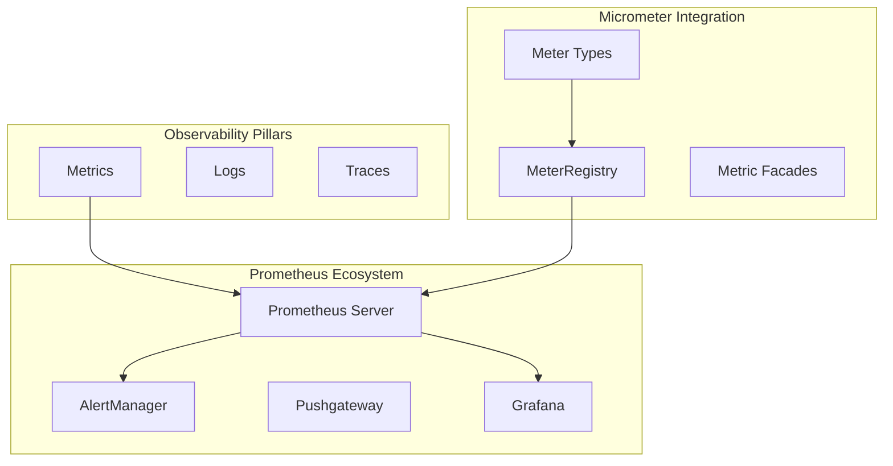

---
categories:
- Microservices
date: 2024-07-18 17:00:00
tags:
- Spring Boot
- Metrics
- Monitoring
- Observability
- Guide
title: 'Complete Guide to Prometheus & Micrometer: Metrics, Monitoring & Observability'
---



# Introduction to Observability with Prometheus & Micrometer

**Observability** is the practice of instrumenting systems to collect, aggregate, and analyze data to understand system behavior and performance. **Prometheus** is a time-series database and monitoring system, while **Micrometer** provides a simple facade over various monitoring systems for JVM-based applications.

## Key Concepts Overview



## Architecture Overview

```mermaid
flowchart LR
    subgraph SpringBootApp ["Spring Boot Application"]
        APP[Application Code]
        MIC[Micrometer]
        ACT[Spring Actuator]
    end
    
    subgraph Metrics Collection
 ["Metrics Collection
"]
        PROM[Prometheus Server]
        SCRAP[Scraping]
    end
    
    subgraph Visualization & Alerting
        GRAF[Grafana]
        ALERT[AlertManager]
    end
    
    APP --> MIC
    MIC --> ACT
    ACT -->|/actuator/prometheus| SCRAP
    SCRAP --> PROM
    PROM --> GRAF
    PROM --> ALERT
```

# Prometheus Metric Types

In Prometheus, metrics can be categorized into several types based on the **nature of the data** they represent.

# Counter

A **counter** is a cumulative metric that represents a single numerical value that only ever **goes up** (and resets when the process restarts). Counters are typically used to represent counts of events or increments over time.

**Use Cases:**
- HTTP request counts
- Error counts
- Task completion counts
- Page views
- API calls

```java
@Component
public class MetricsService {
    private final MeterRegistry meterRegistry;
    private Counter requestCounter;
    private Counter errorCounter;
    private final LicenseService licenseService;

    public MetricsService(MeterRegistry meterRegistry, LicenseService licenseService) {
        this.meterRegistry = meterRegistry;
        this.licenseService = licenseService;
    }

    @PostConstruct
    public void initializeMetrics() {
        // Counter with tags for better categorization
        requestCounter = Counter.builder("http_requests_total")
                .description("Total number of HTTP requests")
                .tags("service", "license", "environment", "prod")
                .register(meterRegistry);

        // Error counter with multiple tags
        errorCounter = Counter.builder("errors_total")
                .description("Total number of errors")
                .tag("type", "business_error")
                .register(meterRegistry);

        // Schedule task to simulate requests
        Executors.newSingleThreadScheduledExecutor()
                .scheduleAtFixedRate(this::processRequest, 0, 100, TimeUnit.SECONDS);
    }

    // Example method using Counter
    public void processRequest() {
        try {
            licenseService.runJob();
            requestCounter.increment(); // Increment by 1
            // requestCounter.increment(5.0); // Increment by custom amount
        } catch (Exception e) {
            errorCounter.increment();
            throw e;
        }
    }

    // Method with conditional counting
    @EventListener
    public void handleUserAction(UserActionEvent event) {
        Counter.builder("user_actions_total")
                .tags("action", event.getAction(), "user_type", event.getUserType())
                .register(meterRegistry)
                .increment();
    }
}
```

# Gauge

A **gauge** is a metric that represents a single numerical value that can **arbitrarily go up and down**. Gauges are used for measured values like temperatures, current memory usage, queue sizes, or active connections.

**Use Cases:**
- Current memory usage
- Active connections
- Queue depth
- Temperature readings
- CPU utilization
- Current inventory levels

```java
@Component
public class SystemMetricsService {
    private final MeterRegistry meterRegistry;
    private final AtomicInteger activeUsers = new AtomicInteger(0);
    private final AtomicDouble cpuUsage = new AtomicDouble(0.0);
    private Gauge activeUsersGauge;
    private Gauge memoryGauge;

    public SystemMetricsService(MeterRegistry meterRegistry) {
        this.meterRegistry = meterRegistry;
    }

    @PostConstruct
    public void initializeMetrics() {
        // Simple gauge with AtomicInteger
        activeUsersGauge = Gauge.builder("active_users")
                .description("Number of currently active users")
                .tags("service", "user_management")
                .register(meterRegistry, activeUsers, AtomicInteger::get);

        // Gauge with lambda function
        Gauge.builder("cpu_usage_percent")
                .description("Current CPU usage percentage")
                .register(meterRegistry, this, SystemMetricsService::getCurrentCpuUsage);

        // Gauge for JVM memory usage
        memoryGauge = Gauge.builder("jvm_memory_used_bytes")
                .description("Used JVM memory in bytes")
                .register(meterRegistry, Runtime.getRuntime(), 
                    runtime -> runtime.totalMemory() - runtime.freeMemory());

        // Collection size gauge
        List<String> activeConnections = new ArrayList<>();
        Gauge.builder("active_connections")
                .description("Number of active connections")
                .register(meterRegistry, activeConnections, Collection::size);

        // Schedule periodic updates
        ScheduledExecutorService executorService = Executors.newSingleThreadScheduledExecutor();
        executorService.scheduleAtFixedRate(this::updateMetrics, 0, 1, TimeUnit.SECONDS);
    }

    public void updateMetrics() {
        // Simulate user activity
        if (Math.random() > 0.5) {
            userLoggedIn();
        } else {
            userLoggedOut();
        }
        
        // Update CPU usage
        cpuUsage.set(Math.random() * 100);
    }

    public int userLoggedIn() {
        return activeUsers.incrementAndGet();
    }

    public int userLoggedOut() {
        return Math.max(0, activeUsers.decrementAndGet());
    }

    private double getCurrentCpuUsage() {
        return cpuUsage.get();
    }

    // Multi-function gauge example
    @Bean
    public MeterBinder systemMetrics() {
        return (MeterRegistry registry) -> {
            Gauge.builder("system.load.average")
                    .register(registry, 
                        ManagementFactory.getOperatingSystemMXBean(),
                        osBean -> osBean.getSystemLoadAverage());
        };
    }
}
```

# Summary

A **summary** samples observations (usually durations or sizes) over a **sliding time window** and calculates configurable **quantiles** (percentiles) over these samples on the **client side**.

**Use Cases:**
- Response time percentiles
- Request size distributions
- Latency measurements
- File size distributions

**Key Features:**
- Client-side quantile calculation
- Configurable sliding time window
- No predefined buckets needed
- Lower server-side storage requirements

```java
@Component
public class PerformanceMetricsService {
    private final MeterRegistry meterRegistry;
    private DistributionSummary responseSizesSummary;
    private DistributionSummary requestLatencySummary;

    public PerformanceMetricsService(MeterRegistry meterRegistry) {
        this.meterRegistry = meterRegistry;
    }

    @PostConstruct
    public void initializeMetrics() {
        // Basic Distribution Summary (Summary)
        responseSizesSummary = DistributionSummary.builder("http_response_sizes")
                .description("Distribution of HTTP response sizes")
                .baseUnit("bytes")
                .tags("service", "api", "version", "v1")
                .register(meterRegistry);

        // Summary with custom quantiles
        requestLatencySummary = DistributionSummary.builder("request_processing_time")
                .description("Request processing time distribution")
                .baseUnit("milliseconds")
                .publishPercentiles(0.5, 0.90, 0.95, 0.99) // 50th, 90th, 95th, 99th percentiles
                .publishPercentileHistogram() // Also publish histogram buckets
                .minimumExpectedValue(1.0)
                .maximumExpectedValue(10000.0)
                .register(meterRegistry);

        // Simulate periodic measurements
        schedulePeriodicMeasurements();
    }

    // Record response size
    public void recordResponseSize(int sizeInBytes) {
        responseSizesSummary.record(sizeInBytes);
    }

    // Record processing time
    public void recordProcessingTime(long timeInMillis) {
        requestLatencySummary.record(timeInMillis);
    }

    // Example method with measurement
    @Timed(value = "business_operation_duration", description = "Business operation duration")
    public void processHttpResponse() {
        long startTime = System.currentTimeMillis();
        
        try {
            // Simulate processing
            Thread.sleep((long) (Math.random() * 100));
            
            // Record response size
            int responseSize = (int) (Math.random() * 1000 + 500);
            recordResponseSize(responseSize);
            
        } catch (InterruptedException e) {
            Thread.currentThread().interrupt();
        } finally {
            long processingTime = System.currentTimeMillis() - startTime;
            recordProcessingTime(processingTime);
        }
    }

    private void schedulePeriodicMeasurements() {
        ScheduledExecutorService executor = Executors.newSingleThreadScheduledExecutor();
        executor.scheduleAtFixedRate(this::processHttpResponse, 0, 1, TimeUnit.SECONDS);
    }
}
```

## Summary vs Histogram Comparison

| Feature | Summary | Histogram |
|---------|---------|-----------|
| **Quantile Calculation** | Client-side | Server-side (via buckets) |
| **Storage Requirements** | Lower | Higher (all bucket data) |
| **Aggregation Across Instances** | ❌ Cannot aggregate | ✅ Can aggregate |
| **Custom Quantiles** | ✅ Configurable | ❌ Approximated from buckets |
| **Historical Data** | ❌ Sliding window only | ✅ Full historical data |
| **Query Flexibility** | ❌ Limited | ✅ High |

# Histogram

A **histogram** samples observations (usually durations or sizes) and counts them in **configurable buckets**. It provides a **sum of all observed values** and enables **server-side quantile calculations**.

**Use Cases:**
- HTTP request durations
- Response times with SLA monitoring
- Database query durations
- File upload sizes
- Processing time distributions

**Key Features:**
- Predefined buckets for measurements
- Server-side aggregation capability
- Historical data preservation
- Flexible querying with PromQL

```java
@Component
public class HistogramMetricsService {
    private final MeterRegistry meterRegistry;
    private Timer requestTimer;
    private Timer.Sample sample;

    public HistogramMetricsService(MeterRegistry meterRegistry) {
        this.meterRegistry = meterRegistry;
    }

    @PostConstruct
    public void initializeMetrics() {
        // Timer (which creates histogram buckets internally)
        requestTimer = Timer.builder("http_request_duration_seconds")
                .description("HTTP request duration in seconds")
                .tags("service", "api", "method", "GET")
                .publishPercentileHistogram() // Enable histogram buckets
                .publishPercentiles(0.5, 0.90, 0.95, 0.99) // Also publish percentiles
                .minimumExpectedValue(Duration.ofMillis(1))
                .maximumExpectedValue(Duration.ofSeconds(10))
                .serviceLevelObjectives( // SLA buckets
                    Duration.ofMillis(100),
                    Duration.ofMillis(500),
                    Duration.ofSeconds(1),
                    Duration.ofSeconds(5)
                )
                .register(meterRegistry);

        // Custom histogram using DistributionSummary
        DistributionSummary fileSizeHistogram = DistributionSummary.builder("file_upload_sizes")
                .description("Distribution of uploaded file sizes")
                .baseUnit("bytes")
                .publishPercentileHistogram()
                .serviceLevelObjectives(1024, 10240, 102400, 1048576) // 1KB, 10KB, 100KB, 1MB
                .register(meterRegistry);

        schedulePeriodicOperations();
    }

    // Method 1: Using Timer.Sample for precise timing
    public void processRequestWithSample() {
        Timer.Sample sample = Timer.start(meterRegistry);
        try {
            // Simulate processing
            Thread.sleep((long) (Math.random() * 1000));
        } catch (InterruptedException e) {
            Thread.currentThread().interrupt();
        } finally {
            sample.stop(requestTimer);
        }
    }

    // Method 2: Using Timer.record() with Supplier
    public String processRequestWithSupplier() {
        return requestTimer.recordCallable(() -> {
            Thread.sleep((long) (Math.random() * 500));
            return "Operation completed";
        });
    }

    // Method 3: Manual timing
    public void processRequestManual() {
        long startTime = System.nanoTime();
        try {
            // Simulate processing
            Thread.sleep((long) (Math.random() * 2000));
        } catch (InterruptedException e) {
            Thread.currentThread().interrupt();
        } finally {
            long duration = System.nanoTime() - startTime;
            requestTimer.record(duration, TimeUnit.NANOSECONDS);
        }
    }

    // File size histogram example
    public void recordFileUpload(long fileSizeBytes) {
        DistributionSummary.builder("file_upload_sizes")
                .register(meterRegistry)
                .record(fileSizeBytes);
    }

    private void schedulePeriodicOperations() {
        ScheduledExecutorService executor = Executors.newScheduledThreadPool(3);
        executor.scheduleAtFixedRate(this::processRequestWithSample, 0, 2, TimeUnit.SECONDS);
        executor.scheduleAtFixedRate(this::processRequestWithSupplier, 0, 3, TimeUnit.SECONDS);
        executor.scheduleAtFixedRate(this::processRequestManual, 0, 4, TimeUnit.SECONDS);
    }
}
```

# Advanced Micrometer Features

## Custom Meters and MeterBinder

```java
@Component
public class CustomMetricsService {
    private final MeterRegistry meterRegistry;
    
    public CustomMetricsService(MeterRegistry meterRegistry) {
        this.meterRegistry = meterRegistry;
    }

    // Custom composite meter
    @Bean
    public MeterBinder customMeterBinder() {
        return registry -> {
            // JVM metrics
            new JvmMemoryMetrics().bindTo(registry);
            new JvmGcMetrics().bindTo(registry);
            new ProcessorMetrics().bindTo(registry);
            new UptimeMetrics().bindTo(registry);
            
            // Custom business metrics
            AtomicInteger orderQueue = new AtomicInteger(0);
            Gauge.builder("order.queue.size")
                    .description("Orders waiting to be processed")
                    .register(registry, orderQueue, AtomicInteger::get);
        };
    }

    // Composite meter for complex metrics
    @Bean
    public CompositeRegistryConfig compositeRegistry() {
        return new CompositeRegistryConfig() {
            @Override
            public String get(String key) {
                return null;
            }
        };
    }
}
```

## Metric Filtering and Configuration

```java
@Configuration
public class MetricsConfiguration {

    @Bean
    public MeterFilter denyHttpMetrics() {
        return MeterFilter.deny(id -> {
            String name = id.getName();
            return name.startsWith("http") && id.getTag("uri").contains("/actuator");
        });
    }

    @Bean  
    public MeterFilter renameMetrics() {
        return MeterFilter.renameTag("http.server.requests", "uri", 
                "/api/v1/**", "/api/v1/endpoint");
    }

    @Bean
    public MeterFilter maximumExpectedValue() {
        return MeterFilter.maximumExpectedValue("http.server.requests", 
                Duration.ofSeconds(5));
    }
}
```

# Untyped/Custom Metrics

**Untyped metrics** are similar to gauges, but they don't have a specified type. They can be used when the value semantics don't fit the typical gauge or counter models, or for custom metric types.

```java
@Component
public class CustomMetricsService {
    private final MeterRegistry meterRegistry;
    private final AtomicLong customValue = new AtomicLong(0);
    private final LicenseService licenseService;

    public CustomMetricsService(MeterRegistry meterRegistry, LicenseService licenseService) {
        this.meterRegistry = meterRegistry;
        this.licenseService = licenseService;
    }

    @PostConstruct
    public void initializeMetrics() {
        // Simple untyped metric as gauge
        meterRegistry.gauge("license_days_remaining", this, 
                service -> licenseService.getDaysRemaining());

        // Custom metric with tags
        meterRegistry.gauge("system_health_score", 
                Tags.of("component", "overall", "environment", "production"),
                this, service -> calculateHealthScore());

        // Multi-value custom metric
        customValue.set(licenseService.runJob());
        meterRegistry.gauge("custom_business_metric", customValue);

        // Time-based custom metric
        meterRegistry.gauge("business_hours_indicator", this,
                service -> isBusinessHours() ? 1.0 : 0.0);
    }

    private double calculateHealthScore() {
        // Complex calculation combining multiple factors
        double cpuScore = getCpuHealthScore();
        double memoryScore = getMemoryHealthScore();
        double dbScore = getDatabaseHealthScore();
        
        return (cpuScore + memoryScore + dbScore) / 3.0;
    }

    private double getCpuHealthScore() { return Math.random() * 100; }
    private double getMemoryHealthScore() { return Math.random() * 100; }
    private double getDatabaseHealthScore() { return Math.random() * 100; }
    
    private boolean isBusinessHours() {
        LocalTime now = LocalTime.now();
        return now.isAfter(LocalTime.of(9, 0)) && now.isBefore(LocalTime.of(17, 0));
    }
}
```

# Timer

A **Timer** is used to measure **latencies or frequencies** of events. It combines both a **histogram** (for distribution) and a **counter** (for rate) to provide comprehensive timing metrics.

**Use Cases:**
- HTTP request durations
- Database query times
- Method execution times
- Business operation durations
- Cache hit/miss timings

**Types of Timers:**
1. **Timer**: Standard timer for short-duration operations
2. **LongTaskTimer**: For long-running operations that are still executing

```java
@Component
public class TimerMetricsService {
    private final MeterRegistry meterRegistry;
    private Timer requestTimer;
    private Timer databaseTimer;
    private LongTaskTimer longTaskTimer;
    private Timer cacheTimer;

    public TimerMetricsService(MeterRegistry meterRegistry) {
        this.meterRegistry = meterRegistry;
    }

    @PostConstruct
    public void initializeMetrics() {
        // Standard Timer
        requestTimer = Timer.builder("http_request_duration")
                .description("HTTP request duration")
                .tags("service", "api", "version", "v1")
                .publishPercentileHistogram()
                .publishPercentiles(0.5, 0.90, 0.95, 0.99)
                .register(meterRegistry);

        // Database operation timer
        databaseTimer = Timer.builder("database_query_duration")
                .description("Database query execution time")
                .tags("operation", "select", "table", "users")
                .register(meterRegistry);

        // Long Task Timer for long-running operations
        longTaskTimer = LongTaskTimer.builder("long_running_task_duration")
                .description("Duration of long-running background tasks")
                .tags("task", "data_processing")
                .register(meterRegistry);

        // Cache operation timer
        cacheTimer = Timer.builder("cache_operation_duration")
                .description("Cache operation timing")
                .register(meterRegistry);

        scheduleTimerExamples();
    }

    // Method 1: Using @Timed annotation
    @Timed(value = "service_method_duration", description = "Service method execution time")
    public String annotatedTimedMethod() throws InterruptedException {
        Thread.sleep((long) (Math.random() * 100));
        return "Method completed";
    }

    // Method 2: Using Timer.Sample
    public void processHttpRequest() {
        Timer.Sample sample = Timer.start(meterRegistry);
        try {
            // Simulate HTTP processing
            Thread.sleep((long) (Math.random() * 200));
        } catch (InterruptedException e) {
            Thread.currentThread().interrupt();
        } finally {
            sample.stop(requestTimer);
        }
    }

    // Method 3: Using Timer.record() with lambda
    public void processDatabaseQuery() {
        databaseTimer.record(() -> {
            try {
                // Simulate database operation
                Thread.sleep((long) (Math.random() * 50));
            } catch (InterruptedException e) {
                Thread.currentThread().interrupt();
            }
        });
    }

    // Method 4: Using Timer.recordCallable() with return value
    public String processWithCallable() {
        return requestTimer.recordCallable(() -> {
            Thread.sleep((long) (Math.random() * 150));
            return "Processing complete";
        });
    }

    // Method 5: Manual timing
    public void processWithManualTiming() {
        Timer.Sample sample = Timer.start(meterRegistry);
        
        try {
            // Your business logic here
            simulateWork();
        } catch (Exception e) {
            // Handle exception
            sample.stop(Timer.builder("failed_operations").register(meterRegistry));
            throw e;
        } finally {
            sample.stop(requestTimer);
        }
    }

    // Method 6: LongTaskTimer usage
    public void startLongRunningTask() {
        LongTaskTimer.Sample sample = longTaskTimer.start();
        
        // Simulate long-running task
        CompletableFuture.runAsync(() -> {
            try {
                Thread.sleep(30000); // 30 seconds
            } catch (InterruptedException e) {
                Thread.currentThread().interrupt();
            } finally {
                sample.stop();
            }
        });
    }

    // Method 7: Cache timing with success/failure tags
    public Object getCachedValue(String key) {
        return Timer.Sample.start(meterRegistry)
                .stop(Timer.builder("cache_access_duration")
                        .tag("operation", "get")
                        .tag("result", "hit") // or "miss"
                        .register(meterRegistry));
    }

    // Method 8: Conditional timing
    public void conditionalTiming(boolean enableMetrics) {
        Timer.Sample sample = enableMetrics ? Timer.start(meterRegistry) : null;
        
        try {
            simulateWork();
        } finally {
            if (sample != null) {
                sample.stop(requestTimer);
            }
        }
    }

    private void simulateWork() {
        try {
            Thread.sleep((long) (Math.random() * 100));
        } catch (InterruptedException e) {
            Thread.currentThread().interrupt();
        }
    }

    private void scheduleTimerExamples() {
        ScheduledExecutorService executor = Executors.newScheduledThreadPool(4);
        
        // Schedule different timer examples
        executor.scheduleAtFixedRate(this::processHttpRequest, 0, 1, TimeUnit.SECONDS);
        executor.scheduleAtFixedRate(this::processDatabaseQuery, 0, 2, TimeUnit.SECONDS);
        executor.scheduleAtFixedRate(() -> {
            try {
                annotatedTimedMethod();
            } catch (InterruptedException e) {
                Thread.currentThread().interrupt();
            }
        }, 0, 3, TimeUnit.SECONDS);
        
        // Start a long-running task every 5 minutes
        executor.scheduleAtFixedRate(this::startLongRunningTask, 0, 5, TimeUnit.MINUTES);
    }
}

// Configuration for @Timed annotation support
@Configuration
@EnableConfigurationProperties
public class TimerConfiguration {
    
    @Bean
    public TimedAspect timedAspect(MeterRegistry registry) {
        return new TimedAspect(registry);
    }
}
```

# Spring Boot Configuration

## Complete Application Configuration

### Maven Dependencies

```xml
<dependencies>
    <!-- Spring Boot Actuator -->
    <dependency>
        <groupId>org.springframework.boot</groupId>
        <artifactId>spring-boot-starter-actuator</artifactId>
    </dependency>
    
    <!-- Micrometer Prometheus Registry -->
    <dependency>
        <groupId>io.micrometer</groupId>
        <artifactId>micrometer-registry-prometheus</artifactId>
    </dependency>
    
    <!-- Optional: Additional metrics -->
    <dependency>
        <groupId>io.github.mweirauch</groupId>
        <artifactId>micrometer-jvm-extras</artifactId>
        <version>0.2.2</version>
    </dependency>
</dependencies>
```

### Application YAML Configuration

```yaml
# Complete Spring Boot Configuration for Prometheus/Micrometer
management:
  endpoints:
    web:
      # Expose all actuator endpoints (use carefully in production)
      exposure:
        include: "*"
        # Or be selective:
        # include: ["health", "info", "metrics", "prometheus"]
      base-path: /actuator
      path-mapping:
        prometheus: metrics # Custom path for prometheus endpoint
  
  # Metrics configuration
  metrics:
    # Enable/disable specific metrics
    enable:
      http: true
      jvm: true
      process: true
      system: true
      tomcat: true
      jdbc: true
      hikaricp: true
      # Custom metrics
      license_days_remaining: true
      custom_business_metric: true
    
    # Prometheus-specific configuration
    export:
      prometheus:
        enabled: true
        step: PT1M # Scrape interval (1 minute)
        descriptions: true # Include metric descriptions
        histogram-flavor: prometheus # Use Prometheus-style histograms
    
    # Distribution statistics
    distribution:
      percentiles-histogram:
        http.server.requests: true
        http.client.requests: true
      percentiles:
        http.server.requests: 0.5, 0.90, 0.95, 0.99
        http.client.requests: 0.5, 0.90, 0.95, 0.99
      sla:
        http.server.requests: 100ms, 500ms, 1s, 2s
        http.client.requests: 100ms, 500ms, 1s
    
    # Tags applied to all metrics
    tags:
      application: ${spring.application.name:unknown}
      environment: ${ENVIRONMENT:dev}
      instance: ${HOSTNAME:${random.uuid}}
      version: ${BUILD_VERSION:unknown}
      region: ${AWS_REGION:us-east-1}
  
  # Health endpoint configuration
  health:
    # Disable sensitive health checks in production
    vault:
      enabled: false
    mail:
      enabled: false
    diskspace:
      enabled: true
    db:
      enabled: true
    # Show detailed health information
    show-details: when-authorized
    show-components: always
  
  # Info endpoint configuration
  info:
    env:
      enabled: true
    java:
      enabled: true
    git:
      enabled: true
      mode: full
  
  # Environment/ConfigProps endpoints
  endpoint:
    env:
      show-values: WHEN_AUTHORIZED # ALWAYS, NEVER, WHEN_AUTHORIZED
    configprops:
      show-values: WHEN_AUTHORIZED
    # Individual endpoint configurations
    health:
      cache:
        time-to-live: 10s
    metrics:
      cache:
        time-to-live: 5s

# Application-specific configuration
spring:
  application:
    name: my-microservice
  
  # JMX configuration for additional metrics
  jmx:
    enabled: true

# Logging configuration for metrics
logging:
  level:
    io.micrometer: INFO
    org.springframework.boot.actuator: INFO
    # Debug metrics issues
    # io.micrometer.core.instrument.MeterRegistry: DEBUG
```

### Production-Ready Configuration

On Kubernetes cluster, if the metrics are not available (if you have metrics disabled upstream to avoid getting excess metrics from Kafka bindings), then try enabling required metrics individually:

```yaml
# Production configuration with selective metrics
management:
  endpoints:
    web:
      exposure:
        include: ["health", "info", "metrics", "prometheus"]
  
  metrics:
    # Disable noisy metrics in production
    enable:
      jvm.gc.pause: false
      jvm.gc.memory.promoted: false
      jvm.gc.memory.allocated: false
      # Enable only business-critical metrics
      http.server.requests: true
      database.query.duration: true
      custom.business.metrics: true
    
    # Reduce cardinality in production
    tags:
      application: ${spring.application.name}
      environment: ${ENVIRONMENT}
      # Don't include high-cardinality tags like user_id, request_id
    
    export:
      prometheus:
        enabled: true
        step: PT30S # More frequent scraping in production
```

# Prometheus Configuration & Setup

## Prometheus Server Configuration

### prometheus.yml
```yaml
# Global configuration
global:
  scrape_interval: 15s # How frequently to scrape targets
  evaluation_interval: 15s # How frequently to evaluate rules
  external_labels:
    monitor: 'spring-boot-monitor'
    environment: 'production'

# Rule files (for alerting)
rule_files:
  - "alert_rules.yml"
  - "recording_rules.yml"

# Scrape configurations
scrape_configs:
  # Spring Boot applications
  - job_name: 'spring-boot-apps'
    metrics_path: '/actuator/prometheus'
    static_configs:
      - targets: ['localhost:8080', 'localhost:8081', 'localhost:8082']
    scrape_interval: 10s
    scrape_timeout: 5s
    
  # Kubernetes service discovery
  - job_name: 'kubernetes-pods'
    kubernetes_sd_configs:
      - role: pod
    relabel_configs:
      - source_labels: [__meta_kubernetes_pod_annotation_prometheus_io_scrape]
        action: keep
        regex: true
      - source_labels: [__meta_kubernetes_pod_annotation_prometheus_io_path]
        action: replace
        target_label: __metrics_path__
        regex: (.+)

  # Custom service discovery
  - job_name: 'spring-cloud-consul'
    consul_sd_configs:
      - server: 'consul:8500'
        services: ['my-service']

# Alertmanager configuration
alerting:
  alertmanagers:
    - static_configs:
        - targets:
          - alertmanager:9093

# Storage configuration
storage:
  tsdb:
    retention.time: 30d
    retention.size: 10GB
```

### Docker Compose for Prometheus Stack
```yaml
version: '3.8'
services:
  prometheus:
    image: prom/prometheus:latest
    container_name: prometheus
    ports:
      - "9090:9090"
    volumes:
      - ./prometheus.yml:/etc/prometheus/prometheus.yml
      - ./alert_rules.yml:/etc/prometheus/alert_rules.yml
      - prometheus_data:/prometheus
    command:
      - '--config.file=/etc/prometheus/prometheus.yml'
      - '--storage.tsdb.path=/prometheus'
      - '--web.console.libraries=/etc/prometheus/console_libraries'
      - '--web.console.templates=/etc/prometheus/consoles'
      - '--web.enable-lifecycle'
      - '--web.enable-admin-api'

  grafana:
    image: grafana/grafana:latest
    container_name: grafana
    ports:
      - "3000:3000"
    environment:
      - GF_SECURITY_ADMIN_PASSWORD=admin
    volumes:
      - grafana_data:/var/lib/grafana
      - ./grafana/dashboards:/etc/grafana/provisioning/dashboards
      - ./grafana/datasources:/etc/grafana/provisioning/datasources

  alertmanager:
    image: prom/alertmanager:latest
    container_name: alertmanager
    ports:
      - "9093:9093"
    volumes:
      - ./alertmanager.yml:/etc/alertmanager/alertmanager.yml

volumes:
  prometheus_data:
  grafana_data:
```

## Alert Rules Configuration

### alert_rules.yml
```yaml
groups:
  - name: spring-boot-alerts
    rules:
      # High error rate
      - alert: HighErrorRate
        expr: rate(http_requests_total{status=~"5.."}[5m]) > 0.1
        for: 5m
        labels:
          severity: warning
        annotations:
          summary: "High error rate detected"
          description: "Error rate is {{ $value }} errors per second"

      # High response time
      - alert: HighResponseTime
        expr: histogram_quantile(0.95, rate(http_request_duration_seconds_bucket[5m])) > 0.5
        for: 2m
        labels:
          severity: critical
        annotations:
          summary: "High response time"
          description: "95th percentile response time is {{ $value }}s"

      # JVM memory usage
      - alert: HighMemoryUsage
        expr: (jvm_memory_used_bytes / jvm_memory_max_bytes) > 0.8
        for: 10m
        labels:
          severity: warning
        annotations:
          summary: "High JVM memory usage"
          description: "JVM memory usage is above 80%"

      # Application down
      - alert: ApplicationDown
        expr: up == 0
        for: 1m
        labels:
          severity: critical
        annotations:
          summary: "Application is down"
          description: "{{ $labels.instance }} has been down for more than 1 minute"
```

# Prometheus Metrics Output

## Sample Metrics Endpoint Output

Access your metrics at: [http://localhost:8080/actuator/prometheus](http://localhost:8080/actuator/prometheus)

```prometheus
# HELP http_requests_total Total number of HTTP requests
# TYPE http_requests_total counter
http_requests_total{service="license",environment="prod"} 1247.0

# HELP active_users Number of currently active users  
# TYPE active_users gauge
active_users{service="user_management"} 15.0

# HELP http_response_sizes Distribution of HTTP response sizes
# TYPE http_response_sizes summary
http_response_sizes_count{service="api",version="v1"} 1
http_response_sizes_sum{service="api",version="v1"} 364.0
http_response_sizes{service="api",version="v1",quantile="0.5"} 364.0
http_response_sizes{service="api",version="v1",quantile="0.9"} 364.0
http_response_sizes{service="api",version="v1",quantile="0.95"} 364.0
http_response_sizes{service="api",version="v1",quantile="0.99"} 364.0

# HELP http_request_duration HTTP request duration
# TYPE http_request_duration histogram
http_request_duration_bucket{service="api",method="GET",le="0.1"} 45
http_request_duration_bucket{service="api",method="GET",le="0.5"} 89  
http_request_duration_bucket{service="api",method="GET",le="1.0"} 100
http_request_duration_bucket{service="api",method="GET",le="+Inf"} 100
http_request_duration_count{service="api",method="GET"} 100
http_request_duration_sum{service="api",method="GET"} 12.5

# HELP jvm_memory_used_bytes Used JVM memory in bytes
# TYPE jvm_memory_used_bytes gauge  
jvm_memory_used_bytes{area="heap",id="PS Eden Space"} 134217728.0
jvm_memory_used_bytes{area="heap",id="PS Old Gen"} 67108864.0
jvm_memory_used_bytes{area="nonheap",id="Metaspace"} 33554432.0

# HELP license_days_remaining Days remaining until License expiration
# TYPE license_days_remaining gauge
license_days_remaining{license_type="enterprise"} 173.0

# HELP system_health_score Overall system health score
# TYPE system_health_score gauge
system_health_score{component="overall",environment="production"} 87.5
```

# PromQL Queries for Spring Boot Metrics

## Essential PromQL Queries

### HTTP Request Metrics
```promql
# Total request rate (requests per second)
rate(http_requests_total[5m])

# Request rate by status code
rate(http_requests_total{status=~"2.."}[5m])  # Success rate
rate(http_requests_total{status=~"4.."}[5m])  # Client error rate  
rate(http_requests_total{status=~"5.."}[5m])  # Server error rate

# Error rate percentage
(rate(http_requests_total{status=~"5.."}[5m]) / rate(http_requests_total[5m])) * 100

# 95th percentile response time
histogram_quantile(0.95, rate(http_request_duration_seconds_bucket[5m]))

# Average response time
rate(http_request_duration_seconds_sum[5m]) / rate(http_request_duration_seconds_count[5m])
```

### JVM and System Metrics
```promql
# JVM Memory Usage
jvm_memory_used_bytes{area="heap"} / jvm_memory_max_bytes{area="heap"} * 100

# Garbage Collection Rate
rate(jvm_gc_collection_seconds_sum[5m])

# CPU Usage
system_cpu_usage * 100

# Thread Count
jvm_threads_live_threads
```

### Business Metrics
```promql
# Active users growth
increase(active_users[1h])

# License expiration alert
license_days_remaining < 30

# System health score
avg(system_health_score) by (environment)
```

# Grafana Integration

## Grafana Dashboard Configuration

### Spring Boot Dashboard JSON
```json
{
  "dashboard": {
    "id": null,
    "title": "Spring Boot Metrics",
    "tags": ["spring-boot", "micrometer"],
    "timezone": "browser",
    "panels": [
      {
        "id": 1,
        "title": "HTTP Request Rate",
        "type": "graph",
        "targets": [
          {
            "expr": "rate(http_requests_total[5m])",
            "legendFormat": "{{method}} {{uri}}"
          }
        ]
      },
      {
        "id": 2,
        "title": "Response Time Percentiles",
        "type": "graph",
        "targets": [
          {
            "expr": "histogram_quantile(0.50, rate(http_request_duration_seconds_bucket[5m]))",
            "legendFormat": "50th percentile"
          },
          {
            "expr": "histogram_quantile(0.95, rate(http_request_duration_seconds_bucket[5m]))",
            "legendFormat": "95th percentile"
          }
        ]
      }
    ]
  }
}
```

### Datasource Configuration
```yaml
apiVersion: 1
datasources:
  - name: Prometheus
    type: prometheus
    access: proxy
    url: http://prometheus:9090
    basicAuth: false
    isDefault: true
    editable: true
    jsonData:
      httpMethod: POST
      queryTimeout: 60s
```

**Grafana** queries the data stored in Prometheus (or other data sources) to create visualizations on its dashboards. It provides:

- **Rich Visualizations**: Graphs, heatmaps, tables, single stats
- **Alerting**: Visual alerts based on metric thresholds  
- **Dashboard Templating**: Dynamic dashboards with variables
- **Multi-Datasource Support**: Prometheus, InfluxDB, CloudWatch, etc.
- **User Management**: Role-based access and team features

# Advanced Monitoring Patterns

## Circuit Breaker Metrics

```java
@Component
public class CircuitBreakerMetrics {
    private final MeterRegistry meterRegistry;
    
    @EventListener
    public void onCircuitBreakerEvent(CircuitBreakerOnStateTransitionEvent event) {
        Counter.builder("circuit_breaker_transitions")
                .tags("name", event.getCircuitBreakerName(),
                      "from", event.getStateTransition().getFromState().name(),
                      "to", event.getStateTransition().getToState().name())
                .register(meterRegistry)
                .increment();
    }
}
```

## Database Connection Pool Metrics

```java
@Bean
public MeterBinder hikariMetrics(@Qualifier("dataSource") HikariDataSource dataSource) {
    return new HikariCPMetrics(dataSource, "hikaricp", Collections.emptyList());
}
```

## Cache Metrics

```java
@Bean
public CacheManager cacheManager(MeterRegistry meterRegistry) {
    CaffeineCacheManager cacheManager = new CaffeineCacheManager();
    cacheManager.setCaffeineSpec(CaffeineSpec.parse("maximumSize=1000,expireAfterWrite=10m"));
    
    // Bind cache metrics
    return new MicrometerCacheManager(cacheManager, meterRegistry);
}
```

## Message Queue Metrics

```java
@RabbitListener(queues = "orders")
@Timed(value = "order_processing_duration", description = "Order processing time")
public void processOrder(@Payload Order order) {
    Counter.builder("orders_processed")
            .tags("type", order.getType(), "priority", order.getPriority())
            .register(meterRegistry)
            .increment();
    
    // Process order logic
}
```

# Observability Tools Ecosystem

## APM Solutions Comparison

| Tool | Strengths | Use Cases | Integration Complexity |
|------|-----------|-----------|----------------------|
| **Prometheus + Grafana** | Open source, flexible, huge ecosystem | Custom metrics, infrastructure monitoring | Medium |
| **Dynatrace** | AI-powered insights, automatic discovery, full-stack | Enterprise APM, performance optimization | Low |
| **New Relic** | Easy setup, great UI, comprehensive monitoring | Application performance, user experience | Low |
| **AppDynamics** | Business transaction monitoring, code-level visibility | Enterprise applications, troubleshooting | Medium |
| **DataDog** | Infrastructure + APM, great integrations | Cloud-native, microservices monitoring | Low |
| **Elastic APM** | Integrated with ELK stack, great for logs correlation | Centralized logging + monitoring | Medium |

## Dynatrace Integration

**Dynatrace** is a comprehensive _Application Performance Monitoring_ (**APM**) solution that offers deep insights into:

- **Application Performance**: Automatic code-level monitoring
- **User Experience**: Real user monitoring (RUM) and synthetic monitoring  
- **Infrastructure**: Cloud, containers, and traditional infrastructure
- **AI-Powered Analytics**: Automatic problem detection and root cause analysis

### Dynatrace Spring Boot Integration
```yaml
# OneAgent automatically instruments Spring Boot
# No code changes needed, just install OneAgent

# Optional: Custom metrics via Dynatrace API
dynatrace:
  apiUrl: https://your-environment.dynatrace.com/api
  apiToken: ${DYNATRACE_API_TOKEN}
  
management:
  dynatrace:
    metrics:
      export:
        enabled: true
        apiToken: ${DYNATRACE_API_TOKEN}
        uri: https://your-environment.dynatrace.com
```

# Best Practices and Production Considerations

## Metric Design Best Practices

### ✅ Do's
- **Use meaningful names**: `user_login_attempts_total` not `counter1`
- **Add helpful descriptions**: Always include description for metrics
- **Use consistent tags**: Standardize tag names across services
- **Keep cardinality low**: Avoid high-cardinality tags like `user_id`
- **Use appropriate types**: Counter for monotonic values, Gauge for current state
- **Include units in names**: `duration_seconds`, `size_bytes`

### ❌ Don'ts
- **Don't use high-cardinality dimensions**: user_id, request_id, timestamps
- **Don't create metrics in hot paths**: Use sampling or async recording
- **Don't ignore metric cleanup**: Remove obsolete metrics
- **Don't forget metric retention**: Consider storage implications

## Performance Considerations

```java
@Component
public class OptimizedMetricsService {
    
    // Pre-register meters to avoid runtime overhead
    private final Counter requestCounter;
    private final Timer responseTimer;
    
    public OptimizedMetricsService(MeterRegistry meterRegistry) {
        this.requestCounter = Counter.builder("requests_total")
                .register(meterRegistry);
        this.responseTimer = Timer.builder("response_time")
                .register(meterRegistry);
    }
    
    // Use sampling for high-volume metrics
    private final Random random = new Random();
    
    public void recordIfSampled() {
        if (random.nextDouble() < 0.1) { // 10% sampling
            responseTimer.record(Duration.ofMillis(100));
        }
    }
}
```

## Security Considerations

```yaml
# Production security settings
management:
  endpoints:
    web:
      exposure:
        include: ["health", "metrics", "prometheus"]  # Limited endpoints
  endpoint:
    health:
      show-details: when-authorized  # Hide sensitive info
  security:
    enabled: true
    roles: ["ACTUATOR"]  # Require specific role

# Network security
server:
  port: 8080
management:
  server:
    port: 8081  # Separate port for management endpoints
    address: 127.0.0.1  # Internal only
```

---

This comprehensive guide covers all aspects of Prometheus and Micrometer integration with Spring Boot, from basic metric types to advanced production configurations and monitoring patterns.