

# Introduction to Server-Sent Events (SSE)

Server-Sent Events (SSE) provide **unidirectional, real-time communication** from server to client over HTTP. SSE enables servers to push data to web clients automatically, maintaining a persistent connection for continuous data streaming.

## SSE vs WebSocket vs HTTP vs Long Polling

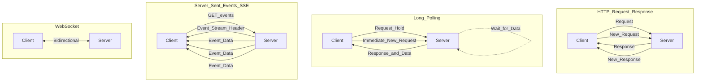
```mermaid
graph TB

    %% HTTP Request-Response
    subgraph HTTP_Request_Response
        A1[Client] -->|Request| B1[Server]
        B1 -->|Response| A1
        A1 -->|New_Request| B1
        B1 -->|New_Response| A1
    end

    %% Long Polling
    subgraph Long_Polling
        A2[Client] -->|Request_Hold| B2[Server]
        B2 -.->|Wait_for_Data| B2
        B2 -->|Response_and_Data| A2
        A2 -->|Immediate_New_Request| B2
    end

    %% Server-Sent Events SSE
    subgraph Server_Sent_Events_SSE
        A3[Client] -->|GET_events| B3[Server]
        B3 -->|Event_Stream_Header| A3
        B3 -->|Event_Data| A3
        B3 -->|Event_Data| A3
        B3 -->|Event_Data| A3
    end

    %% WebSocket
    subgraph WebSocket
        A4[Client] <-->|Bidirectional| B4[Server]
    end      
```

| Feature | HTTP | Long Polling | SSE | WebSocket |
|---------|------|--------------|-----|-----------|
| **Direction** | Request-Response | Server → Client | Server → Client | Bidirectional |
| **Connection** | Short-lived | Medium-lived | Persistent | Persistent |
| **Protocol** | HTTP | HTTP | HTTP | WebSocket Protocol |
| **Complexity** | Low | Medium | Low-Medium | High |
| **Automatic Reconnection** | N/A | Manual | Built-in | Manual |
| **Binary Data** | Yes | Yes | No | Yes |
| **Firewall Friendly** | Yes | Yes | Yes | Sometimes |
| **Browser Support** | Universal | Universal | Modern Browsers | Modern Browsers |

## When to Use SSE

**✅ Perfect for:**
- Live feeds and news updates
- Real-time notifications
- Stock price updates
- Live sports scores
- System monitoring dashboards
- Chat applications (receive-only)
- Progress indicators for long-running tasks
- IoT sensor data streaming

**❌ Avoid for:**
- Bidirectional communication needs
- Binary data transmission
- High-frequency updates (>1000/sec)
- Mobile apps with strict battery constraints
- When client needs to send frequent data

# SSE Architecture Overview

## High-Level Architecture

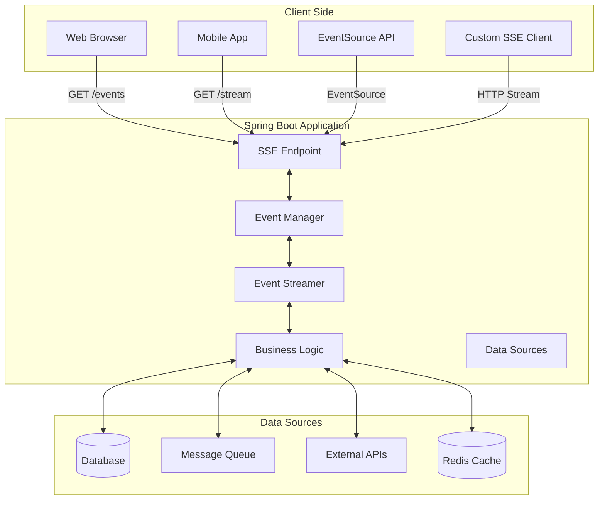
```mermaid
graph TB
    subgraph "Client Side"
        C1[Web Browser]
        C2[Mobile App]
        C3[EventSource API]
        C4[Custom SSE Client]
    end
    
    subgraph "Spring Boot Application"
        SE[SSE Endpoint]
        EM[Event Manager]
        ES[Event Streamer]
        BL[Business Logic]
        DS[Data Sources]
    end
    
    subgraph "Data Sources"
        DB[(Database)]
        MQ[Message Queue]
        EXT[External APIs]
        CACHE[(Redis Cache)]
    end
    
    C1 -->|GET /events| SE
    C2 -->|GET /stream| SE
    C3 -->|EventSource| SE
    C4 -->|HTTP Stream| SE
    
    SE <--> EM
    EM <--> ES
    ES <--> BL
    BL <--> DB
    BL <--> MQ
    BL <--> EXT
    BL <--> CACHE
```

## SSE Connection Lifecycle

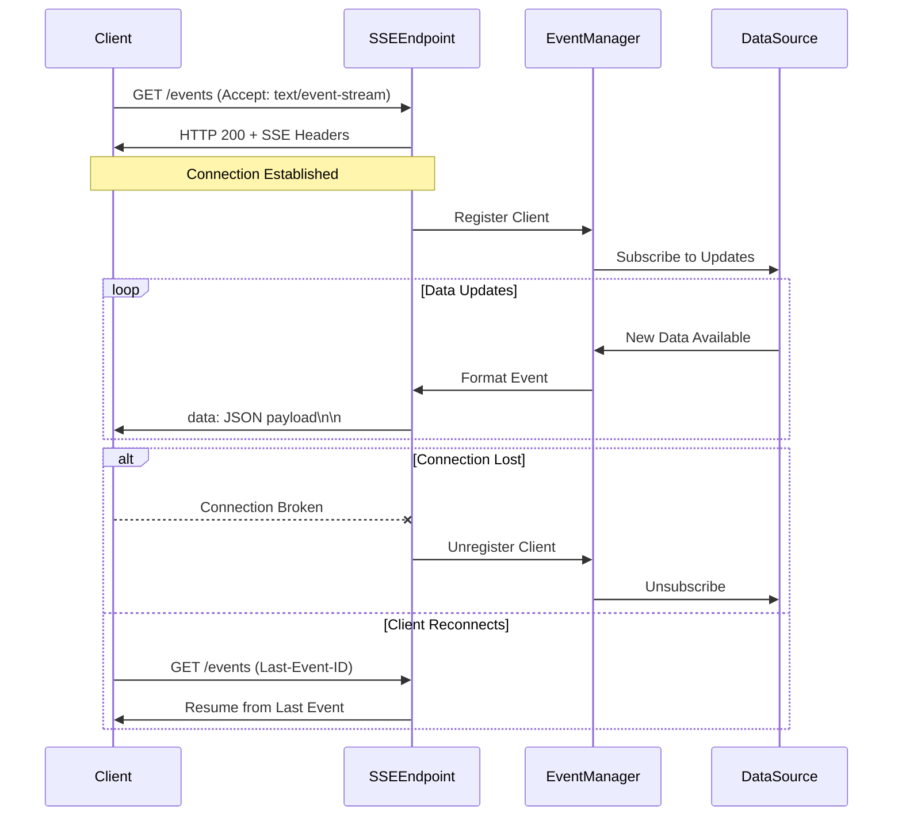
```mermaid
sequenceDiagram
    participant Client
    participant SSEEndpoint
    participant EventManager
    participant DataSource
    
    Client->>SSEEndpoint: GET /events (Accept: text/event-stream)
    SSEEndpoint->>Client: HTTP 200 + SSE Headers
    
    Note over SSEEndpoint,Client: Connection Established
    
    SSEEndpoint->>EventManager: Register Client
    EventManager->>DataSource: Subscribe to Updates
    
    loop Data Updates
        DataSource->>EventManager: New Data Available
        EventManager->>SSEEndpoint: Format Event
        SSEEndpoint->>Client: data: JSON payload\n\n
    end
    
    alt Connection Lost
        Client--xSSEEndpoint: Connection Broken
        SSEEndpoint->>EventManager: Unregister Client
        EventManager->>DataSource: Unsubscribe
    else Client Reconnects
        Client->>SSEEndpoint: GET /events (Last-Event-ID)
        SSEEndpoint->>Client: Resume from Last Event
    end
```

# Spring Boot SSE Implementation Approaches

## 1. ResponseBodyEmitter Approach

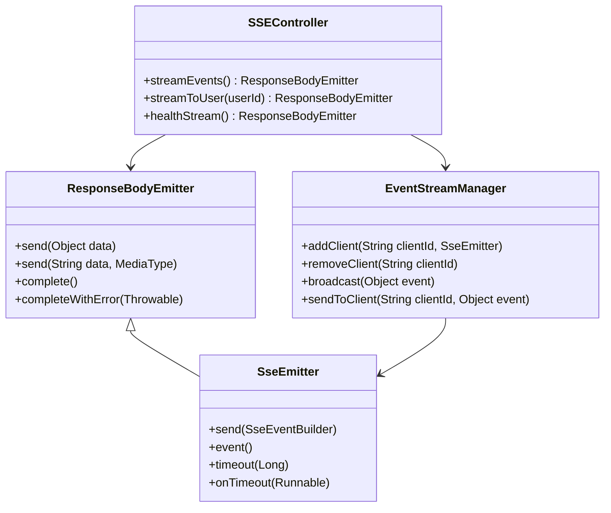
```mermaid
classDiagram
    class SSEController {
        +streamEvents() ResponseBodyEmitter
        +streamToUser(userId) ResponseBodyEmitter
        +healthStream() ResponseBodyEmitter
    }
    
    class ResponseBodyEmitter {
        +send(Object data)
        +send(String data, MediaType)
        +complete()
        +completeWithError(Throwable)
    }
    
    class SseEmitter {
        +send(SseEventBuilder)
        +event()
        +timeout(Long)
        +onTimeout(Runnable)
    }
    
    class EventStreamManager {
        +addClient(String clientId, SseEmitter)
        +removeClient(String clientId)
        +broadcast(Object event)
        +sendToClient(String clientId, Object event)
    }
    
    SSEController --> ResponseBodyEmitter
    ResponseBodyEmitter <|-- SseEmitter
    SSEController --> EventStreamManager
    EventStreamManager --> SseEmitter
```

### Basic SSE Controller Structure
```java
@RestController
@RequestMapping("/api/sse")
@Slf4j
public class SSEController {
    
    @GetMapping(value = "/events", produces = MediaType.TEXT_EVENT_STREAM_VALUE)
    public SseEmitter streamEvents() {
        SseEmitter emitter = new SseEmitter(Long.MAX_VALUE);
        
        // Register client and handle lifecycle
        eventStreamManager.addClient(emitter);
        
        return emitter;
    }
    
    @GetMapping(value = "/notifications/{userId}", produces = MediaType.TEXT_EVENT_STREAM_VALUE)  
    public SseEmitter streamUserNotifications(@PathVariable String userId) {
        SseEmitter emitter = new SseEmitter(30000L); // 30 seconds timeout
        
        // User-specific event streaming
        notificationService.subscribeUser(userId, emitter);
        
        return emitter;
    }
}
```

## 2. Reactive Streams Approach (WebFlux)

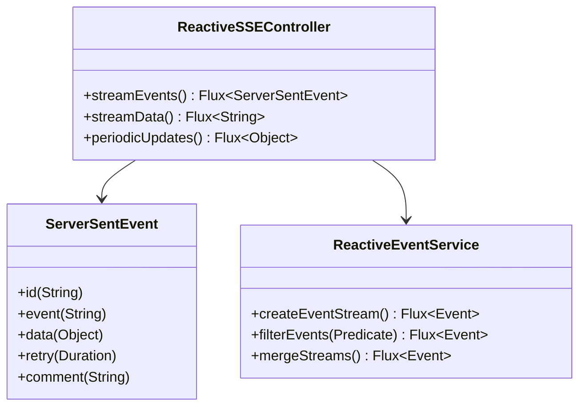
```mermaid
classDiagram
    class ReactiveSSEController {
        +streamEvents() Flux~ServerSentEvent~
        +streamData() Flux~String~
        +periodicUpdates() Flux~Object~
    }
    
    class ServerSentEvent {
        +id(String)
        +event(String)
        +data(Object)
        +retry(Duration)
        +comment(String)
    }
    
    class ReactiveEventService {
        +createEventStream() Flux~Event~
        +filterEvents(Predicate) Flux~Event~
        +mergeStreams() Flux~Event~
    }
    
    ReactiveSSEController --> ServerSentEvent
    ReactiveSSEController --> ReactiveEventService
```

### WebFlux SSE Implementation Structure
```java
@RestController
@RequestMapping("/api/reactive-sse")
public class ReactiveSSEController {
    
    @GetMapping(value = "/stream", produces = MediaType.TEXT_EVENT_STREAM_VALUE)
    public Flux<ServerSentEvent> streamEvents() {
        return eventService.createEventStream()
            .map(event -> ServerSentEvent.builder()
                .id(event.getId())
                .event(event.getType())
                .data(event.getData())
                .build());
    }
}
```

# Event Management Architecture

## Event Broadcasting System

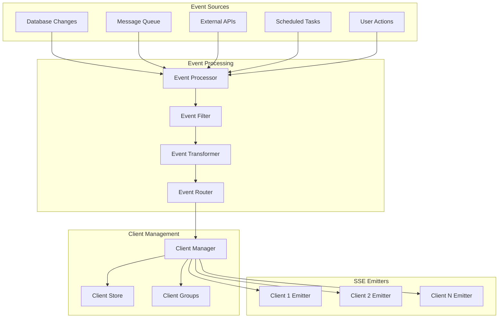
```mermaid
graph TB
    subgraph "Event Sources"
        DB[Database Changes]
        MQ[Message Queue]
        API[External APIs]
        SCHEDULE[Scheduled Tasks]
        USER[User Actions]
    end
    
    subgraph "Event Processing"
        EP[Event Processor]
        EF[Event Filter]
        ET[Event Transformer]
        ER[Event Router]
    end
    
    subgraph "Client Management"
        CM[Client Manager]
        CS[Client Store]
        CG[Client Groups]
    end
    
    subgraph "SSE Emitters"
        SE1[Client 1 Emitter]
        SE2[Client 2 Emitter]  
        SE3[Client N Emitter]
    end
    
    DB --> EP
    MQ --> EP
    API --> EP
    SCHEDULE --> EP
    USER --> EP
    
    EP --> EF
    EF --> ET
    ET --> ER
    
    ER --> CM
    CM --> CS
    CM --> CG
    
    CM --> SE1
    CM --> SE2
    CM --> SE3
```

## Event Types and Structure

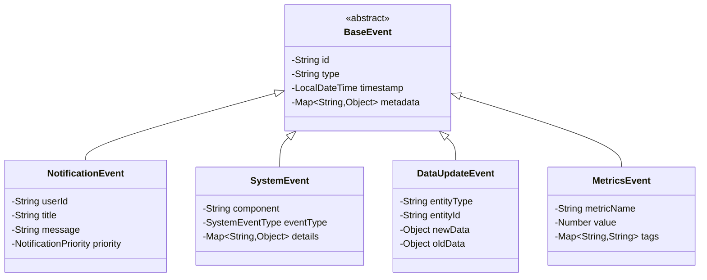
```mermaid
classDiagram
    class BaseEvent {
        <<abstract>>
        -String id
        -String type
        -LocalDateTime timestamp
        -Map~String,Object~ metadata
    }
    
    class NotificationEvent {
        -String userId
        -String title
        -String message
        -NotificationPriority priority
    }
    
    class SystemEvent {
        -String component
        -SystemEventType eventType
        -Map~String,Object~ details
    }
    
    class DataUpdateEvent {
        -String entityType
        -String entityId
        -Object newData
        -Object oldData
    }
    
    class MetricsEvent {
        -String metricName
        -Number value
        -Map~String,String~ tags
    }
    
    BaseEvent <|-- NotificationEvent
    BaseEvent <|-- SystemEvent
    BaseEvent <|-- DataUpdateEvent
    BaseEvent <|-- MetricsEvent
```

# Real-World Use Cases

## 1. Live Dashboard Architecture

```mermaid
graph TB
    subgraph "Dashboard Frontend"
        D1[Metrics Panel]
        D2[Alert Panel]
        D3[Log Panel]
        D4[Chart Components]
    end
    
    subgraph "SSE Streams"
        S1[/metrics-stream]
        S2[/alerts-stream]
        S3[/logs-stream]
        S4[/system-health]
    end
    
    subgraph "Data Collection"
        DC1[Metrics Collector]
        DC2[Alert Manager]
        DC3[Log Aggregator]
        DC4[Health Monitor]
    end
    
    subgraph "Data Sources"
        DB1[(Metrics DB)]
        DB2[(Alert DB)]
        DB3[(Log Store)]
        SYS[System APIs]
    end
    
    D1 --> S1
    D2 --> S2
    D3 --> S3
    D4 --> S4
    
    S1 --> DC1
    S2 --> DC2
    S3 --> DC3
    S4 --> DC4
    
    DC1 --> DB1
    DC2 --> DB2
    DC3 --> DB3
    DC4 --> SYS
```

## 2. Notification System Architecture

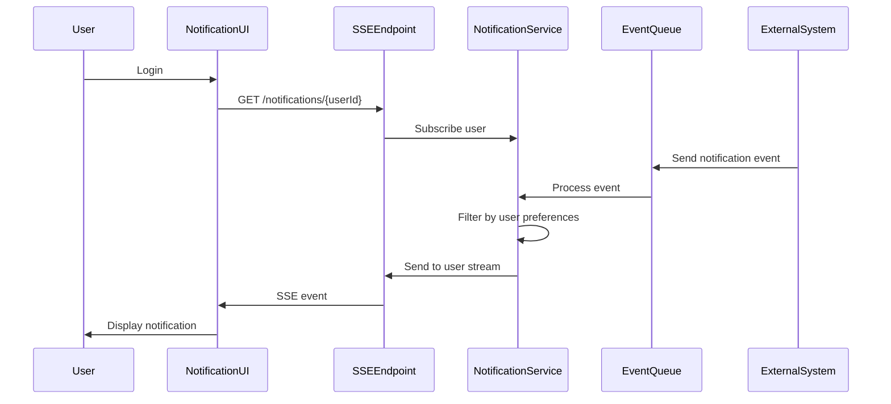
```mermaid
sequenceDiagram
    participant User
    participant NotificationUI
    participant SSEEndpoint
    participant NotificationService
    participant EventQueue
    participant ExternalSystem
    
    User->>NotificationUI: Login
    NotificationUI->>SSEEndpoint: GET /notifications/{userId}
    SSEEndpoint->>NotificationService: Subscribe user
    
    ExternalSystem->>EventQueue: Send notification event
    EventQueue->>NotificationService: Process event
    NotificationService->>NotificationService: Filter by user preferences
    NotificationService->>SSEEndpoint: Send to user stream
    SSEEndpoint->>NotificationUI: SSE event
    NotificationUI->>User: Display notification
```

## 3. Progress Tracking Architecture  

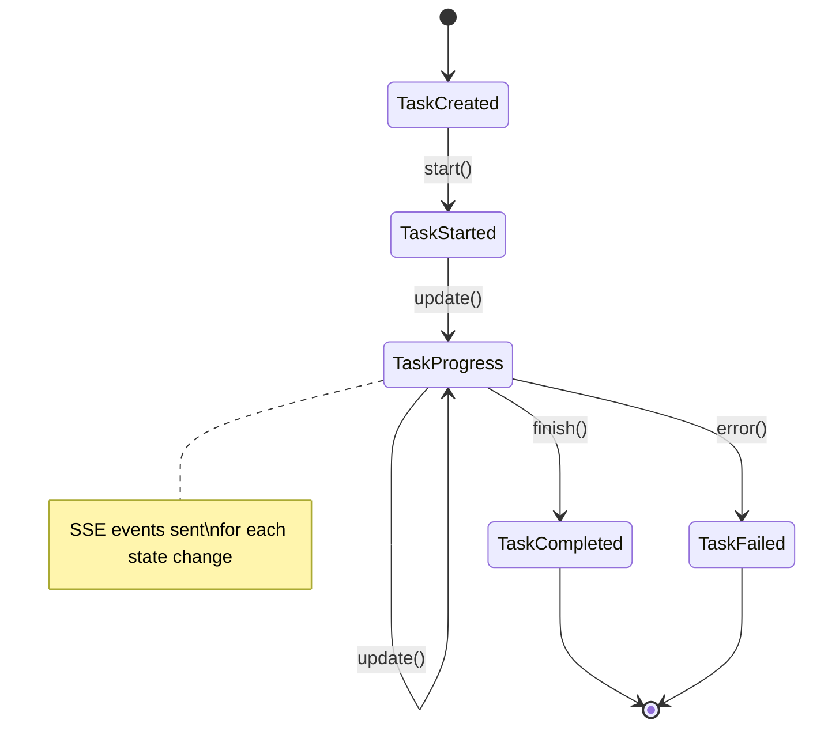
```mermaid
stateDiagram-v2
    [*] --> TaskCreated
    TaskCreated --> TaskStarted : start()
    TaskStarted --> TaskProgress : update()
    TaskProgress --> TaskProgress : update()
    TaskProgress --> TaskCompleted : finish()
    TaskProgress --> TaskFailed : error()
    TaskCompleted --> [*]
    TaskFailed --> [*]
    
    note right of TaskProgress : SSE events sent\nfor each state change
```

# Client-Side Implementation Patterns

## Browser EventSource API

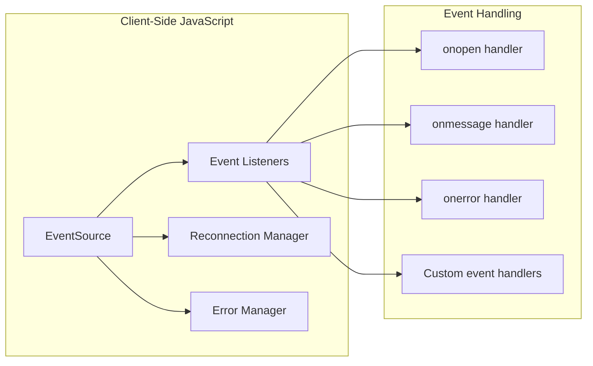
```mermaid
graph LR
    subgraph "Client-Side JavaScript"
        ES[EventSource]
        EL[Event Listeners]
        RM[Reconnection Manager]
        EM[Error Manager]
    end
    
    subgraph "Event Handling"
        OH[onopen handler]
        MH[onmessage handler]
        EH[onerror handler]
        CH[Custom event handlers]
    end
    
    ES --> EL
    EL --> OH
    EL --> MH
    EL --> EH
    EL --> CH
    
    ES --> RM
    ES --> EM
```

### JavaScript Client Structure
```javascript
// Basic EventSource setup
const eventSource = new EventSource('/api/sse/events');

eventSource.onopen = function(event) {
    console.log('SSE connection opened');
    updateConnectionStatus('connected');
};

eventSource.onmessage = function(event) {
    const data = JSON.parse(event.data);
    handleEvent(data);
};

eventSource.onerror = function(event) {
    console.error('SSE error:', event);
    updateConnectionStatus('error');
};

// Custom event types
eventSource.addEventListener('notification', function(event) {
    const notification = JSON.parse(event.data);
    showNotification(notification);
});
```

## React SSE Hook Pattern

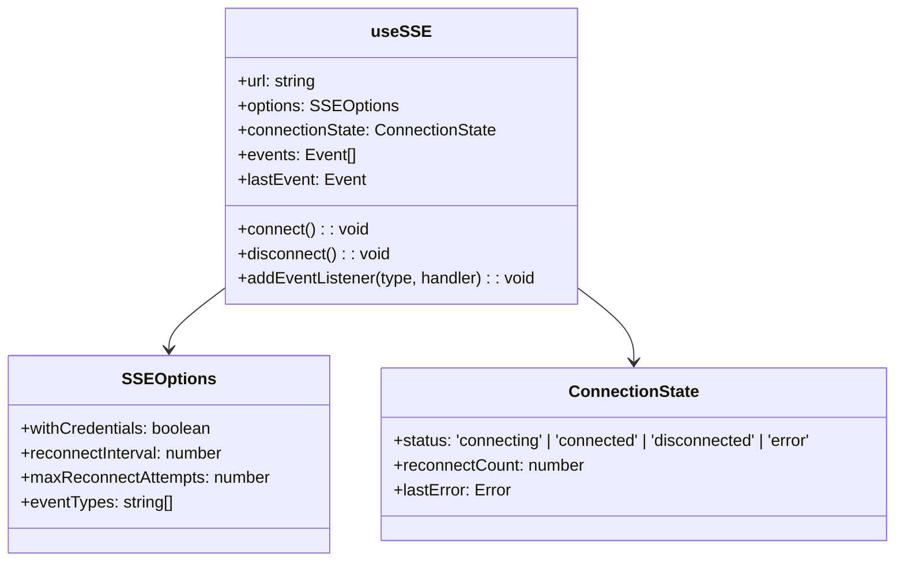
```mermaid
classDiagram
    class useSSE {
        +url: string
        +options: SSEOptions
        +connectionState: ConnectionState
        +events: Event[]
        +lastEvent: Event
        +connect(): void
        +disconnect(): void
        +addEventListener(type, handler): void
    }
    
    class SSEOptions {
        +withCredentials: boolean
        +reconnectInterval: number
        +maxReconnectAttempts: number
        +eventTypes: string[]
    }
    
    class ConnectionState {
        +status: 'connecting' | 'connected' | 'disconnected' | 'error'
        +reconnectCount: number
        +lastError: Error
    }
    
    useSSE --> SSEOptions
    useSSE --> ConnectionState
```

# Security Architecture

## SSE Security Layers

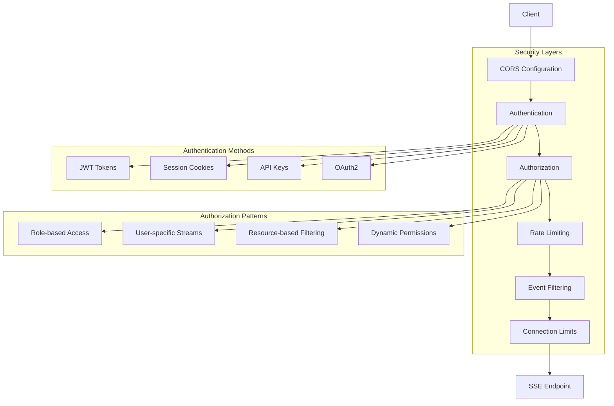
```mermaid
graph TB
    subgraph "Security Layers"
        A1[CORS Configuration]
        A2[Authentication]
        A3[Authorization] 
        A4[Rate Limiting]
        A5[Event Filtering]
        A6[Connection Limits]
    end
    
    subgraph "Authentication Methods"
        B1[JWT Tokens]
        B2[Session Cookies]
        B3[API Keys]
        B4[OAuth2]
    end
    
    subgraph "Authorization Patterns"
        C1[Role-based Access]
        C2[User-specific Streams]
        C3[Resource-based Filtering]
        C4[Dynamic Permissions]
    end
    
    Client[Client] --> A1
    A1 --> A2
    A2 --> A3
    A3 --> A4
    A4 --> A5
    A5 --> A6
    A6 --> SSEEndpoint[SSE Endpoint]
    
    A2 --> B1
    A2 --> B2
    A2 --> B3
    A2 --> B4
    
    A3 --> C1
    A3 --> C2
    A3 --> C3
    A3 --> C4
```

## Security Implementation Structure

```java
@Configuration
public class SSESecurityConfig {
    
    @Bean
    public CorsConfigurationSource corsConfigurationSource() {
        // CORS configuration for SSE endpoints
    }
    
    @Bean
    public SSEAuthenticationInterceptor sseAuthInterceptor() {
        // Authentication interceptor for SSE requests
    }
    
    @Bean 
    public RateLimitingFilter rateLimitingFilter() {
        // Rate limiting for SSE connections
    }
}
```

# Performance and Scalability Architecture

## Connection Management

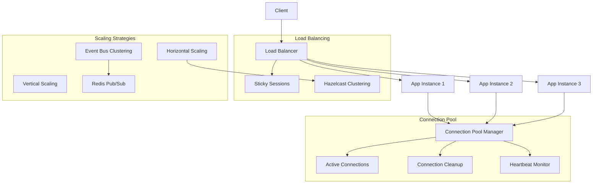
```mermaid
graph TB
    subgraph "Connection Pool"
        CP[Connection Pool Manager]
        AC[Active Connections]
        CC[Connection Cleanup]
        HB[Heartbeat Monitor]
    end
    
    subgraph "Load Balancing"
        LB[Load Balancer]
        SL[Sticky Sessions]
        HZ[Hazelcast Clustering]
    end
    
    subgraph "Scaling Strategies"
        SS1[Vertical Scaling]
        SS2[Horizontal Scaling]  
        SS3[Event Bus Clustering]
        SS4[Redis Pub/Sub]
    end
    
    Client --> LB
    LB --> SL
    LB --> App1[App Instance 1]
    LB --> App2[App Instance 2]
    LB --> App3[App Instance 3]
    
    App1 --> CP
    App2 --> CP
    App3 --> CP
    
    CP --> AC
    CP --> CC
    CP --> HB
    
    SS3 --> SS4
    SS2 --> HZ
```

## Memory Management Patterns

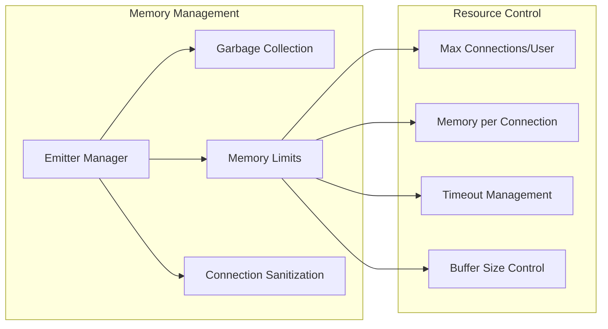
```mermaid
graph LR
    subgraph "Memory Management"
        EM[Emitter Manager]
        GC[Garbage Collection]
        ML[Memory Limits]
        CS[Connection Sanitization]
    end
    
    subgraph "Resource Control"
        RC1[Max Connections/User]
        RC2[Memory per Connection]
        RC3[Timeout Management]
        RC4[Buffer Size Control]
    end
    
    EM --> GC
    EM --> ML
    EM --> CS
    
    ML --> RC1
    ML --> RC2
    ML --> RC3
    ML --> RC4
```

# Monitoring and Observability

## SSE Metrics Architecture

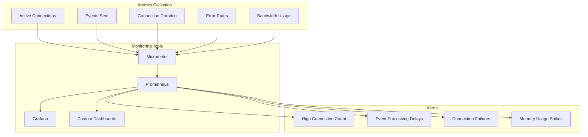
```mermaid
graph TB
    subgraph "Metrics Collection"
        M1[Active Connections]
        M2[Events Sent]
        M3[Connection Duration]
        M4[Error Rates]
        M5[Bandwidth Usage]
    end
    
    subgraph "Monitoring Tools"
        MT1[Micrometer]
        MT2[Prometheus]
        MT3[Grafana]
        MT4[Custom Dashboards]
    end
    
    subgraph "Alerts"
        A1[High Connection Count]
        A2[Event Processing Delays]
        A3[Connection Failures]
        A4[Memory Usage Spikes]
    end
    
    M1 --> MT1
    M2 --> MT1
    M3 --> MT1
    M4 --> MT1
    M5 --> MT1
    
    MT1 --> MT2
    MT2 --> MT3
    MT2 --> MT4
    
    MT2 --> A1
    MT2 --> A2
    MT2 --> A3
    MT2 --> A4
```

# Testing Strategy Architecture

## Testing Pyramid for SSE

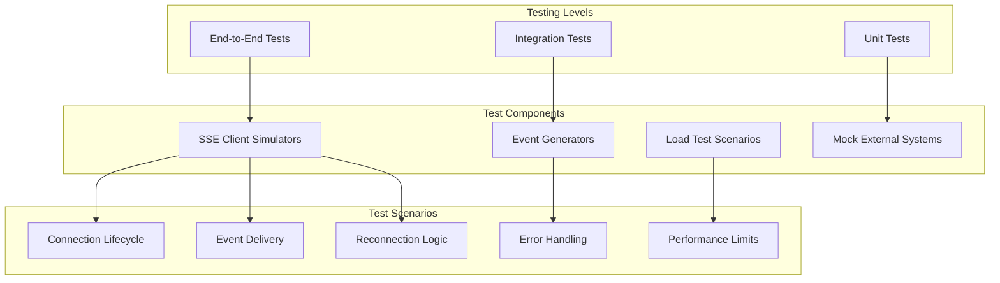
```mermaid
graph TB
    subgraph "Testing Levels"
        E2E[End-to-End Tests]
        INT[Integration Tests]
        UNIT[Unit Tests]
    end
    
    subgraph "Test Components"
        TC1[SSE Client Simulators]
        TC2[Event Generators]
        TC3[Load Test Scenarios]
        TC4[Mock External Systems]
    end
    
    subgraph "Test Scenarios"
        TS1[Connection Lifecycle]
        TS2[Event Delivery]
        TS3[Error Handling]
        TS4[Performance Limits]
        TS5[Reconnection Logic]
    end
    
    E2E --> TC1
    INT --> TC2
    UNIT --> TC4
    
    TC1 --> TS1
    TC1 --> TS2
    TC2 --> TS3
    TC3 --> TS4
    TC1 --> TS5
```

## Test Architecture Components

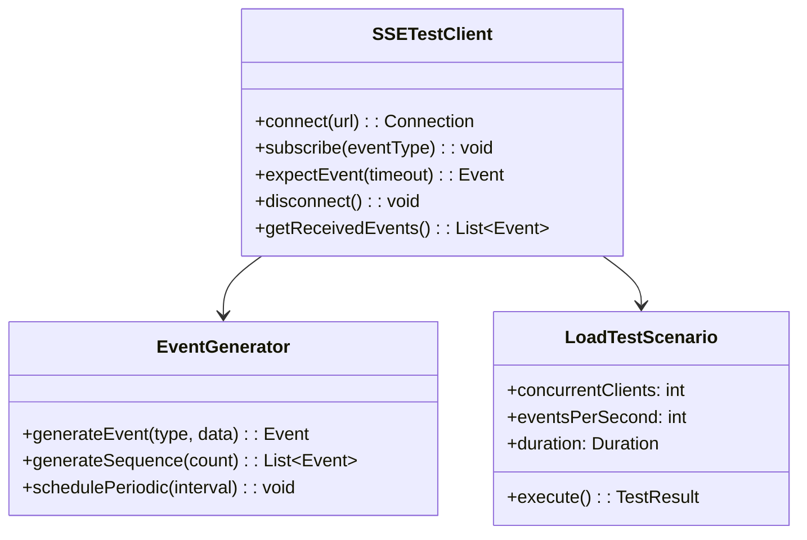
```mermaid
classDiagram
    class SSETestClient {
        +connect(url): Connection
        +subscribe(eventType): void
        +expectEvent(timeout): Event
        +disconnect(): void
        +getReceivedEvents(): List~Event~
    }
    
    class EventGenerator {
        +generateEvent(type, data): Event
        +generateSequence(count): List~Event~
        +schedulePeriodic(interval): void
    }
    
    class LoadTestScenario {
        +concurrentClients: int
        +eventsPerSecond: int
        +duration: Duration
        +execute(): TestResult
    }
    
    SSETestClient --> EventGenerator
    SSETestClient --> LoadTestScenario
```

# Configuration and Deployment

## Production Configuration Architecture

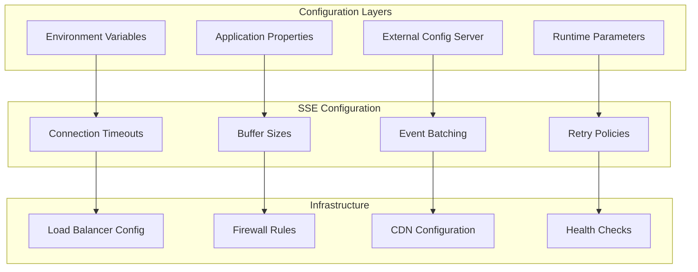
```mermaid
graph TB
    subgraph "Configuration Layers"
        CL1[Environment Variables]
        CL2[Application Properties]
        CL3[External Config Server]
        CL4[Runtime Parameters]
    end
    
    subgraph "SSE Configuration"
        SC1[Connection Timeouts]
        SC2[Buffer Sizes]
        SC3[Event Batching]
        SC4[Retry Policies]
    end
    
    subgraph "Infrastructure"
        I1[Load Balancer Config]
        I2[Firewall Rules]
        I3[CDN Configuration]
        I4[Health Checks]
    end
    
    CL1 --> SC1
    CL2 --> SC2
    CL3 --> SC3
    CL4 --> SC4
    
    SC1 --> I1
    SC2 --> I2
    SC3 --> I3
    SC4 --> I4
```

## Deployment Patterns

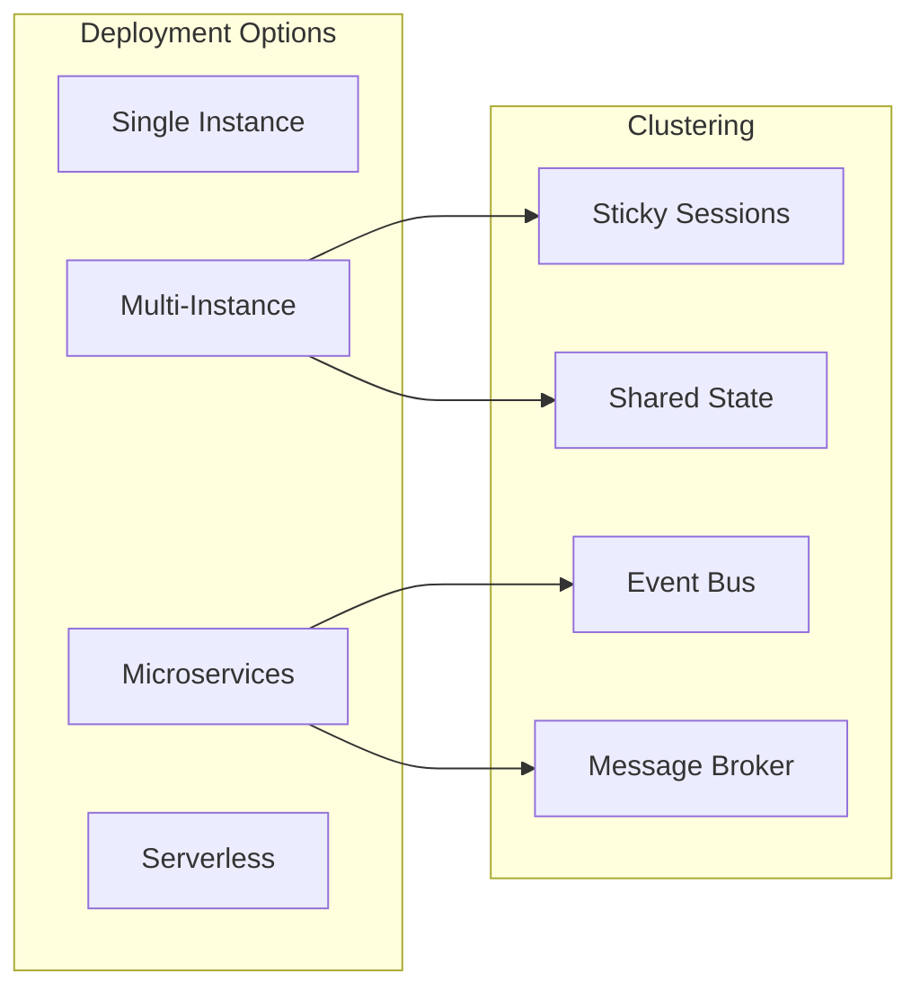
```mermaid
graph LR
    subgraph "Deployment Options"
        D1[Single Instance]
        D2[Multi-Instance]
        D3[Microservices]
        D4[Serverless]
    end
    
    subgraph "Clustering"
        C1[Sticky Sessions]
        C2[Event Bus]
        C3[Shared State]
        C4[Message Broker]
    end
    
    D2 --> C1
    D3 --> C2
    D2 --> C3
    D3 --> C4
```

# Best Practices and Anti-Patterns

## Best Practices Architecture

```mermaid
mindmap
  root((SSE Best Practices))
    Connection Management
      Proper timeouts
      Cleanup on disconnect
      Connection pooling
      Heartbeat implementation
    Event Design
      Small event payloads
      Structured data format
      Event versioning
      Idempotent events
    Performance
      Event batching
      Compression
      Caching strategies
      Rate limiting
    Security
      Authentication
      Authorization
      CORS configuration
      Input validation
    Monitoring
      Connection metrics
      Event throughput
      Error tracking
      Performance monitoring
```

## Common Anti-Patterns

```mermaid
graph TB
    subgraph "Anti-Patterns to Avoid"
        AP1[Large Event Payloads]
        AP2[No Connection Cleanup]
        AP3[Blocking Event Handlers]
        AP4[No Error Handling]
        AP5[Unlimited Connections]
    end
    
    subgraph "Consequences"
        C1[Memory Leaks]
        C2[Performance Degradation]
        C3[System Instability]
        C4[Security Vulnerabilities]
    end
    
    AP1 --> C2
    AP2 --> C1
    AP3 --> C2
    AP4 --> C3
    AP5 --> C1
    AP5 --> C3
```

# Integration Patterns

## SSE with Message Brokers

```mermaid
graph TB
    subgraph "Message Broker Integration"
        MB[Message Broker]
        T1[Topic: Notifications]
        T2[Topic: Updates]
        T3[Topic: Alerts]
    end
    
    subgraph "SSE Service"
        SS[SSE Service]
        EL[Event Listeners]
        EF[Event Formatters]
        EM[Emitter Manager]
    end
    
    subgraph "Clients"
        C1[Web Client 1]
        C2[Mobile Client]
        C3[Dashboard]
    end
    
    ExternalSystem --> MB
    MB --> T1
    MB --> T2
    MB --> T3
    
    T1 --> EL
    T2 --> EL
    T3 --> EL
    
    EL --> EF
    EF --> EM
    
    EM --> C1
    EM --> C2
    EM --> C3
```

## Database Change Streams

```mermaid
sequenceDiagram
    participant Database
    participant ChangeListener
    participant SSEService
    participant Client
    
    Database->>ChangeListener: INSERT/UPDATE/DELETE
    ChangeListener->>ChangeListener: Process Change
    ChangeListener->>SSEService: Publish Event
    SSEService->>SSEService: Filter & Format
    SSEService->>Client: SSE Event
    Client->>Client: Update UI
```

# Conclusion and Decision Matrix

## Technology Decision Matrix

```mermaid
graph TB
    subgraph "Use SSE When"
        U1[One-way communication]
        U2[Real-time updates needed]
        U3[Simple implementation preferred]
        U4[Browser compatibility important]
        U5[Automatic reconnection desired]
    end
    
    subgraph "Consider WebSocket When"
        W1[Bidirectional communication]
        W2[High-frequency updates]
        W3[Binary data transfer]
        W4[Custom protocols needed]
    end
    
    subgraph "Consider Polling When"
        P1[Infrequent updates]
        P2[Simple request-response]
        P3[Stateless preferred]
        P4[Firewall restrictions]
    end
```

## SSE Implementation Readiness Checklist

```mermaid
flowchart TD
    START([Planning SSE Implementation]) --> Q1{Need bidirectional communication?}
    Q1 -->|Yes| WEBSOCKET[Consider WebSocket]
    Q1 -->|No| Q2{Real-time updates required?}
    Q2 -->|No| POLLING[Use HTTP Polling]
    Q2 -->|Yes| Q3{High-frequency updates >1000/sec?}
    Q3 -->|Yes| WEBSOCKET
    Q3 -->|No| Q4{Need binary data?}
    Q4 -->|Yes| WEBSOCKET
    Q4 -->|No| SSE_READY[SSE is Perfect Choice]
    
    SSE_READY --> IMPL[Implement SSE]
    IMPL --> SECURITY[Add Security Layer]
    SECURITY --> MONITORING[Add Monitoring]
    MONITORING --> TESTING[Implement Testing]
    TESTING --> DEPLOY[Deploy & Scale]
```

---

This comprehensive outline provides the foundation for detailed implementation of each section. Each section can be expanded with:

1. **Detailed code examples** for each pattern
2. **Complete configuration samples** 
3. **Step-by-step implementation guides**
4. **Troubleshooting sections**
5. **Performance tuning details**
6. **Advanced integration patterns**

The architecture diagrams establish the visual framework for understanding SSE concepts, while the outlined sections provide a clear path for detailed documentation development.