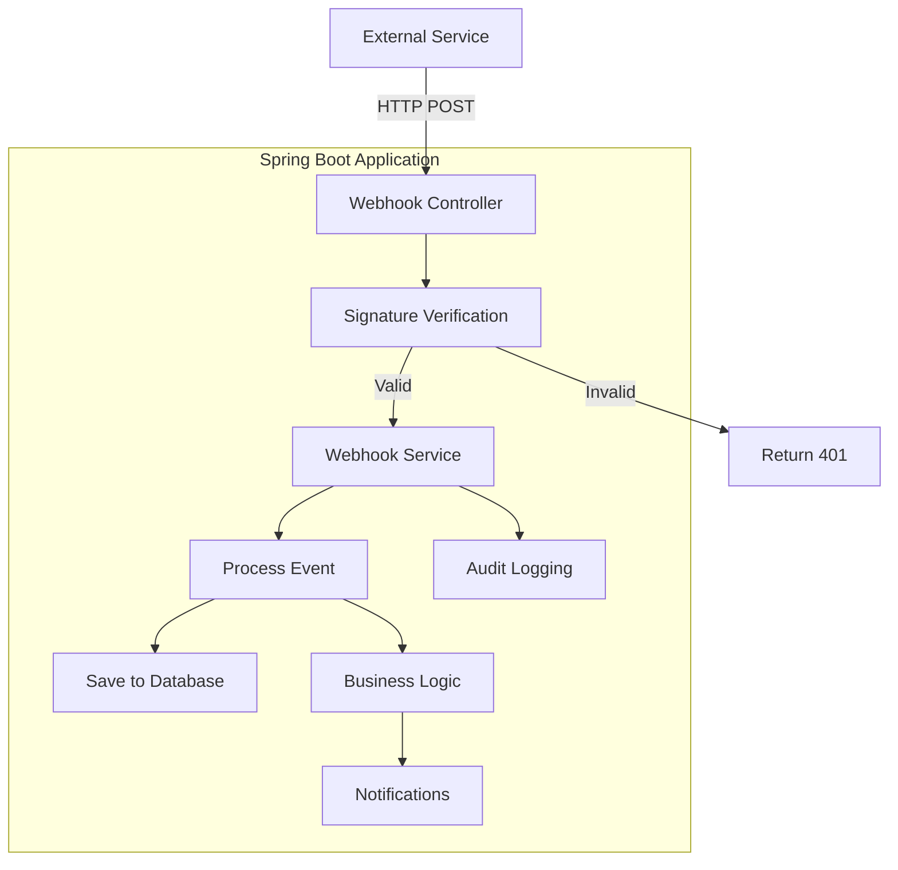
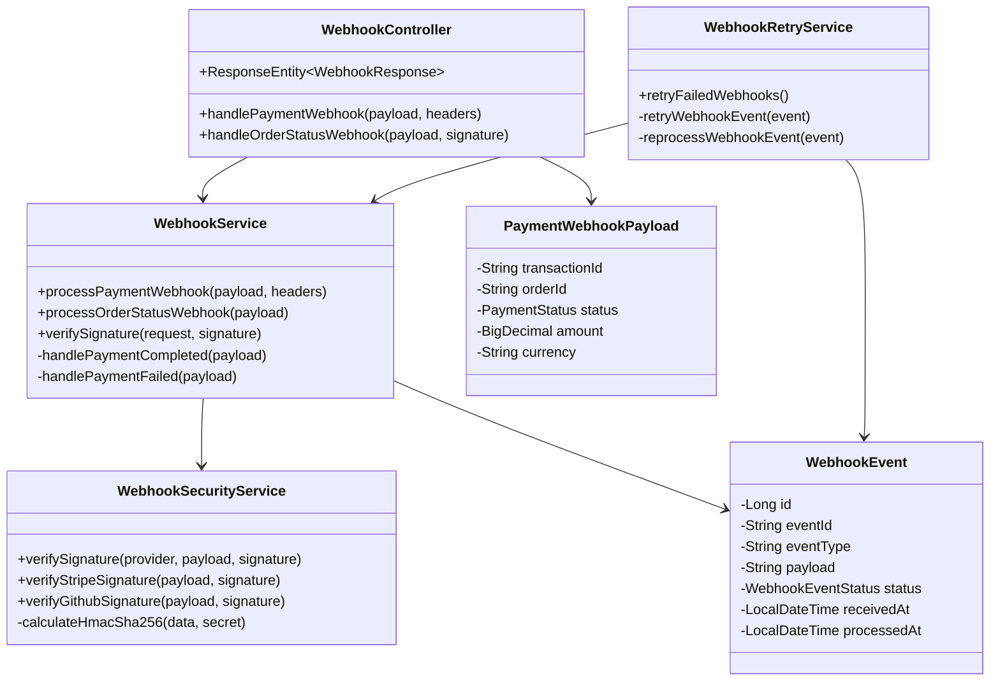
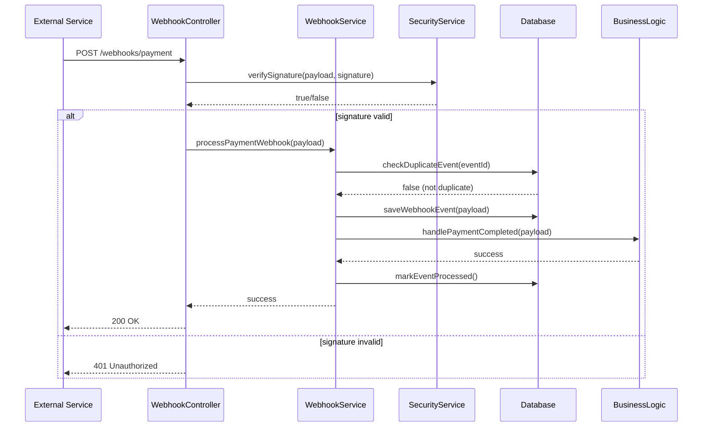
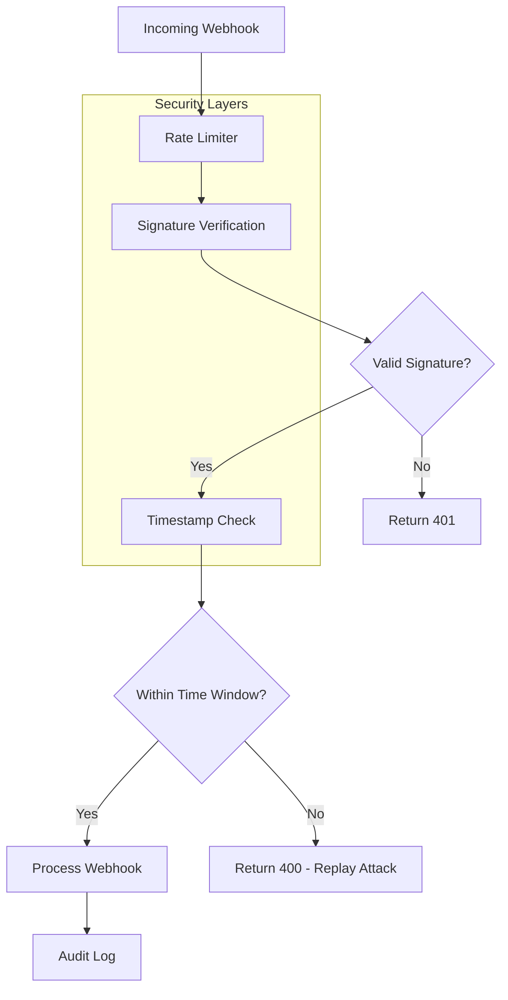
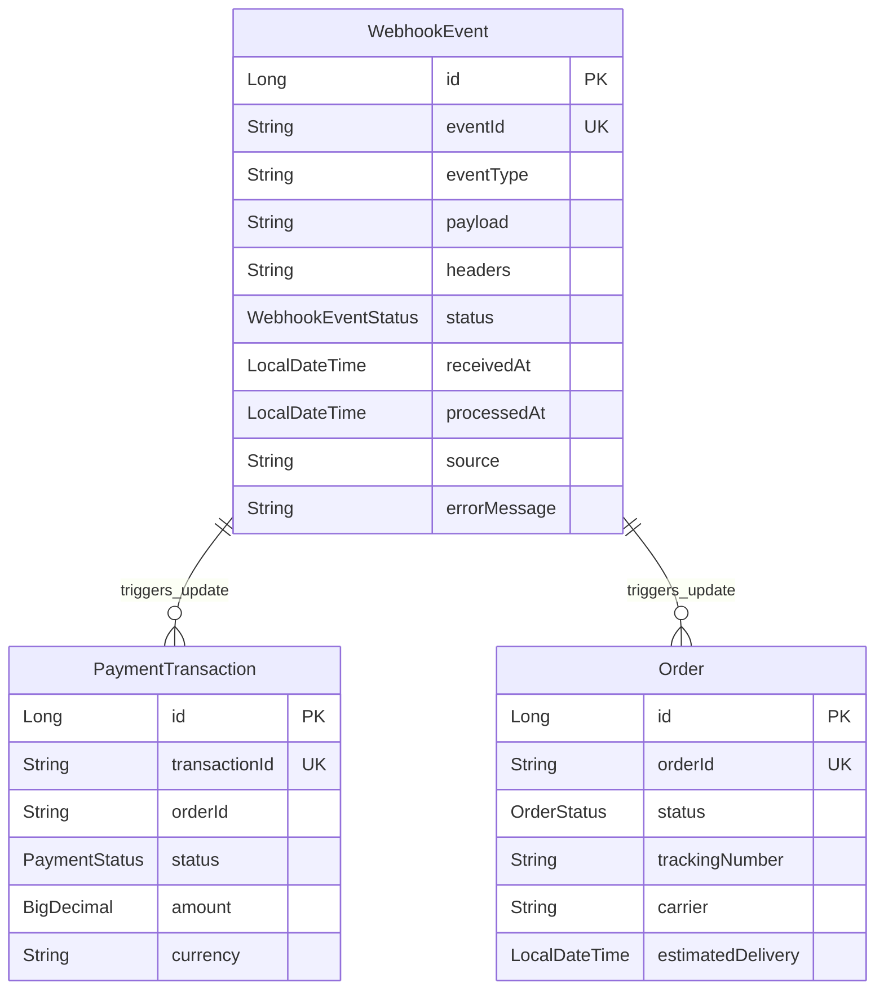
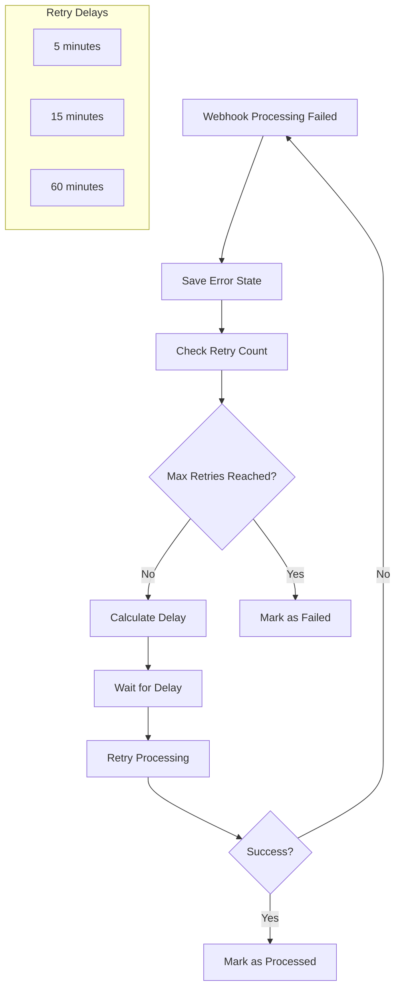
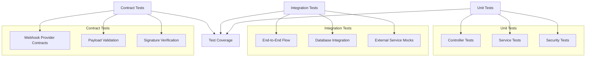

---
categories:
- Microservices
date: 2024-11-27 15:00:00
tags:
- Spring Boot
- Webhooks
- Security
- API
- Guide
title: 'Complete Guide to SpringBoot Webhooks: Implementation, Security & Best Practices'
---



# Introduction to Webhooks

Webhooks operate under the principle of "event-driven" communication: the server sends data to the client when an event occurs, without the client needing to poll for updates.

Essentially, a webhook is an HTTP callback triggered by an event. It involves setting up an endpoint in your Spring Boot application that can accept and process incoming HTTP requests (usually POST).

## Webhook vs Polling vs WebSockets

| Aspect | Webhooks | Polling | WebSockets |
|--------|----------|---------|------------|
| **Communication** | Event-driven push | Client pulls data | Bidirectional real-time |
| **Efficiency** | High (only when needed) | Low (constant requests) | High (persistent connection) |
| **Real-time** | Near real-time | Depends on poll interval | Real-time |
| **Complexity** | Medium | Low | High |
| **Use Case** | External integrations | Simple data sync | Chat, live updates |

## When to Use Webhooks

**✅ Perfect for:**
- Payment processing notifications (Stripe, PayPal)
- CI/CD pipeline events (GitHub, GitLab)
- Third-party service integrations
- Order status updates
- Inventory changes
- User registration confirmations

**❌ Not suitable for:**
- Real-time bidirectional communication
- High-frequency events (>1000/sec)
- Internal microservice communication
- When immediate consistency is critical

# Basic Webhook Implementation

## Architecture Overview



## Class Diagram



## Dependencies

```xml
<dependencies>
    <dependency>
        <groupId>org.springframework.boot</groupId>
        <artifactId>spring-boot-starter-web</artifactId>
    </dependency>
    <dependency>
        <groupId>org.springframework.boot</groupId>
        <artifactId>spring-boot-starter-data-jpa</artifactId>
    </dependency>
    <dependency>
        <groupId>org.springframework.boot</groupId>
        <artifactId>spring-boot-starter-validation</artifactId>
    </dependency>
</dependencies>
```

## Simple Webhook Controller

```java
@RestController
@RequestMapping("/webhooks")
@Slf4j
public class WebhookController {
    
    @Autowired
    private WebhookService webhookService;
    
    @PostMapping("/payment")
    public ResponseEntity<WebhookResponse> handlePaymentWebhook(
            @RequestBody PaymentWebhookPayload payload,
            @RequestHeader Map<String, String> headers) {
        
        try {
            log.info("Received payment webhook: {}", payload.getEventId());
            webhookService.processPaymentWebhook(payload, headers);
            return ResponseEntity.ok(WebhookResponse.success("Payment webhook processed"));
            
        } catch (Exception e) {
            log.error("Error processing payment webhook", e);
            return ResponseEntity.status(HttpStatus.INTERNAL_SERVER_ERROR)
                .body(WebhookResponse.error("Processing failed: " + e.getMessage()));
        }
    }
    
    @PostMapping("/order-status")
    public ResponseEntity<WebhookResponse> handleOrderStatusWebhook(
            @RequestBody @Valid OrderStatusWebhookPayload payload,
            @RequestHeader(value = "X-Signature", required = false) String signature) {
        
        if (!webhookService.verifySignature(payload, signature)) {
            return ResponseEntity.status(HttpStatus.UNAUTHORIZED)
                .body(WebhookResponse.error("Invalid signature"));
        }
        
        webhookService.processOrderStatusWebhook(payload);
        return ResponseEntity.ok(WebhookResponse.success("Order status updated"));
    }
}
```

## Data Models

```java
// Base webhook payload
@Data
@JsonIgnoreProperties(ignoreUnknown = true)
public abstract class BaseWebhookPayload {
    private String eventId;
    private String eventType;
    private LocalDateTime timestamp;
    private String source;
}

// Payment webhook payload
@Data
@EqualsAndHashCode(callSuper = true)
public class PaymentWebhookPayload extends BaseWebhookPayload {
    @NotNull private String transactionId;
    @NotNull private String orderId;
    @NotNull private PaymentStatus status;
    @DecimalMin("0.01") private BigDecimal amount;
    @NotBlank private String currency;
    private String customerId;
}

// Webhook response model
@Data
@AllArgsConstructor
public class WebhookResponse {
    private boolean success;
    private String message;
    private LocalDateTime timestamp;
    
    public static WebhookResponse success(String message) {
        return new WebhookResponse(true, message, LocalDateTime.now());
    }
    
    public static WebhookResponse error(String message) {
        return new WebhookResponse(false, message, LocalDateTime.now());
    }
}
```

# Webhook Service Implementation

## Service Layer Design



## Core Service Implementation

```java
@Service
@Transactional
@Slf4j
public class WebhookService {
    
    @Autowired
    private WebhookEventRepository webhookEventRepository;
    
    @Autowired
    private PaymentService paymentService;
    
    @Autowired
    private WebhookSecurityService securityService;
    
    public void processPaymentWebhook(PaymentWebhookPayload payload, Map<String, String> headers) {
        // Check for duplicate events (idempotency)
        if (isDuplicateEvent(payload.getEventId())) {
            log.info("Duplicate payment webhook event ignored: {}", payload.getEventId());
            return;
        }
        
        // Save webhook event for audit trail
        WebhookEvent webhookEvent = saveWebhookEvent(payload, "PAYMENT");
        
        try {
            switch (payload.getStatus()) {
                case COMPLETED -> handlePaymentCompleted(payload);
                case FAILED -> handlePaymentFailed(payload);
                case REFUNDED -> handlePaymentRefunded(payload);
                default -> log.info("Payment status {} - no action required", payload.getStatus());
            }
            
            webhookEvent.setStatus(WebhookEventStatus.PROCESSED);
            webhookEvent.setProcessedAt(LocalDateTime.now());
            
        } catch (Exception e) {
            webhookEvent.setStatus(WebhookEventStatus.FAILED);
            webhookEvent.setErrorMessage(e.getMessage());
            throw new WebhookProcessingException("Failed to process payment webhook", e);
        } finally {
            webhookEventRepository.save(webhookEvent);
        }
    }
    
    public boolean verifySignature(BaseWebhookPayload payload, String signature) {
        return securityService.verifySignature("generic", JsonUtils.toJson(payload), signature, null);
    }
    
    private boolean isDuplicateEvent(String eventId) {
        return webhookEventRepository.existsByEventId(eventId);
    }
    
    private void handlePaymentCompleted(PaymentWebhookPayload payload) {
        paymentService.markPaymentCompleted(payload.getTransactionId(), payload.getAmount());
        // Additional business logic...
    }
}
```
```

# Security Implementation

## Security Architecture



## Signature Verification

```java
@Component
@Slf4j
public class WebhookSecurityService {
    
    @Value("${webhook.secrets}")
    private Map<String, String> webhookSecrets;
    
    public boolean verifySignature(String provider, String payload, String signature, Map<String, String> headers) {
        String secret = webhookSecrets.get(provider);
        if (secret == null) {
            log.error("No webhook secret configured for provider: {}", provider);
            return false;
        }
        
        return switch (provider.toLowerCase()) {
            case "stripe" -> verifyStripeSignature(payload, signature, secret);
            case "github" -> verifyGithubSignature(payload, signature, secret);
            default -> verifyGenericHmacSignature(payload, signature, secret);
        };
    }
    
    private boolean verifyStripeSignature(String payload, String signature, String secret) {
        try {
            // Stripe signature format: t=timestamp,v1=signature
            String[] elements = signature.split(",");
            long timestamp = extractTimestamp(elements);
            String v1 = extractSignature(elements);
            
            // Check timestamp (prevent replay attacks)
            if (isTimestampExpired(timestamp, 300)) { // 5 minutes tolerance
                return false;
            }
            
            String expectedSignature = calculateHmacSha256(timestamp + "." + payload, secret);
            return MessageDigest.isEqual(v1.getBytes(), expectedSignature.getBytes());
            
        } catch (Exception e) {
            log.error("Error verifying Stripe signature", e);
            return false;
        }
    }
    
    private String calculateHmacSha256(String data, String secret) throws Exception {
        Mac mac = Mac.getInstance("HmacSHA256");
        SecretKeySpec secretKey = new SecretKeySpec(secret.getBytes(StandardCharsets.UTF_8), "HmacSHA256");
        mac.init(secretKey);
        byte[] hash = mac.doFinal(data.getBytes(StandardCharsets.UTF_8));
        return Hex.encodeHexString(hash);
    }
}
```

# Database Design

## Entity Relationship Diagram



## Database Entity

```java
@Entity
@Table(name = "webhook_events")
@Data
@Builder
@NoArgsConstructor
@AllArgsConstructor
public class WebhookEvent {
    @Id
    @GeneratedValue(strategy = GenerationType.IDENTITY)
    private Long id;
    
    @Column(unique = true, nullable = false)
    private String eventId;
    
    @Column(nullable = false)
    private String eventType;
    
    @Column(columnDefinition = "TEXT")
    private String payload;
    
    @Enumerated(EnumType.STRING)
    private WebhookEventStatus status;
    
    private LocalDateTime receivedAt;
    private LocalDateTime processedAt;
    private String source;
    private String errorMessage;
}

public enum WebhookEventStatus {
    RECEIVED, PROCESSING, PROCESSED, FAILED, RETRY
}
```

# Error Handling and Retry Mechanisms

## Retry Strategy Flow



## Retry Implementation

```java
@Component
@Slf4j
public class WebhookRetryService {
    
    @Autowired
    private WebhookEventRepository webhookEventRepository;
    
    @Value("${webhook.retry.maxAttempts:3}")
    private int maxRetryAttempts;
    
    @Value("${webhook.retry.delayMinutes:5,15,60}")
    private List<Integer> retryDelays;
    
    @Scheduled(fixedDelay = 300000) // Every 5 minutes
    public void retryFailedWebhooks() {
        List<WebhookEvent> failedEvents = webhookEventRepository
            .findByStatusAndReceivedAtBefore(WebhookEventStatus.FAILED, 
                LocalDateTime.now().minusMinutes(5));
        
        for (WebhookEvent event : failedEvents) {
            retryWebhookEvent(event);
        }
    }
    
    private void retryWebhookEvent(WebhookEvent event) {
        int attemptCount = getAttemptCount(event);
        
        if (attemptCount >= maxRetryAttempts) {
            event.setStatus(WebhookEventStatus.FAILED);
            webhookEventRepository.save(event);
            return;
        }
        
        int delayIndex = Math.min(attemptCount, retryDelays.size() - 1);
        LocalDateTime nextRetryTime = event.getReceivedAt().plusMinutes(retryDelays.get(delayIndex));
        
        if (LocalDateTime.now().isBefore(nextRetryTime)) {
            return; // Not time to retry yet
        }
        
        try {
            reprocessWebhookEvent(event);
            event.setStatus(WebhookEventStatus.PROCESSED);
            event.setProcessedAt(LocalDateTime.now());
        } catch (Exception e) {
            event.setStatus(WebhookEventStatus.FAILED);
            event.setErrorMessage(e.getMessage());
        } finally {
            webhookEventRepository.save(event);
        }
    }
}
```

# Testing Strategy

## Testing Architecture



## Sample Test Implementation

```java
@ExtendWith(MockitoExtension.class)
class WebhookControllerTest {
    
    @Mock
    private WebhookService webhookService;
    
    @InjectMocks
    private WebhookController webhookController;
    
    @Test
    void shouldProcessPaymentWebhookSuccessfully() throws Exception {
        // Arrange
        PaymentWebhookPayload payload = createValidPaymentPayload();
        Map<String, String> headers = Map.of("X-Signature", "valid_signature");
        
        doNothing().when(webhookService).processPaymentWebhook(payload, headers);
        
        // Act
        ResponseEntity<WebhookResponse> response = webhookController
            .handlePaymentWebhook(payload, headers);
        
        // Assert
        assertThat(response.getStatusCode()).isEqualTo(HttpStatus.OK);
        assertThat(response.getBody().isSuccess()).isTrue();
        verify(webhookService).processPaymentWebhook(payload, headers);
    }
    
    @Test
    void shouldReturnUnauthorizedForInvalidSignature() {
        // Arrange
        OrderStatusWebhookPayload payload = createValidOrderPayload();
        when(webhookService.verifySignature(any(), anyString())).thenReturn(false);
        
        // Act
        ResponseEntity<WebhookResponse> response = webhookController
            .handleOrderStatusWebhook(payload, "invalid_signature");
        
        // Assert
        assertThat(response.getStatusCode()).isEqualTo(HttpStatus.UNAUTHORIZED);
        assertThat(response.getBody().getMessage()).contains("Invalid signature");
    }
}
```

# Configuration and Best Practices

## Application Configuration

```yaml
# application.yml
webhook:
  secret: ${WEBHOOK_SECRET:your-webhook-secret-key}
  retry:
    maxAttempts: 3
    delayMinutes: 5,15,60
  security:
    enabled: true
    rateLimitPerMinute: 100

spring:
  datasource:
    url: jdbc:postgresql://localhost:5432/webhookdb
    username: ${DB_USERNAME:webhook_user}
    password: ${DB_PASSWORD:webhook_password}
    
logging:
  level:
    com.example.webhook: INFO
    
management:
  endpoints:
    web:
      exposure:
        include: health,metrics
```

## Best Practices Summary

### Security Checklist
- ✅ **Always verify webhook signatures**
- ✅ **Use HTTPS for webhook endpoints**
- ✅ **Implement rate limiting**
- ✅ **Validate all input data**
- ✅ **Use environment variables for secrets**

### Reliability Checklist
- ✅ **Implement idempotency checks**
- ✅ **Use database transactions**
- ✅ **Implement retry mechanisms**
- ✅ **Handle partial failures gracefully**
- ✅ **Log all webhook events for audit**

### Performance Checklist
- ✅ **Process webhooks asynchronously when possible**
- ✅ **Implement proper timeout handling**
- ✅ **Monitor processing times**
- ✅ **Scale webhook processing based on load**

## Common Webhook Provider Examples

### Stripe Integration
```java
@PostMapping("/stripe")
public ResponseEntity<String> handleStripeWebhook(
        @RequestBody String payload,
        @RequestHeader("Stripe-Signature") String signature) {
    
    try {
        Event event = Webhook.constructEvent(payload, signature, stripeWebhookSecret);
        
        switch (event.getType()) {
            case "payment_intent.succeeded" -> handlePaymentSuccess(event);
            case "payment_intent.payment_failed" -> handlePaymentFailure(event);
            default -> log.info("Unhandled Stripe event: {}", event.getType());
        }
        
        return ResponseEntity.ok("Webhook processed");
        
    } catch (SignatureVerificationException e) {
        return ResponseEntity.status(HttpStatus.BAD_REQUEST).body("Invalid signature");
    }
}
```

### GitHub Integration
```java
@PostMapping("/github")
public ResponseEntity<String> handleGitHubWebhook(
        @RequestBody String payload,
        @RequestHeader("X-GitHub-Event") String event,
        @RequestHeader("X-Hub-Signature-256") String signature) {
    
    if (!gitHubService.verifySignature(payload, signature)) {
        return ResponseEntity.status(HttpStatus.UNAUTHORIZED).body("Invalid signature");
    }
    
    switch (event) {
        case "push" -> gitHubService.handlePushEvent(payload);
        case "pull_request" -> gitHubService.handlePullRequestEvent(payload);
        default -> log.info("Unhandled GitHub event: {}", event);
    }
    
    return ResponseEntity.ok("Webhook processed");
}
```

# Conclusion

This guide covers the essential aspects of implementing robust webhook systems in Spring Boot:

## Key Takeaways
- **Event-driven architecture** enables real-time integrations
- **Security first** approach with signature verification
- **Resilience patterns** like retry mechanisms and idempotency
- **Proper testing** ensures reliability
- **Monitoring and observability** for production readiness

## When to Use Webhooks
- ✅ External service integrations (payments, notifications)
- ✅ Real-time event processing
- ✅ Reducing polling overhead
- ✅ Asynchronous communication patterns

Webhooks provide an efficient way to build event-driven systems that scale and integrate well with external services while maintaining security and reliability.