

# Introduction to WebSockets

WebSockets provide **full-duplex communication** between client and server over a single, persistent connection. Unlike HTTP's request-response model, WebSockets enable real-time, bidirectional data flow.

## WebSocket vs HTTP vs Server-Sent Events

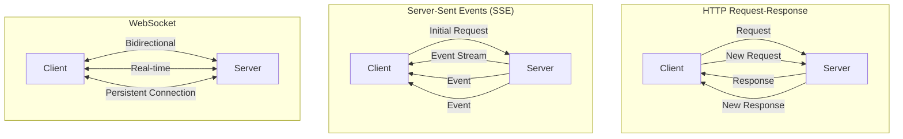

| Feature | HTTP | Server-Sent Events | WebSocket |
|---------|------|-------------------|-----------|
| **Direction** | Request-Response | Server → Client | Bidirectional |
| **Connection** | Short-lived | Persistent (one-way) | Persistent (two-way) |
| **Overhead** | High (headers) | Medium | Low |
| **Real-time** | No | Yes | Yes |
| **Complexity** | Low | Medium | High |
| **Use Cases** | REST APIs | Live feeds, notifications | Chat, gaming, collaboration |

## When to Use WebSockets

**✅ Perfect for:**
- Real-time chat applications
- Live gaming and multiplayer experiences
- Collaborative editing (Google Docs style)
- Live trading platforms
- Real-time dashboards and monitoring
- Live sports scores and updates

**❌ Avoid for:**
- Simple request-response APIs
- File uploads/downloads
- SEO-dependent content
- One-way data flow (use SSE instead)

# Spring WebSocket Architecture

## Overall Architecture

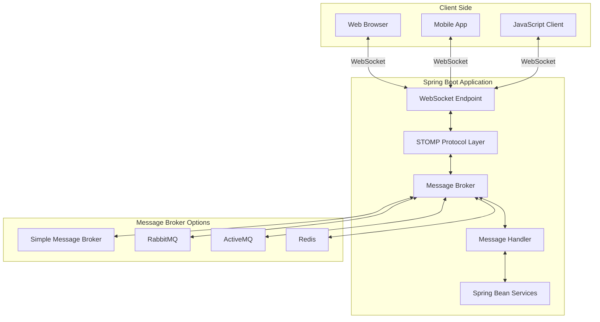

# Spring WebSocket Approaches

Spring Boot provides two main approaches for WebSocket implementation:

## 1. Raw WebSocket (`@EnableWebSocket`)

**Use Case:** Low-level WebSocket handling with custom protocols

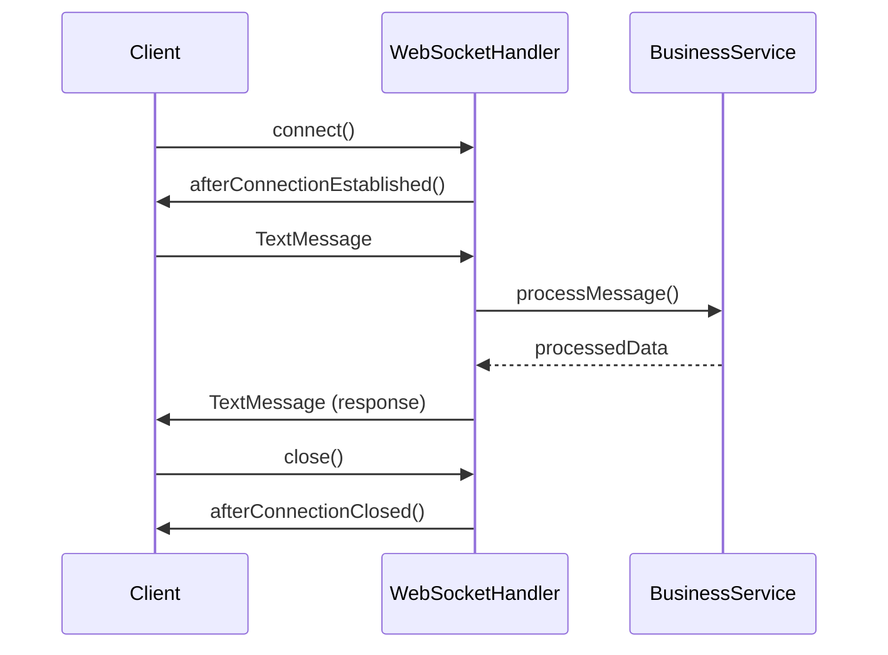

### Configuration
```java
@Configuration
@EnableWebSocket
public class WebSocketConfig implements WebSocketConfigurer {
    
    @Override
    public void registerWebSocketHandlers(WebSocketHandlerRegistry registry) {
        registry.addHandler(new MyWebSocketHandler(), "/websocket")
               .setAllowedOrigins("*")
               .withSockJS(); // Fallback support
    }
}
```

### WebSocket Handler
```java
@Component
public class MyWebSocketHandler extends TextWebSocketHandler {
    
    private final Set<WebSocketSession> sessions = ConcurrentHashMap.newKeySet();
    
    @Override
    public void afterConnectionEstablished(WebSocketSession session) {
        sessions.add(session);
        log.info("Client connected: {}", session.getId());
    }
    
    @Override
    protected void handleTextMessage(WebSocketSession session, TextMessage message) throws Exception {
        String payload = message.getPayload();
        log.info("Received: {}", payload);
        
        // Echo to all connected clients
        broadcastMessage(new TextMessage("Echo: " + payload));
    }
    
    @Override
    public void afterConnectionClosed(WebSocketSession session, CloseStatus status) {
        sessions.remove(session);
        log.info("Client disconnected: {}", session.getId());
    }
    
    private void broadcastMessage(TextMessage message) {
        sessions.parallelStream().forEach(session -> {
            try {
                session.sendMessage(message);
            } catch (Exception e) {
                log.error("Error sending message", e);
            }
        });
    }
}
```

## 2. STOMP WebSocket (`@EnableWebSocketMessageBroker`)

**Use Case:** High-level messaging with publish-subscribe patterns

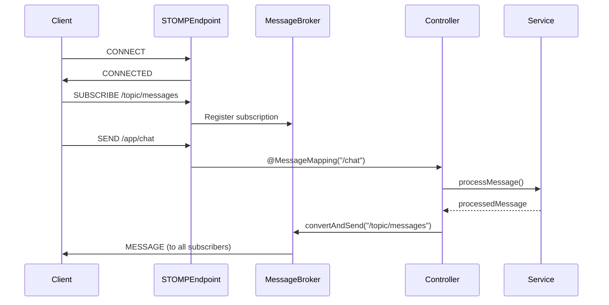

### STOMP Configuration
```java
@Configuration
@EnableWebSocketMessageBroker
public class WebSocketMessageConfig implements WebSocketMessageBrokerConfigurer {
    
    @Override
    public void registerStompEndpoints(StompEndpointRegistry registry) {
        registry.addEndpoint("/ws")
               .setAllowedOriginPatterns("*")
               .withSockJS();
    }
    
    @Override
    public void configureMessageBroker(MessageBrokerRegistry registry) {
        // Enable simple in-memory broker
        registry.enableSimpleBroker("/topic", "/queue");
        
        // Set application destination prefix
        registry.setApplicationDestinationPrefixes("/app");
        
        // Optional: Set user destination prefix
        registry.setUserDestinationPrefix("/user");
    }
}
```

### STOMP Controller
```java
@Controller
public class ChatController {
    
    @Autowired
    private SimpMessagingTemplate messagingTemplate;
    
    @MessageMapping("/chat.sendMessage")
    @SendTo("/topic/public")
    public ChatMessage sendMessage(ChatMessage chatMessage) {
        return chatMessage;
    }
    
    @MessageMapping("/chat.addUser")
    @SendTo("/topic/public")
    public ChatMessage addUser(ChatMessage chatMessage, 
                              SimpMessageHeaderAccessor headerAccessor) {
        // Add username to websocket session
        headerAccessor.getSessionAttributes().put("username", chatMessage.getSender());
        return chatMessage;
    }
    
    // Send to specific user
    @MessageMapping("/chat.private")
    public void sendPrivateMessage(@Payload PrivateMessage message, 
                                  SimpMessageHeaderAccessor headerAccessor) {
        messagingTemplate.convertAndSendToUser(
            message.getRecipient(), 
            "/queue/private", 
            message
        );
    }
}
```

# Message Broker Patterns

## Simple Message Broker vs External Broker

```mermaid
flowchart TB
    subgraph SimpleMessageBroker ["Simple Message Broker (In-Memory)"]
        SM[Simple Broker]
        SM --> T1[/topic/messages]
        SM --> T2[/queue/private]
        SM --> T3[/user/specific]
    end
    
    subgraph ExternalMessageBroker ["External Message Broker"]
        EB[RabbitMQ/ActiveMQ]
        EB --> E1[Exchange/Topic]
        EB --> E2[Queue]
        EB --> E3[Routing Key]
    end
    
    subgraph ScalingConsiderations ["Scaling Considerations"]
        S1[Single Instance] --> SM
        S2[Multiple Instances] --> EB
        S3[High Availability] --> EB
        S4[Persistence] --> EB
    end
```

## External Broker Configuration

### RabbitMQ Integration
```java
@Configuration
@EnableWebSocketMessageBroker
public class RabbitMQWebSocketConfig implements WebSocketMessageBrokerConfigurer {
    
    @Override
    public void configureMessageBroker(MessageBrokerRegistry registry) {
        registry.enableStompBrokerRelay("/topic", "/queue")
               .setRelayHost("localhost")
               .setRelayPort(61613)
               .setClientLogin("guest")
               .setClientPasscode("guest")
               .setSystemLogin("guest")
               .setSystemPasscode("guest");
               
        registry.setApplicationDestinationPrefixes("/app");
    }
}
```

### Redis Pub/Sub Integration
```java
@Configuration
public class RedisWebSocketConfig {
    
    @Bean
    public RedisMessageListenerContainer redisContainer() {
        RedisMessageListenerContainer container = new RedisMessageListenerContainer();
        container.setConnectionFactory(jedisConnectionFactory());
        container.addMessageListener(messageListener(), new PatternTopic("chat.*"));
        return container;
    }
    
    @Bean
    public MessageListener messageListener() {
        return (message, pattern) -> {
            // Broadcast to WebSocket clients
            messagingTemplate.convertAndSend("/topic/messages", 
                new String(message.getBody()));
        };
    }
}
```

# Data Models and Message Types

## Message Structure

```java
// Base message
@Data
public abstract class BaseMessage {
    private String id;
    private LocalDateTime timestamp;
    private MessageType type;
    private String sessionId;
}

// Chat message
@Data
@EqualsAndHashCode(callSuper = true)
public class ChatMessage extends BaseMessage {
    private String sender;
    private String content;
    private String roomId;
}

// System message
@Data
@EqualsAndHashCode(callSuper = true)
public class SystemMessage extends BaseMessage {
    private String event;
    private Map<String, Object> data;
}

// Private message
@Data
@EqualsAndHashCode(callSuper = true)
public class PrivateMessage extends BaseMessage {
    private String sender;
    private String recipient;
    private String content;
}

public enum MessageType {
    CHAT, JOIN, LEAVE, TYPING, SYSTEM, PRIVATE
}
```

# Real-World Use Cases and Implementations

## 1. Chat Application Architecture

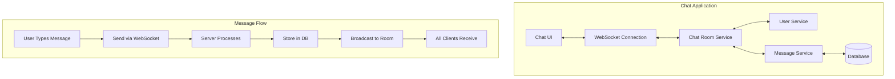

### Chat Implementation
```java
@Controller
public class ChatRoomController {
    
    @Autowired
    private ChatService chatService;
    
    @MessageMapping("/chat.join/{roomId}")
    @SendTo("/topic/room/{roomId}")
    public SystemMessage joinRoom(@DestinationVariable String roomId, 
                                 ChatUser user,
                                 SimpMessageHeaderAccessor headerAccessor) {
        
        headerAccessor.getSessionAttributes().put("roomId", roomId);
        headerAccessor.getSessionAttributes().put("username", user.getUsername());
        
        chatService.addUserToRoom(roomId, user);
        
        return SystemMessage.builder()
            .type(MessageType.JOIN)
            .event("user-joined")
            .data(Map.of("username", user.getUsername(), "roomId", roomId))
            .timestamp(LocalDateTime.now())
            .build();
    }
    
    @MessageMapping("/chat.send/{roomId}")
    @SendTo("/topic/room/{roomId}")
    public ChatMessage sendMessage(@DestinationVariable String roomId, 
                                  ChatMessage message) {
        // Save message to database
        ChatMessage savedMessage = chatService.saveMessage(roomId, message);
        
        // Return message to broadcast
        return savedMessage;
    }
    
    @MessageMapping("/chat.typing/{roomId}")
    @SendTo("/topic/room/{roomId}/typing")
    public TypingIndicator handleTyping(@DestinationVariable String roomId,
                                       TypingIndicator indicator) {
        return indicator;
    }
}
```

## 2. Live Dashboard/Monitoring

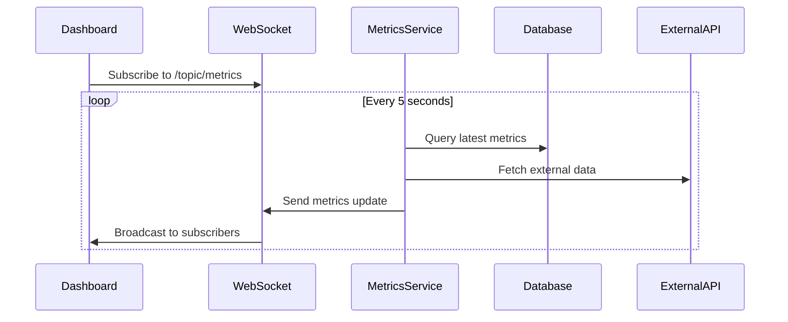

### Live Metrics Implementation
```java
@Component
public class LiveMetricsService {
    
    @Autowired
    private SimpMessagingTemplate messagingTemplate;
    
    @Scheduled(fixedRate = 5000) // Every 5 seconds
    public void sendMetricsUpdate() {
        MetricsData metrics = collectCurrentMetrics();
        
        messagingTemplate.convertAndSend("/topic/metrics", metrics);
    }
    
    @Scheduled(fixedRate = 1000) // Every second for critical metrics
    public void sendCriticalMetrics() {
        CriticalMetrics critical = getCriticalMetrics();
        
        if (critical.hasAlerts()) {
            messagingTemplate.convertAndSend("/topic/alerts", critical);
        }
    }
    
    private MetricsData collectCurrentMetrics() {
        return MetricsData.builder()
            .cpuUsage(systemMetrics.getCpuUsage())
            .memoryUsage(systemMetrics.getMemoryUsage())
            .activeUsers(userService.getActiveUserCount())
            .requestsPerSecond(requestMetrics.getRequestsPerSecond())
            .timestamp(LocalDateTime.now())
            .build();
    }
}
```

## 3. Collaborative Editing

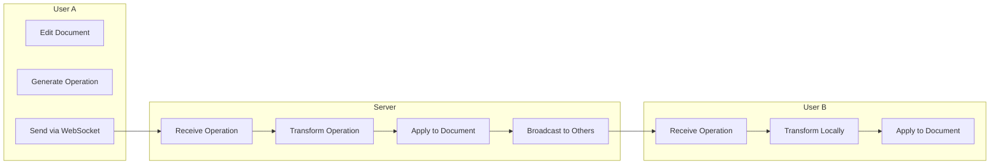

### Collaborative Editing Controller
```java
@Controller
public class CollaborativeEditingController {
    
    @MessageMapping("/document.edit/{documentId}")
    @SendTo("/topic/document/{documentId}")
    public DocumentOperation handleEdit(@DestinationVariable String documentId,
                                       DocumentOperation operation,
                                       SimpMessageHeaderAccessor headerAccessor) {
        
        String userId = (String) headerAccessor.getSessionAttributes().get("userId");
        operation.setUserId(userId);
        operation.setTimestamp(System.currentTimeMillis());
        
        // Apply operational transformation
        DocumentOperation transformedOp = operationalTransformService
            .transform(documentId, operation);
        
        // Save to document history
        documentService.applyOperation(documentId, transformedOp);
        
        return transformedOp;
    }
    
    @MessageMapping("/document.cursor/{documentId}")
    @SendTo("/topic/document/{documentId}/cursors")
    public CursorPosition updateCursor(@DestinationVariable String documentId,
                                      CursorPosition position,
                                      SimpMessageHeaderAccessor headerAccessor) {
        
        String userId = (String) headerAccessor.getSessionAttributes().get("userId");
        position.setUserId(userId);
        
        return position;
    }
}
```

# Client-Side Implementation

## JavaScript WebSocket Client

```javascript
// STOMP Client Setup
const socket = new SockJS('/ws');
const stompClient = Stomp.over(socket);

stompClient.connect({}, function(frame) {
    console.log('Connected: ' + frame);
    
    // Subscribe to public messages
    stompClient.subscribe('/topic/public', function(message) {
        const chatMessage = JSON.parse(message.body);
        displayMessage(chatMessage);
    });
    
    // Subscribe to private messages
    stompClient.subscribe('/user/queue/private', function(message) {
        const privateMessage = JSON.parse(message.body);
        displayPrivateMessage(privateMessage);
    });
});

// Send message
function sendMessage() {
    const message = {
        sender: username,
        content: messageInput.value,
        type: 'CHAT'
    };
    
    stompClient.send('/app/chat.sendMessage', {}, JSON.stringify(message));
    messageInput.value = '';
}

// Handle connection states
stompClient.onWebSocketError = function(error) {
    console.error('WebSocket Error: ', error);
    showConnectionStatus('Error: Connection lost');
};

stompClient.onStompError = function(frame) {
    console.error('STOMP Error: ', frame.headers['message']);
    showConnectionStatus('Error: ' + frame.headers['message']);
};
```

## React WebSocket Hook

```javascript
import { useEffect, useState } from 'react';
import SockJS from 'sockjs-client';
import Stomp from 'stompjs';

export const useWebSocket = (url, subscriptions = []) => {
    const [stompClient, setStompClient] = useState(null);
    const [connected, setConnected] = useState(false);
    const [messages, setMessages] = useState([]);

    useEffect(() => {
        const socket = new SockJS(url);
        const client = Stomp.over(socket);

        client.connect({}, 
            // Success callback
            (frame) => {
                setConnected(true);
                setStompClient(client);
                
                // Subscribe to topics
                subscriptions.forEach(({ topic, callback }) => {
                    client.subscribe(topic, (message) => {
                        const parsedMessage = JSON.parse(message.body);
                        setMessages(prev => [...prev, parsedMessage]);
                        callback && callback(parsedMessage);
                    });
                });
            },
            // Error callback
            (error) => {
                console.error('WebSocket connection error:', error);
                setConnected(false);
            }
        );

        return () => {
            if (client && client.connected) {
                client.disconnect();
            }
        };
    }, [url]);

    const sendMessage = (destination, message) => {
        if (stompClient && connected) {
            stompClient.send(destination, {}, JSON.stringify(message));
        }
    };

    return {
        connected,
        messages,
        sendMessage,
        stompClient
    };
};
```

# Security and Authentication

## WebSocket Security Architecture

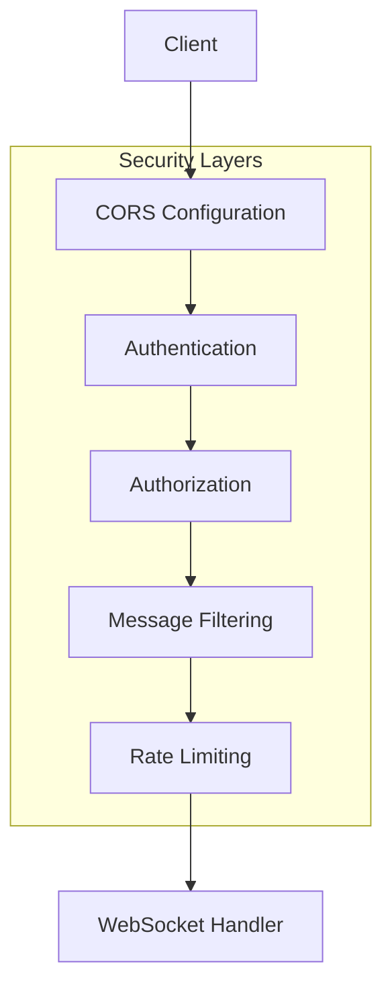

## Authentication Implementation

```java
@Configuration
public class WebSocketAuthConfig {
    
    @Bean
    public AuthChannelInterceptor authChannelInterceptor() {
        return new AuthChannelInterceptor();
    }
    
    @Override
    public void configureClientInboundChannel(ChannelRegistration registration) {
        registration.interceptors(authChannelInterceptor());
    }
}

@Component
public class AuthChannelInterceptor implements ChannelInterceptor {
    
    @Autowired
    private JwtTokenProvider tokenProvider;
    
    @Override
    public Message<?> preSend(Message<?> message, MessageChannel channel) {
        StompHeaderAccessor accessor = MessageHeaderAccessor.getAccessor(message, StompHeaderAccessor.class);
        
        if (accessor != null && StompCommand.CONNECT.equals(accessor.getCommand())) {
            String token = accessor.getFirstNativeHeader("Authorization");
            
            if (token != null && tokenProvider.validateToken(token)) {
                String username = tokenProvider.getUsernameFromToken(token);
                UsernamePasswordAuthenticationToken auth = 
                    new UsernamePasswordAuthenticationToken(username, null, new ArrayList<>());
                SecurityContextHolder.getContext().setAuthentication(auth);
                accessor.setUser(auth);
            } else {
                throw new IllegalArgumentException("Invalid token");
            }
        }
        
        return message;
    }
}
```

## Message-Level Security

```java
@Controller
public class SecureMessageController {
    
    @MessageMapping("/secure.message")
    @PreAuthorize("hasRole('USER')")
    @SendTo("/topic/secure")
    public SecureMessage handleSecureMessage(SecureMessage message, 
                                           Principal principal) {
        // Validate sender
        if (!message.getSender().equals(principal.getName())) {
            throw new IllegalArgumentException("Sender mismatch");
        }
        
        // Filter sensitive content
        message.setContent(contentFilter.filter(message.getContent()));
        
        return message;
    }
    
    @MessageMapping("/admin.broadcast")
    @PreAuthorize("hasRole('ADMIN')")
    @SendTo("/topic/admin")
    public AdminMessage handleAdminMessage(AdminMessage message, 
                                         Principal principal) {
        message.setSender(principal.getName());
        return message;
    }
}
```

# Performance Optimization and Monitoring

## Connection Management

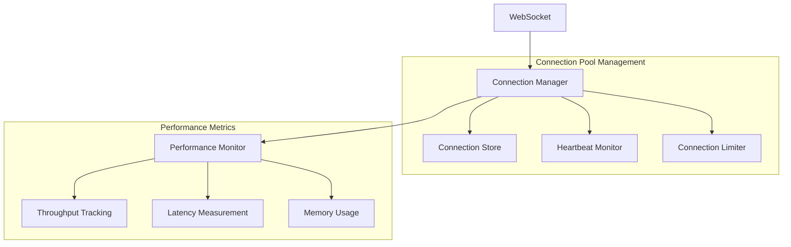

## Connection Management Service

```java
@Component
@Slf4j
public class WebSocketConnectionManager {
    
    private final Map<String, WebSocketSession> sessions = new ConcurrentHashMap<>();
    private final Map<String, Set<String>> roomSessions = new ConcurrentHashMap<>();
    
    @EventListener
    public void handleWebSocketConnectListener(SessionConnectedEvent event) {
        String sessionId = (String) event.getMessage().getHeaders().get("simpSessionId");
        log.info("WebSocket connection established: {}", sessionId);
        
        // Track connection metrics
        connectionMetrics.incrementConnections();
    }
    
    @EventListener
    public void handleWebSocketDisconnectListener(SessionDisconnectEvent event) {
        String sessionId = (String) event.getMessage().getHeaders().get("simpSessionId");
        String username = (String) event.getSessionAttributes().get("username");
        String roomId = (String) event.getSessionAttributes().get("roomId");
        
        if (roomId != null && username != null) {
            leaveRoom(roomId, sessionId);
            notifyUserLeft(roomId, username);
        }
        
        connectionMetrics.decrementConnections();
        log.info("WebSocket connection closed: {}", sessionId);
    }
    
    public void joinRoom(String roomId, String sessionId, String username) {
        roomSessions.computeIfAbsent(roomId, k -> ConcurrentHashMap.newKeySet()).add(sessionId);
        log.info("User {} joined room {}", username, roomId);
    }
    
    public void leaveRoom(String roomId, String sessionId) {
        Set<String> sessions = roomSessions.get(roomId);
        if (sessions != null) {
            sessions.remove(sessionId);
            if (sessions.isEmpty()) {
                roomSessions.remove(roomId);
            }
        }
    }
    
    public int getRoomSize(String roomId) {
        return roomSessions.getOrDefault(roomId, Collections.emptySet()).size();
    }
}
```

## Performance Configuration

```yaml
# application.yml
spring:
  websocket:
    stomp:
      message-size-limit: 64KB
      send-buffer-size-limit: 512KB
      send-time-limit: 20s
    
server:
  tomcat:
    max-connections: 10000
    max-threads: 200
    
management:
  endpoints:
    web:
      exposure:
        include: websocket, metrics
        
logging:
  level:
    org.springframework.messaging: DEBUG
    org.springframework.web.socket: DEBUG
```

## Custom Metrics

```java
@Component
public class WebSocketMetrics {
    
    private final Counter messagesReceived;
    private final Counter messagesSent;
    private final Gauge activeConnections;
    private final Timer messageProcessingTime;
    
    public WebSocketMetrics(MeterRegistry meterRegistry) {
        this.messagesReceived = Counter.builder("websocket.messages.received")
            .description("Total messages received via WebSocket")
            .register(meterRegistry);
            
        this.messagesSent = Counter.builder("websocket.messages.sent")
            .description("Total messages sent via WebSocket")
            .register(meterRegistry);
            
        this.activeConnections = Gauge.builder("websocket.connections.active")
            .description("Current active WebSocket connections")
            .register(meterRegistry, this, WebSocketMetrics::getActiveConnectionCount);
            
        this.messageProcessingTime = Timer.builder("websocket.message.processing.time")
            .description("Time taken to process WebSocket messages")
            .register(meterRegistry);
    }
    
    public void recordMessageReceived(String type) {
        messagesReceived.increment(Tags.of("type", type));
    }
    
    public void recordMessageSent(String destination) {
        messagesSent.increment(Tags.of("destination", destination));
    }
    
    public Timer.Sample startMessageProcessing() {
        return Timer.start(messageProcessingTime);
    }
    
    private double getActiveConnectionCount() {
        // Implementation to get active connection count
        return connectionManager.getActiveConnectionCount();
    }
}
```

# Testing WebSocket Applications

## Testing Architecture

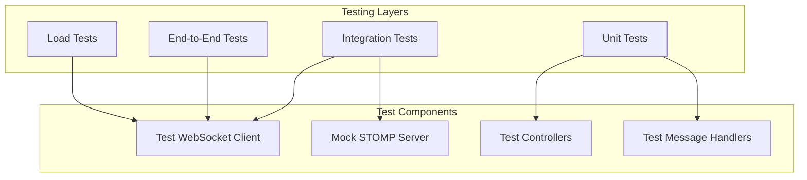

## Integration Testing

```java
@SpringBootTest(webEnvironment = SpringBootTest.WebEnvironment.RANDOM_PORT)
class WebSocketIntegrationTest {
    
    @LocalServerPort
    private int port;
    
    private StompSession stompSession;
    private final BlockingQueue<ChatMessage> blockingQueue = new ArrayBlockingQueue<>(1);
    
    @BeforeEach
    void setUp() throws Exception {
        WebSocketStompClient stompClient = new WebSocketStompClient(new SockJSClient(
            List.of(new WebSocketTransport(new StandardWebSocketClient()))));
        
        stompClient.setMessageConverter(new MappingJackson2MessageConverter());
        
        stompSession = stompClient.connect("ws://localhost:" + port + "/ws", 
            new StompSessionHandlerAdapter() {}).get(5, SECONDS);
    }
    
    @Test
    void shouldReceiveMessageAfterSending() throws Exception {
        // Subscribe to topic
        stompSession.subscribe("/topic/public", new StompFrameHandler() {
            @Override
            public Type getPayloadType(StompHeaders headers) {
                return ChatMessage.class;
            }
            
            @Override
            public void handleFrame(StompHeaders headers, Object payload) {
                blockingQueue.offer((ChatMessage) payload);
            }
        });
        
        // Send message
        ChatMessage message = new ChatMessage();
        message.setSender("testUser");
        message.setContent("Hello World");
        message.setType(MessageType.CHAT);
        
        stompSession.send("/app/chat.sendMessage", message);
        
        // Verify message received
        ChatMessage receivedMessage = blockingQueue.poll(5, SECONDS);
        
        assertThat(receivedMessage).isNotNull();
        assertThat(receivedMessage.getSender()).isEqualTo("testUser");
        assertThat(receivedMessage.getContent()).isEqualTo("Hello World");
    }
    
    @Test
    void shouldHandleMultipleConnections() throws Exception {
        // Test concurrent connections
        List<StompSession> sessions = new ArrayList<>();
        CountDownLatch latch = new CountDownLatch(5);
        
        for (int i = 0; i < 5; i++) {
            StompSession session = createTestSession();
            sessions.add(session);
            
            session.subscribe("/topic/public", new StompFrameHandler() {
                @Override
                public Type getPayloadType(StompHeaders headers) {
                    return ChatMessage.class;
                }
                
                @Override
                public void handleFrame(StompHeaders headers, Object payload) {
                    latch.countDown();
                }
            });
        }
        
        // Send broadcast message
        stompSession.send("/app/chat.sendMessage", createTestMessage());
        
        // Verify all sessions receive message
        assertTrue(latch.await(10, SECONDS));
    }
}
```

## Load Testing with JMeter

```xml
<!-- JMeter WebSocket Test Plan -->
<TestPlan>
  <WebSocketSampler>
    <stringProp name="serverNameOrIp">localhost</stringProp>
    <stringProp name="portNumber">8080</stringProp>
    <stringProp name="path">/ws</stringProp>
    <stringProp name="connectionTimeout">5000</stringProp>
    <stringProp name="responseTimeout">10000</stringProp>
    <stringProp name="protocol">SockJS</stringProp>
    
    <!-- STOMP Connect Frame -->
    <stringProp name="connectFrame">
      CONNECT
      accept-version:1.1,1.0
      heart-beat:10000,10000
      
    </stringProp>
    
    <!-- Test Messages -->
    <stringProp name="requestData">
      SEND
      destination:/app/chat.sendMessage
      content-type:application/json
      
      {"sender":"testUser","content":"Load test message","type":"CHAT"}
    </stringProp>
  </WebSocketSampler>
</TestPlan>
```

# Best Practices and Common Pitfalls

## Best Practices Checklist

### **Architecture & Design**
- ✅ Choose the right approach (Raw WebSocket vs STOMP)
- ✅ Design for scalability with external message brokers
- ✅ Implement proper connection lifecycle management
- ✅ Use appropriate message serialization (JSON, MessagePack)

### **Security**
- ✅ Implement authentication and authorization
- ✅ Validate all incoming messages
- ✅ Use HTTPS/WSS in production
- ✅ Implement rate limiting to prevent abuse

### **Performance**
- ✅ Monitor connection counts and message throughput
- ✅ Implement connection pooling and reuse
- ✅ Use message batching for high-frequency updates
- ✅ Configure appropriate buffer sizes and timeouts

### **Reliability**
- ✅ Handle connection drops gracefully
- ✅ Implement reconnection logic on client side
- ✅ Use heartbeat/ping-pong for connection health
- ✅ Store critical messages for delivery guarantee

## Common Pitfalls to Avoid

### **1. Memory Leaks from Session Management**
```java
// ❌ Bad: Sessions not properly cleaned up
private final Map<String, WebSocketSession> sessions = new HashMap<>();

// ✅ Good: Use concurrent collections and cleanup listeners
private final Map<String, WebSocketSession> sessions = new ConcurrentHashMap<>();

@EventListener
public void handleWebSocketDisconnectListener(SessionDisconnectEvent event) {
    String sessionId = event.getSessionId();
    sessions.remove(sessionId);
    // Additional cleanup...
}
```

### **2. Blocking Operations in Message Handlers**
```java
// ❌ Bad: Blocking database call in message handler
@MessageMapping("/chat.send")
public void handleMessage(ChatMessage message) {
    expensiveDatabase.save(message); // Blocks message processing
}

// ✅ Good: Async processing
@MessageMapping("/chat.send")
public void handleMessage(ChatMessage message) {
    CompletableFuture.runAsync(() -> {
        expensiveDatabase.save(message);
    });
}
```

### **3. Not Handling Backpressure**
```java
// ✅ Good: Implement backpressure handling
@Component
public class BackpressureHandler {
    
    private final Semaphore messageSemaphore = new Semaphore(1000);
    
    public boolean tryAcquireMessageSlot() {
        return messageSemaphore.tryAcquire();
    }
    
    public void releaseMessageSlot() {
        messageSemaphore.release();
    }
}
```

# Scaling WebSocket Applications

## Horizontal Scaling Architecture

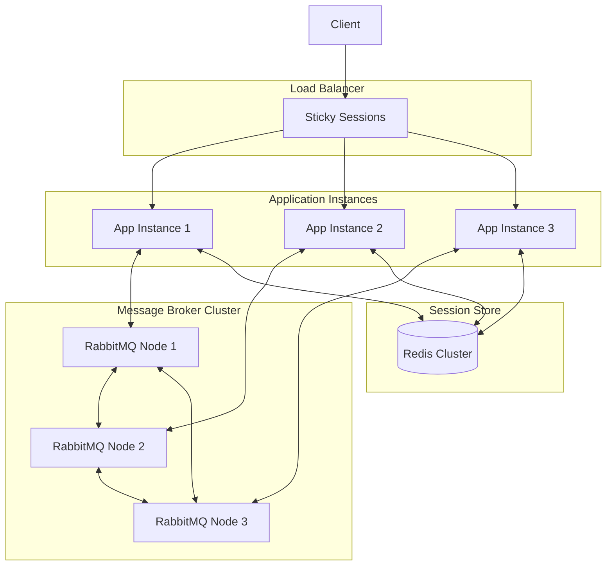

## Configuration for Production

```yaml
# application-prod.yml
spring:
  rabbitmq:
    host: rabbitmq-cluster.example.com
    port: 5672
    username: ${RABBITMQ_USERNAME}
    password: ${RABBITMQ_PASSWORD}
    virtual-host: /websocket
    
  redis:
    host: redis-cluster.example.com
    port: 6379
    password: ${REDIS_PASSWORD}
    timeout: 2000ms
    
  websocket:
    stomp:
      relay:
        enabled: true
        host: ${RABBITMQ_STOMP_HOST:localhost}
        port: ${RABBITMQ_STOMP_PORT:61613}
        login: ${RABBITMQ_USERNAME}
        passcode: ${RABBITMQ_PASSWORD}
        
server:
  tomcat:
    max-connections: 10000
    max-threads: 300
    
management:
  endpoints:
    web:
      exposure:
        include: health,metrics,websocket
  metrics:
    export:
      prometheus:
        enabled: true
```

## Summary

WebSockets in Spring Boot provide powerful real-time communication capabilities. Key takeaways:

### **When to Use Each Approach:**
- **Raw WebSocket (`@EnableWebSocket`)**: Custom protocols, binary data, low-level control
- **STOMP WebSocket (`@EnableWebSocketMessageBroker`)**: Chat apps, publish-subscribe, room-based communication

### **Production Considerations:**
- Use external message brokers for scaling
- Implement proper security and authentication  
- Monitor performance and connection health
- Handle failures gracefully with reconnection logic
- Test thoroughly including load testing

### **Architecture Patterns:**
- Publisher-Subscriber for broadcasting
- Point-to-Point for private messaging
- Request-Response for interactive features
- Event-Driven for real-time updates

WebSockets enable rich, interactive applications but require careful consideration of security, scalability, and reliability patterns for production deployment.

`@EnableWebSocketMessageBroker`:

This is used for implementing a **STOMP-based messaging system.**
Suitable for applications needing a publish/subscribe model or complex routing with destinations.
Relies on Spring's simp messaging (simple messaging protocol) abstraction.
Example use case: A chat application with topic-based subscriptions.

`@EnableWebSocket`:

This is for creating raw WebSocket handlers.
Allows handling low-level WebSocket frames (e.g., TextMessage, BinaryMessage) directly.
Example use case: Custom WebSocket-based protocols or real-time data streams like stock prices.