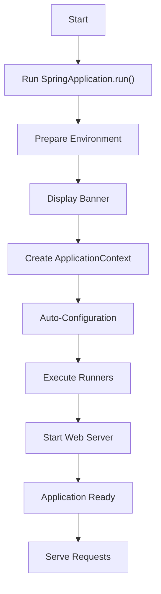



# Spring Boot Startup Process



---

# 1. **Application Entry Point**
- The entry point for a Spring Boot application is typically a class annotated with `@SpringBootApplication`.
- The `@SpringBootApplication` annotation is a combination of:
    - `@EnableAutoConfiguration`: Enables Spring Boot's auto-configuration mechanism.
    - `@ComponentScan`: Scans for components in the current package and sub-packages.
    - `@Configuration`: Marks the class as a source of bean definitions.

The `SpringApplication.run()` method is invoked to start the application and triggers the entire startup process.

```java
@SpringBootApplication
public class Application {
    public static void main(String[] args) {
        SpringApplication.run(Application.class, args);
    }
}
```

# 2. **Steps in the Startup Process**

### 2.1 **SpringApplication Initialization**
- A `SpringApplication` object is created when the application is run.
- Key tasks during initialization include:
  - Detecting the application type (`SERVLET`, `REACTIVE`, or `NONE`).
  - Loading `ApplicationContextInitializers` and `ApplicationListeners`.
  - Setting default properties for the application.

### 2.2 **Application Listeners Execution**
- `ApplicationListeners` handle various lifecycle events during startup, such as environment preparation and context initialization.
- Examples of lifecycle events include:
  - Preparing the environment.
  - Initializing the application context.

```java
public static void main(String[] args) {
  SpringApplication app = new SpringApplication(Application.class);
  app.setBannerMode(Banner.Mode.OFF); // Example of customizing the startup
  app.run(args);
}
```

# 3. **Environment Preparation**
Spring Boot creates and configures an `Environment` object to manage application properties and profiles. 

Key steps include:
- Loading properties from various sources:
  - Configuration files (e.g., `application.properties` or `application.yml`).
  - Environment variables.
  - Command-line arguments.
- Determining and activating profiles for different environments, such as `dev` or `prod`.

# 4. **Creating the Application Context**
Spring Boot creates the appropriate type of `ApplicationContext` based on the application type:
- For **servlet-based** applications, a `ServletWebServerApplicationContext` is used.
- For reactive applications, a `ReactiveWebServerApplicationContext` is used.
- For CLI or non-web applications, a `GenericApplicationContext` is used.

# 5. **Auto-Configuration and Component Scanning**

### 5.1 **Component Scanning**
- The `@ComponentScan` annotation scans the base package and sub-packages for Spring-managed components, such as:
  - Services
  - Repositories
  - Controllers
  - Configuration classes

### 5.2 **Auto-Configuration**
- Auto-configuration uses the `@EnableAutoConfiguration` annotation.
- It leverages `META-INF/spring.factories` to load relevant configuration classes automatically.
- Conditional annotations (`@Conditional`) determine which configurations should be applied.

# 6. **Bean Definitions and Dependency Injection**

### 6.1 **Bean Creation**
- Beans are registered in the application context through:
  - Component scanning.
  - Explicit definitions in configuration classes.
  - Auto-configuration.

### 6.2 **Dependency Injection**
- Dependencies are resolved and injected into beans through mechanisms like:
  - Constructor injection.
  - Field injection.
  - Setter injection.

# 7. **Application Context Refresh**

The application context is refreshed to perform tasks such as:
- Instantiating and configuring all beans.
- Resolving placeholders and configuration properties.
- Registering and initializing any lifecycle components or runners.

# 8. **Embedded Server Initialization (For Web Applications)**

### 8.1 **Server Startup**
- The embedded web server (e.g., Tomcat, Jetty, or Undertow) is started during this phase.

### 8.2 **DispatcherServlet Initialization**
- The `DispatcherServlet` is registered in the servlet context and initialized to handle HTTP requests.

# 9. **Application Execution**

### 9.1 **Lifecycle Events**
- Spring Boot triggers application lifecycle events, including:
  - `ApplicationStartedEvent` – Signaling the application startup phase.
  - `ApplicationReadyEvent` – Signaling that the application is ready.

### 9.2 **Custom Logic Execution**
- Any custom initialization logic defined in `CommandLineRunner` or `ApplicationRunner` beans is executed.

# 10. **Application Ready**

The application is fully initialized and ready to handle its tasks:
- For web applications, the server is ready to process requests.
- For CLI or batch applications, the main process begins execution.

# Summary

The Spring Boot startup process consists of several well-defined steps:
1. Initializing the `SpringApplication`.
2. Preparing the environment and loading properties.
3. Creating and refreshing the application context.
4. Registering beans and performing dependency injection.
5. Starting the embedded server (if applicable).
6. Running custom application logic.