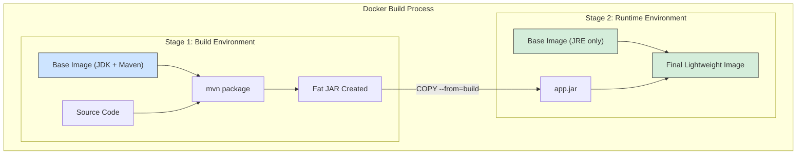



# Introduction to Containerization

Containerization is a lightweight form of virtualization that allows you to package an application and its dependencies into a single, isolated unit called a **container**. This container can run consistently on any environment, whether it's a developer's laptop, a testing server, or a production cloud instance.

**Docker** is the most popular containerization platform.

## Why Containerize a Spring Boot Application?

- **Consistency**: A container runs the same everywhere, eliminating the "it works on my machine" problem.
- **Portability**: Docker containers can run on any system that has Docker installed, from local machines to cloud providers like AWS, GCP, and Azure.
- **Isolation**: Containers run in isolation, so they don't interfere with other applications or the host system.
- **Scalability**: Containers are lightweight and start quickly, making them perfect for microservices and for scaling applications horizontally.
- **DevOps Enablement**: Containers streamline the build, test, and deployment pipeline, enabling CI/CD and DevOps practices.

# Creating a Dockerfile for a Spring Boot App

A `Dockerfile` is a text file that contains instructions for building a Docker image. Here is a basic `Dockerfile` for a typical Spring Boot application.

### Step 1: Build the Application
First, make sure you have a packaged, executable JAR file. You can create this with Maven or Gradle.
```shell
# Using Maven
mvn clean package

# Using Gradle
./gradlew build
```
This will typically create a JAR file in the `target/` or `build/libs/` directory.

### Step 2: Write the Dockerfile

A simple `Dockerfile`:

```dockerfile
# 1. Use an official OpenJDK runtime as a parent image
# Using a slim image reduces the final image size
FROM openjdk:17-jdk-slim

# 2. Add metadata to the image
LABEL maintainer="your-email@example.com"

# 3. Set the working directory inside the container
WORKDIR /app

# 4. Copy the executable JAR file from your build directory into the container
# The source path is relative to the Docker build context
COPY target/my-app-0.0.1-SNAPSHOT.jar app.jar

# 5. Expose the port the application runs on
EXPOSE 8080

# 6. Specify the command to run on container startup
ENTRYPOINT ["java", "-jar", "app.jar"]
```

## Building and Running the Docker Image

1.  **Build the image**:
    Open a terminal in the root of your project (where the `Dockerfile` is) and run:
    ```shell
    # -t tags the image with a name (e.g., my-spring-app)
    # . specifies the build context (the current directory)
    docker build -t my-spring-app .
    ```

2.  **Run the container**:
    ```shell
    # -p maps port 8080 on your host to port 8080 in the container
    # --name gives the running container a specific name
    docker run -p 8080:8080 --name my-running-app my-spring-app
    ```
    You should now be able to access your application at `http://localhost:8080`.

# Best Practice: Multi-Stage Builds

The `Dockerfile` above is simple, but it has a drawback: you have to build the JAR file on your host machine first and then copy it into the image. A **multi-stage build** is a more advanced and efficient approach where the entire build process happens inside Docker.

This has two main benefits:
1.  **No local build required**: You don't need to have Maven or Java installed on your host machine.
2.  **Smaller final image**: The final image contains only the JRE and your application JAR, not the entire JDK, Maven, and your source code. This makes the image more secure and faster to deploy.

### Example of a Multi-Stage `Dockerfile`:

```dockerfile
# --- 1. Build Stage ---
# Use a base image with Maven and JDK to build the application
FROM maven:3.8.5-openjdk-17 AS build

# Set the working directory
WORKDIR /source

# Copy the project files
COPY . .

# Build the application and create the executable JAR
# -DskipTests skips running tests during the build
RUN mvn clean package -DskipTests


# --- 2. Runtime Stage ---
# Use a slim JRE image for the final, lightweight container
FROM openjdk:17-jre-slim

# Set the working directory
WORKDIR /app

# Copy only the built JAR from the 'build' stage
COPY --from=build /source/target/*.jar app.jar

# Expose the application port
EXPOSE 8080

# Run the application
ENTRYPOINT ["java", "-jar", "app.jar"]
```

This `Dockerfile` creates a temporary "build" container, uses it to compile the code and build the JAR, and then copies *only the final JAR* into a clean, lightweight runtime container. The build container and all its intermediate files are discarded.

This diagram shows the multi-stage build process, separating the build environment from the final runtime environment.



# Cloud-Native Best Practices for Containers

- **Externalize Configuration**: Don't bake environment-specific configuration (like database URLs or passwords) into your Docker image. Use environment variables, volume mounts for config files, or a configuration server (like Spring Cloud Config).
- **Health Checks**: Use Spring Boot Actuator to expose health endpoints (`/actuator/health`). In orchestrators like Kubernetes, these are used as `liveness` and `readiness` probes to manage the container's lifecycle.
- **Graceful Shutdown**: Ensure your application can shut down gracefully when it receives a `SIGTERM` signal from Docker. Spring Boot does this automatically, finishing in-flight requests before exiting.
- **Stateless Services**: Design your services to be stateless. Any state should be stored in an external database or cache. This allows you to easily scale your application by simply running more instances of your container.
