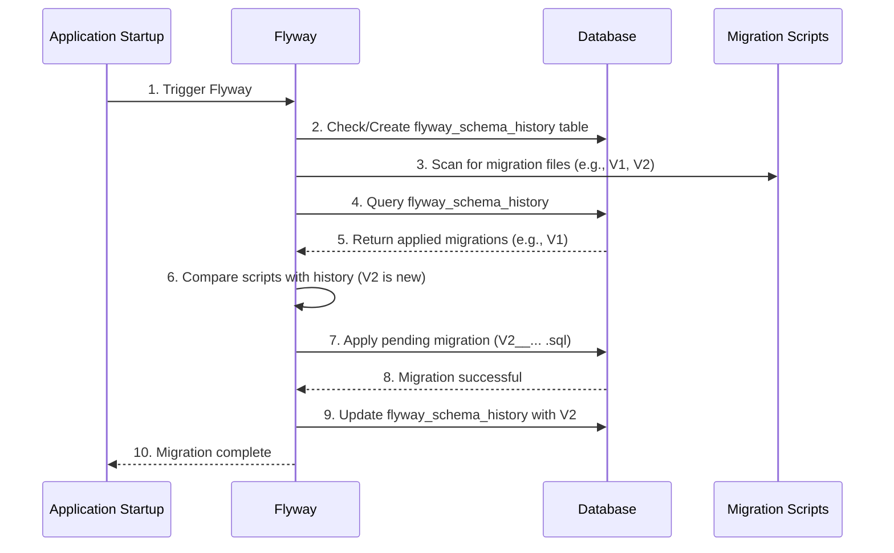

---
categories:
- Microservices
date: 2025-09-22 12:03:00
tags:
- Spring Boot
- Database
- Migration
title: Database Migration with Flyway
---



# What is Database Migration?

Database migration is the management of incremental, reversible changes to your database schema. Just as you use version control (like Git) for your source code, a database migration tool allows you to version-control your database structure.

## Why is it Important?

In modern application development, especially in an agile environment, the database schema evolves along with the application code. Without a proper migration tool, managing these changes can be chaotic and error-prone.

- **Problem**: How do you ensure that every developer's local database is up-to-date? How do you apply schema changes to the production database during deployment?
- **Solution**: A database migration tool automates this process.

Key benefits include:
- **Version Control for Your DB**: Schema changes are scripted and checked into your project's source control.
- **Automation**: Migrations can be applied automatically on application startup.
- **Consistency**: Ensures that the database schema is consistent across all environments (development, testing, production).
- **Collaboration**: Makes it easy for teams of developers to manage and share database changes.

# Flyway

Flyway is a popular open-source database migration tool that strongly favors simplicity and convention over configuration. It is very easy to set up and use, especially with Spring Boot.

## How Flyway Works

1.  **Migration Scripts**: You write your database changes as plain SQL scripts.
2.  **Schema History Table**: Flyway creates a special table in your database (by default, `flyway_schema_history`) to track which migration scripts have already been applied.
3.  **Migration on Startup**: When your application starts, Flyway scans the classpath for migration scripts. It then compares these scripts against the schema history table and applies any new (pending) migrations in order.

This diagram illustrates the Flyway migration process on application startup.



## Setting up Flyway with Spring Boot

1.  **Dependency**: Add the Flyway dependency to your `pom.xml`. Spring Boot's `spring-boot-starter-data-jpa` or `spring-boot-starter-jdbc` will manage the database connection.

    ```xml
    <dependency>
        <groupId>org.flywaydb</groupId>
        <artifactId>flyway-core</artifactId>
    </dependency>
    ```

2.  **Create Migration Scripts**:
    By default, Flyway looks for SQL scripts in the `src/main/resources/db/migration` directory.

    The naming convention for the scripts is crucial:
    **`V<VERSION>__<DESCRIPTION>.sql`**

    - `V`: The prefix for versioned migrations.
    - `<VERSION>`: The version number (e.g., `1`, `1.1`, `202509221200`). Versions are sorted numerically.
    - `__`: Two underscores to separate the version and description.
    - `<DESCRIPTION>`: A human-readable description of the change.
    - `.sql`: The file extension.

    **Example Scripts:**

    `src/main/resources/db/migration/V1__create_user_table.sql`:
    ```sql
    CREATE TABLE app_user (
        id BIGINT PRIMARY KEY AUTO_INCREMENT,
        username VARCHAR(100) NOT NULL UNIQUE,
        email VARCHAR(255) NOT NULL
    );
    ```

    `src/main/resources/db/migration/V2__add_password_to_user.sql`:
    ```sql
    ALTER TABLE app_user ADD COLUMN password_hash VARCHAR(255) NOT NULL;
    ```

3.  **Configure `application.yml`** (Optional):
    Spring Boot provides excellent auto-configuration for Flyway. Usually, you don't need to configure anything. However, you can customize its behavior if needed.

    ```yaml
    spring:
      flyway:
        enabled: true # Enabled by default
        locations: classpath:db/migration,classpath:db/another_location # Change script locations
        baseline-on-migrate: true # If migrating an existing DB, sets the current state as baseline V1
    ```

4.  **Run the Application**:
    That's it! When you start your Spring Boot application, it will automatically detect Flyway, check the `flyway_schema_history` table, and apply any pending migrations (like `V1` and `V2` if the database is new).

# Flyway vs. Liquibase

Liquibase is another popular database migration tool. Here's a quick comparison:

| Feature           | Flyway                                      | Liquibase                                   |
|-------------------|---------------------------------------------|---------------------------------------------|
| **Script Format** | Plain SQL                                   | XML, YAML, JSON, or SQL                     |
| **Philosophy**    | Simplicity, convention over configuration   | Flexibility, database-agnostic abstractions |
| **Rollbacks**     | Available in the paid version (Teams)       | Supported in the free version               |
| **Use Case**      | Great for teams that prefer writing raw SQL and want a simple, straightforward tool. | Good for complex scenarios, multi-database support, or when you need declarative, database-agnostic changelogs. |

For most Spring Boot applications, Flyway's simplicity and ease of use make it an excellent first choice.