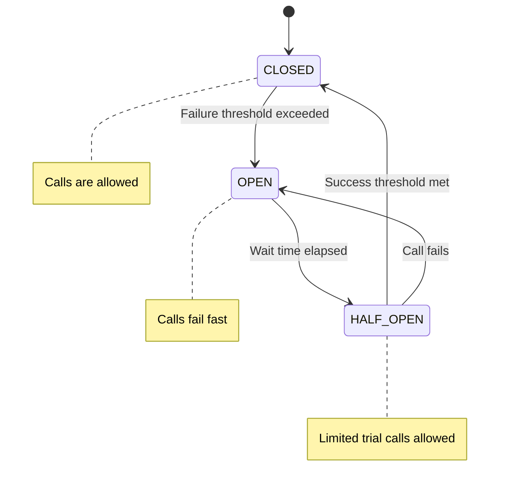
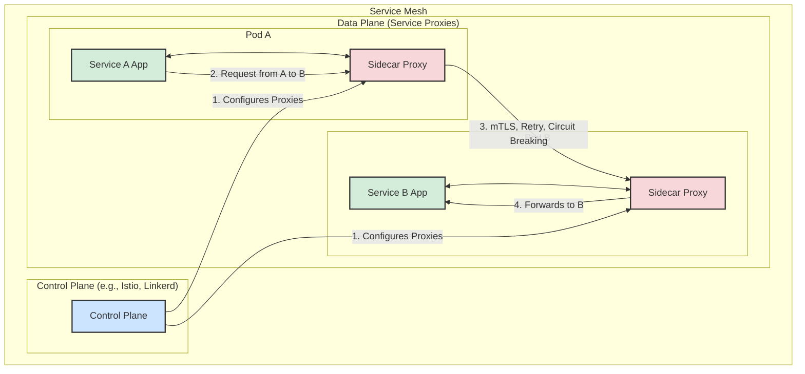

---
categories:
- Microservices
date: 2025-09-22 12:02:00
tags:
- Spring Boot
- Fault Tolerance
title: Resilience and Fault Tolerance with Resilience4J
---



# Introduction to Resilience

In a distributed, microservices-based architecture, it's not a question of *if* a service will fail, but *when*. Network issues, service unavailability, and latency are common problems. **Resilience** is the ability of a system to gracefully handle such failures and remain responsive to the user.

**Fault tolerance** is a key aspect of resilience. It ensures that your application can continue to operate, perhaps in a degraded but controlled manner, even when one or more of its dependencies are failing.

# Resilience4J

Resilience4J is a lightweight, easy-to-use fault tolerance library for Java. It is inspired by Netflix Hystrix but is designed for Java 8 and functional programming. It allows you to decorate any method call, lambda expression, or `Supplier` with resilience patterns.

Spring Cloud provides seamless integration with Resilience4J.

## Key Dependencies

To get started, add the Spring Cloud Starter for Resilience4J.

```xml
<dependency>
    <groupId>org.springframework.cloud</groupId>
    <artifactId>spring-cloud-starter-circuitbreaker-resilience4j</artifactId>
</dependency>
```

# Core Resilience Patterns

## 1. Circuit Breaker

The Circuit Breaker pattern prevents an application from repeatedly trying to call a service that is known to be failing. This avoids wasting resources and gives the failing service time to recover.

This diagram shows the three states of the Circuit Breaker: `CLOSED`, `OPEN`, and `HALF_OPEN`.



- **How it works**: A circuit breaker acts like an electrical circuit breaker. It has three states:
  - **`CLOSED`**: The normal state. All calls are allowed to pass through to the remote service. If the number of failures exceeds a configured threshold, the breaker trips and moves to the `OPEN` state.
  - **`OPEN`**: The circuit is "open." All calls fail immediately without even attempting to contact the remote service. After a configured wait duration, the breaker moves to `HALF_OPEN`.
  - **`HALF_OPEN`**: A limited number of trial requests are allowed through. If they succeed, the breaker moves back to `CLOSED`. If they fail, it returns to `OPEN`.

- **Configuration** (`application.yml`):
  ```yaml
  resilience4j.circuitbreaker:
    instances:
      myExternalService:
        registerHealthIndicator: true
        slidingWindowType: COUNT_BASED
        slidingWindowSize: 10 # Last 10 calls are considered
        failureRateThreshold: 50 # If 50% of calls fail, open the circuit
        waitDurationInOpenState: 10s # Wait 10 seconds before moving to HALF_OPEN
        permittedNumberOfCallsInHalfOpenState: 3 # Allow 3 trial calls
  ```

- **Usage**:
  The `@CircuitBreaker` annotation is used to wrap a method. The `fallbackMethod` is invoked if the circuit is open or if the original call fails.

  ```java
  @Service
  public class ExternalApiService {

      @CircuitBreaker(name = "myExternalService", fallbackMethod = "getFallbackData")
      public String fetchDataFromApi() {
          // This call might fail
          return restTemplate.getForObject("http://api.example.com/data", String.class);
      }

      // The fallback method must have the same signature, plus an optional Throwable parameter
      public String getFallbackData(Throwable t) {
          log.error("External API is down. Falling back. Error: {}", t.getMessage());
          return "Default Data"; // Return a cached or default response
      }
  }
  ```

## 2. Retry

The Retry pattern automatically re-invokes a failed operation. This is useful for handling transient, temporary failures like a brief network glitch.

- **Configuration** (`application.yml`):
  ```yaml
  resilience4j.retry:
    instances:
      myExternalService:
        maxAttempts: 3 # Try the operation a total of 3 times
        waitDuration: 100ms # Wait 100ms between attempts
  ```

- **Usage**:
  You can combine annotations. The order matters: `Retry` should typically be applied "inside" the `CircuitBreaker`.

  ```java
  @CircuitBreaker(name = "myExternalService", fallbackMethod = "getFallbackData")
  @Retry(name = "myExternalService")
  public String fetchDataFromApi() {
      // ...
  }
  ```

## 3. Bulkhead

The Bulkhead pattern limits the number of concurrent calls to a specific component. This prevents a slow or failing dependency from exhausting all resources (like threads) in your application, which could cause a cascading failure across the entire system.

- **How it works**: It's like the bulkheads in a ship's hull. If one compartment floods, the bulkheads prevent the entire ship from sinking. Similarly, if one service is slow, the bulkhead isolates that problem and prevents it from taking down your whole application.

- **Configuration** (`application.yml`):
  ```yaml
  resilience4j.bulkhead:
    instances:
      myExternalService:
        maxConcurrentCalls: 10 # Allow only 10 concurrent calls to this service
        maxWaitDuration: 10ms # How long a thread will wait for permission to call
  ```

- **Usage**:
  ```java
  @Bulkhead(name = "myExternalService")
  @CircuitBreaker(name = "myExternalService", fallbackMethod = "getFallbackData")
  public String fetchDataFromApi() {
      // ...
  }
  ```

## Other Patterns

- **Rate Limiter**: Limits the rate of requests to a certain number per time period (e.g., 10 requests per second).
- **Time Limiter**: Sets a timeout for asynchronous operations, completing them with a `TimeoutException` if they take too long.

By combining these patterns, you can build highly resilient applications that are robust against the inevitable failures of a distributed environment.

# The Modern Alternative: Service Mesh (e.g., Istio, Linkerd)

While Resilience4J is excellent for implementing resilience patterns *within your application code*, the dominant trend in modern cloud-native environments (as of 2025) is to handle this at the **infrastructure level** using a **Service Mesh**.

A Service Mesh is a dedicated, configurable infrastructure layer that handles inter-service communication. It works by deploying a lightweight proxy (called a **sidecar**) next to each service instance. All network traffic flows through this proxy, which is controlled by the mesh's control plane.

This means resilience logic like circuit breaking, retries, and timeouts can be configured and enforced *outside* of the application, transparently.

### Service Mesh Architecture

Here is a diagram illustrating the Service Mesh architecture. It shows a **Control Plane** that configures the **Sidecar Proxies** running alongside each service in the **Data Plane**. All service-to-service communication is intercepted and managed by these proxies.



## Comparison: Resilience4J vs. Service Mesh

| Feature                | In-App Library (Resilience4J)                                  | Service Mesh (Istio, Linkerd)                                  |
|:------------------------|:----------------------------------------------------------------|:----------------------------------------------------------------|
| **Location of Logic**  | Inside the application code (e.g., `@CircuitBreaker`).         | Outside the application, in the sidecar proxy (e.g., Envoy).   |
| **Language Dependent** | **Yes**. Resilience4J is for the JVM. Other languages need their own libraries. | **No**. It is language-agnostic and works with any service.      |
| **Developer Overhead** | Developers must implement annotations and configuration in every service. | Developers focus on business logic. The platform/ops team manages resilience rules. |
| **Consistency**        | Can be inconsistent if not applied uniformly across all services. | Enforced consistently across all services in the mesh by platform policy. |
| **Observability**      | Provides metrics for the specific application.                 | Provides rich, uniform metrics, tracing, and logs for all traffic in the mesh. |

## When to Choose Which Approach

- **Use Resilience4J when**:
  - You are not running in a Kubernetes/Service Mesh environment.
  - You need fine-grained, application-aware resilience logic that the infrastructure can't handle.
  - You want to keep your deployment architecture simple without a full service mesh.

- **Use a Service Mesh when**:
  - You are building a complex, polyglot microservices architecture on Kubernetes.
  - You want to decouple operational concerns (like resilience and security) from application code.
  - You have a platform team that can manage the service mesh infrastructure.

For a modern cloud-native application, leveraging a service mesh is often the preferred, more scalable strategy. However, knowing how to implement these patterns within the application using tools like Resilience4J is still a critical skill.
- **Time Limiter**: Sets a timeout for asynchronous operations, completing them with a `TimeoutException` if they take too long.

By combining these patterns, you can build highly resilient applications that are robust against the inevitable failures of a distributed environment.