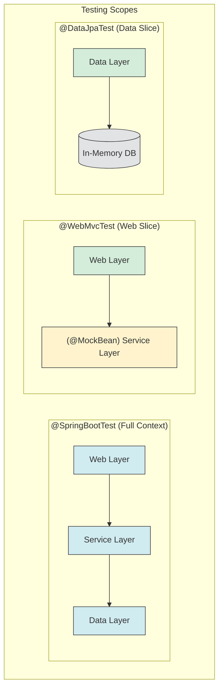



# Introduction to Advanced Testing

Spring Boot provides a powerful and comprehensive testing framework that simplifies writing unit, integration, and end-to-end tests. While basic unit tests are essential, advanced techniques like test slices and container-based integration tests are crucial for building robust, production-ready applications.

# Test Slices

Test slices allow you to test a specific layer or "slice" of your application in isolation. Instead of loading the entire application context, which can be slow, a test slice loads only the beans necessary for that specific layer. This results in faster and more focused tests.

The diagram below illustrates the difference between a full `@SpringBootTest` and focused test slices like `@WebMvcTest` and `@DataJpaTest`.



To use test slices, you use specific annotations provided by Spring Boot.

## `@WebMvcTest`: Testing the Web Layer

`@WebMvcTest` is used for testing Spring MVC controllers. It focuses only on the web layer and does not load the full application context.

- **What it does**:
  - Auto-configures Spring Security and `MockMvc`.
  - Loads only the specified controller(s) and related web-layer components (`@Controller`, `@ControllerAdvice`, `@JsonComponent`, etc.).
  - Disables full auto-configuration; services and repositories are not loaded unless explicitly imported.

- **When to use it**: To verify that your controllers are handling HTTP requests correctly, validating input, and producing the expected JSON or view responses.

- **Example**:
  You often need to mock the service layer dependencies using `@MockBean`.

  ```java
  @WebMvcTest(UserController.class)
  public class UserControllerTest {

      @Autowired
      private MockMvc mockMvc; // For making mock HTTP requests

      @MockBean
      private UserService userService; // Mock the service dependency

      @Test
      void whenGetUserById_thenReturnUser() throws Exception {
          // Given: Mock the service call
          User user = new User("1", "Nitin");
          given(userService.getUserById("1")).willReturn(Optional.of(user));

          // When & Then: Perform the request and assert the response
          mockMvc.perform(get("/users/1")
                  .contentType(MediaType.APPLICATION_JSON))
              .andExpect(status().isOk())
              .andExpect(jsonPath("$.name", is("Nitin")));
      }
  }
  ```

## `@DataJpaTest`: Testing the Persistence Layer

`@DataJpaTest` is used for testing the persistence layer, specifically JPA repositories.

- **What it does**:
  - Configures an in-memory database (like H2) by default.
  - Scans for `@Entity` classes and configures Spring Data JPA repositories.
  - Runs each test in a transaction that is rolled back by default, ensuring tests are isolated.
  - Auto-configures `TestEntityManager`, a utility for persisting and finding entities in tests.

- **When to use it**: To verify that your JPA repositories are working correctly, including custom queries.

- **Example**:

  ```java
  @DataJpaTest
  public class UserRepositoryTest {

      @Autowired
      private TestEntityManager entityManager;

      @Autowired
      private UserRepository userRepository;

      @Test
      public void whenFindByUsername_thenReturnUser() {
          // Given: Persist a user to the test database
          User user = new User("Nitin", "nitin@test.com");
          entityManager.persist(user);
          entityManager.flush(); // Flush changes to the database

          // When: Call the repository method
          Optional<User> found = userRepository.findByUsername("Nitin");

          // Then: Assert that the user was found
          assertThat(found).isPresent();
          assertThat(found.get().getEmail()).isEqualTo("nitin@test.com");
      }
  }
  ```

## Other Test Slices

- **`@JsonTest`**: For testing JSON serialization and deserialization. Useful for testing DTOs and custom `JsonSerializer`/`JsonDeserializer` implementations.
- **`@RestClientTest`**: For testing REST clients (like `RestTemplate` or `WebClient`).
- **`@DataMongoTest`**, **`@DataRedisTest`**, etc.: For testing other data technologies.

# Integration Testing with Testcontainers

While in-memory databases are fast, they may not behave exactly like your production database. **Testcontainers** is a Java library that provides lightweight, throwaway instances of real databases, message brokers, or any other service that can run in a Docker container. This allows you to run true integration tests against the same technology you use in production.

## How it Works

1.  You add the Testcontainers dependency to your project.
2.  You annotate your test class with `@Testcontainers` and declare a container field with `@Container`.
3.  Testcontainers will start the specified Docker container before your tests run and stop it afterward.
4.  You dynamically configure Spring Boot to connect to the running container.

## Example: Integration Test with a Real PostgreSQL Database

1.  **Dependencies** (`pom.xml`):
    ```xml
    <dependency>
        <groupId>org.testcontainers</groupId>
        <artifactId>junit-jupiter</artifactId>
        <scope>test</scope>
    </dependency>
    <dependency>
        <groupId>org.testcontainers</groupId>
        <artifactId>postgresql</artifactId>
        <scope>test</scope>
    </dependency>
    ```

2.  **Test Implementation**:
    ```java
    @SpringBootTest(webEnvironment = SpringBootTest.WebEnvironment.RANDOM_PORT)
    @Testcontainers
    class UserServiceIntegrationTest {

        // This will start a PostgreSQL container for the test
        @Container
        static PostgreSQLContainer<?> postgres = new PostgreSQLContainer<>("postgres:13-alpine");

        // Dynamically set the datasource properties for Spring Boot
        @DynamicPropertySource
        static void configureProperties(DynamicPropertyRegistry registry) {
            registry.add("spring.datasource.url", postgres::getJdbcUrl);
            registry.add("spring.datasource.username", postgres::getUsername);
            registry.add("spring.datasource.password", postgres::getPassword);
            registry.add("spring.jpa.hibernate.ddl-auto", () -> "create");
        }

        @Autowired
        private UserService userService;

        @Autowired
        private UserRepository userRepository;

        @Test
        void shouldSaveAndRetrieveUser() {
            // Given
            User user = new User("Nitin", "nitin@test.com");

            // When
            userService.saveUser(user);

            // Then
            Optional<User> foundUser = userRepository.findByUsername("Nitin");
            assertThat(foundUser).isPresent();
            assertThat(foundUser.get().getEmail()).isEqualTo("nitin@test.com");
        }
    }
    ```

In this example, the test runs against a real PostgreSQL database inside a Docker container, providing a much higher level of confidence than an in-memory database.

