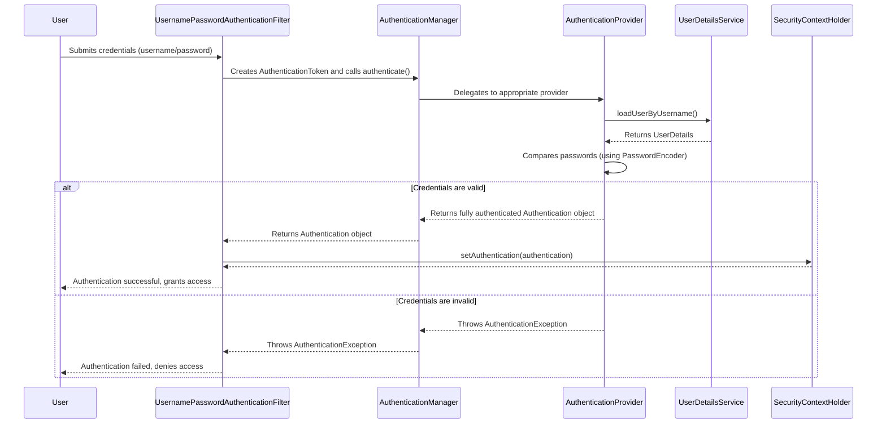

---
categories:
- Microservices
date: 2025-09-22 12:00:00
tags:
- Spring Boot
- Security
- Authentication
- Authorization
title: Spring Security Concepts
---



# Core Concepts

Spring Security is a framework that provides authentication, authorization, and other security features for enterprise applications. As a Spring developer, a strong understanding of its architecture is crucial for interviews.

## Fundamental Concepts

- **Authentication**: The process of verifying the identity of a user, device, or system. It answers the question, "Who are you?".
- **Authorization**: The process of determining whether an authenticated user has permission to access a specific resource or perform a particular action. It answers the question, "What are you allowed to do?".
- **Principal**: The currently authenticated user. It can be represented as an object within Spring Security's `SecurityContext`.

## SecurityContextHolder, SecurityContext, and Authentication

-   **`SecurityContextHolder`**: This is the heart of Spring Security's authentication mechanism. It's where the framework stores the details of the currently authenticated principal. By default, it uses a `ThreadLocal` to store these details, making the security context available throughout a single thread of execution.
-   **`SecurityContext`**: Held by the `SecurityContextHolder`, this contains the `Authentication` object.
-   **`Authentication`**: This interface represents the token for an authentication request. It contains:
    -   `getPrincipal()`: The identity of the principal being authenticated.
    -   `getCredentials()`: The credentials that prove the principal's identity (e.g., a password).
    -   `getAuthorities()`: The permissions granted to the principal (e.g., roles).

## UserDetails and UserDetailsService

-   **`UserDetails`**: Provides core user information. It's a contract for a user's details, including username, password, authorities, and account status (e.g., enabled, locked).
-   **`UserDetailsService`**: An interface used to load user-specific data. It has a single method, `loadUserByUsername(String username)`, which is responsible for locating the user from a persistent store (like a database) and returning a `UserDetails` object.

## GrantedAuthority

This interface represents a permission granted to the principal. These are typically roles (e.g., `ROLE_USER`, `ROLE_ADMIN`).

## PasswordEncoder

-   Used for encoding passwords before storing them.
-   Spring Security requires a `PasswordEncoder` to be configured. `BCryptPasswordEncoder` is a common and secure choice.

# Authentication Architecture

Authentication is the process of verifying who a user is.

## AuthenticationManager, ProviderManager, and AuthenticationProvider

-   **`AuthenticationManager`**: The main strategy interface for authentication. Its `authenticate()` method attempts to authenticate the passed `Authentication` object.
-   **`ProviderManager`**: The most common implementation of `AuthenticationManager`. It delegates to a list of configured `AuthenticationProvider` instances.
-   **`AuthenticationProvider`**: Responsible for a specific authentication mechanism (e.g., username/password, LDAP, SAML). It attempts to authenticate a user and returns a fully populated `Authentication` object if successful.

## SecurityFilterChain

In modern Spring Security (post-`WebSecurityConfigurerAdapter`), security is configured via `SecurityFilterChain` beans. This chain of filters intercepts incoming requests to enforce security rules.

Key filters include:
-   **`UsernamePasswordAuthenticationFilter`**: Processes authentication form submissions.
-   **`BasicAuthenticationFilter`**: Handles HTTP Basic authentication.
-   **`FilterSecurityInterceptor`**: Responsible for authorization, checking if a user has access to a resource.

# Authorization

Authorization is the process of deciding if a user is allowed to do something.

## Role-Based vs. Permission-Based Access Control

-   **Role-Based Access Control (RBAC)**: Access is granted based on roles assigned to users (e.g., `ADMIN`, `USER`).
-   **Permission-Based Access Control**: More granular. Access is granted based on specific permissions (e.g., `READ_PRIVILEGE`, `WRITE_PRIVILEGE`).

## Method Security Annotations

-   **`@PreAuthorize`**: Checks for authorization before a method is executed. Uses SpEL (Spring Expression Language) for powerful expressions.
-   **`@PostAuthorize`**: Checks for authorization after a method is executed. Useful when you need to check the return value.
-   **`@Secured`**: A simpler annotation for role-based checks (e.g., `@Secured("ROLE_ADMIN")`).
-   **`@RolesAllowed`**: The JSR-250 standard annotation for specifying roles.

# Web Security

## HttpSecurity Configuration

The `HttpSecurity` object is used to configure web-based security for all HTTP requests. You can configure:
-   URL-based authorization rules (`requestMatchers`).
-   Login and logout behavior.
-   CORS and CSRF protection.
-   Session management.

## CORS (Cross-Origin Resource Sharing)

A mechanism that allows resources to be requested from another domain. Spring Security provides comprehensive CORS support that can be configured within the `HttpSecurity` configuration.

## CSRF (Cross-Site Request Forgery)

An attack that tricks a victim into submitting a malicious request. Spring Security provides CSRF protection by default. It requires a token to be included in all state-changing requests.

# JWT (JSON Web Token)

JWT is a compact, URL-safe means of representing claims to be transferred between two parties. It's commonly used for stateless authentication in microservices.

The flow is typically:
1.  User authenticates with credentials.
2.  Server generates a JWT and sends it to the client.
3.  Client includes the JWT in the `Authorization` header for subsequent requests.
4.  A custom filter on the server validates the JWT and sets the `Authentication` in the `SecurityContextHolder`.

# OAuth2 and OpenID Connect (OIDC)

-   **OAuth2**: An authorization framework that enables a third-party application to obtain limited access to an HTTP service. Key roles:
    -   **Resource Owner**: The user.
    -   **Client**: The application requesting access.
    -   **Authorization Server**: The server that authenticates the Resource Owner and issues access tokens.
    -   **Resource Server**: The server that hosts the protected resources.
-   **OIDC**: A thin layer on top of OAuth2 that adds an identity layer, providing information about the authenticated user.

# Testing Spring Security

-   **`@WithMockUser`**: Mocks a user with a specific username, password, and roles.
-   **`@WithUserDetails`**: Loads a user from the `UserDetailsService` to use for a test.
-   **`MockMvc`**: Can be used with Spring Security to test web-layer security by performing requests and asserting the responses.