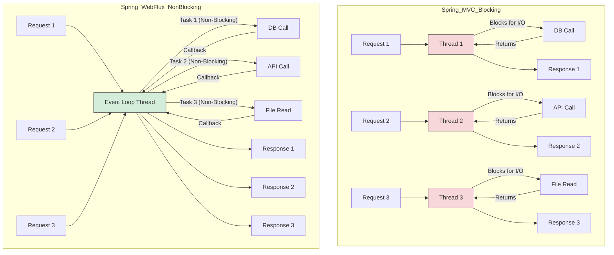



# Introduction to Reactive Programming

Reactive Programming is a programming paradigm oriented around data flows and the propagation of change. It is about building asynchronous, non-blocking, and event-driven applications that can scale efficiently.

The core principles of reactive programming are:
- **Responsive**: The system responds in a timely manner if at all possible.
- **Resilient**: The system stays responsive in the face of failure.
- **Elastic**: The system stays responsive under varying workload.
- **Message Driven**: Reactive systems rely on asynchronous message-passing to establish a boundary between components.

# Spring WebFlux

Spring WebFlux is the reactive-stack web framework of Spring Framework, introduced in version 5.0. It is a fully non-blocking alternative to Spring MVC, designed to handle a massive number of concurrent connections with a small number of threads.

## Key Dependencies

To use Spring WebFlux, you need to add the `spring-boot-starter-webflux` dependency to your `pom.xml` or `build.gradle`.

```xml
<dependency>
    <groupId>org.springframework.boot</groupId>
    <artifactId>spring-boot-starter-webflux</artifactId>
</dependency>
```

This starter pulls in `spring-webflux` and `project-reactor` as the default reactive library.

## Project Reactor: Mono and Flux

Project Reactor is the reactive library of choice for Spring WebFlux. It provides two key types that implement the `Publisher` interface from the Reactive Streams specification:

- **`Mono<T>`**: A publisher that emits **0 or 1** element. It is used for asynchronous operations that may return a single result or nothing.
  - **Use Cases**: API calls that return a single resource (e.g., `findById`), or operations that complete without a return value (e.g., `save` or `delete`).

- **`Flux<T>`**: A publisher that emits **0 to N** elements. It is used for asynchronous sequences of data.
  - **Use Cases**: API calls that return a collection of resources (e.g., `findAll`), streaming data, or infinite streams.

### Example:

```java
// Returns a single user
Mono<User> userMono = Mono.just(new User("Nitin"));

// Returns a stream of users
Flux<User> userFlux = Flux.just(
    new User("Nitin"),
    new User("Priya"),
    new User("Amit")
);
```

## Backpressure

Backpressure is a crucial concept in reactive programming. It is a mechanism that allows a subscriber to control the rate at which a publisher sends data. This prevents the publisher from overwhelming the subscriber with more data than it can handle.

In Reactive Streams, this is managed through the `Subscription` object. The `Subscriber` requests a certain number of items (`subscription.request(n)`), and the `Publisher` will not send more than that number until the `Subscriber` requests more.

# WebFlux vs. Spring MVC

Here is a diagram comparing the traditional blocking thread model of Spring MVC with the non-blocking event-loop model of WebFlux.



| Feature           | Spring MVC (Blocking)                               | Spring WebFlux (Non-Blocking)                             |
|-------------------|-----------------------------------------------------|-----------------------------------------------------------|
| **Thread Model**  | **Thread-per-request**. Each incoming request is assigned a thread from a thread pool. If all threads are busy, new requests must wait. | **Event-loop model**. A small number of threads (often one per CPU core) handle many requests concurrently. Operations are non-blocking. |
| **API Style**     | **Imperative**. Methods return actual objects or collections (e.g., `User`, `List<User>`). The thread blocks until the result is ready. | **Functional & Reactive**. Methods return `Mono<User>` or `Flux<User>`. The processing pipeline is defined declaratively. |
| **Use Case**      | Traditional applications, blocking I/O (like standard JDBC), simple CRUD services. | High-concurrency applications, streaming APIs, microservices that need to be highly scalable and resilient. |
| **Dependencies**  | `spring-boot-starter-web`                           | `spring-boot-starter-webflux`                             |

# Building a Reactive Controller

A reactive controller in WebFlux looks similar to an MVC controller, but it returns `Mono` and `Flux` types.

```java
@RestController
@RequestMapping("/users")
public class UserController {

    private final UserService userService;

    public UserController(UserService userService) {
        this.userService = userService;
    }

    @GetMapping("/{id}")
    public Mono<User> getUserById(@PathVariable String id) {
        return userService.findById(id);
    }

    @GetMapping
    public Flux<User> getAllUsers() {
        return userService.findAll();
    }

    @PostMapping
    @ResponseStatus(HttpStatus.CREATED)
    public Mono<User> createUser(@RequestBody User user) {
        return userService.save(user);
    }
}
```

In this example:
- `getUserById` returns a `Mono<User>`, as it expects a single user.
- `getAllUsers` returns a `Flux<User>`, as it streams a list of users.
- The framework handles subscribing to these reactive types and writing the result to the HTTP response.

# When to Use WebFlux

- **High Concurrency Needs**: When you need to handle a very large number of concurrent users with minimal hardware resources.
- **Streaming Data**: For applications that stream data, such as video streaming, real-time analytics, or long-polling notifications.
- **Non-Blocking I/O**: When your application communicates with other non-blocking services (e.g., reactive databases like MongoDB, Redis, or other microservices built with WebFlux).
- **Functional Programming Style**: If you prefer a declarative, functional style of programming.

You should **stick with Spring MVC** if your application uses blocking dependencies (like traditional JDBC or JPA), or if your team is not yet comfortable with the reactive programming paradigm, as it comes with a steeper learning curve.

