

# Introduction to SSL/TLS and Certificate Management

**SSL/TLS certificates** and **certificate management** are fundamental security concepts that every software developer should understand. Despite being crucial for secure communication, these concepts are often mysterious to developers who work primarily with application code.

This comprehensive guide covers everything from basic cryptographic concepts to practical implementation in enterprise applications.

## Why This Matters for Developers

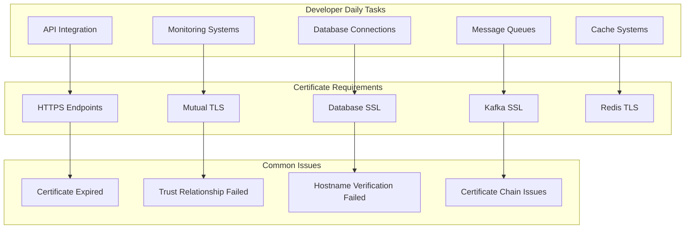

# Fundamental Cryptographic Concepts

## Public Key Cryptography (Asymmetric Encryption)

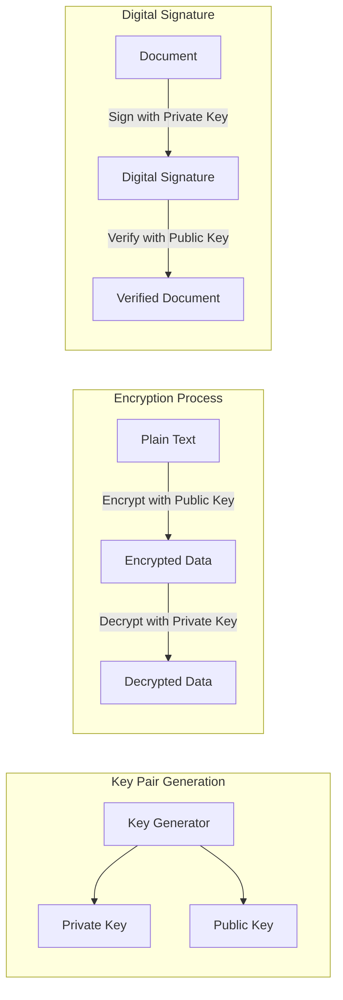

### Key Concepts:
- **Private Key**: Secret key that must be protected, used for decryption and signing
- **Public Key**: Openly shared key used for encryption and signature verification
- **Key Pair**: Mathematically related private and public keys
- **Digital Signature**: Cryptographic proof of authenticity and integrity

## Symmetric vs Asymmetric Encryption Comparison

| Aspect | Symmetric Encryption | Asymmetric Encryption |
|--------|---------------------|----------------------|
| **Keys** | Single shared key | Key pair (public + private) |
| **Speed** | Very fast | Slower (computationally intensive) |
| **Key Distribution** | Difficult (secure channel needed) | Easy (public key can be shared openly) |
| **Use Case** | Bulk data encryption | Key exchange, digital signatures |
| **Examples** | AES, DES, 3DES | RSA, ECC, DSA |
| **Key Length** | 128, 192, 256 bits | 2048, 3072, 4096 bits (RSA) |

# SSL/TLS Protocol Deep Dive

## SSL/TLS Handshake Process

```mermaid
sequenceDiagram
    participant Client
    participant Server
    participant CA as Certificate Authority
    
    Client->>Server: 1. Client Hello (supported ciphers, TLS version)
    Server->>Client: 2. Server Hello (selected cipher, TLS version)
    Server->>Client: 3. Server Certificate (public key + CA signature)
    Server->>Client: 4. Server Hello Done
    
    Note over Client: Verify server certificate with CA
    Client->>CA: Validate certificate chain
    CA-->>Client: Certificate validation response
    
    Client->>Server: 5. Client Key Exchange (pre-master secret encrypted with server's public key)
    Client->>Server: 6. Change Cipher Spec
    Client->>Server: 7. Client Finished (encrypted with session key)
    
    Server->>Client: 8. Change Cipher Spec  
    Server->>Client: 9. Server Finished (encrypted with session key)
    
    Note over Client,Server: Secure communication using symmetric encryption
    Client<->>Server: Application Data (encrypted)
```

## TLS Versions and Evolution

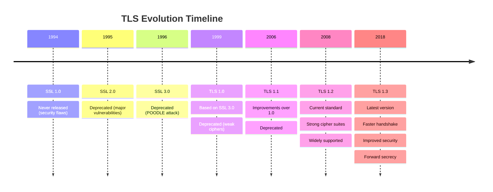

| TLS Version | Status | Security Level | Performance |
|-------------|--------|----------------|-------------|
| **SSL 2.0/3.0** | ❌ Deprecated | Very Weak | Slow |
| **TLS 1.0** | ❌ Deprecated | Weak | Slow |
| **TLS 1.1** | ❌ Deprecated | Moderate | Moderate |
| **TLS 1.2** | ✅ Recommended | Strong | Good |
| **TLS 1.3** | ✅ Preferred | Very Strong | Fast |

# Digital Certificates Explained

## What is a Digital Certificate?

A **digital certificate** is an electronic document that uses a **digital signature** to bind a **public key** with an **identity** (person, organization, or device).

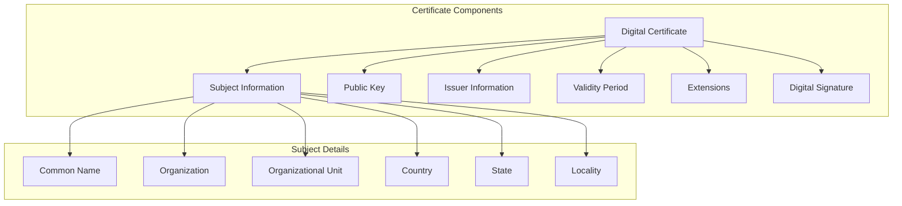

## Certificate Fields Breakdown

### Subject Information
```
Subject: CN=api.example.com, O=Example Corp, OU=IT Department, L=San Francisco, ST=California, C=US
```

- **CN (Common Name)**: The hostname or service name the certificate protects
- **O (Organization)**: Legal name of the organization
- **OU (Organizational Unit)**: Department or division
- **L (Locality)**: City or locality
- **ST (State)**: State or province
- **C (Country)**: Two-letter country code

### Issuer Information
```
Issuer: CN=DigiCert SHA2 Secure Server CA, O=DigiCert Inc, C=US
```

### Validity Period
```
Not Before: Jan 1, 2024 00:00:00 GMT
Not After: Jan 1, 2025 23:59:59 GMT
```

### Extensions (Critical for modern certificates)
- **Subject Alternative Names (SAN)**: Additional hostnames protected
- **Key Usage**: Allowed uses for the public key
- **Extended Key Usage**: Specific purposes (server auth, client auth)
- **Basic Constraints**: Whether this is a CA certificate

## Certificate Types and Use Cases

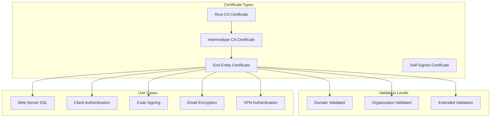

### Certificate Validation Levels

| Level | Validation Process | Trust Indicators | Use Case |
|-------|-------------------|------------------|----------|
| **Domain Validated (DV)** | Domain ownership only | Basic padlock | Development, personal sites |
| **Organization Validated (OV)** | Domain + organization verification | Organization name shown | Business websites |
| **Extended Validation (EV)** | Rigorous organization verification | Green address bar (legacy) | High-security sites |

# Certificate Authorities (CA) and Trust Chain

## Certificate Authority Hierarchy

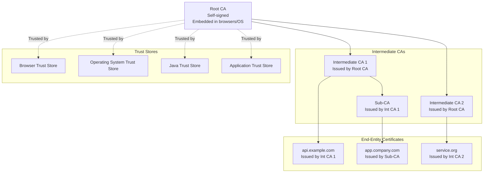

## Certificate Chain Validation Process

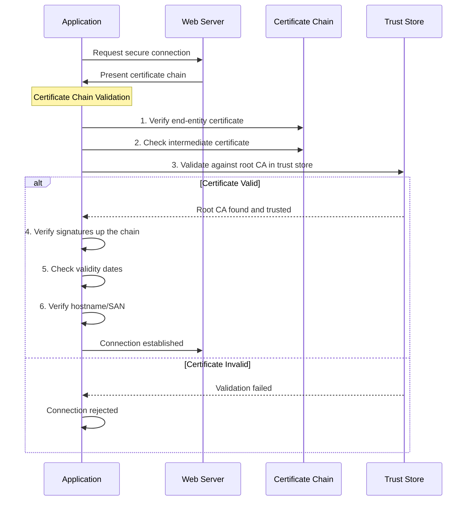

## Major Certificate Authorities

### Public CAs
- **DigiCert**: Enterprise-focused, high-security certificates
- **Let's Encrypt**: Free, automated certificates with 90-day validity
- **GlobalSign**: International CA with strong presence in Europe
- **Comodo/Sectigo**: Cost-effective certificates for various needs
- **GeoTrust**: Symantec subsidiary, now owned by DigiCert

### Private/Internal CAs
- **Microsoft Active Directory Certificate Services (ADCS)**
- **OpenSSL-based internal CAs**
- **HashiCorp Vault PKI**
- **AWS Certificate Manager Private CA**

# Java Keystores and Truststores

## Keystore vs Truststore Conceptual Difference

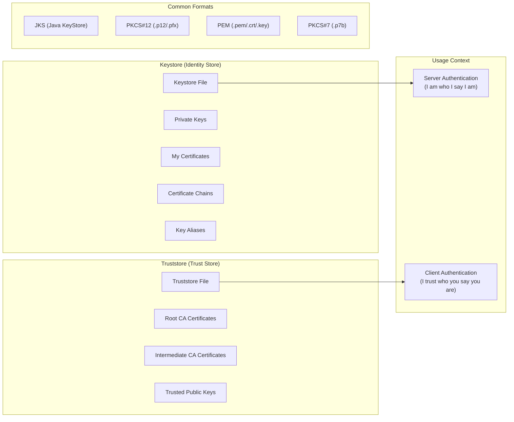

## Keystore Deep Dive

A **keystore** contains:
- **Private keys** (your identity)
- **Certificates** (your public key + identity info)
- **Certificate chains** (path to trusted root)

### Keystore Operations with keytool

```bash
# Generate a new key pair and certificate
keytool -genkeypair \
    -alias myserver \
    -keyalg RSA \
    -keysize 2048 \
    -validity 365 \
    -keystore server.jks \
    -storetype JKS \
    -dname "CN=api.mycompany.com,O=My Company,L=San Francisco,ST=CA,C=US"

# Generate Certificate Signing Request (CSR)
keytool -certreq \
    -alias myserver \
    -keystore server.jks \
    -file server.csr \
    -storepass changeit

# Import signed certificate from CA
keytool -importcert \
    -alias myserver \
    -keystore server.jks \
    -file server-signed.crt \
    -storepass changeit

# List all entries in keystore
keytool -list \
    -keystore server.jks \
    -storepass changeit \
    -v

# Export certificate (public key only)
keytool -exportcert \
    -alias myserver \
    -keystore server.jks \
    -file server-public.crt \
    -storepass changeit
```

## Truststore Deep Dive

A **truststore** contains:
- **Root CA certificates** (who you trust)
- **Intermediate CA certificates** (chain of trust)
- **Self-signed certificates** (explicitly trusted)

### Truststore Operations

```bash
# Import CA certificate into truststore
keytool -importcert \
    -alias digicert-root \
    -keystore truststore.jks \
    -file DigiCertRootCA.crt \
    -storepass changeit \
    -noprompt

# List trusted certificates
keytool -list \
    -keystore truststore.jks \
    -storepass changeit

# Remove a trusted certificate
keytool -delete \
    -alias old-ca \
    -keystore truststore.jks \
    -storepass changeit

# Import intermediate CA
keytool -importcert \
    -alias digicert-intermediate \
    -keystore truststore.jks \
    -file DigiCertIntermediateCA.crt \
    -storepass changeit
```

## Java Default Trust Store

```bash
# Location of Java's default truststore (cacerts)
$JAVA_HOME/lib/security/cacerts

# Default password: changeit

# List default trusted certificates
keytool -list -keystore $JAVA_HOME/lib/security/cacerts -storepass changeit

# Add certificate to system truststore (requires admin privileges)
sudo keytool -importcert \
    -alias my-internal-ca \
    -keystore $JAVA_HOME/lib/security/cacerts \
    -file internal-ca.crt \
    -storepass changeit
```

# Certificate File Formats

## Common Certificate Formats

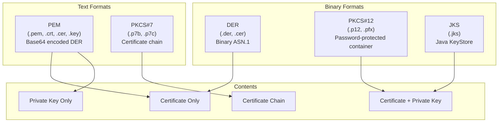

## Format Conversion Examples

### Convert between formats
```bash
# PEM to DER
openssl x509 -in certificate.pem -outform DER -out certificate.der

# DER to PEM
openssl x509 -in certificate.der -inform DER -outform PEM -out certificate.pem

# PKCS#12 to PEM (extract certificate and private key)
openssl pkcs12 -in certificate.p12 -out certificate.pem -nodes

# PEM to PKCS#12 (combine certificate and private key)
openssl pkcs12 -export -out certificate.p12 -inkey private.key -in certificate.crt

# JKS to PKCS#12
keytool -importkeystore \
    -srckeystore keystore.jks \
    -destkeystore keystore.p12 \
    -deststoretype PKCS12

# Extract private key from PKCS#12
openssl pkcs12 -in certificate.p12 -nocerts -out private.key -nodes

# Extract certificate from PKCS#12
openssl pkcs12 -in certificate.p12 -nokeys -out certificate.crt
```

### View Certificate Information
```bash
# View PEM certificate details
openssl x509 -in certificate.pem -text -noout

# View certificate in keystore
keytool -list -v -keystore keystore.jks -alias myalias

# Check certificate expiry
openssl x509 -in certificate.pem -noout -dates

# Verify certificate chain
openssl verify -CAfile ca-bundle.crt certificate.crt

# Check certificate against private key
openssl x509 -noout -modulus -in certificate.crt | openssl md5
openssl rsa -noout -modulus -in private.key | openssl md5
```

# Spring Boot SSL/TLS Configuration

## Server-Side SSL Configuration (HTTPS)

### Application Properties
```yaml
# Basic HTTPS Configuration
server:
  port: 8443
  ssl:
    enabled: true
    key-store: classpath:keystore.p12
    key-store-password: changeit
    key-store-type: PKCS12
    key-alias: myserver
    
    # Advanced SSL Configuration
    protocol: TLS
    enabled-protocols: 
      - TLSv1.2
      - TLSv1.3
    ciphers:
      - TLS_ECDHE_RSA_WITH_AES_256_GCM_SHA384
      - TLS_ECDHE_RSA_WITH_AES_128_GCM_SHA256
      - TLS_DHE_RSA_WITH_AES_256_GCM_SHA384
    
    # Client Certificate Authentication (Mutual TLS)
    client-auth: need  # none, want, need
    trust-store: classpath:truststore.p12
    trust-store-password: changeit
    trust-store-type: PKCS12

# HTTP to HTTPS Redirect
server:
  tomcat:
    redirect-context-root: false
    remoteip:
      protocol-header: X-Forwarded-Proto
      remote-ip-header: X-Forwarded-For
```

### Java Configuration
```java
@Configuration
@EnableConfigurationProperties
public class SSLConfiguration {
    
    @Value("${server.ssl.key-store}")
    private String keyStorePath;
    
    @Value("${server.ssl.key-store-password}")
    private String keyStorePassword;
    
    @Bean
    public ServletWebServerFactory servletContainer() {
        TomcatServletWebServerFactory tomcat = new TomcatServletWebServerFactory() {
            @Override
            protected void postProcessContext(Context context) {
                SecurityConstraint securityConstraint = new SecurityConstraint();
                securityConstraint.setUserConstraint("CONFIDENTIAL");
                
                SecurityCollection collection = new SecurityCollection();
                collection.addPattern("/*");
                securityConstraint.addCollection(collection);
                
                context.addConstraint(securityConstraint);
            }
        };
        
        tomcat.addAdditionalTomcatConnectors(httpConnector());
        return tomcat;
    }
    
    private Connector httpConnector() {
        Connector connector = new Connector(TomcatServletWebServerFactory.DEFAULT_PROTOCOL);
        connector.setScheme("http");
        connector.setPort(8080);
        connector.setSecure(false);
        connector.setRedirectPort(8443);
        return connector;
    }
    
    @Bean
    public SSLContext sslContext() throws Exception {
        KeyStore keyStore = KeyStore.getInstance("PKCS12");
        keyStore.load(new FileInputStream(keyStorePath), keyStorePassword.toCharArray());
        
        KeyManagerFactory keyManagerFactory = KeyManagerFactory.getInstance(
            KeyManagerFactory.getDefaultAlgorithm());
        keyManagerFactory.init(keyStore, keyStorePassword.toCharArray());
        
        SSLContext sslContext = SSLContext.getInstance("TLS");
        sslContext.init(keyManagerFactory.getKeyManagers(), null, null);
        
        return sslContext;
    }
}
```

## Client-Side SSL Configuration

### RestTemplate with Custom SSL
```java
@Configuration
public class RestTemplateSSLConfig {
    
    @Bean
    public RestTemplate secureRestTemplate() throws Exception {
        
        // Load client keystore (for mutual TLS)
        KeyStore clientKeyStore = KeyStore.getInstance("PKCS12");
        clientKeyStore.load(
            new FileInputStream("client-keystore.p12"), 
            "password".toCharArray()
        );
        
        // Load truststore
        KeyStore trustStore = KeyStore.getInstance("PKCS12");
        trustStore.load(
            new FileInputStream("truststore.p12"), 
            "password".toCharArray()
        );
        
        SSLContext sslContext = SSLContexts.custom()
            .loadKeyMaterial(clientKeyStore, "password".toCharArray()) // Client cert
            .loadTrustMaterial(trustStore, null) // Trusted CAs
            .build();
        
        SSLConnectionSocketFactory socketFactory = new SSLConnectionSocketFactory(
            sslContext,
            new String[]{"TLSv1.2", "TLSv1.3"},
            null,
            SSLConnectionSocketFactory.getDefaultHostnameVerifier()
        );
        
        HttpClient httpClient = HttpClients.custom()
            .setSSLSocketFactory(socketFactory)
            .build();
            
        HttpComponentsClientHttpRequestFactory factory = 
            new HttpComponentsClientHttpRequestFactory(httpClient);
        
        return new RestTemplate(factory);
    }
    
    @Bean 
    public RestTemplate insecureRestTemplate() throws Exception {
        // WARNING: Only for development/testing
        TrustStrategy acceptingTrustStrategy = (cert, authType) -> true;
        
        SSLContext sslContext = SSLContexts.custom()
            .loadTrustMaterial(null, acceptingTrustStrategy)
            .build();
            
        SSLConnectionSocketFactory csf = new SSLConnectionSocketFactory(
            sslContext,
            NoopHostnameVerifier.INSTANCE
        );
        
        HttpClient httpClient = HttpClients.custom()
            .setSSLSocketFactory(csf)
            .build();
            
        HttpComponentsClientHttpRequestFactory requestFactory = 
            new HttpComponentsClientHttpRequestFactory(httpClient);
            
        return new RestTemplate(requestFactory);
    }
}
```

### WebClient with SSL
```java
@Configuration
public class WebClientSSLConfig {
    
    @Bean
    public WebClient secureWebClient() throws Exception {
        
        SslContext sslContext = SslContextBuilder
            .forClient()
            .keyManager(getKeyManagerFactory())
            .trustManager(getTrustManagerFactory())
            .protocols("TLSv1.2", "TLSv1.3")
            .build();
        
        HttpClient httpClient = HttpClient.create()
            .secure(t -> t.sslContext(sslContext));
        
        return WebClient.builder()
            .clientConnector(new ReactorClientHttpConnector(httpClient))
            .build();
    }
    
    private KeyManagerFactory getKeyManagerFactory() throws Exception {
        KeyStore keyStore = KeyStore.getInstance("PKCS12");
        keyStore.load(new FileInputStream("client-keystore.p12"), "password".toCharArray());
        
        KeyManagerFactory factory = KeyManagerFactory.getInstance(
            KeyManagerFactory.getDefaultAlgorithm());
        factory.init(keyStore, "password".toCharArray());
        
        return factory;
    }
    
    private TrustManagerFactory getTrustManagerFactory() throws Exception {
        KeyStore trustStore = KeyStore.getInstance("PKCS12");
        trustStore.load(new FileInputStream("truststore.p12"), "password".toCharArray());
        
        TrustManagerFactory factory = TrustManagerFactory.getInstance(
            TrustManagerFactory.getDefaultAlgorithm());
        factory.init(trustStore);
        
        return factory;
    }
}
```

# Mutual TLS (mTLS) Implementation

## What is Mutual TLS?

**Mutual TLS** extends the standard TLS handshake to authenticate **both** the client and the server using certificates.

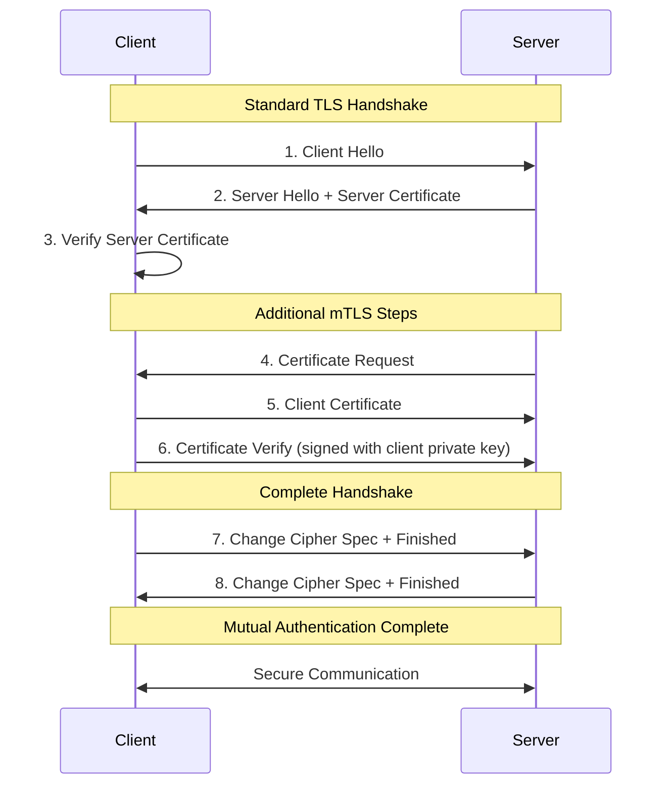

## mTLS Spring Boot Configuration

### Server Configuration
```yaml
server:
  ssl:
    client-auth: need  # Require client certificates
    trust-store: classpath:client-truststore.p12
    trust-store-password: changeit
    trust-store-type: PKCS12
```

### Custom mTLS Validation
```java
@Component
public class MutualTLSValidator {
    
    @EventListener
    public void handleSSLHandshakeCompleted(SSLHandshakeCompletedEvent event) {
        try {
            Certificate[] clientCerts = event.getPeerCertificates();
            if (clientCerts != null && clientCerts.length > 0) {
                X509Certificate clientCert = (X509Certificate) clientCerts[0];
                
                // Custom validation logic
                validateClientCertificate(clientCert);
                
                // Extract client identity
                String clientDN = clientCert.getSubjectDN().getName();
                log.info("Client authenticated: {}", clientDN);
            }
        } catch (Exception e) {
            log.error("Client certificate validation failed", e);
        }
    }
    
    private void validateClientCertificate(X509Certificate cert) throws CertificateException {
        // Check validity period
        cert.checkValidity();
        
        // Validate certificate chain
        // Custom business logic validation
        String cn = getCommonName(cert.getSubjectDN().getName());
        if (!isAuthorizedClient(cn)) {
            throw new CertificateException("Client not authorized: " + cn);
        }
    }
    
    private String getCommonName(String dn) {
        return Arrays.stream(dn.split(","))
            .filter(part -> part.trim().startsWith("CN="))
            .findFirst()
            .map(part -> part.substring(3))
            .orElse("");
    }
    
    private boolean isAuthorizedClient(String commonName) {
        // Implement your authorization logic
        List<String> authorizedClients = Arrays.asList(
            "client-app-1", "client-app-2", "admin-client"
        );
        return authorizedClients.contains(commonName);
    }
}
```

# Database SSL/TLS Configuration

## MySQL SSL Configuration

### Spring Boot Configuration
```yaml
spring:
  datasource:
    url: jdbc:mysql://localhost:3306/mydb?useSSL=true&requireSSL=true&verifyServerCertificate=true&trustCertificateKeyStoreUrl=file:mysql-truststore.jks&trustCertificateKeyStorePassword=changeit
    username: user
    password: password
    
# Alternative configuration using individual properties
  datasource:
    url: jdbc:mysql://localhost:3306/mydb
    username: user
    password: password
    hikari:
      data-source-properties:
        useSSL: true
        requireSSL: true
        verifyServerCertificate: true
        clientCertificateKeyStoreUrl: file:client-keystore.p12
        clientCertificateKeyStorePassword: changeit
        trustCertificateKeyStoreUrl: file:mysql-truststore.p12
        trustCertificateKeyStorePassword: changeit
```

### MySQL Server Certificate Setup
```bash
# Generate CA private key
openssl genrsa 2048 > ca-key.pem

# Generate CA certificate
openssl req -new -x509 -nodes -days 3600 -key ca-key.pem -out ca.pem

# Generate server private key
openssl req -newkey rsa:2048 -days 3600 -nodes -keyout server-key.pem -out server-req.pem

# Generate server certificate signed by CA
openssl rsa -in server-key.pem -out server-key.pem
openssl x509 -req -in server-req.pem -days 3600 -CA ca.pem -CAkey ca-key.pem -set_serial 01 -out server-cert.pem
```

## PostgreSQL SSL Configuration

```yaml
spring:
  datasource:
    url: jdbc:postgresql://localhost:5432/mydb?ssl=true&sslmode=require&sslcert=client-cert.pem&sslkey=client-key.pk8&sslrootcert=server-ca.pem
    username: user
    password: password
```

## Oracle Database SSL Configuration

```yaml
spring:
  datasource:
    url: jdbc:oracle:thin:@(DESCRIPTION=(ADDRESS=(PROTOCOL=tcps)(HOST=localhost)(PORT=2484))(CONNECT_DATA=(SERVICE_NAME=ORCL)))
    username: user
    password: password
    hikari:
      data-source-properties:
        javax.net.ssl.trustStore: /path/to/truststore.jks
        javax.net.ssl.trustStorePassword: changeit
        javax.net.ssl.keyStore: /path/to/keystore.jks
        javax.net.ssl.keyStorePassword: changeit
```

# Message Queue SSL/TLS Configuration

## Apache Kafka SSL Configuration

### Producer Configuration
```java
@Configuration
public class KafkaProducerSSLConfig {
    
    @Bean
    public ProducerFactory<String, String> producerFactory() {
        Map<String, Object> configProps = new HashMap<>();
        
        // Basic Kafka configuration
        configProps.put(ProducerConfig.BOOTSTRAP_SERVERS_CONFIG, "kafka1:9093,kafka2:9093");
        configProps.put(ProducerConfig.KEY_SERIALIZER_CLASS_CONFIG, StringSerializer.class);
        configProps.put(ProducerConfig.VALUE_SERIALIZER_CLASS_CONFIG, StringSerializer.class);
        
        // SSL Configuration
        configProps.put(CommonClientConfigs.SECURITY_PROTOCOL_CONFIG, "SSL");
        configProps.put(SslConfigs.SSL_PROTOCOL_CONFIG, "TLSv1.2");
        
        // Keystore (client certificate)
        configProps.put(SslConfigs.SSL_KEYSTORE_LOCATION_CONFIG, "/path/to/kafka-client.keystore.jks");
        configProps.put(SslConfigs.SSL_KEYSTORE_PASSWORD_CONFIG, "keystore-password");
        configProps.put(SslConfigs.SSL_KEY_PASSWORD_CONFIG, "key-password");
        configProps.put(SslConfigs.SSL_KEYSTORE_TYPE_CONFIG, "JKS");
        
        // Truststore (trusted CA certificates)
        configProps.put(SslConfigs.SSL_TRUSTSTORE_LOCATION_CONFIG, "/path/to/kafka.truststore.jks");
        configProps.put(SslConfigs.SSL_TRUSTSTORE_PASSWORD_CONFIG, "truststore-password");
        configProps.put(SslConfigs.SSL_TRUSTSTORE_TYPE_CONFIG, "JKS");
        
        // Hostname verification
        configProps.put(SslConfigs.SSL_ENDPOINT_IDENTIFICATION_ALGORITHM_CONFIG, "https");
        
        return new DefaultKafkaProducerFactory<>(configProps);
    }
}
```

### SASL_SSL with SCRAM Configuration
```java
@Configuration
public class KafkaSASLSSLConfig {
    
    @Bean
    public ConsumerFactory<String, String> consumerFactory() {
        Map<String, Object> configProps = new HashMap<>();
        
        configProps.put(ConsumerConfig.BOOTSTRAP_SERVERS_CONFIG, "kafka1:9093");
        configProps.put(ConsumerConfig.GROUP_ID_CONFIG, "my-consumer-group");
        
        // SASL_SSL Configuration
        configProps.put(CommonClientConfigs.SECURITY_PROTOCOL_CONFIG, "SASL_SSL");
        configProps.put(SaslConfigs.SASL_MECHANISM, "SCRAM-SHA-256");
        configProps.put(SaslConfigs.SASL_JAAS_CONFIG, 
            "org.apache.kafka.common.security.scram.ScramLoginModule required " +
            "username=\"kafka-client\" " +
            "password=\"client-password\";");
        
        // SSL Configuration for encrypted transport
        configProps.put(SslConfigs.SSL_TRUSTSTORE_LOCATION_CONFIG, "/path/to/truststore.jks");
        configProps.put(SslConfigs.SSL_TRUSTSTORE_PASSWORD_CONFIG, "truststore-password");
        
        return new DefaultKafkaConsumerFactory<>(configProps);
    }
}
```

## RabbitMQ SSL Configuration

```yaml
spring:
  rabbitmq:
    host: rabbitmq-server
    port: 5671  # SSL port
    username: user
    password: password
    ssl:
      enabled: true
      key-store: classpath:client-keystore.p12
      key-store-password: changeit
      key-store-type: PKCS12
      trust-store: classpath:rabbitmq-truststore.p12
      trust-store-password: changeit
      trust-store-type: PKCS12
      algorithm: TLSv1.2
      verify-hostname: true
```

### Custom RabbitMQ SSL Configuration
```java
@Configuration
public class RabbitMQSSLConfig {
    
    @Bean
    public ConnectionFactory connectionFactory() throws Exception {
        ConnectionFactory factory = new ConnectionFactory();
        factory.setHost("rabbitmq-server");
        factory.setPort(5671);
        factory.setUsername("user");
        factory.setPassword("password");
        
        // SSL Context
        SSLContext sslContext = createSSLContext();
        factory.useSslProtocol(sslContext);
        
        return factory;
    }
    
    private SSLContext createSSLContext() throws Exception {
        // Load client keystore
        KeyStore keyStore = KeyStore.getInstance("PKCS12");
        keyStore.load(new FileInputStream("client-keystore.p12"), "changeit".toCharArray());
        
        KeyManagerFactory kmf = KeyManagerFactory.getInstance(KeyManagerFactory.getDefaultAlgorithm());
        kmf.init(keyStore, "changeit".toCharArray());
        
        // Load truststore
        KeyStore trustStore = KeyStore.getInstance("PKCS12");
        trustStore.load(new FileInputStream("rabbitmq-truststore.p12"), "changeit".toCharArray());
        
        TrustManagerFactory tmf = TrustManagerFactory.getInstance(TrustManagerFactory.getDefaultAlgorithm());
        tmf.init(trustStore);
        
        SSLContext sslContext = SSLContext.getInstance("TLSv1.2");
        sslContext.init(kmf.getKeyManagers(), tmf.getTrustManagers(), null);
        
        return sslContext;
    }
}
```

# Redis SSL/TLS Configuration

## Redis SSL with Spring Boot

```yaml
spring:
  redis:
    ssl: true
    host: redis-server
    port: 6380  # SSL port
    password: redis-password
    timeout: 2000ms
    
    # Custom SSL configuration
    jedis:
      pool:
        max-active: 8
        max-idle: 8
        min-idle: 0
        max-wait: -1ms
```

### Custom Redis SSL Configuration
```java
@Configuration
public class RedisSSLConfig {
    
    @Bean
    public LettuceConnectionFactory redisConnectionFactory() throws Exception {
        
        // SSL Configuration
        SslOptions sslOptions = SslOptions.builder()
            .trustManager(getTrustManagerFactory())
            .keyManager(getKeyManagerFactory())
            .build();
            
        ClientOptions clientOptions = ClientOptions.builder()
            .sslOptions(sslOptions)
            .build();
            
        LettuceClientConfiguration clientConfig = LettuceClientConfiguration.builder()
            .clientOptions(clientOptions)
            .commandTimeout(Duration.ofSeconds(2))
            .build();
            
        RedisStandaloneConfiguration serverConfig = new RedisStandaloneConfiguration();
        serverConfig.setHostName("redis-server");
        serverConfig.setPort(6380);
        serverConfig.setPassword("redis-password");
        
        return new LettuceConnectionFactory(serverConfig, clientConfig);
    }
    
    private TrustManagerFactory getTrustManagerFactory() throws Exception {
        KeyStore trustStore = KeyStore.getInstance("PKCS12");
        trustStore.load(new FileInputStream("redis-truststore.p12"), "changeit".toCharArray());
        
        TrustManagerFactory factory = TrustManagerFactory.getInstance(
            TrustManagerFactory.getDefaultAlgorithm());
        factory.init(trustStore);
        return factory;
    }
    
    private KeyManagerFactory getKeyManagerFactory() throws Exception {
        KeyStore keyStore = KeyStore.getInstance("PKCS12");
        keyStore.load(new FileInputStream("redis-keystore.p12"), "changeit".toCharArray());
        
        KeyManagerFactory factory = KeyManagerFactory.getInstance(
            KeyManagerFactory.getDefaultAlgorithm());
        factory.init(keyStore, "changeit".toCharArray());
        return factory;
    }
}
```

# Certificate Lifecycle Management

## Certificate Creation Workflow

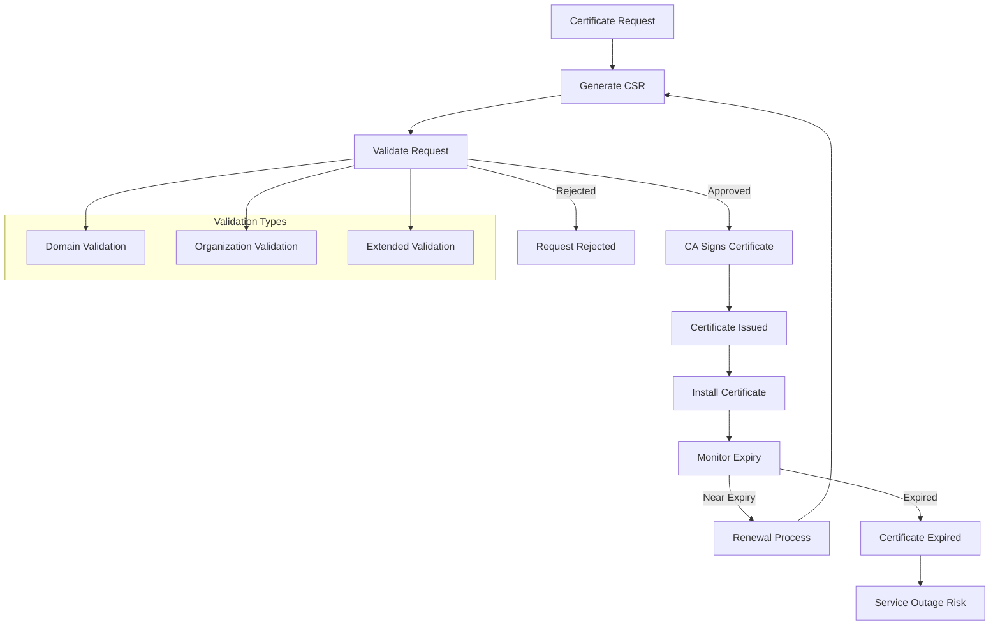

## Certificate Renewal Strategies

### Automated Renewal with Let's Encrypt
```bash
# Install certbot
sudo apt-get install certbot

# Obtain certificate
sudo certbot certonly --webroot -w /var/www/html -d example.com -d www.example.com

# Automatic renewal (cron job)
0 12 * * * /usr/bin/certbot renew --quiet

# Renewal with hooks
sudo certbot renew --pre-hook "systemctl stop nginx" --post-hook "systemctl start nginx"
```

### Spring Boot Certificate Rotation
```java
@Component
@Slf4j
public class CertificateRotationService {
    
    private final SSLContext sslContext;
    private final ApplicationEventPublisher eventPublisher;
    
    @Scheduled(fixedRate = 3600000) // Check every hour
    public void checkCertificateExpiry() {
        try {
            KeyStore keyStore = loadKeystore();
            Enumeration<String> aliases = keyStore.aliases();
            
            while (aliases.hasMoreElements()) {
                String alias = aliases.nextElement();
                X509Certificate cert = (X509Certificate) keyStore.getCertificate(alias);
                
                if (isCertificateExpiring(cert, 30)) { // 30 days warning
                    log.warn("Certificate {} expires on: {}", alias, cert.getNotAfter());
                    eventPublisher.publishEvent(new CertificateExpiryWarningEvent(alias, cert));
                }
                
                if (isCertificateExpiring(cert, 7)) { // 7 days critical
                    log.error("Certificate {} expires soon: {}", alias, cert.getNotAfter());
                    eventPublisher.publishEvent(new CertificateExpiryCriticalEvent(alias, cert));
                }
            }
        } catch (Exception e) {
            log.error("Error checking certificate expiry", e);
        }
    }
    
    private boolean isCertificateExpiring(X509Certificate cert, int daysThreshold) {
        Date expiryDate = cert.getNotAfter();
        Date thresholdDate = Date.from(
            Instant.now().plus(daysThreshold, ChronoUnit.DAYS)
        );
        return expiryDate.before(thresholdDate);
    }
    
    @EventListener
    public void handleCertificateExpiry(CertificateExpiryWarningEvent event) {
        // Send notifications to administrators
        // Trigger certificate renewal process
        // Update monitoring dashboards
    }
    
    private KeyStore loadKeystore() throws Exception {
        KeyStore keyStore = KeyStore.getInstance("PKCS12");
        try (InputStream is = new FileInputStream("keystore.p12")) {
            keyStore.load(is, "changeit".toCharArray());
        }
        return keyStore;
    }
}
```

# Common SSL/TLS Issues and Troubleshooting

## Certificate Validation Errors

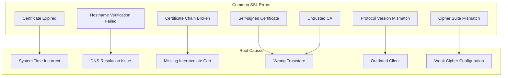

## Debugging SSL Issues

### Enable SSL Debug Logging
```java
// JVM system properties for SSL debugging
System.setProperty("javax.net.debug", "ssl:handshake:verbose");
System.setProperty("javax.net.debug", "ssl,handshake,data,trustmanager");

// Spring Boot logging configuration
logging:
  level:
    javax.net.ssl: DEBUG
    org.apache.http.conn.ssl: DEBUG
    org.springframework.web.client: DEBUG
```

### SSL Testing Tools
```bash
# Test SSL connection with OpenSSL
openssl s_client -connect api.example.com:443 -servername api.example.com

# Test with specific TLS version
openssl s_client -connect api.example.com:443 -tls1_2

# Test certificate chain
openssl s_client -connect api.example.com:443 -showcerts

# Verify certificate against CA bundle
openssl verify -CAfile ca-bundle.crt certificate.crt

# Check certificate dates
openssl x509 -in certificate.crt -noout -dates

# Test mutual TLS
openssl s_client -connect api.example.com:443 -cert client.crt -key client.key
```

### Java SSL Diagnostics
```java
@Component
public class SSLDiagnostics {
    
    public void diagnoseTLSConnection(String hostname, int port) {
        try {
            SSLSocketFactory factory = (SSLSocketFactory) SSLSocketFactory.getDefault();
            SSLSocket socket = (SSLSocket) factory.createSocket(hostname, port);
            
            // Start handshake
            socket.startHandshake();
            
            // Get session information
            SSLSession session = socket.getSession();
            
            log.info("SSL Session Information:");
            log.info("Protocol: {}", session.getProtocol());
            log.info("Cipher Suite: {}", session.getCipherSuite());
            log.info("Peer Host: {}", session.getPeerHost());
            
            // Get certificate information
            Certificate[] certs = session.getPeerCertificates();
            for (Certificate cert : certs) {
                if (cert instanceof X509Certificate) {
                    X509Certificate x509 = (X509Certificate) cert;
                    log.info("Certificate Subject: {}", x509.getSubjectDN());
                    log.info("Certificate Issuer: {}", x509.getIssuerDN());
                    log.info("Valid From: {}", x509.getNotBefore());
                    log.info("Valid Until: {}", x509.getNotAfter());
                }
            }
            
            socket.close();
            
        } catch (Exception e) {
            log.error("SSL connection failed", e);
        }
    }
    
    public void validateCertificateChain(String keystorePath, String password, String alias) {
        try {
            KeyStore keyStore = KeyStore.getInstance("PKCS12");
            keyStore.load(new FileInputStream(keystorePath), password.toCharArray());
            
            Certificate[] chain = keyStore.getCertificateChain(alias);
            if (chain == null) {
                log.error("No certificate chain found for alias: {}", alias);
                return;
            }
            
            for (int i = 0; i < chain.length; i++) {
                X509Certificate cert = (X509Certificate) chain[i];
                log.info("Certificate {}: {}", i, cert.getSubjectDN());
                
                // Validate certificate
                try {
                    cert.checkValidity();
                    log.info("Certificate {} is valid", i);
                } catch (CertificateExpiredException e) {
                    log.error("Certificate {} has expired", i);
                } catch (CertificateNotYetValidException e) {
                    log.error("Certificate {} is not yet valid", i);
                }
                
                // Verify chain
                if (i < chain.length - 1) {
                    try {
                        cert.verify(chain[i + 1].getPublicKey());
                        log.info("Certificate {} verified by certificate {}", i, i + 1);
                    } catch (Exception e) {
                        log.error("Certificate {} verification failed", i, e);
                    }
                }
            }
            
        } catch (Exception e) {
            log.error("Certificate chain validation failed", e);
        }
    }
}
```

# Security Best Practices

## Certificate Security Guidelines

### ✅ Best Practices

1. **Use Strong Key Sizes**
   - RSA: Minimum 2048 bits, prefer 3072 or 4096 bits
   - ECC: Minimum 256 bits (equivalent to RSA 3072)

2. **Implement Proper Certificate Validation**
   ```java
   // Always verify hostname
   HttpsURLConnection.setDefaultHostnameVerifier(
       HttpsURLConnection.getDefaultHostnameVerifier()
   );
   
   // Don't disable certificate validation in production
   // NEVER do this in production:
   // HttpsURLConnection.setDefaultHostnameVerifier((hostname, session) -> true);
   ```

3. **Use Modern TLS Versions**
   ```yaml
   # Disable weak protocols
   server:
     ssl:
       enabled-protocols: [TLSv1.2, TLSv1.3]
       ciphers:
         - TLS_AES_256_GCM_SHA384
         - TLS_CHACHA20_POLY1305_SHA256
         - TLS_AES_128_GCM_SHA256
         - ECDHE-RSA-AES256-GCM-SHA384
   ```

4. **Regular Certificate Rotation**
   - Implement automated certificate renewal
   - Monitor certificate expiry dates
   - Use shorter certificate validity periods (90 days with Let's Encrypt)

5. **Secure Key Storage**
   - Use HSMs (Hardware Security Modules) for high-security environments
   - Encrypt keystores with strong passwords
   - Limit access to private keys
   - Use separate keystores for different services

### ❌ Security Anti-Patterns

1. **Never Disable Certificate Validation**
   ```java
   // DON'T DO THIS - Security vulnerability
   TrustManager[] trustAllCerts = new TrustManager[] {
       new X509TrustManager() {
           public X509Certificate[] getAcceptedIssuers() { return null; }
           public void checkClientTrusted(X509Certificate[] certs, String authType) { }
           public void checkServerTrusted(X509Certificate[] certs, String authType) { }
       }
   };
   ```

2. **Avoid Weak Cryptographic Settings**
   - Don't use SSL 3.0, TLS 1.0, or TLS 1.1
   - Avoid weak cipher suites (RC4, DES, MD5)
   - Don't use RSA keys smaller than 2048 bits

3. **Don't Ignore Certificate Warnings**
   - Always investigate certificate validation failures
   - Don't suppress SSL warnings in logs
   - Implement proper error handling for SSL failures

## Production Security Checklist

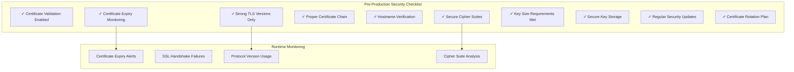

# Enterprise Certificate Management

## PKI (Public Key Infrastructure) Overview

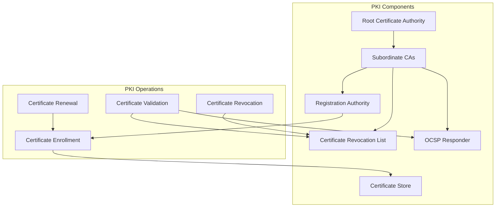

## Automated Certificate Management

### HashiCorp Vault PKI
```java
@Service
public class VaultCertificateService {
    
    private final VaultTemplate vaultTemplate;
    
    public CertificateBundle generateCertificate(String commonName, List<String> altNames) {
        Map<String, Object> request = Map.of(
            "common_name", commonName,
            "alt_names", String.join(",", altNames),
            "ttl", "8760h", // 1 year
            "format", "pem_bundle"
        );
        
        VaultResponse response = vaultTemplate.write("pki/issue/server-role", request);
        Map<String, Object> data = response.getData();
        
        return CertificateBundle.builder()
            .certificate((String) data.get("certificate"))
            .privateKey((String) data.get("private_key"))
            .caChain((String) data.get("ca_chain"))
            .serialNumber((String) data.get("serial_number"))
            .build();
    }
    
    public void revokeCertificate(String serialNumber) {
        Map<String, Object> request = Map.of("serial_number", serialNumber);
        vaultTemplate.write("pki/revoke", request);
    }
}
```

### AWS Certificate Manager Integration
```java
@Service
public class ACMCertificateService {
    
    private final AWSCertificateManager acmClient;
    
    public String requestCertificate(String domainName, List<String> subjectAlternativeNames) {
        RequestCertificateRequest request = new RequestCertificateRequest()
            .withDomainName(domainName)
            .withSubjectAlternativeNames(subjectAlternativeNames)
            .withValidationMethod(ValidationMethod.DNS)
            .withCertificateTransparencyLoggingPreference(
                CertificateTransparencyLoggingPreference.ENABLED
            );
        
        RequestCertificateResult result = acmClient.requestCertificate(request);
        return result.getCertificateArn();
    }
    
    public CertificateDetail getCertificateDetails(String certificateArn) {
        DescribeCertificateRequest request = new DescribeCertificateRequest()
            .withCertificateArn(certificateArn);
            
        DescribeCertificateResult result = acmClient.describeCertificate(request);
        return result.getCertificate();
    }
}
```

---

This comprehensive guide provides a solid foundation for understanding SSL/TLS certificates, keystores, truststores, and related security concepts. It covers both theoretical knowledge and practical implementation details that every software developer should know for working with secure applications in enterprise environments.