

## Introduction to SSL/TLS and Certificate Management
Any secured info, like user id and password cannot be sent over internet in plain text (json serialization) as it can be converted from binary to json and can be easily read by anyone who has access to the network traffic. 

To protect this sensitive information, we use **SSL/TLS** (Secure Sockets Layer / Transport Layer Security) protocols, which encrypt the data during transmission.

**SSL/TLS certificates** and **certificate management** are fundamental security concepts that every software developer should understand. 

> See the [Spring Boot SSL/TLS Configuration Guide]() for practical Java code examples.

## Why This Matters for Developers

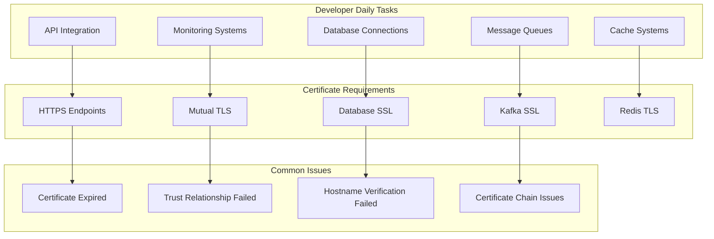
```mermaid
flowchart TB
    subgraph DailyTasks ["Developer Daily Tasks"]
        API[API Integration]
        DB[Database Connections]
        MSG[Message Queues]
        CACHE[Cache Systems]
        MONITOR[Monitoring Systems]
    end
    
    subgraph CertReqs ["Certificate Requirements"]
        HTTPS[HTTPS Endpoints]
        MUTUAL[Mutual TLS]
        DB_SSL[Database SSL]
        KAFKA_SSL[Kafka SSL]
        REDIS_TLS[Redis TLS]
    end
    
    API --> HTTPS
    DB --> DB_SSL
    MSG --> KAFKA_SSL
    CACHE --> REDIS_TLS
    MONITOR --> MUTUAL
    
    subgraph CommonIssues ["Common Issues"]
        CERT_EXP[Certificate Expired]
        TRUST_ERR[Trust Relationship Failed]
        HOSTNAME[Hostname Verification Failed]
        CHAIN_ERR[Certificate Chain Issues]
    end
    
    HTTPS --> CERT_EXP
    MUTUAL --> TRUST_ERR
    DB_SSL --> HOSTNAME
    KAFKA_SSL --> CHAIN_ERR
```
# Fundamental Cryptographic Concepts
Symmetric Encryption and Asymmetric Encryption are the two main types of encryption used in SSL/TLS. In symmetric encryption, the same key is used for both encryption and decryption,
while in asymmetric encryption, a public key is used for encryption and a private key is used for decryption.

## Public Key Cryptography (Asymmetric Encryption)
where a public-private key pair is used for encryption and decryption. The public key is shared openly, while the private key is kept secret. This allows for secure communication and digital signatures.

### Key Concepts:
- **Private Key**: Secret key that must be protected, used for decryption and signing
- **Public Key**: Openly shared key used for encryption and signature verification
- **Key Pair**: Mathematically related private and public keys
- **Digital Signature**: Cryptographic proof of authenticity and integrity

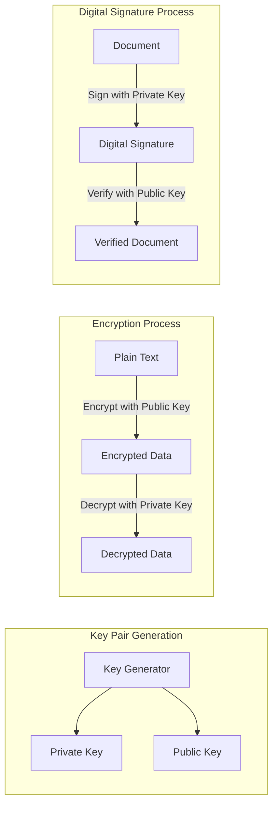
```mermaid
flowchart LR
    subgraph KeyGen ["Key Pair Generation"]
        KEYGEN[Key Generator]
        PRIVATE[Private Key]
        PUBLIC[Public Key]
    end
    
    subgraph EncProc ["Encryption Process"]
        PLAINTEXT[Plain Text]
        ENCRYPTED[Encrypted Data]
        DECRYPTED[Decrypted Data]
    end
    
    KEYGEN --> PRIVATE
    KEYGEN --> PUBLIC
    
    PLAINTEXT -->|Encrypt with Public Key| ENCRYPTED
    ENCRYPTED -->|Decrypt with Private Key| DECRYPTED
    
    subgraph DigSig ["Digital Signature Process "]
        DOCUMENT[Document]
        SIGNATURE[Digital Signature]
        VERIFIED[Verified Document]
    end
    
    DOCUMENT -->|Sign with Private Key| SIGNATURE
    SIGNATURE -->|Verify with Public Key| VERIFIED
```


### Symmetric vs Asymmetric Encryption Comparison

| Aspect               | Symmetric Encryption              | Asymmetric Encryption                  |
|:---------------------|:----------------------------------|:---------------------------------------|
| **Keys**             | Single shared key                 | Key pair (public + private)            |
| **Speed**            | Very fast                         | Slower (computationally intensive)     |
| **Key Distribution** | Difficult (secure channel needed) | Easy (public key can be shared openly) |
| **Use Case**         | Bulk data encryption              | Key exchange, digital signatures       |
| **Examples**         | AES, DES, 3DES                    | RSA, ECC, DSA                          |
| **Key Length**       | 128, 192, 256 bits                | 2048, 3072, 4096 bits (RSA)            |

# SSL/TLS Protocol Deep Dive

## SSL/TLS Handshake Process

```mermaid
sequenceDiagram
    participant Client
    participant Server
    participant CA as Certificate Authority
    
    Client->>Server: 1. Client Hello (supported ciphers, TLS version)
    Server->>Client: 2. Server Hello (selected cipher, TLS version)
    Server->>Client: 3. Server Certificate (public key + CA signature)
    Server->>Client: 4. Server Hello Done
    
    Note over Client: Verify server certificate with CA
    Client->>CA: Validate certificate chain
    CA-->>Client: Certificate validation response
    
    Client->>Server: 5. Client Key Exchange (pre-master secret encrypted with server's public key)
    Client->>Server: 6. Change Cipher Spec
    Client->>Server: 7. Client Finished (encrypted with session key)
    
    Server->>Client: 8. Change Cipher Spec  
    Server->>Client: 9. Server Finished (encrypted with session key)
    
    Note over Client,Server: Secure communication using symmetric encryption
    Client<->>Server: Application Data (encrypted)
```

## TLS Versions and Evolution

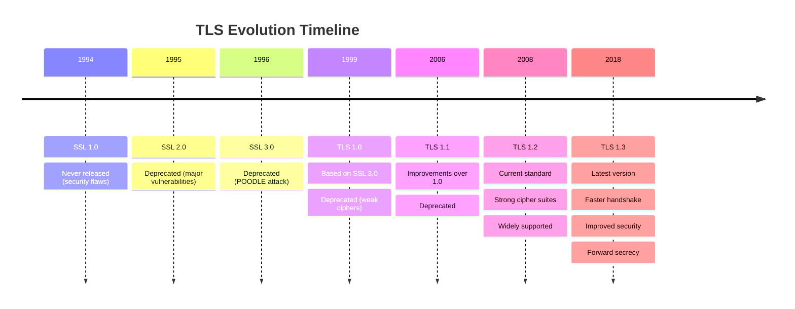
```mermaid
timeline
    title TLS Evolution Timeline
    
    1994 : SSL 1.0
         : Never released (security flaws)
    
    1995 : SSL 2.0
         : Deprecated (major vulnerabilities)
    
    1996 : SSL 3.0
         : Deprecated (POODLE attack)
    
    1999 : TLS 1.0
         : Based on SSL 3.0
         : Deprecated (weak ciphers)
    
    2006 : TLS 1.1
         : Improvements over 1.0
         : Deprecated
    
    2008 : TLS 1.2
         : Current standard
         : Strong cipher suites
         : Widely supported
    
    2018 : TLS 1.3
         : Latest version
         : Faster handshake
         : Improved security
         : Forward secrecy
```

# Digital Certificates Explained

## What is a Digital Certificate?

A **digital certificate** is an electronic document that uses a **digital signature** to bind a **public key** with an **identity** (person, organization, or device).

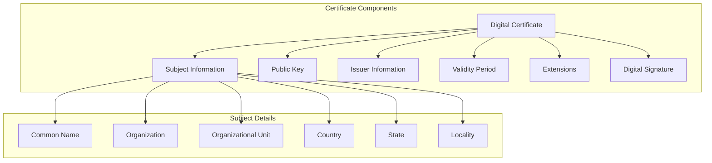
```mermaid
flowchart TB
    subgraph CertComp ["Certificate Components"]
        CERT[Digital Certificate]
        SUBJECT[Subject Information]
        PUBKEY[Public Key]
        ISSUER[Issuer Information]  
        VALIDITY[Validity Period]
        EXTENSIONS[Extensions]
        SIGNATURE[Digital Signature]
    end
    
    CERT --> SUBJECT
    CERT --> PUBKEY
    CERT --> ISSUER
    CERT --> VALIDITY
    CERT --> EXTENSIONS
    CERT --> SIGNATURE
    
    subgraph SubjDetails ["Subject Details"]
        CN[Common Name]
        O[Organization]
        OU[Organizational Unit]
        C[Country]
        ST[State]
        L[Locality]
    end
    
    SUBJECT --> CN
    SUBJECT --> O
    SUBJECT --> OU
    SUBJECT --> C
    SUBJECT --> ST
    SUBJECT --> L
```

## Certificate Fields Breakdown

### Subject Information
```
Subject: CN=api.example.com, O=Example Corp, OU=IT Department, L=San Francisco, ST=California, C=US
```

- **CN (Common Name)**: The hostname or service name the certificate protects
- **O (Organization)**: Legal name of the organization
- **OU (Organizational Unit)**: Department or division
- **L (Locality)**: City or locality
- **ST (State)**: State or province
- **C (Country)**: Two-letter country code

### Issuer Information
```
Issuer: CN=DigiCert SHA2 Secure Server CA, O=DigiCert Inc, C=US
```

### Validity Period
```
Not Before: Jan 1, 2024 00:00:00 GMT
Not After: Jan 1, 2025 23:59:59 GMT
```

### Extensions (Critical for modern certificates)
- **Subject Alternative Names (SAN)**: Additional hostnames protected
- **Key Usage**: Allowed uses for the public key
- **Extended Key Usage**: Specific purposes (server auth, client auth)
- **Basic Constraints**: Whether this is a CA certificate

## Certificate Types and Use Cases

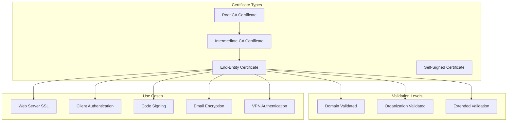
```mermaid
flowchart TB
    subgraph CertTypes ["Certificate Types"]
        ROOT[Root CA Certificate]
        INTER[Intermediate CA Certificate]
        LEAF[End-Entity Certificate]
        SELF[Self-Signed Certificate]
    end
    
    subgraph ValLevels ["Validation Levels"]
        DV[Domain Validated]
        OV[Organization Validated]
        EV[Extended Validation]
    end
    
    subgraph UseCases ["Use Cases"]
        WEB[Web Server SSL]
        CLIENT[Client Authentication]
        CODE[Code Signing]
        EMAIL[Email Encryption]
        VPN[VPN Authentication]
    end
    
    ROOT --> INTER
    INTER --> LEAF
    
    LEAF --> DV
    LEAF --> OV
    LEAF --> EV
    
    LEAF --> WEB
    LEAF --> CLIENT
    LEAF --> CODE
    LEAF --> EMAIL
    LEAF --> VPN
```

### Certificate Validation Levels

| Level | Validation Process | Trust Indicators | Use Case |
|:------|:-------------------|:-----------------|:---------|
| **Domain Validated (DV)** | Domain ownership only | Basic padlock | Development, personal sites |
| **Organization Validated (OV)** | Domain + organization verification | Organization name shown | Business websites |
| **Extended Validation (EV)** | Rigorous organization verification | Green address bar (legacy) | High-security sites |

# Certificate Authorities (CA) and Trust Chain

## Certificate Authority Hierarchy

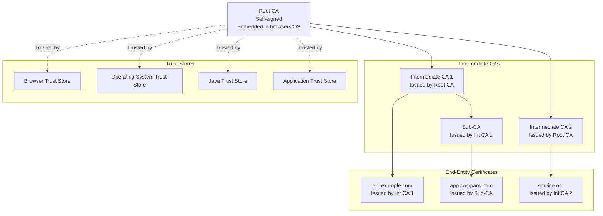
```mermaid
flowchart TB
    ROOT["Root CA<br/>Self-signed<br/>Embedded in browsers/OS"]
        
    subgraph IntermediateCAs ["Intermediate CAs"]
        INT1["Intermediate CA 1<br/>Issued by Root CA"]
        INT2["Intermediate CA 2<br/>Issued by Root CA"]
        SUB1["Sub-CA<br/>Issued by Int CA 1"]
    end
    
    subgraph EndEntity ["End-Entity Certificates"]
        WEB1["api.example.com<br/>Issued by Int CA 1"]
        WEB2["app.company.com<br/>Issued by Sub-CA"]
        WEB3["service.org<br/>Issued by Int CA 2"]
    end
    
    ROOT --> INT1
    ROOT --> INT2
    INT1 --> SUB1
    INT1 --> WEB1
    SUB1 --> WEB2
    INT2 --> WEB3
    
    subgraph TrustStores ["Trust Stores"]
        BROWSER[Browser Trust Store]
        OS[Operating System Trust Store]
        JAVA[Java Trust Store]
        CUSTOM[Application Trust Store]
    end
    
    ROOT -.->|Trusted by| BROWSER
    ROOT -.->|Trusted by| OS
    ROOT -.->|Trusted by| JAVA
    ROOT -.->|Trusted by| CUSTOM
```

## Certificate Chain Validation Process

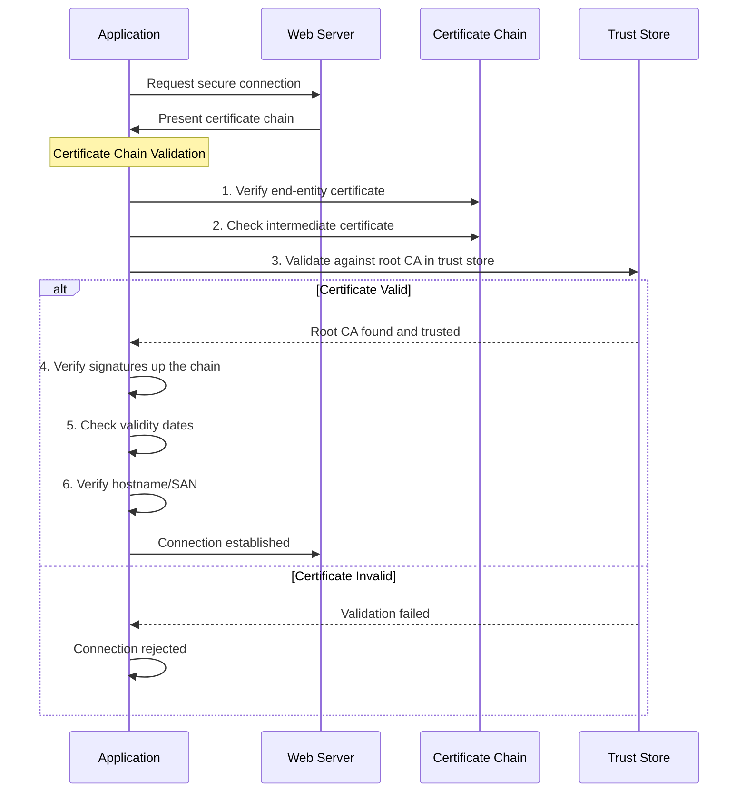
```mermaid
sequenceDiagram
    participant App as Application
    participant Server as Web Server
    participant Chain as Certificate Chain
    participant Trust as Trust Store
    
    App->>Server: Request secure connection
    Server->>App: Present certificate chain
    
    Note over App: Certificate Chain Validation
    App->>Chain: 1. Verify end-entity certificate
    App->>Chain: 2. Check intermediate certificate
    App->>Trust: 3. Validate against root CA in trust store
    
    alt Certificate Valid
        Trust-->>App: Root CA found and trusted
        App->>App: 4. Verify signatures up the chain
        App->>App: 5. Check validity dates
        App->>App: 6. Verify hostname/SAN
        App->>Server: Connection established
    else Certificate Invalid
        Trust-->>App: Validation failed
        App->>App: Connection rejected
    end
```

## Major Certificate Authorities

### Public CAs
- **DigiCert**: Enterprise-focused, high-security certificates
- **Let's Encrypt**: Free, automated certificates with 90-day validity
- **GlobalSign**: International CA with strong presence in Europe
- **Comodo/Sectigo**: Cost-effective certificates for various needs
- **GeoTrust**: Symantec subsidiary, now owned by DigiCert

### Private/Internal CAs
- **Microsoft Active Directory Certificate Services (ADCS)**
- **OpenSSL-based internal CAs**
- **HashiCorp Vault PKI**
- **AWS Certificate Manager Private CA**

# Java Keystores and Truststores

## Keystore vs Truststore Conceptual Difference

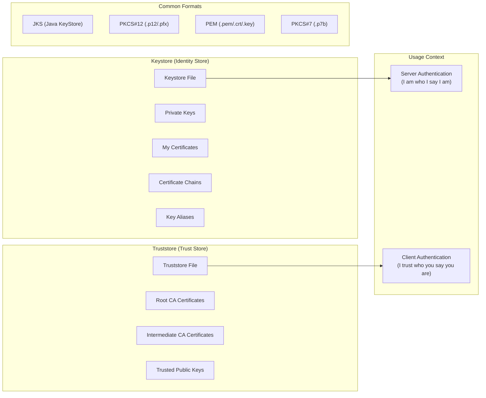
```mermaid
flowchart LR
    subgraph Keystore ["Keystore (Identity Store)"]
        KS[Keystore File]
        PRIV[Private Keys]
        CERT[My Certificates]
        CHAIN[Certificate Chains]
        ALIAS[Key Aliases]
    end
    
    subgraph Truststore ["Truststore (Trust Store)"]
        TS[Truststore File]
        ROOT_CA[Root CA Certificates]
        INT_CA[Intermediate CA Certificates]
        TRUSTED[Trusted Public Keys]
    end
    
    subgraph UsageContext ["Usage Context"]
        SERVER["Server Authentication<br/>(I am who I say I am)"]
        CLIENT["Client Authentication<br/>(I trust who you say you are)"]
    end
    
    KS --> SERVER
    TS --> CLIENT
    
    subgraph CommonFormats ["Common Formats"]
        JKS["JKS (Java KeyStore)"]
        PKCS12["PKCS#12 (.p12/.pfx)"]
        PEM["PEM (.pem/.crt/.key)"]
        P7B["PKCS#7 (.p7b)"]
    end
```

## Keystore Deep Dive

A **keystore** contains:
- **Private keys** (your identity)
- **Certificates** (your public key + identity info)
- **Certificate chains** (path to trusted root)

### Keystore Operations with keytool

```bash
# Generate a new key pair and certificate
keytool -genkeypair \
    -alias myserver \
    -keyalg RSA \
    -keysize 2048 \
    -validity 365 \
    -keystore server.jks \
    -storetype JKS \
    -dname "CN=api.mycompany.com,O=My Company,L=San Francisco,ST=CA,C=US"

# Generate Certificate Signing Request (CSR)
keytool -certreq \
    -alias myserver \
    -keystore server.jks \
    -file server.csr \
    -storepass changeit

# Import signed certificate from CA
keytool -importcert \
    -alias myserver \
    -keystore server.jks \
    -file server-signed.crt \
    -storepass changeit

# List all entries in keystore
keytool -list \
    -keystore server.jks \
    -storepass changeit \
    -v

# Export certificate (public key only)
keytool -exportcert \
    -alias myserver \
    -keystore server.jks \
    -file server-public.crt \
    -storepass changeit
```

## Truststore Deep Dive

A **truststore** contains:
- **Root CA certificates** (who you trust)
- **Intermediate CA certificates** (chain of trust)
- **Self-signed certificates** (explicitly trusted)

### Truststore Operations

```bash
# Import CA certificate into truststore
keytool -importcert \
    -alias digicert-root \
    -keystore truststore.jks \
    -file DigiCertRootCA.crt \
    -storepass changeit \
    -noprompt

# List trusted certificates
keytool -list \
    -keystore truststore.jks \
    -storepass changeit

# Remove a trusted certificate
keytool -delete \
    -alias old-ca \
    -keystore truststore.jks \
    -storepass changeit

# Import intermediate CA
keytool -importcert \
    -alias digicert-intermediate \
    -keystore truststore.jks \
    -file DigiCertIntermediateCA.crt \
    -storepass changeit
```

## Java Default Trust Store

```bash
# Location of Java's default truststore (cacerts)
$JAVA_HOME/lib/security/cacerts

# Default password: changeit

# List default trusted certificates
keytool -list -keystore $JAVA_HOME/lib/security/cacerts -storepass changeit

# Add certificate to system truststore (requires admin privileges)
sudo keytool -importcert \
    -alias my-internal-ca \
    -keystore $JAVA_HOME/lib/security/cacerts \
    -file internal-ca.crt \
    -storepass changeit
```

# Certificate File Formats

## Common Certificate Formats

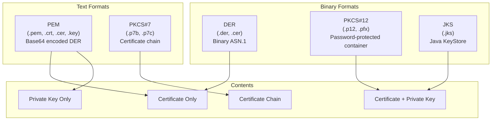
```mermaid
flowchart TB
    subgraph BinaryFormats ["Binary Formats"]
        DER["DER<br/>(.der, .cer)<br/>Binary ASN.1"]
        PKCS12["PKCS#12<br/>(.p12, .pfx)<br/>Password-protected container"]
        JKS["JKS<br/>(.jks)<br/>Java KeyStore"]
    end
    
    subgraph TextFormats ["Text Formats"]
        PEM["PEM<br/>(.pem, .crt, .cer, .key)<br/>Base64 encoded DER"]
        PKCS7["PKCS#7<br/>(.p7b, .p7c)<br/>Certificate chain"]
    end
    
    subgraph Contents ["Contents"]
        CERT_ONLY[Certificate Only]
        KEY_ONLY[Private Key Only]
        BOTH[Certificate + Private Key]
        CHAIN[Certificate Chain]
    end
    
    PEM --> CERT_ONLY
    PEM --> KEY_ONLY
    DER --> CERT_ONLY
    PKCS12 --> BOTH
    PKCS7 --> CHAIN
    JKS --> BOTH
```

## Format Conversion Examples

### Convert between formats
```bash
# PEM to DER
openssl x509 -in certificate.pem -outform DER -out certificate.der

# DER to PEM
openssl x509 -in certificate.der -inform DER -outform PEM -out certificate.pem

# PKCS#12 to PEM (extract certificate and private key)
openssl pkcs12 -in certificate.p12 -out certificate.pem -nodes

# PEM to PKCS#12 (combine certificate and private key)
openssl pkcs12 -export -out certificate.p12 -inkey private.key -in certificate.crt

# JKS to PKCS#12
keytool -importkeystore \
    -srckeystore keystore.jks \
    -destkeystore keystore.p12 \
    -deststoretype PKCS12

# Extract private key from PKCS#12
openssl pkcs12 -in certificate.p12 -nocerts -out private.key -nodes

# Extract certificate from PKCS#12
openssl pkcs12 -in certificate.p12 -nokeys -out certificate.crt
```

### View Certificate Information
```bash
# View PEM certificate details
openssl x509 -in certificate.pem -text -noout

# View certificate in keystore
keytool -list -v -keystore keystore.jks -alias myalias

# Check certificate expiry
openssl x509 -in certificate.pem -noout -dates

# Verify certificate chain
openssl verify -CAfile ca-bundle.crt certificate.crt

# Check certificate against private key
openssl x509 -noout -modulus -in certificate.crt | openssl md5
openssl rsa -noout -modulus -in private.key | openssl md5
```

# Certificate Lifecycle Management

## Certificate Creation Workflow

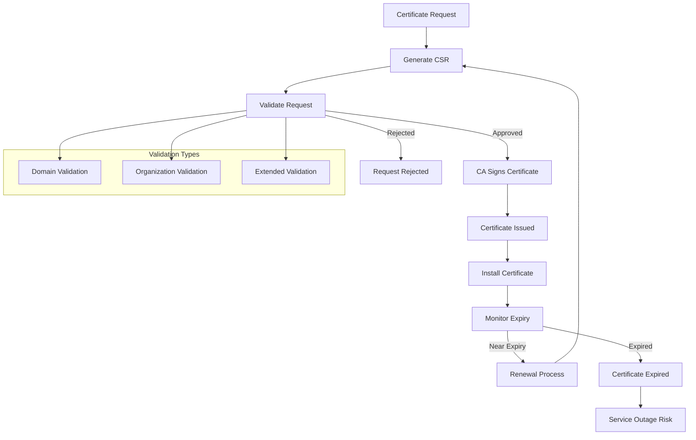
```mermaid
flowchart TD
    START[Certificate Request] --> CSR[Generate CSR]
    CSR --> VALIDATE[Validate Request]
    VALIDATE -->|Approved| SIGN[CA Signs Certificate]
    VALIDATE -->|Rejected| REJECT[Request Rejected]
    SIGN --> ISSUE[Certificate Issued]
    ISSUE --> INSTALL[Install Certificate]
    INSTALL --> MONITOR[Monitor Expiry]
    MONITOR -->|Near Expiry| RENEW[Renewal Process]
    MONITOR -->|Expired| EXPIRED[Certificate Expired]
    RENEW --> CSR
    EXPIRED --> OUTAGE[Service Outage Risk]
    
    subgraph "Validation Types"
        DV[Domain Validation]
        OV[Organization Validation]  
        EV[Extended Validation]
    end
    
    VALIDATE --> DV
    VALIDATE --> OV
    VALIDATE --> EV
```

## Certificate Renewal Strategies

### Automated Renewal with Let's Encrypt
```bash
# Install certbot
sudo apt-get install certbot

# Obtain certificate
sudo certbot certonly --webroot -w /var/www/html -d example.com -d www.example.com

# Automatic renewal (cron job)
0 12 * * * /usr/bin/certbot renew --quiet

# Renewal with hooks
sudo certbot renew --pre-hook "systemctl stop nginx" --post-hook "systemctl start nginx"
```

# Common SSL/TLS Issues and Troubleshooting

## Certificate Validation Errors

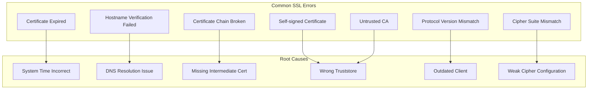
```mermaid
flowchart TB
    subgraph SSLErrors ["Common SSL Errors"]
        CERT_EXP[Certificate Expired]
        HOSTNAME[Hostname Verification Failed]
        CHAIN_ERR[Certificate Chain Broken]
        SELF_SIGNED[Self-signed Certificate]
        UNTRUSTED_CA[Untrusted CA]
        PROTOCOL[Protocol Version Mismatch]
        CIPHER[Cipher Suite Mismatch]
    end
    
    subgraph RootCauses ["Root Causes"]
        TIME_SYNC[System Time Incorrect]
        DNS_ISSUE[DNS Resolution Issue]
        MISSING_INTER[Missing Intermediate Cert]
        WRONG_TRUST[Wrong Truststore]
        OLD_CLIENT[Outdated Client]
        WEAK_CIPHER[Weak Cipher Configuration]
    end
    
    CERT_EXP --> TIME_SYNC
    HOSTNAME --> DNS_ISSUE
    CHAIN_ERR --> MISSING_INTER
    SELF_SIGNED --> WRONG_TRUST
    UNTRUSTED_CA --> WRONG_TRUST
    PROTOCOL --> OLD_CLIENT
    CIPHER --> WEAK_CIPHER
```

## Debugging SSL Issues

### SSL Testing Tools
```bash
# Test SSL connection with OpenSSL
openssl s_client -connect api.example.com:443 -servername api.example.com

# Test with specific TLS version
openssl s_client -connect api.example.com:443 -tls1_2

# Test certificate chain
openssl s_client -connect api.example.com:443 -showcerts

# Verify certificate against CA bundle
openssl verify -CAfile ca-bundle.crt certificate.crt

# Check certificate dates
openssl x509 -in certificate.crt -noout -dates

# Test mutual TLS
openssl s_client -connect api.example.com:443 -cert client.crt -key client.key
```

# Security Best Practices

## Certificate Security Guidelines

### ✅ Best Practices

1. **Use Strong Key Sizes**
   - RSA: Minimum 2048 bits, prefer 3072 or 4096 bits
   - ECC: Minimum 256 bits (equivalent to RSA 3072)

2. **Use Modern TLS Versions**
   - Enable only TLSv1.2 and TLSv1.3
   - Disable SSL 3.0, TLS 1.0, and TLS 1.1

3. **Regular Certificate Rotation**
   - Implement automated certificate renewal
   - Monitor certificate expiry dates
   - Use shorter certificate validity periods (90 days with Let's Encrypt)

4. **Secure Key Storage**
   - Use HSMs (Hardware Security Modules) for high-security environments
   - Encrypt keystores with strong passwords
   - Limit access to private keys
   - Use separate keystores for different services

### ❌ Security Anti-Patterns

1. **Never Disable Certificate Validation** in production
2. **Avoid Weak Cryptographic Settings**
   - Don't use SSL 3.0, TLS 1.0, or TLS 1.1
   - Avoid weak cipher suites (RC4, DES, MD5)
   - Don't use RSA keys smaller than 2048 bits
3. **Don't Ignore Certificate Warnings**
   - Always investigate certificate validation failures
   - Don't suppress SSL warnings in logs
   - Implement proper error handling for SSL failures

## Production Security Checklist

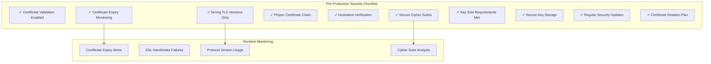
```mermaid
flowchart TB
    subgraph PreProdChecklist ["Pre-Production Security Checklist"]
        CHECK1["✓ Certificate Validation Enabled"]
        CHECK2["✓ Strong TLS Versions Only"]
        CHECK3["✓ Secure Cipher Suites"]
        CHECK4["✓ Proper Certificate Chain"]
        CHECK5["✓ Hostname Verification"]
        CHECK6["✓ Certificate Expiry Monitoring"]
        CHECK7["✓ Key Size Requirements Met"]
        CHECK8["✓ Secure Key Storage"]
        CHECK9["✓ Regular Security Updates"]
        CHECK10["✓ Certificate Rotation Plan"]
    end
    
    subgraph RuntimeMonitoring ["Runtime Monitoring"]
        MONITOR1[Certificate Expiry Alerts]
        MONITOR2[SSL Handshake Failures]
        MONITOR3[Protocol Version Usage]
        MONITOR4[Cipher Suite Analysis]
    end
    
    CHECK6 --> MONITOR1
    CHECK2 --> MONITOR3
    CHECK3 --> MONITOR4
```

---

This guide provides a solid foundation for understanding SSL/TLS certificates, keystores, truststores, and related security concepts.

**For practical Spring Boot implementation**, see the [Spring Boot SSL/TLS Configuration Guide]() which covers:
- Server and client SSL configuration
- Mutual TLS (mTLS) implementation
- Database, Kafka, RabbitMQ, and Redis SSL setup
- Certificate lifecycle management in Java
- SSL debugging and diagnostics

