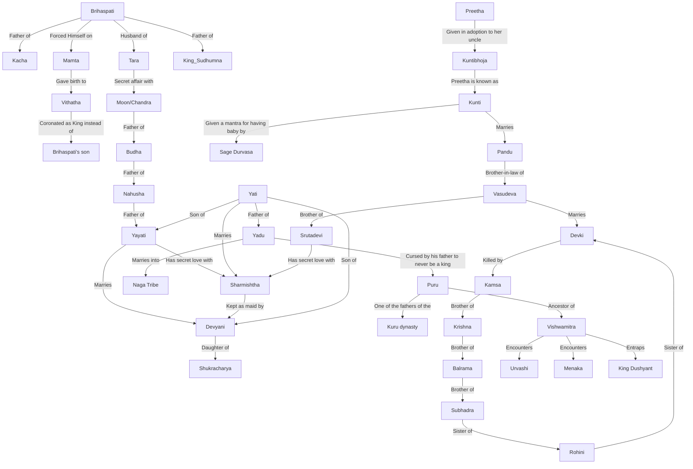

# The Family tree

Image 2:

# Mahabharata Family Tree

Generation 1

- Shantanu: Married to Ganga and later to Satyavati (Matsyagandhi)

Generation 2

- Bhishma (Devavrata): Son of Shantanu and Ganga
- Chitrangada: Son of Shantanu and Satyavati
- Vichitravirya: Son of Shantanu and Satyavati

Generation 3

- Ambika and Ambalika: Wives of Vichitravirya
- Vyasa (Krishna Dwaipayana): Son of Satyavati and Parashara

Generation 4

- Dhritarashtra: Son of Vyasa and Ambika
- Pandu: Son of Vyasa and Ambalika
- Vidura: Son of Vyasa and a maid

Generation 5

- Gandhari: Wife of Dhritarashtra
- Duryodhan, Dushashan, and 98 other sons, 1 daughter (Dushila)
- Kunti and Madri: Wives of Pandu
- Kunti's Children: Yudhishthira, Bhima, Arjuna
- Madri's Children: Nakul, Sahadeva

Krishna's Lineage

- Vasudeva and Devaki: Parents of Krishna, Balarama, and Subhadra

Additional Lineages and Connections

- Brihaspati and Tara: Parents of Budha
- Yayati: Ancestor of Puru and Yadu

