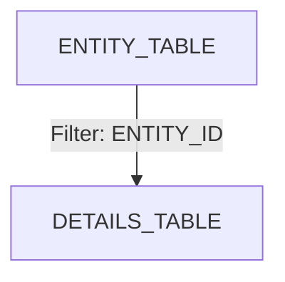
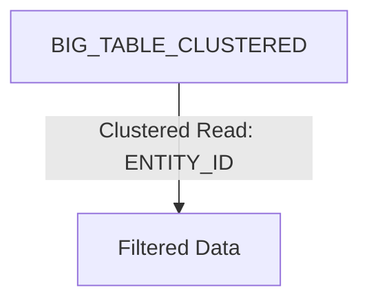
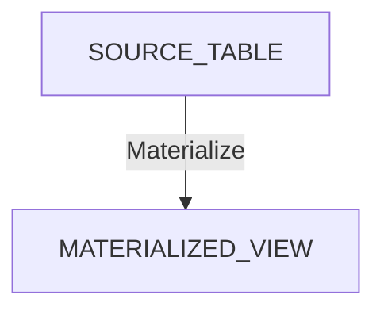
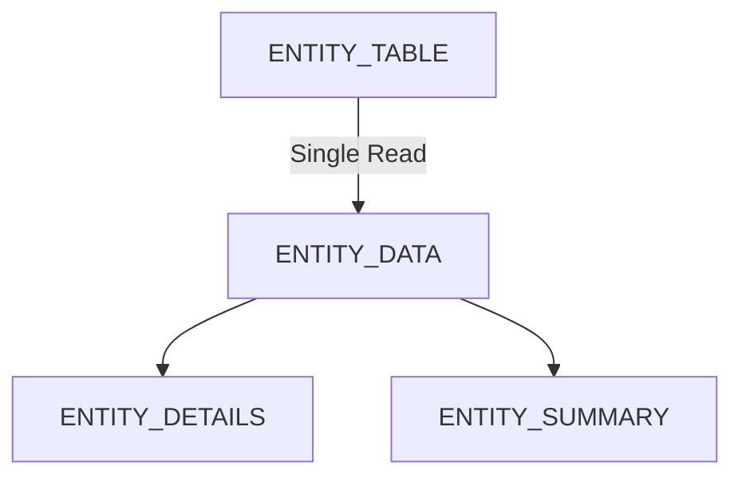



# Cluster Pruning
Cluster pruning refers to the optimization technique used in databases, particularly in distributed databases, 
to reduce the amount of data read from storage during query execution.

- It involves skipping unnecessary data blocks or partitions that do not contain relevant data for a given query.
- The goal is to minimize disk I/O and improve query performance by avoiding the need to read entire data sets.

In distributed databases, cluster pruning is often associated with query optimization strategies such as 
- predicate pushdown (where filters are applied as early as possible in the query execution process) and
- partition pruning (where unnecessary partitions are excluded from query processing based on query predicates).

# Partitioning
Partitioning involves dividing a large database table into smaller, more manageable parts called partitions.

Partitioning can be based on various criteria:

- **Range Partitioning**: Data is partitioned based on ranges of column values (e.g., dates).
- **Hash Partitioning**: Data is partitioned based on a hash function applied to a specific column.
- **List Partitioning**: Data is partitioned based on a list of discrete values.

# Sharding
Sharding is a technique used in distributed databases to **horizontally partition** data across multiple servers or nodes (shards). 
Each shard independently stores a subset of the data, and together they form a logical whole. 

Sharding is typically used to improve scalability and performance by distributing the workload across multiple machines, 
allowing for parallel processing of queries and transactions.

# Early data filtering
**Context**

Most analyzed data access patterns are entity-centric, where data is fetched by passing a unique identifier (e.g., ENTITY_ID) 
as a filter while running queries. 

However, only a few tables in the domain contain the same identifier, resulting in poor performance as data from multiple 
joined tables needs to be read and filtered after the join.

```sql
SELECT
  e.MASTER_IDENTIFIER,
  e.ENTITY_ID,
  d.DETAILS
FROM `project.dataset.ENTITY_TABLE` e
       JOIN `project.dataset.DETAILS_TABLE` d USING (ENTITY_ID)
WHERE e.MASTER_IDENTIFIER = '12345'
```

**Issues:**
- Only the ENTITY_TABLE is filtered by MASTER_IDENTIFIER.
- Other tables are joined without prior filtering.

**Solution**

Filter data earlier using a column present in all tables, such as ENTITY_ID.

```sql
SELECT
    e.MASTER_IDENTIFIER,
    e.ENTITY_ID,
    d.DETAILS
FROM `project.dataset.ENTITY_TABLE` e
JOIN `project.dataset.DETAILS_TABLE` d USING (ENTITY_ID) -- instead of MASTER_IDENTIFIER
WHERE e.ENTITY_ID = '67890';
```

called a **filter (or predicate) pushdown**, where filtering happens before the join.



# Cluster pruning
**Context**

Filter-pushdown allows processing less data in later stages, but does not reduce the initial amount of data read.

Reading all table data can become a bottleneck as data grows.

```sql
SELECT
    *
FROM `project.dataset.BIG_TABLE`
WHERE ENTITY_ID = '67890'
```
**Issue:**

The query reads the entire table before filtering.

**Solution**

Cluster the table on the ENTITY_ID column.

```sql
CREATE TABLE `project.dataset.BIG_TABLE_CLUSTERED`
CLUSTER BY ENTITY_ID AS
SELECT * FROM `project.dataset.BIG_TABLE`
```



# Data materialization
**Context**

Queries often use real-time data, leading to high computation costs as views are recalculated on each query execution.

**Solution**

Materialize data using scheduled queries or materialized views.

```sql
CREATE MATERIALIZED VIEW `project.dataset.MATERIALIZED_VIEW` AS
SELECT
    e.ENTITY_ID,
    e.ATTRIBUTE
FROM `project.dataset.SOURCE_TABLE` e
```


# Avoiding repeated reads and transformations
**Context**

Common Table Expressions (CTEs) can lead to repeated reads if not used carefully.

```sql
WITH entity_data AS (
    SELECT * FROM `project.dataset.ENTITY_TABLE`
),
entity_details AS (
    SELECT * FROM entity_data WHERE ENTITY_TYPE = 'TypeA'
),
entity_summary AS (
    SELECT * FROM entity_data WHERE ENTITY_TYPE = 'TypeB'
)

SELECT * FROM entity_details
UNION ALL
SELECT * FROM entity_summary
```

**Issue**:

ENTITY_TABLE is read multiple times.

**Solution**

Use analytic functions or flatten the CTE to avoid repeated reads.
```sql
WITH entity_data AS (
    SELECT
        ENTITY_ID,
        ENTITY_TYPE,
        FIRST_VALUE(ATTRIBUTE) OVER (PARTITION BY ENTITY_ID ORDER BY TIMESTAMP) AS ATTRIBUTE
    FROM `project.dataset.ENTITY_TABLE`
)

SELECT * FROM entity_data WHERE ENTITY_TYPE = 'TypeA'
UNION ALL
SELECT * FROM entity_data WHERE ENTITY_TYPE = 'TypeB'
```



