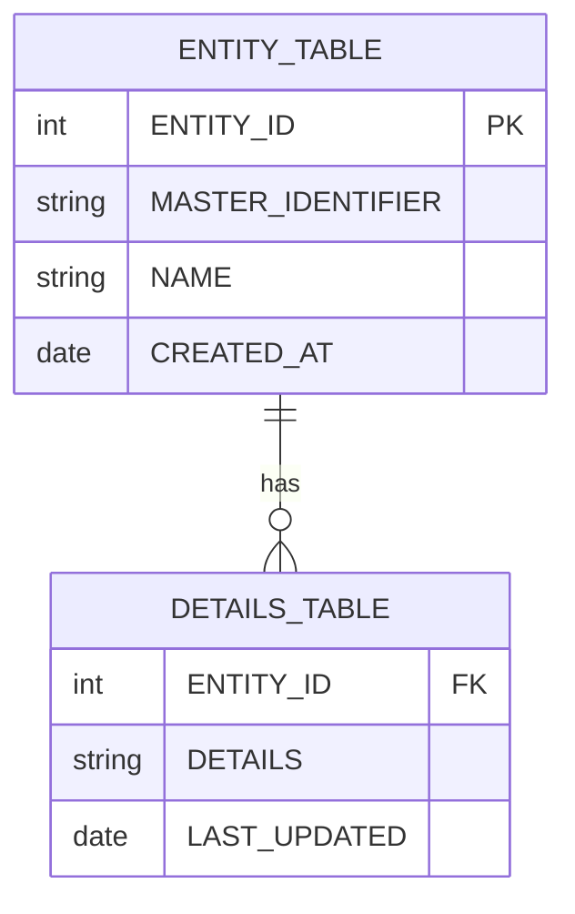
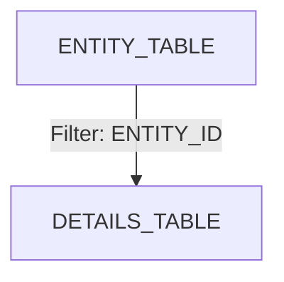
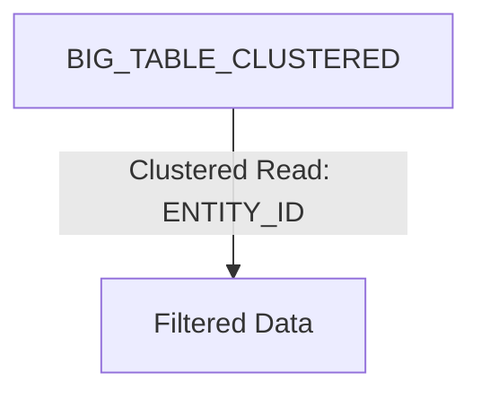
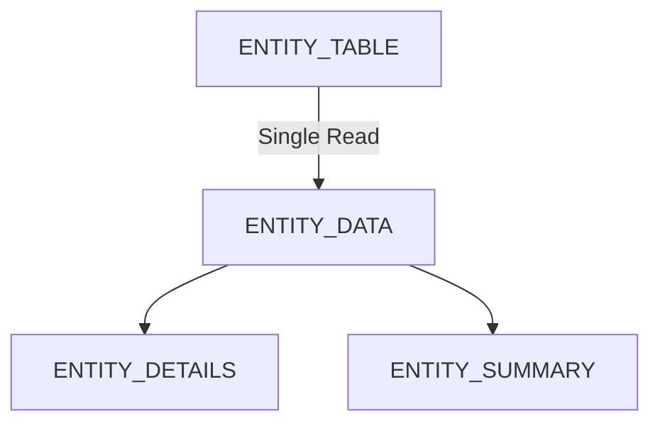

---
categories:
- SQL
date: 2024-07-07 14:25:00
tags:
- Query Optimization
- Performance
- Sharding
title: Distributed DB Query Optimization
---



In Google Cloud Platform's BigQuery, clustering and partitioning are
optimization
techniques used to improve query performance and manage costs when working with
large datasets.

# Indexing

For Tradition and Old DBs, an index is a data structure that improves the speed
of data retrieval operations on a database table.

**Use in BigQuery**: While BigQuery doesn’t support traditional indexing like
other databases,
leveraging partitioning and clustering effectively serves a similar purpose by
optimizing data access paths.

> Indexes are a performance drag when modifying records (Write Heavy DBs).

# Partitioning

Partitioning involves dividing a large database table into smaller,
more manageable **segments** called partitions, making it easier and more
efficient to query large datasets.

Partitioning can be based on various criteria:

- **Range Partitioning**: Data is partitioned based on ranges of column values (
  e.g., dates).
- **Hash Partitioning**: Data is partitioned based on a hash function applied to
  a specific column.
- **List Partitioning**: Data is partitioned based on a list of discrete values.

## Partitioning in BigQuery

Partition can be based on:

- Time-based columns: Such as DATE or TIMESTAMP.
- Integer range: You can also partition by integer values, which can be useful
  for datasets that can be grouped into ranges.

## Maximum Partitions in Google BigQuery

As of now BigQuery supports:

- Up to 4,000 partitions **per table** for partitioned tables based on **a
  single column**.
- However, if a table is partitioned by ingestion time, it can support **daily
  partitions**,
    - which allows for a much larger number of partitions.

```sql
CREATE TABLE my_dataset.my_partitioned_table
(
    event_id   INT64,
    event_name STRING,
    event_date DATE
) PARTITION BY event_date;
```

# Clustering

Clustering further organizes data **within the partitions**.
It **sorts** the data based on specific columns, allowing for more efficient
querying.

```sql
CREATE TABLE ` project_name.dataset_id.patient_visits `
    PARTITION BY CAST(FARM_FINGERPRINT(facility_id) % 100 AS INT64) -- Partition by hashed(UUID) facility_id, LOW CARDINALITY
    --TODO: CHECK IF this is POSSIBLE
    CLUSTER BY patient_id, visit_date -- Cluster by both patient_id and visit_date  
    -- Cluster by patient_id (High Cardinality), visit_Date(medium cardinality)

AS
SELECT visit_id,    --STRING
       patient_id,  --STRING, HIGH CARDINALITY
       facility_id, --STRING, UUID format, LOW CARDINALITY
       visit_date,  --DATE
       visit_reason --STRING
FROM `project_name.dataset_id.source_table`;

-- Data insert, for 2 patinets in same facility
INSERT INTO ` project_name.dataset_id.patient_visits ` (visit_id, patient_id,
                                                        facility_id, visit_date,
                                                        visit_reason)
VALUES ('V001', 'P001', '550e8400-e29b-41d4-a716-446655440000', '2023-07-01',
        'Checkup'),
       ('V002', 'P002', '550e8400-e29b-41d4-a716-446655440001', '2023-07-02',
        'Flu symptoms'),
       ('V003', 'P001', '550e8400-e29b-41d4-a716-446655440000', '2023-08-01',
        'Follow-up');
```

**Partitioning**:

- If you partition your table by the `visit_date`, and if you’re analyzing
  patient visits for July 2023,
  BigQuery would only look at the partition for that month, significantly
  reducing the amount of data processed.

**Clustering**:

- By Facility ID: If many queries focus on specific facilities, clustering by
  this column can reduce the amount of data scanned.
- By Patient ID or other attributes: Clustering by patient attributes might also
  be beneficial if queries often filter on patient demographics.

Within each partition (e.g., July 2023), you could cluster your data by
patient_id or facility_id.

If a query is run to get patient visit details for Facility A in July 2023,
BigQuery can quickly find the relevant data without scanning all the records for
other facilities.

## Querying by Facility ID

```sql
SELECT *
FROM `project_name.dataset_id.patient_visits`
WHERE CAST(FARM_FINGERPRINT(facility_id) % 100 AS INT64) = 00576
  AND visit_date BETWEEN '2023-07-01' AND '2023-07-31';
```

## Querying by Patient ID

```sql
SELECT *
FROM `project_name.dataset_id.patient_visits`
WHERE patient_id = 'P001'
  AND visit_date = '2023-07-01';
```

# Partitioning v/s Clustering

**Use Partitioning When:**

- The column used for partitioning has a **time-based nature** (dates, medium
  cardinality)
- The query patterns filter on a specific **range of values**, especially if
  those values are well-defined (like date ranges).
- You want to significantly **reduce the amount of data scanned** for queries
  that filter on a **low cardinality** column.

**Use Clustering When:**

- You have **high cardinality** columns frequently queried (e.g., `patient_id`)
  but unsuitable for partitioning.
- Queries filter or aggregate on specific columns, benefiting from sorting.
- You want to enhance performance for filtering or joining based on certain
  attributes.

**Combined Use Cases : Partitioning and Clustering Together**:
Use both strategies together for maximum performance. For example,

- partition by a date column (high cardinality, time-based) and
- cluster by `facility_id (medium cardinality)` and `status (low cardinality)`
  to optimize a variety of queries.

# Sharding

Sharding is a technique for **horizontally partitioning** data across multiple
servers or nodes (shards). Each shard independently stores a subset of the data,
collectively forming a logical whole.

### Benefits of Sharding

- **Improves Scalability**: Distributes data across multiple machines, making it
  easier to handle large datasets.
- **Enhances Performance**: Allows for parallel processing of queries and
  transactions, leading to faster query execution.

### Sharding in BigQuery

While BigQuery does not explicitly use the term "sharding," you can achieve
similar results by:

1. **Partitioned Tables**: Use time-based columns to partition your data,
   optimizing query performance and reducing costs.
2. **Sharded Tables**: Create multiple tables with a common naming convention (
   e.g., `dataset.table_2021`, `dataset.table_2022`) to distribute data across
   different tables.

# Early data filtering

**Context:** Most analyzed data access patterns are **entity-centric**, where
data is fetched by passing a unique identifier
(e.g., ENTITY_ID) as a filter while running queries.

However, only a few tables in the domain contain the same identifier, resulting
in poor performance as data from multiple
joined tables needs to be read and filtered **_after the join_**.

For the two tables



**Issue:** Only ENTITY_TABLE is filtered by MASTER_IDENTIFIER, causing all
records in DETAILS_TABLE to be processed before filtering.

```sql
SELECT e.MASTER_IDENTIFIER,
       e.ENTITY_ID,
       d.DETAILS
FROM `project.dataset.ENTITY_TABLE` e
         JOIN `project.dataset.DETAILS_TABLE` d USING (ENTITY_ID)
WHERE e.MASTER_IDENTIFIER = '12345'
```

**Execution Plan Breakdown**
Table Scans:

Full Table Scan on ENTITY_TABLE:

- The database starts by scanning the entire ENTITY_TABLE to find rows where
  MASTER_IDENTIFIER = '12345'.
- This can be inefficient if the table is large, as it reads all rows.

Full Table Scan on DETAILS_TABLE:

- The join will also require scanning the DETAILS_TABLE to gather all records
  associated with the ENTITY_ID,
  regardless of whether they match the MASTER_IDENTIFIER.

Join Operation:

After filtering ENTITY_TABLE, the database will perform a join operation using
the ENTITY_ID column.
Since the filtering occurred after the join, all rows from DETAILS_TABLE must be
considered for joining, leading to unnecessary data processing.

Result Filtering:

Once the join is complete, the system then filters out any results that don’t
match the
specified MASTER_IDENTIFIER. This means that a lot of unnecessary data was
processed before filtering, which leads to poor performance.

Issues Identified
Lack of Early Filtering: The main issue is that filtering is applied only to
ENTITY_TABLE,
meaning all records from DETAILS_TABLE are processed before the result is
narrowed down.

Inefficient Data Retrieval: Full table scans on both tables, especially if they
are large ,
can lead to slow performance and high resource usage.

**Solution:** Filter data earlier using **a common column present in all tables
**, such as `ENTITY_ID`.

```sql
SELECT e.MASTER_IDENTIFIER,
       e.ENTITY_ID,
       d.DETAILS
FROM `project.dataset.ENTITY_TABLE` e
         JOIN `project.dataset.DETAILS_TABLE` d USING (ENTITY_ID)
WHERE e.ENTITY_ID = '67890'; -- instead of MASTER_IDENTIFIER
```

This called a **filter (or predicate) pushdown**, where filtering happens before
the join.
Primary {: .notice--primary}



# Cluster Pruning

Cluster pruning refers to the optimization technique used in databases,
particularly in distributed databases,
to **reduce the amount of data read from storage during query execution**.

- It involves skipping unnecessary data blocks or partitions that do not contain
  relevant data for a given query.
- The goal is to minimize disk I/O and improve query performance by avoiding the
  need to read entire data sets.

In distributed databases, cluster pruning is often associated with query
optimization strategies such as

- predicate pushdown (where filters are applied as early as possible in the
  query execution process) and
- partition pruning (where unnecessary partitions are excluded from query
  processing based on query predicates).

**Context**: Filter-pushdown allows processing less data in later stages, but *
*does not reduce** the initial amount of data read.

Reading entire table data can become a bottleneck as data grows.

```sql
SELECT *
FROM `project.dataset.BIG_TABLE`
WHERE ENTITY_ID = '67890'
```

**Issue:** The query reads the entire table before filtering.

**Solution:** Cluster the table on the ENTITY_ID column.

```sql
CREATE TABLE ` project.dataset.BIG_TABLE_CLUSTERED `
    CLUSTER BY ENTITY_ID AS
SELECT *
FROM `project.dataset.BIG_TABLE`
```



# Clustering vs Cluster Pruning

**Clustering** is the organization of data based on specified columns to improve
performance.

**Cluster pruning** is the **process** that occurs when the database engine
skips irrelevant data during a query because of that clustering.

Clustering refers to the method of organizing data in a way that optimizes query
performance.
In systems like BigQuery, clustering involves physically sorting the data based
on
specified columns (e.g., facility_id, patient_id).
When a table is clustered, queries that filter on these clustered columns can
skip over large amounts of irrelevant data, reducing the amount scanned and
speeding up query performance.

a table in BigQuery that is clustered by patient_id.

```sql
CREATE TABLE your_dataset.patient_visits
    CLUSTER BY patient_id;
```

Cluster pruning is a specific optimization technique that occurs as a result of
clustering.
When you run a query that includes filters on the clustered columns, the
database engine
can **"prune" or skip entire sections** of the dataset that do not meet the
query criteria.
This means that only the relevant clusters (or sorted sections of data) are
read,
which improves query performance and reduces costs.

```sql
-- CLUSTER BY patient_id
SELECT *
FROM your_dataset.patient_visits
WHERE patient_id = 'P001';
```

BigQuery uses cluster pruning to only scan the segments of data that contain
records for P001, skipping over all other patient IDs.

# Data materialization

**Context:** Queries often use real-time data, leading to high computation costs
as **views are recalculated** on each query execution.

**Solution:** Materialize data using scheduled queries or materialized views. !!
TODO:CHECK WITH SOMEONE

- Calculate Once and re-use multiple times

## Materialized Views

```sql
CREATE MATERIALIZED VIEW `project.dataset.MATERIALIZED_VIEW` AS
SELECT e.ENTITY_ID,
       e.ATTRIBUTE
FROM `project.dataset.SOURCE_TABLE` e
```

## Scheduled Query

**1. Create the Destination Table**:

- Before creating the scheduled query, you need a destination table where the
  results will be stored.

```sql
CREATE TABLE ` project.dataset.destination_table ` AS
SELECT e.ENTITY_ID,
       e.ATTRIBUTE
FROM `project.dataset.SOURCE_TABLE` e
WHERE FALSE; -- Create an empty table with the correct schema
```

**2: Set Up the Scheduled Query**:

- Go to the BigQuery Console.
- In the navigation pane, click on "Scheduled queries."
- Click on "Create Scheduled Query."
- In the SQL section, enter the query:

```sql
--Ensuring no duplicate record insertion into destination table
TRUNCATE TABLE ` project.dataset.destination_table `;

INSERT INTO ` project.dataset.destination_table `
SELECT e.ENTITY_ID,
       e.ATTRIBUTE
FROM `project.dataset.SOURCE_TABLE` e
--This filter ensures that only rows from the last three months are selected.
WHERE e.date_column >= DATE_SUB(CURRENT_DATE(), INTERVAL 3 MONTH);
```

**3: Configure the Schedule**:

- Choose how frequently you want the query to run (e.g., hourly, daily).
- Set the time zone and start time as needed.

## Key Differences

**Materialized Views**: Automatically refresh and maintain the results based on
the underlying data. !!TODO:: HOW??

**Scheduled Queries**: You control when to run the query, and the results are
stored in a table you specify.
You may need to handle the refresh logic (e.g., truncating the table before
inserting new data) if necessary.

# Avoiding repeated reads and transformations

**Context**

Common Table Expressions (CTEs) can lead to repeated reads if not used
carefully.

```sql
--3 CTE's
WITH entity_data AS (SELECT *
                     FROM `project.dataset.ENTITY_TABLE`),
     entity_details AS ( -- read from the entity_data CTE
         SELECT * FROM entity_data WHERE ENTITY_TYPE = 'EntityDetails'),
     entity_summary AS ( -- read from the entity_data CTE second time
         SELECT * FROM entity_data WHERE ENTITY_TYPE = 'EntitySummary')

SELECT *
FROM entity_details
UNION ALL
SELECT *
FROM entity_summary
```

**Issue**:

ENTITY_TABLE is read multiple times.!! TODO: Check if the entity_data CTE is
called twice means it executes twice thus executing Entity Table twice

**Solution**

Use analytic functions or flatten the CTE to avoid repeated reads.

```sql
WITH entity_data AS (SELECT ENTITY_ID,
                            ENTITY_TYPE,
                            FIRST_VALUE(ATTRIBUTE)
                                        OVER (PARTITION BY ENTITY_ID ORDER BY TIMESTAMP) AS ATTRIBUTE
                     FROM `project.dataset.ENTITY_TABLE`)

SELECT *
FROM entity_data
WHERE ENTITY_TYPE = 'EntityDetails'
UNION ALL
SELECT *
FROM entity_data
WHERE ENTITY_TYPE = 'EntitySummary'
```



# Partitioning in Google Cloud Spanner

In Spanner, data is automatically partitioned into ranges based on the primary
key.
You can define a primary key that determines how data is distributed across
nodes.
This is crucial for achieving good performance and scalability.

Example:
If you have a patient_visits table, you might define a primary key like this:

```sql
CREATE TABLE patient_visits
(
    visit_id     STRING(36) NOT NULL,
    patient_id   STRING(36),
    facility_id  STRING(36),
    visit_date   DATE,
    visit_reason STRING(255),
) PRIMARY KEY (facility_id, visit_date, visit_id);

```

In this case, the table is partitioned by facility_id and visit_date.
This allows Spanner to efficiently query data by those keys.

# Clustering in Google Cloud Spanner

While Spanner doesn't have a dedicated clustering feature like BigQuery, you can
achieve similar results by carefully designing your primary key. By including
frequently queried columns in your primary key, you can improve performance for
specific query patterns.

Example:
If you expect many queries to filter by patient_id, you could modify the primary
key:

```sql
PRIMARY KEY (facility_id, patient_id, visit_date, visit_id)
```

# Denormalization:

In a distributed database, especially in data warehouses, denormalization (
storing redundant data)
can **reduce the need for complex joins** and improve query performance.

**Example**: Instead of normalizing patient data across multiple tables, you
might store it all in one table, which can speed up read queries.

```sql
CREATE TABLE ` project.dataset.denormalized_patient_data ` AS
SELECT p.patient_id,
       p.name,
       p.gender,
       v.visit_date,
       v.visit_reason
FROM `project.dataset.patients` p
         JOIN `project.dataset.visits` v ON p.patient_id = v.patient_id;
```

# Additional Concepts for Query Optimization

## Data Types:

**Optimization**: Choosing appropriate data types can reduce storage costs and
improve performance. For instance, using INTEGER instead of STRING for numeric
values can yield better performance.

```sql
-- Using INTEGER instead of STRING for IDs
CREATE TABLE ` project.dataset.optimized_table `
(
    patient_id   INT64, -- Better performance than STRING
    visit_date   DATE,
    visit_reason STRING
);
```

## Query Rewrite:

**Optimization**: Sometimes, rewriting queries for better performance can help.
For instance,

- using JOIN instead of UNION when the same dataset is being merged can reduce
  the overhead.
- Avoiding subqueries when possible can also enhance performance.

```sql
-- Instead of using UNION, use JOIN if applicable
SELECT *
FROM `project.dataset.table_a` a
         JOIN `project.dataset.table_b` b ON a.id = b.id;
```

subquery that retrieves the average visit count for each patient and then
filters the results based on that average

```sql
SELECT *
FROM `project.dataset.patients` p
WHERE (SELECT COUNT(*)
       FROM `project.dataset.visits` v
       WHERE v.patient_id = p.patient_id) > 5;
```

Instead of using a subquery, we can use a JOIN and a GROUP BY clause to achieve
the same result more efficiently.

```sql
SELECT p.*
FROM `project.dataset.patients` p
         JOIN (SELECT patient_id, COUNT(*) AS visit_count
               FROM `project.dataset.visits`
               GROUP BY patient_id) v ON p.patient_id = v.patient_id
WHERE v.visit_count > 5;
```

## Data Sampling:

Use Case: For exploratory data analysis, consider using sampled data instead of
the full dataset to speed up query times.
BigQuery supports sampling methods that can be utilized in your queries.

```sql
SELECT *
FROM `project.dataset.large_table`
         TABLESAMPLE SYSTEM (10 PERCENT);
```

## Load Balancing:

Context: In distributed databases, balancing the load among nodes can prevent
some nodes from becoming bottlenecks.
Ensure that your data distribution is even across partitions or shards.

In Spanner, you can ensure even distribution by defining a well-thought-out
primary key.

```sql
CREATE TABLE patient_visits
(
    visit_id     STRING(36) NOT NULL,
    patient_id   STRING(36),
    facility_id  STRING(36),
    visit_date   DATE,
    visit_reason STRING(255),
) PRIMARY KEY (facility_id, visit_date, patient_id);
```

## Avoiding Cross-Joins:

Context: Cross-joins can lead to significant performance degradation. Always
ensure that join conditions are specified to avoid cartesian products.

```sql
-- Always include join conditions
SELECT *
FROM `project.dataset.table_a` a
         JOIN `project.dataset.table_b` b
              ON a.id = b.id; -- Avoiding cross-join
```

## Caching:

Context: If your queries frequently access the same datasets, consider caching
results where possible.
This can significantly reduce load times for repeat queries.

```sql
-- You can utilize materialized views for caching results
CREATE MATERIALIZED VIEW `project.dataset.cached_view` AS
SELECT patient_id, COUNT(*) AS visit_count
FROM `project.dataset.visits`
GROUP BY patient_id;
```

## Using Approximate Algorithms: !!TODO : CHECK

Context: For analytics queries, using approximate algorithms (like
APPROX_COUNT_DISTINCT) can drastically reduce computation time and resources.

```sql
SELECT APPROX_COUNT_DISTINCT(patient_id) AS unique_patients
FROM `project.dataset.visits`;
```