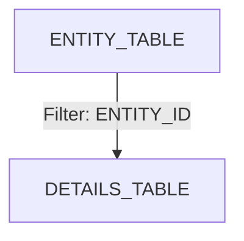
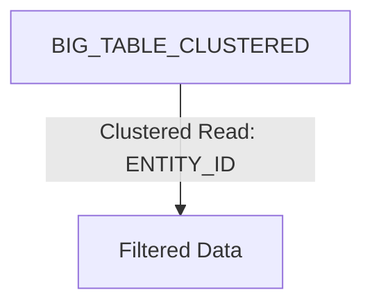
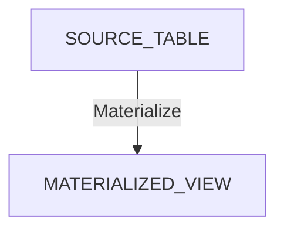
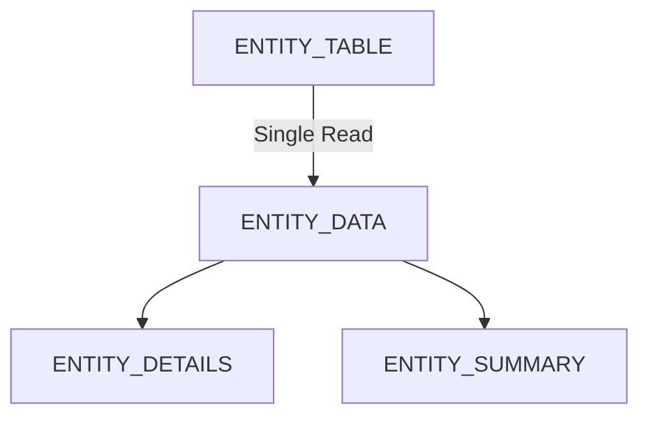



In Google Cloud Platform's BigQuery, clustering and partitioning are optimization
techniques used to improve query performance and manage costs when working with large datasets.

# Partitioning
Partitioning involves dividing a large database table into smaller, 
more manageable **segments** called partitions, making it easier and more efficient to query large datasets.

Partitioning can be based on various criteria:
- **Range Partitioning**: Data is partitioned based on ranges of column values (e.g., dates).
- **Hash Partitioning**: Data is partitioned based on a hash function applied to a specific column.
- **List Partitioning**: Data is partitioned based on a list of discrete values.

## Partitioning in BigQuery
Partition can be based on:
- Time-based columns: Such as DATE or TIMESTAMP.
- Integer range: You can also partition by integer values, which can be useful for datasets that can be grouped into ranges.

# Clustering
Clustering further organizes data **within the partitions**.
It **sorts** the data based on specific columns, allowing for more efficient querying.

Let’s consider a scenario with 2,000 facilities and 200,000 patients with Visit Table

Table Schema for Visit Table
```sql
CREATE TABLE `project_name.dataset_id.patient_visits`
    PARTITION BY CAST(FARM_FINGERPRINT(facility_id) % 100 AS INT64)  -- Partition by hashed facility_id
    CLUSTER BY patient_id  -- Cluster by patient_id
AS
SELECT
    visit_id, --STRING
    patient_id, --STRING
    facility_id, --STRING, UUID format
    visit_date, --DATE
    visit_reason --STRING
FROM
    `project_name.dataset_id.source_table`;

-- Data insert
INSERT INTO `project_name.dataset_id.patient_visits` (visit_id, patient_id, facility_id, visit_date, visit_reason)
VALUES
    ('V001', 'P001', '550e8400-e29b-41d4-a716-446655440000', '2023-07-01', 'Checkup'),
    ('V002', 'P002', '550e8400-e29b-41d4-a716-446655440001', '2023-07-02', 'Flu symptoms'),
    ('V003', 'P001', '550e8400-e29b-41d4-a716-446655440000', '2023-08-01', 'Follow-up');
```

**Partitioning**:

If you partition your table by the `visit_date`, and if you’re analyzing patient visits for July 2023, 
BigQuery would only look at the partition for that month, significantly reducing the amount of data processed.

**Clustering**:
- By Facility ID: If many queries focus on specific facilities, clustering by this column can reduce the amount of data scanned.
- By Patient ID or other attributes: Clustering by patient attributes might also be beneficial if queries often filter on patient demographics.

Within each partition (e.g., July 2023), you could cluster your data by facility_id.

If a query is run to get patient visit details for Facility A in July 2023,
BigQuery can quickly find the relevant data without scanning all the records for other facilities.


## Querying by Facility ID
```sql
SELECT *
FROM `project_name.dataset_id.patient_visits`
WHERE CAST(FARM_FINGERPRINT(facility_id) % 100 AS INT64) = 00576
AND visit_date BETWEEN '2023-07-01' AND '2023-07-31';

```

## Querying by Patient ID
```sql
SELECT *
FROM `project_name.dataset_id.patient_visits`
WHERE patient_id = 'P001'
AND visit_date = '2023-07-01';
```

# Sharding
Sharding is a technique used in distributed databases to **horizontally partition** data across multiple servers or nodes (shards). 
Each shard independently stores a subset of the data, and together they form a logical whole. 

Sharding is typically used to improve scalability and performance by distributing the workload across multiple machines, 
allowing for parallel processing of queries and transactions.

# Early data filtering
**Context**

Most analyzed data access patterns are **entity-centric**, where data is fetched by passing a unique identifier (e.g., ENTITY_ID) 
as a filter while running queries. 

However, only a few tables in the domain contain the same identifier, resulting in poor performance as data from multiple 
joined tables needs to be read and filtered **_after the join_**.

```sql
SELECT
  e.MASTER_IDENTIFIER,
  e.ENTITY_ID,
  d.DETAILS
FROM `project.dataset.ENTITY_TABLE` e
JOIN `project.dataset.DETAILS_TABLE` d USING (ENTITY_ID) --check here
WHERE e.MASTER_IDENTIFIER = '12345'
```

**Issue:**
- Only the ENTITY_TABLE is filtered by MASTER_IDENTIFIER.
- Other tables are joined without prior filtering.

**Solution**

Filter data earlier using **a column present in all tables**, such as ENTITY_ID.

```sql
SELECT
    e.MASTER_IDENTIFIER,
    e.ENTITY_ID,
    d.DETAILS
FROM `project.dataset.ENTITY_TABLE` e
JOIN `project.dataset.DETAILS_TABLE` d USING (ENTITY_ID) -- instead of MASTER_IDENTIFIER
WHERE e.ENTITY_ID = '67890'; -- instead of MASTER_IDENTIFIER
```

This called a **filter (or predicate) pushdown**, where filtering happens before the join.
Primary {: .notice--primary}



# Cluster Pruning
Cluster pruning refers to the optimization technique used in databases, particularly in distributed databases,
to reduce the amount of data read from storage during query execution.

- It involves skipping unnecessary data blocks or partitions that do not contain relevant data for a given query.
- The goal is to minimize disk I/O and improve query performance by avoiding the need to read entire data sets.

In distributed databases, cluster pruning is often associated with query optimization strategies such as
- predicate pushdown (where filters are applied as early as possible in the query execution process) and
- partition pruning (where unnecessary partitions are excluded from query processing based on query predicates).


# Cluster pruning
**Context**

Filter-pushdown allows processing less data in later stages, but does not reduce the initial amount of data read.

Reading all table data can become a bottleneck as data grows.

```sql
SELECT *
FROM `project.dataset.BIG_TABLE`
WHERE ENTITY_ID = '67890'
```
**Issue:**

The query reads the entire table before filtering.

**Solution**

Cluster the table on the ENTITY_ID column.

```sql
CREATE TABLE `project.dataset.BIG_TABLE_CLUSTERED`
CLUSTER BY ENTITY_ID AS
SELECT * FROM `project.dataset.BIG_TABLE`
```



# Clustering vs Cluster Pruning
**Clustering** is the organization of data based on specified columns to improve performance.

**Cluster pruning** is the process that occurs when the database engine skips irrelevant data during a query because of that clustering.


Clustering refers to the method of organizing data in a way that optimizes query performance.
In systems like BigQuery, clustering involves physically sorting the data based on
specified columns (e.g., facility_id, patient_id).
When a table is clustered, queries that filter on these clustered columns can
skip over large amounts of irrelevant data, reducing the amount scanned and speeding up query performance.

a table in BigQuery that is clustered by patient_id.
```sql
CREATE TABLE your_dataset.patient_visits
CLUSTER BY patient_id;
```

Cluster pruning is a specific optimization technique that occurs as a result of clustering.
When you run a query that includes filters on the clustered columns, the database engine
can "prune" or skip entire sections of the dataset that do not meet the query criteria.
This means that only the relevant clusters (or sorted sections of data) are read,
which improves query performance and reduces costs.
```sql
SELECT *
FROM your_dataset.patient_visits
WHERE patient_id = 'P001';
```
BigQuery uses cluster pruning to only scan the segments of data that contain records for P001, skipping over all other patient IDs.


# Data materialization
**Context**

Queries often use real-time data, leading to high computation costs as views are recalculated on each query execution.

**Solution**

Materialize data using scheduled queries or materialized views.

```sql
CREATE MATERIALIZED VIEW `project.dataset.MATERIALIZED_VIEW` AS
SELECT
    e.ENTITY_ID,
    e.ATTRIBUTE
FROM `project.dataset.SOURCE_TABLE` e
```



# Avoiding repeated reads and transformations
**Context**

Common Table Expressions (CTEs) can lead to repeated reads if not used carefully.

```sql
WITH entity_data AS (
    SELECT * FROM `project.dataset.ENTITY_TABLE`
),
entity_details AS (
    SELECT * FROM entity_data WHERE ENTITY_TYPE = 'TypeA'
),
entity_summary AS (
    SELECT * FROM entity_data WHERE ENTITY_TYPE = 'TypeB'
)

SELECT * FROM entity_details
UNION ALL
SELECT * FROM entity_summary
```

**Issue**:

ENTITY_TABLE is read multiple times.

**Solution**

Use analytic functions or flatten the CTE to avoid repeated reads.
```sql
WITH entity_data AS (
    SELECT
        ENTITY_ID,
        ENTITY_TYPE,
        FIRST_VALUE(ATTRIBUTE) OVER (PARTITION BY ENTITY_ID ORDER BY TIMESTAMP) AS ATTRIBUTE
    FROM `project.dataset.ENTITY_TABLE`
)

SELECT * FROM entity_data WHERE ENTITY_TYPE = 'TypeA'
UNION ALL
SELECT * FROM entity_data WHERE ENTITY_TYPE = 'TypeB'
```



# Partitioning in Google Cloud Spanner
In Spanner, data is automatically partitioned into ranges based on the primary key.
You can define a primary key that determines how data is distributed across nodes.
This is crucial for achieving good performance and scalability.

Example:
If you have a patient_visits table, you might define a primary key like this:
```sql
CREATE TABLE patient_visits (
    visit_id STRING(36) NOT NULL,
    patient_id STRING(36),
    facility_id STRING(36),
    visit_date DATE,
    visit_reason STRING(255),
) PRIMARY KEY (facility_id, visit_date, visit_id);

```
In this case, the table is partitioned by facility_id and visit_date.
This allows Spanner to efficiently query data by those keys.

# Clustering in Google Cloud Spanner
While Spanner doesn't have a dedicated clustering feature like BigQuery, you can achieve similar results by carefully designing your primary key. By including frequently queried columns in your primary key, you can improve performance for specific query patterns.

Example:
If you expect many queries to filter by patient_id, you could modify the primary key:
```sql
PRIMARY KEY (facility_id, patient_id, visit_date, visit_id)
```

