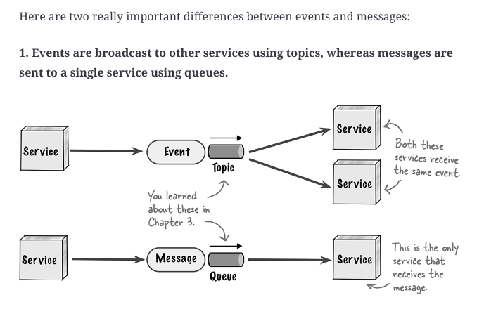
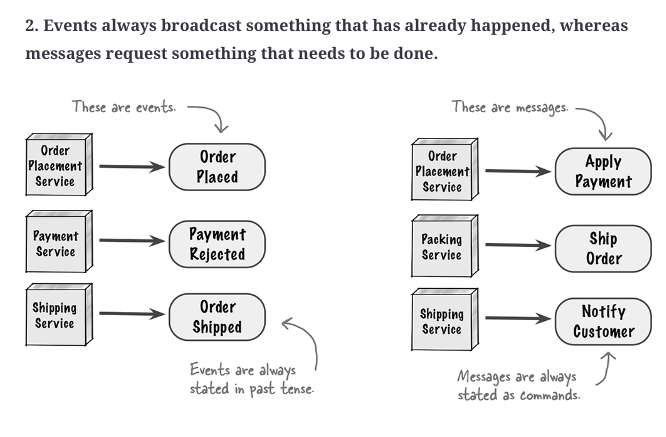
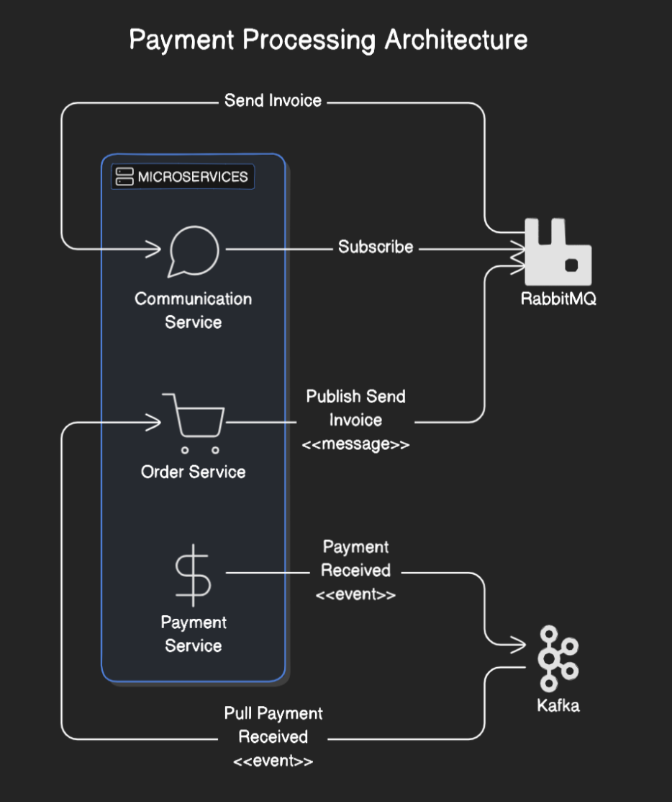



> Means of loosely coupling sub-systems

[Kafka Basics](https://nitinkc.github.io/microservices/essential-kafka/)

Apache Kafka is primarily an event streaming platform
- Kafka uses topics to manage the distribution of events
- Event Streaming : New Consumers will have access to old events and can replay if they want
  - provides reliable delivery
  - used in Pattern/Anomaly detection (Consumers need access to all the past events)
- Kafka uses **append only logs** as its primary data structure which adds new data to the **end of the file**

Rabbit MQ Supports pub sub via Queues. Pub/Sub (Publish/Subscribe) is a messaging service that supports message streaming
- Fire and Forget

# Messaging Protocols
- **STOMP** - Simple Text Oriented Messaging Protocol
- **MQTT** - Message Queue Telemetry Protocol (for machine to machine - IOT)
- **AMQP** - Asynchronous Messaging Queueing Protocol

Rabbit MQ Supports all of the above

# 4 actors of Messaging Pattern
> **Producer** --> Sends mvfessage --> to an **exchange** --> Routed to --> **Queue** --> Delivered to --> a **Consumer**

- **Producer**: Sends messages to an exchange.
- **Exchanges**: Receive messages from producers and route them to queues based on certain rules.
  - Routing Algo decides where to send messages from exchange
  - Routing algo depends on exchange type and rules called "bindings"
- **Queues**: Store messages until they are consumed by subscribers.
- **Consumer**: Subscribes to the queues and processes the messages.

RabbitMQ supports the publish/subscribe (pub/sub) messaging pattern

# Actors of Event Streaming
- **Event**: A record of an action or occurrence within a system, often containing data about the event.
- **Stream**: A sequence of events ordered by time.
- **Producer**: An entity that generates and sends events to a stream.
- **Consumer**: An entity that reads and processes events from a stream.
- **Topic**: A category or feed name to which records are sent by producers and from which records are received by consumers.
- **Partition**: A division within a topic that allows for parallel processing of events.
- **Broker**: A server that stores and serves streams of events.
- **Offset**: A unique identifier for each event within a partition, used to track the position of events.
- **Retention**: The duration for which events are stored in a stream before being deleted.
- **Schema**: The structure that defines the format of events.
- **Replication**: The process of copying events across multiple brokers to ensure reliability and fault tolerance.
- **Consumer Group**: A group of consumers that work together to process events from a stream.
- **Checkpointing**: The process of saving the state of a consumer to ensure it can resume processing from the last known position in case of failure.
- **Backpressure**: A mechanism to handle situations where the rate of event production exceeds the rate of event consumption.

# Messages vs Events
> In terms of OOP, `Message` is the Super class with `Event` and `Command` as subclasses.

What is typically understood by message is actually a **command**.

> Use Queues in a point-to-point messaging system
> Use topic in publish-subscribe messaging system

It is very easy to wiretap into a topic but not on queue. if a rogue service did listen to a queue,
the corrosponding point-to-point service will not receive the message and a notification would be
immediately be sent about the data loss.

topic model does not support monitoring of the messages, and hence autoscaling capabilities

topic only supports homogenous contracts
## Event
- Has already happened, in the past
- **order of events can't be changed** as history can't be altered
- Can be sent via the **Event Streaming Platform** like Apache Kafka Streams
- typically represents a state change
- Events are often used to indicate that something has occurred in the system
  that other parts of the system might be interested in.

### Characteristics
- **Decoupling**: Events are usually published to an **event queue** or **an event stream**,
- and consumers (or subscribers) can process these events independently.
- The producer of the event doesn’t need to know who the consumers are.
- **Immutable**: Once an event is created and published, it doesn’t change. It’s a record(log) of something that had happened.

## Command/Message
Pub/Sub Model : Message Broaker as a temporary storage
- request for a task to be done
- order and priority can change
- Can be sent via API calls (point to point or async) or via "Message Brokers"
  like Apache Active MQ, Rabbit MQ, Solace
- typically refers to a piece of data or a command sent from one component to
  another within a system.
- Unlike events, messages often contain commands or instructions that prompt a
  specific action or response

### Characteristics
- Fire & Forget 
- Buffering
- Broadcasting
- Infinite streams or events
- **Direct Communication**: Messages are often used in point-to-point
  communication or request-response patterns. The sender of the message
  typically expects a specific response or action from the receiver.
- **Contextual**: Messages can include commands, requests, or data that needs to
  be acted upon.
  The sender and receiver usually have a defined relationship.

# Example
- Payment service creates an **event** `<<payment received>>` and published it
  to kafka event streaming platform.
- Order service subscribes to the event published and processes the payment.
- Order service, then, send a **message/command** `<<send invoice>>` to a
  messaging queue like RabbitMQ, ActiveMQ or solace.
- Communication service subscribes to the message and reads the messages and
  processes it.

{:
width="50%" height="50%"}

# Messages
- immutable array of bytes
- topic -> feed of messages

See : Topic Partitioning

Queue helps keeping track of requests and redirect in case of a failure

- Asynchronous requests
- In a queue, data persistence

# Why is kafka fast

Kafka is optimized for high Throughput.

### Reliance of Sequential I/O
2 types of Disk Access patterns
- Random access
- Sequential access

Kafka uses **append only logs** as its primary data structure which adds new
data to the **end of the file**

HHD is 1/3 of the price, but 3 times capacity due to which kafka can keep
messages (cost effectively) over a long period of time

### Zero Copy principle
The data page is loaded from the disk to the OS buffer (RAM??) - zero copy

the directly from RAM into the NIC Buffer (kafka uses system call called
sendFile()

to tell the OS to directly copy the data from the OS cache to the network
interface card buffer)

With modern network card, this copying is done with the DMA (Direct Memory
Access) - when its used, the CPU is not involved