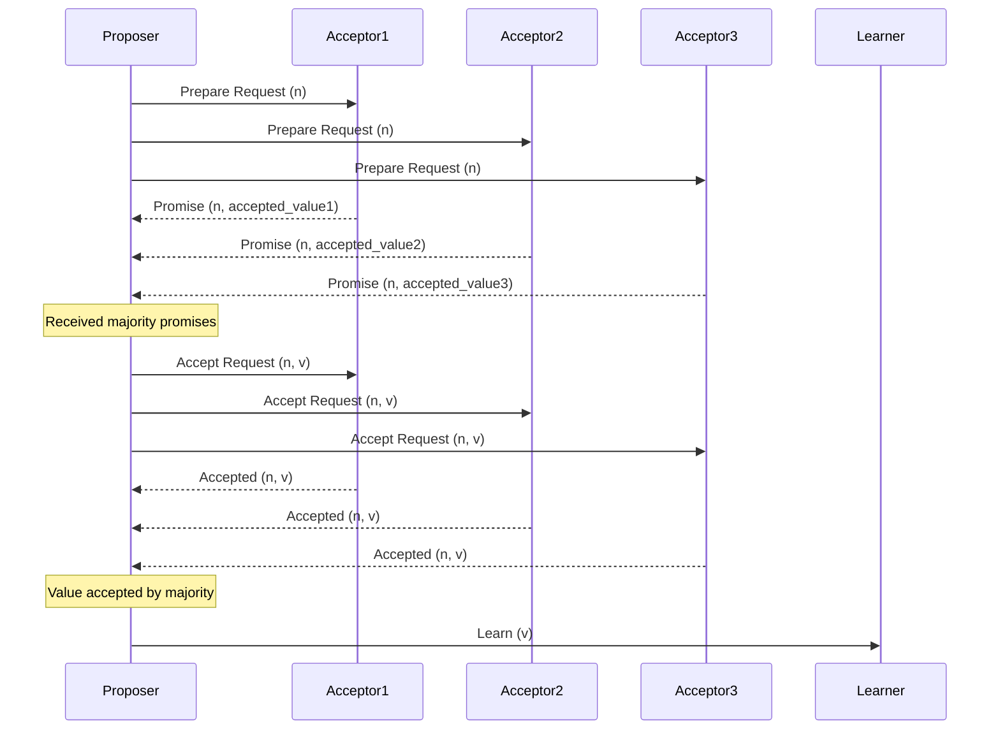
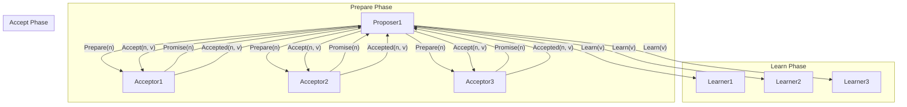



```mermaid!
sequenceDiagram
    participant Proposer
    participant Acceptor1
    participant Acceptor2
    participant Acceptor3
    participant Learner

    Proposer ->> Acceptor1: Prepare Request (n)
    Proposer ->> Acceptor2: Prepare Request (n)
    Proposer ->> Acceptor3: Prepare Request (n)

    Acceptor1 -->> Proposer: Promise (n, accepted_value1)
    Acceptor2 -->> Proposer: Promise (n, accepted_value2)
    Acceptor3 -->> Proposer: Promise (n, accepted_value3)

    Note over Proposer: Received majority promises

    Proposer ->> Acceptor1: Accept Request (n, v)
    Proposer ->> Acceptor2: Accept Request (n, v)
    Proposer ->> Acceptor3: Accept Request (n, v)

    Acceptor1 -->> Proposer: Accepted (n, v)
    Acceptor2 -->> Proposer: Accepted (n, v)
    Acceptor3 -->> Proposer: Accepted (n, v)

    Note over Proposer: Value accepted by majority

    Proposer ->> Learner: Learn (v)
```

```mermaid!
graph TD
    subgraph Prepare Phase
        Proposer1 -- Prepare(n) --> Acceptor1
        Proposer1 -- Prepare(n) --> Acceptor2
        Proposer1 -- Prepare(n) --> Acceptor3
        Acceptor1 -- Promise(n) --> Proposer1
        Acceptor2 -- Promise(n) --> Proposer1
        Acceptor3 -- Promise(n) --> Proposer1
    end

    subgraph Accept Phase
        Proposer1 -- Accept(n, v) --> Acceptor1
        Proposer1 -- Accept(n, v) --> Acceptor2
        Proposer1 -- Accept(n, v) --> Acceptor3
        Acceptor1 -- Accepted(n, v) --> Proposer1
        Acceptor2 -- Accepted(n, v) --> Proposer1
        Acceptor3 -- Accepted(n, v) --> Proposer1
    end

    subgraph Learn Phase
        Proposer1 -- Learn(v) --> Learner1
        Proposer1 -- Learn(v) --> Learner2
        Proposer1 -- Learn(v) --> Learner3
    end
```