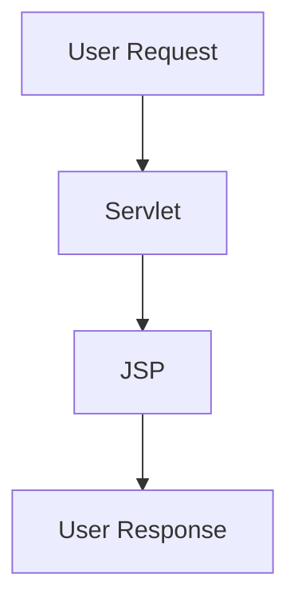
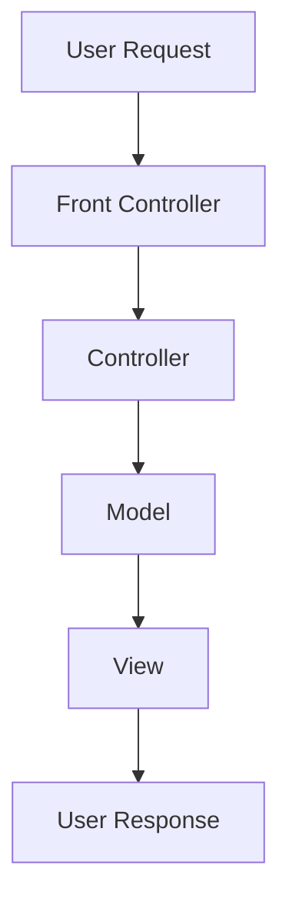
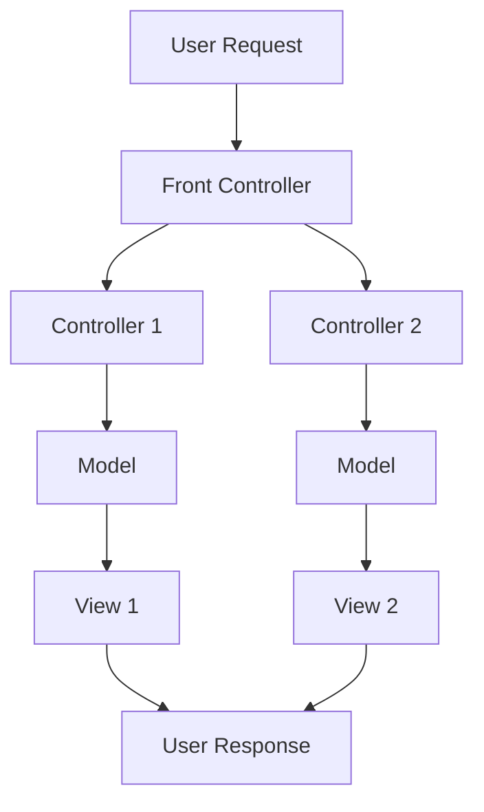



# Model 1 Architecture
In the Model 1 Architecture, the JSPs handle both the presentation and some business logic directly.
- All JSP's

# Model 2 Architecture (MVC)
In Model 2, also known as MVC (Model-View-Controller), the architecture is divided
into three main components: Model, View, and Controller.

# Model 2 Front Controller Architecture
In this variation, a single Front Controller routes requests to appropriate controllers,
which then interact with the Model and View.

