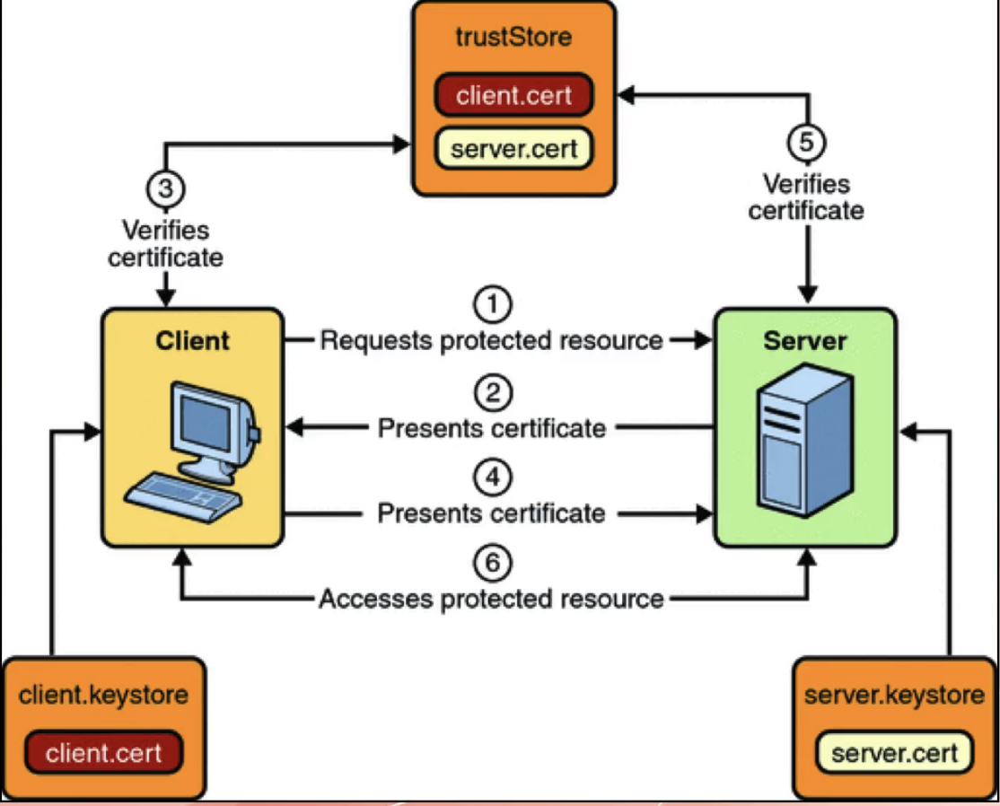



# SSH Keys

Cryptographic keys are used to access remote systems and servers securely

# OAuth Tokens

Tokens that provide limited access to user data on third-party applications

# SSL Certificates

Digital certificates ensure secure and encrypted communication between servers
and clients

## Client Certificate

- method for authenticating the API User
- client certificate file with public & private key pair is used
- When an API caller makes an API call, the server validates the Client
  Certificate.
- It is called TLS Handshake

# Credentials:

User authentication information is used to verify and grant access to various
systems and services

