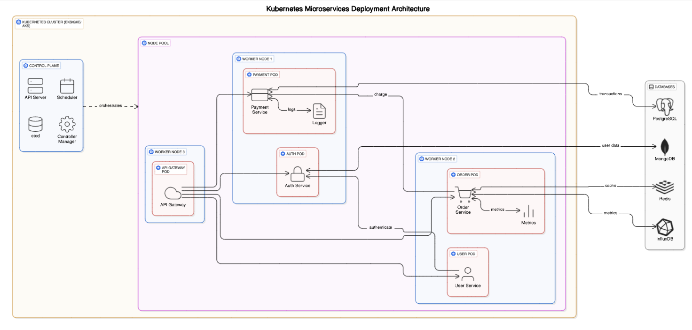



An Open source Container Orchestration platform

Automates 
- Deployment of containers
- Scaling of containers
- Maintenance of containers

[https://github.com/ByteByteGoHq/system-design-101?tab=readme-ov-file#what-is-k8s-kubernetes](https://github.com/ByteByteGoHq/system-design-101?tab=readme-ov-file#what-is-k8s-kubernetes)

