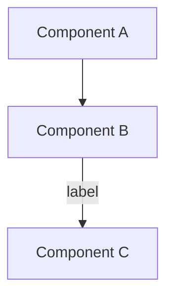

# MkDocs + Mermaid Template

> Feed this file to GitHub Copilot and ask it to set up MkDocs documentation for your project.

---

## Copilot Prompt

```
Use MKDOCS_TEMPLATE.md to set up MkDocs documentation for this project.
Create all necessary files and build to verify: python3 -m mkdocs build
```

---

## File 1: `requirements.txt`

```txt
mkdocs<2.0
pymdown-extensions>=10.8
mkdocs-material==9.5.0
Markdown>=3.6
mkdocs-bootswatch==1.1
```

---

## File 2: `mkdocs.yml`

```yaml
site_name: YOUR PROJECT NAME
site_description: YOUR DESCRIPTION
site_author: YOUR NAME

theme:
  name: mkdocs
  color_mode: auto
  user_color_mode_toggle: true
  highlightjs: true
  hljs_languages:
    - yaml
    - java
    - python
    - javascript
    - go
    - sql
    - bash


plugins:
  - search

markdown_extensions:
  - admonition
  - pymdownx.details
  - pymdownx.superfences
  - pymdownx.highlight:
      anchor_linenums: true
  - pymdownx.inlinehilite
  - pymdownx.snippets
  - pymdownx.tabbed:
      alternate_style: true
  - attr_list
  - md_in_html
  - tables
  - footnotes
  - def_list
  - abbr
  - pymdownx.arithmatex:
      generic: true

extra_javascript:
  - https://cdn.jsdelivr.net/npm/mermaid/dist/mermaid.min.js
  - https://unpkg.com/mermaid@10/dist/mermaid.js
  - js/mermaid-init.js
  - js/mathjax.js
  - https://cdn.jsdelivr.net/npm/mathjax@3/es5/tex-mml-chtml.js
  - js/theme-toggle.js
#  - js/tooltips.js

extra_css:
  - https://unpkg.com/mermaid@10/dist/mermaid.css
  - css/myCss.css


nav:
  - Home: index.md
  # Add your sections here:
  # - Section:
  #   - section/index.md
  #   - "Page Title": section/page.md
```

---

## File 3: `docs/js/mermaid-init.js`

```javascript
document.addEventListener('DOMContentLoaded', function () {
  if (typeof mermaid !== 'undefined') {
    mermaid.initialize({ startOnLoad: false, theme: 'default', securityLevel: 'loose' });

    document.querySelectorAll('div.highlight pre').forEach(function (pre) {
      const code = pre.textContent.trim();
      const mermaidKeywords = ['graph', 'sequenceDiagram', 'classDiagram',
        'stateDiagram', 'erDiagram', 'journey', 'gitGraph', 'pie', 'requirement'];

      if (mermaidKeywords.some(kw => code.startsWith(kw))) {
        const diagram = document.createElement('div');
        diagram.className = 'mermaid';
        diagram.textContent = code;
        pre.parentElement.replaceWith(diagram);
      }
    });

    if (window.mermaid && window.mermaid.contentLoaded) {
      mermaid.contentLoaded();
    }
  }
});
```

---

## Commands

```bash
python3 -m venv .venv                                                                  
source .venv/bin/activate
pip3 install -r requirements.txt   # Install dependencies
python3 -m mkdocs build             # Build site
python3 -m mkdocs serve             # Preview at http://127.0.0.1:8000
```

---

## Writing Mermaid Diagrams

Use triple backtick mermaid blocks in any `.md` file:

````

````

> ⚠️ Never use `|` inside node labels — it breaks the parser.
> Use `·` (middle dot) instead: `[Partition 0 · Partition 1]`

---

## Known Issues & Fixes

| Problem                                        | Fix                                                                                       |
|:-----------------------------------------------|:------------------------------------------------------------------------------------------|
| Diagram shows as code block                    | Ensure `docs/js/mermaid-init.js` exists and is in `mkdocs.yml` under `extra_javascript`   |
| `Parse error... got 'PIPE'`                    | Replace `\|` inside node labels `[ ]` with `·`                                            |
| `404 for custom.css`                           | Remove `extra_css` if no local CSS file exists                                            |
| Build warnings about emoji/material extensions | Remove `pymdownx.emoji` — it requires `mkdocs-material` theme                             |
| `tags plugin not installed`                    | Remove `- tags` from plugins, or install `mkdocs-material`                                |
| Lists (<li>) not rendering properly            | The markdown specification requires a blank line before lists to ensure proper rendering. |
| ^                                              | The corrections needed are straightforward—add an empty line before any list              |
| ^                                              | (whether bulleted -, numbered 1., or checkbox - [ ]) that directly follows text content.  |

|

