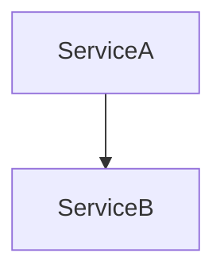

# Copilot Instructions — Architecture Interview Prep Docs

This is an MkDocs documentation site covering microservices and architectural patterns for senior developers preparing for architecture-role interviews.

---

## Project Structure

```
architectureStyle/
├── mkdocs.yml                          ← Site config and nav
├── requirements.txt                    ← Python deps (mkdocs + pymdown)
├── docs/
│   ├── index.md                        ← Master overview + learning path
│   ├── js/mermaid-init.js              ← Mermaid JS renderer
│   ├── 01-foundations.md               ← Architecture styles, CAP, Conway's Law
│   ├── 02-ddd.md                       ← Strategic + Tactical DDD
│   ├── 03-microservices-patterns.md    ← Decomposition, Integration, Sidecar, Outbox
│   ├── 04-event-driven.md              ← Kafka, CQRS, Event Sourcing, Saga
│   ├── 05-api-communication.md         ← REST, gRPC, GraphQL, Gateway, BFF, Mesh
│   ├── 06-resilience.md                ← Circuit Breaker, Retry, Bulkhead, Throttle
│   ├── 07-observability.md             ← Logs, Metrics, Traces, SLO, OTel
│   ├── 08-security.md                  ← OAuth2, JWT, mTLS, Secrets, Zero Trust [SUMMARY]
│   ├── 08.01-oauth2-and-oidc.md        ← Grant types, PKCE, SAML vs OAuth2 [DEEP DIVE]
│   ├── 08.02-jwt-deep-dive.md          ← RS256 vs HS256, JWKS, vulnerabilities [DEEP DIVE]
│   ├── 08.03-service-to-service-auth.md← mTLS, SPIFFE/SPIRE, K8s SA tokens [DEEP DIVE]
│   ├── 08.04-api-security-patterns.md  ← CORS, rate limiting, OWASP Top 10 [DEEP DIVE]
│   ├── 08.05-secrets-management.md     ← Vault, AWS SM, K8s secrets hardening [DEEP DIVE]
│   ├── 08.06-zero-trust.md             ← Five pillars, OPA, maturity model [DEEP DIVE]
│   ├── 09-deployment.md                ← K8s, Helm, GitOps, Strategies, 12-Factor
│   └── 10-interview.md                 ← Q&A, Trade-offs, ADRs, Spring Boot map
```

---

## How to Add or Expand Content

### Add a new top-level section
1. Create `docs/NN-section-name.md`
2. Add an entry to `nav:` in `mkdocs.yml`
3. Follow the content style guide below

### Add a sub-article within an existing section
When a topic grows large enough to split, use a numbered sub-file pattern:
1. Create `docs/NN-section-name.md` for the main article (e.g. `04-event-driven.md`)
2. Create `docs/04.01-topic-name.md` for the sub-article (e.g. `04.01-kafka-deep-dive.md`)
3. Update `nav:` in `mkdocs.yml`:
```yaml
- "04 · Event-Driven Architecture": 04-event-driven.md
- "04.01 · Kafka Deep Dive": 04.01-kafka-deep-dive.md
```

---

## Deep-Dive Article Pattern (Summary + Sub-articles)

The site uses a **two-tier content model**:

- **`NN-section.md`** — the summary: breadth-first, tables, quick reference. **Never remove or modify existing content here.** Only add `→ Deep Dive:` links.
- **`NN.XX-topic.md`** — focused deep-dives: one topic per file, progressively deeper.

### How 08-Security Was Expanded (Reference Implementation)

08-security.md is the completed example. Apply the same pattern to any other section.

**Step 1 — Identify 5–7 major topic clusters in the summary.**

For 08-security these were: OAuth2/OIDC, JWT, Service-to-Service Auth, API Security, Secrets Management, Zero Trust.

**Step 2 — Create one sub-article per cluster**, numbered `NN.01`, `NN.02`, etc:

```
08-security.md          ← summary, untouched
08.01-oauth2-and-oidc.md
08.02-jwt-deep-dive.md
08.03-service-to-service-auth.md
08.04-api-security-patterns.md
08.05-secrets-management.md
08.06-zero-trust.md
```

**Step 3 — Add a `→ Deep Dive:` link** at the end of each corresponding section in the summary:

```markdown
## OAuth2 & OIDC

... (existing summary content unchanged) ...

→ **[Deep Dive: OAuth2 & OIDC](08.01-oauth2-and-oidc.md)** — Grant types, PKCE flow, SAML vs OAuth2, common mistakes
```

**Step 4 — Structure each sub-article** with this template:

```markdown
# Topic Name — Deep Dive

> **Level:** Beginner | Intermediate | Advanced
> **Pre-reading:** [NN · Parent Summary](NN-section.md) · [NN.XX · Related Article](NN.XX-related.md)

---

## Section 1 ...

## Section 2 ...

---

??? question "Interview question about this topic?"
    Concise answer, 2–4 lines.
```

**Step 5 — Add all sub-articles to `mkdocs.yml`** under the same nav group as the summary:

```yaml
- Operations & Security:
  - "08 · Security": 08-security.md
  - "08.01 · OAuth2 & OIDC": 08.01-oauth2-and-oidc.md
  - "08.02 · JWT Deep Dive": 08.02-jwt-deep-dive.md
  - "08.03 · Service-to-Service Auth": 08.03-service-to-service-auth.md
  - "08.04 · API Security Patterns": 08.04-api-security-patterns.md
  - "08.05 · Secrets Management": 08.05-secrets-management.md
  - "08.06 · Zero Trust": 08.06-zero-trust.md
  - "09 · Deployment & Infrastructure": 09-deployment.md
```

### Learning Level Guidelines

| Level | Who It's For | Depth |
|:------|:------------|:------|
| **Beginner** | Concepts new to the reader | Definitions, diagrams, why it exists |
| **Intermediate** | Reader knows the concept, wants practical detail | Trade-offs, patterns, code examples, common mistakes |
| **Advanced** | Reader wants production-grade knowledge | Full flows, security vulnerabilities, configuration, comparisons |

### Sub-article Content Rules

- Always start with `> **Level:**` and `> **Pre-reading:**` breadcrumb links
- Include at least one Mermaid diagram per sub-article
- End with 2–3 `??? question` interview Q&A blocks
- Keep to the topic of the file — cross-link to other sub-articles rather than duplicating content
- Use `!!! tip`, `!!! warning`, `!!! note` callouts for key insights and gotchas

### Add a Mermaid diagram
Use triple-backtick mermaid blocks:
````

````

---

## Content Style Guide

**Goal:** Breadth over depth. This is a prep guide, not a textbook.

| Element                                    | Usage                                                                             |
|:-------------------------------------------|:----------------------------------------------------------------------------------|
| **Tables**                                 | Primary format for concept comparisons and definitions. Keep columns left aligned |
| **Mermaid diagrams**                       | Architecture flows, state machines, sequence diagrams                             |
| **`??? question`**                         | Collapsible interview Q&A blocks                                                  |
| **`!!! tip` / `!!! note` / `!!! warning`** | Callout boxes for key insights                                                    |
| **Bold**                                   | First occurrence of a key term                                                    |
| **Description length**                     | 1–2 lines per concept maximum                                                     |

### Admonition blocks
```markdown
!!! tip "Title"
    Key insight or recommendation.

!!! warning "Watch out"
    Common mistake or gotcha.

??? question "Interview question text?"
    Short answer, 2–4 lines maximum.
```

---

## Markdown List Rendering Rule

**Always add a blank line between a text/paragraph and the list that follows it.**

MkDocs (and most Markdown renderers) require a blank line before a list to render it correctly as a `<ul>` or `<ol>`. Without it, the list items render inline as plain text.

❌ **Wrong — no blank line before list:**
```markdown
**Best practices:**
- Use structured logging
- Include correlation IDs
- Never log secrets
```

✅ **Correct — blank line before list:**
```markdown
**Best practices:**

- Use structured logging
- Include correlation IDs
- Never log secrets
```

This applies everywhere:
- After a **bold label** like `**Benefits:**`, `**When used:**`, `**Best for:**`
- After a sentence or paragraph that introduces a list
- After a `>` blockquote that introduces a list
- Does NOT apply inside code blocks or YAML

---

## Mermaid Diagram Rules

1. **NEVER use `|` inside node labels** `[ ]` — it breaks the mermaid parser. Use `·` (middle dot U+00B7) instead: `[Partition 0 · Partition 1]`
2. Supported start keywords: `graph`, `sequenceDiagram`, `classDiagram`, `stateDiagram`, `erDiagram`, `pie`, `gitGraph`
3. Keep diagrams simple — maximum ~10–12 nodes for rendering reliability
4. Test all diagrams in live preview (`mkdocs serve`) before finalizing
5. Use `--` for dotted edges: `A -.-> B` (dotted), `A --> B` (solid)

---

## Build & Serve Commands

```bash
# First-time setup
python3 -m venv .venv
source .venv/bin/activate
pip install -r requirements.txt

# Local preview (hot reload)
python3 -m mkdocs serve
# → http://127.0.0.1:8000

# Production build
python3 -m mkdocs build
# → output in site/
```

---

## Adding Abbreviations & Tooltips

The site uses **hover tooltips** for technical terms — when readers hover over a dotted-underlined term, a popup shows its definition. This is powered by the `abbr` Markdown extension + a custom JavaScript tooltip engine.

### How It Works

1. **`docs/_abbreviations.md`** — Shared glossary file containing all term definitions
2. **`docs/js/tooltips.js`** — JavaScript that renders floating tooltips on hover (works inside tables!)
3. **Any page** can include abbreviations by adding one line at the bottom: `--8<-- "_abbreviations.md"`

### Adding a New Abbreviation — Step by Step

#### Step 1: Add the definition to `docs/_abbreviations.md`

Open `docs/_abbreviations.md` and add your term in the relevant section (or create a new comment section if needed):

```markdown
<!-- Your section category -->
*[Your Term]: Your definition here — 1–2 lines, concise and clear.
*[alternate form]: Same definition if the term appears in lowercase or different format.
```

**Example — adding "Replication":**
```markdown
<!-- Data consistency -->
*[Replication]: Copying data from one node to another; basis for fault tolerance and read scaling.
*[replication]: Copying data from one node to another; basis for fault tolerance and read scaling.
```

**Rules:**
- **One definition per term** — the JavaScript will display it on every match
- **Add case variants** if the term appears as both "CAP" and "cap" or "Vector Clocks" and "Vector clocks" (the extension is case-sensitive)
- **Keep definitions 1–2 lines max** — concise over verbose
- **Include key context** — "what it is" + "why it matters"
- **Use categories** with HTML comments to organize: `<!-- CAP / Consistency models -->`, `<!-- Common systems -->`, etc.

#### Step 2: Include abbreviations on your page

At the **very end** of your markdown file (after all content, after interview Q&As), add:

```markdown
--8<-- "_abbreviations.md"
```

This line tells MkDocs to include all abbreviations from that shared file. The `abbr` extension will automatically wrap every matching term with `<abbr title="...">` tags.

#### Step 3: Rebuild and test

Run the dev server:
```bash
source .venv/bin/activate
python3 -m mkdocs serve
```

Then open the page at `http://127.0.0.1:8000/` and look for **dotted-underlined terms**. Hover over one — you should see a dark tooltip bubble appear above the term with its definition.

### Adding Abbreviations to a New Page — Full Example

Say you're writing `docs/11-patterns.md` and want to add tooltips for terms like **Saga**, **Idempotent**, **Compensation**.

**In `docs/11-patterns.md`, add to `_abbreviations.md` first:**

```markdown
<!-- In _abbreviations.md, find or create a section for your terms -->
*[Saga]: Long-running distributed transaction split into compensatable steps.
*[Idempotent]: Operation that produces the same result no matter how many times it runs.
*[Compensation]: Rollback operation that reverses a previously completed transaction step.
*[idempotent]: Operation that produces the same result no matter how many times it runs.
```

**In `docs/11-patterns.md`, at the bottom:**

```markdown
## Patterns and Trade-offs

...content about sagas, idempotency, compensation...

--8<-- "_abbreviations.md"
```

Now every occurrence of "**Saga**", "**Idempotent**", "**idempotent**", and "**Compensation**" will have tooltips.

### Visual Styling

- **Dotted underline** (✓ visible, shows term is hoverable)
- **`cursor: help`** icon on hover
- **Dark tooltip bubble** (position: fixed, follows cursor, auto-flips at screen edges)
- **Works inside tables** — the JavaScript appends the tooltip to `<body>`, so it's never clipped by `overflow: hidden`

### Glossary Table (Optional)

Many pages include a **Glossary** section at the bottom before the abbreviations include:

```markdown
## Glossary

Key terms used on this page — hover over any **underlined** term throughout the article to see its definition inline.

| Term | Definition |
|:-----|:-----------|
| **Saga** | Long-running distributed transaction split into compensatable steps. |
| **Idempotent** | Operation that produces the same result no matter how many times it runs. |
| **Compensation** | Rollback operation that reverses a previously completed transaction step. |

--8<-- "_abbreviations.md"
```

This gives readers both a **reference table** at the bottom and **inline tooltips** throughout the page.

---

## Adding Interview Questions

In `docs/10-interview.md`, append to the Q&A section:

```markdown
??? question "What is X?"
    Concise answer in 2–4 lines. Include the key distinction or gotcha.
```

## Adding Spring Boot Mappings

In the Spring Boot mapping table in `docs/10-interview.md`:

```markdown
| Concept Name | Spring Boot library or module |
```

## Adding a Trade-off Entry

In the trade-off table in `docs/10-interview.md`:

```markdown
| **X vs Y** | When to pick X | When to pick Y |
```

---

## Tone & Voice

- Senior-developer-to-senior-developer; skip the basics
- State the pattern, the trade-off, and when NOT to use it
- Prefer concrete examples over abstract descriptions
- Use past tense for events ("OrderPlaced"), imperative for commands ("PlaceOrder")
