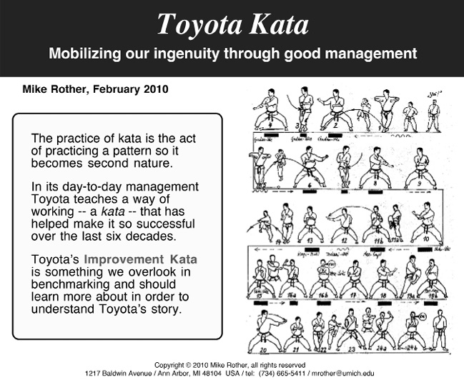

Dr. Eliyahu Goldratt wrote his seminal book, 
The Goal: A Process of Ongoing Improvement, in 1984. 
It’s a Socratic novel about Alex Rogo, a plant manager who must fix his 
cost and due date issues in ninety days, or his plant will be shut down.
This book has been incorporated into many MBA curriculums, 
influenced multiple generations of business leaders, and sold over six million copies to date.

In The Goal, Dr. Goldratt starts to describe the steps in the Theory of Constraints (TOC) methodology. 
Briefly, the five original TOC steps are:

- Identify the constraint
- Exploit the constraint
- Subordinate all other activities to the constraint
- Elevate the constraint to new levels
- Find the next constraint

# Other Management Frameworks
The Five Dysfunctions of a Team:

Patrick Lencioni’s model outlines core dysfunctions (e.g., lack of trust, fear of conflict) that hinder team performance. Building trust and vulnerability is vital for success.
Toyota Kata:

Mike Rother’s Toyota Kata emphasizes the need for systematic routines (kata) to foster improvement and adaptability in organizations.
Continuous Delivery:

Jez Humble and David Farley’s work on continuous delivery highlights practices necessary for reliable software releases, emphasizing system-wide performance over individual silos.
Release It!:

Michael T. Nygard’s book focuses on designing production-ready software, bridging gaps between development and operations.
Visible Ops and ITIL:

The Visible Ops series emphasizes practical steps for achieving high performance in IT organizations, complementing ITIL’s descriptive frameworks.
Kanban Methodology:

Books by Jim Benson and David J. Anderson promote kanban as a means to manage work-in-progress (WIP) and improve efficiency in technology businesses.

Eliyahu M. Goldratt, who created the Theory of Constraints, 
showed us how any improvements made anywhere _**besides**_ the bottleneck are an illusion.

Goldratt taught us that in most plants, there are a very small number of resources, whether it’s men, machines, or materials, that dictates the output of the entire system. We call this the constraint—or bottleneck. Either term works. Whatever you call it, until you create a trusted system to manage the flow of work to the constraint, the constraint is constantly wasted, which means that the constraint is likely being drastically underutilized.

The concepts from The Goal by Eli Goldratt, particularly the Theory of
Constraints (TOC) as it applies to operations management.

Understand how to manage constraints in their organization.

**Identify the Constraint**: Determine the resource that limits the overall
output of the system.
This is crucial, as misidentifying the constraint can lead to ineffective
solutions.
The narrator has identified Brent as a constraint
affecting service restoration.

**Exploit the Constraint**: Ensure that the constraint is utilized to its full
potential. This means minimizing any downtime and ensuring that it is always 
working on the most critical tasks.
The advice stresses maximizing the use of Brent’s time by ensuring he works on
high-priority tasks and minimizing unplanned work that detracts from planned 
initiatives.

**Subordinate to the Constraint**: Align the entire system to support the
constraint. This involves adjusting the flow of work and prioritizing tasks
based on the capacity of the constraint, ensuring it’s not overwhelmed.

The concept of **Drum-Buffer-Rope** is introduced, highlighting the need to 
align the flow of work with the capacity of the constraint, just as Alex did
with his plant’s bottleneck.

**Elevate the Constraint**: Take steps to increase the capacity of the
constraint. This could involve investing in additional resources or improving
processes related to the constraint.

**Repeat the Process**: Once a constraint is resolved, return to the first step
to identify the next constraint. Continuous improvement is essential for
optimizing the system.

Importance of Design: The discussion shifts to how underlying issues, like those
caused by the "Phoenix" project, need to be addressed in development to prevent
ongoing unplanned work. The focus is on integrating stability and other key
requirements into the design process.

Outcome vs. Process: The conversation concludes with the reminder that
understanding what truly matters to the business outcomes is crucial — 
prioritizing effective work over mere completion of tasks.

# WIP

Three incredible scientifically-grounded management movements.
- the Theory of Constraints,
- Lean production or the Toyota Production System, and 
- Total Quality Management. 

Although each movement started in different places, they all agree on one thing: 
**WIP is the silent killer**. Therefore, one of the most critical mechanisms in
the management of any plant is **job and materials release**. 
Without it, you can’t control WIP.”

That inability to control WIP on the plant floor was one of the root causes for
chronic due-date problems and quality issues.

Index cards on a kanban board is one of the best mechanisms to do this, because everyone can see WIP

# KATA

[https://www.lean.org/lexicon-terms/kata/](https://www.lean.org/lexicon-terms/kata/)
