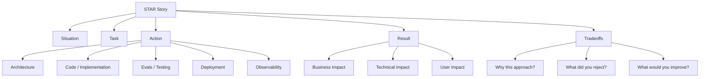
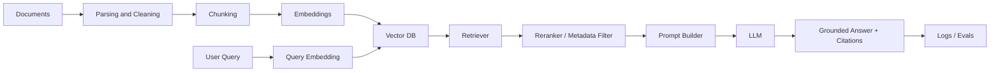
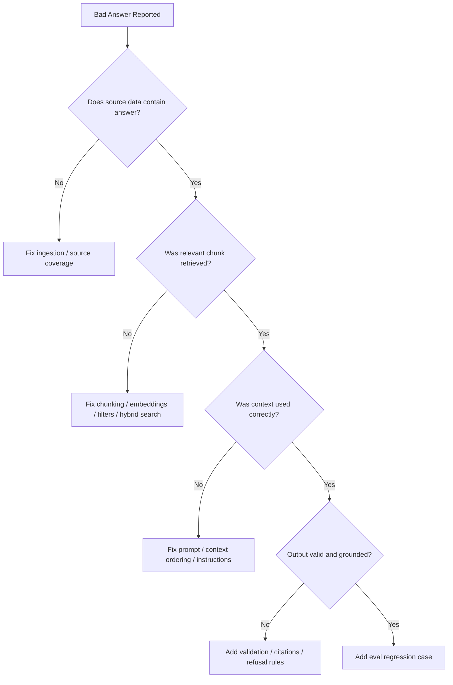
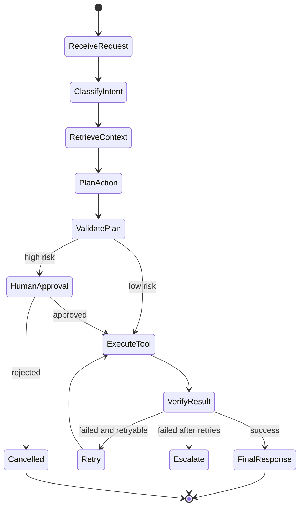
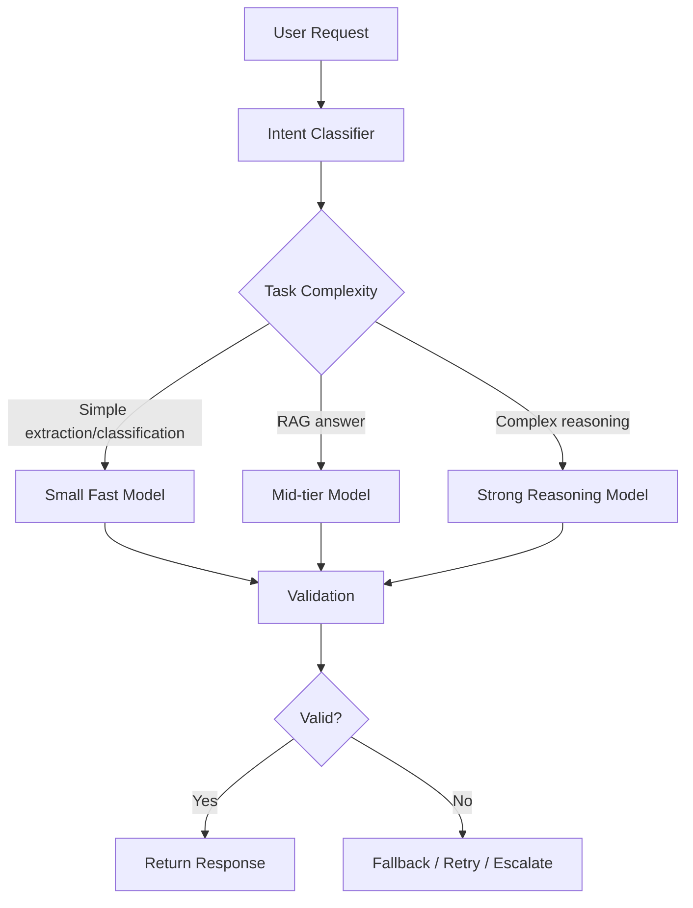
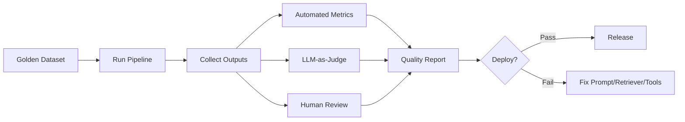
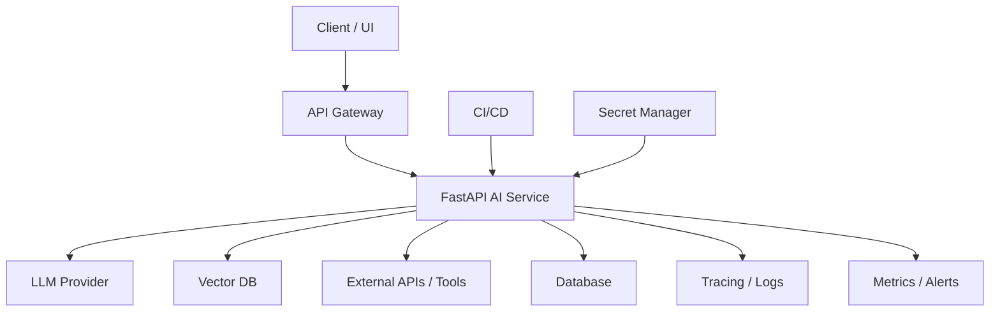
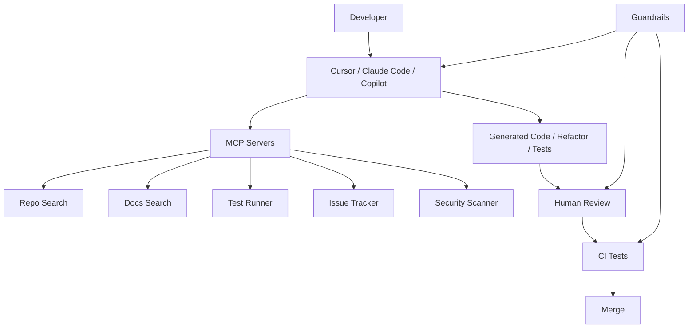
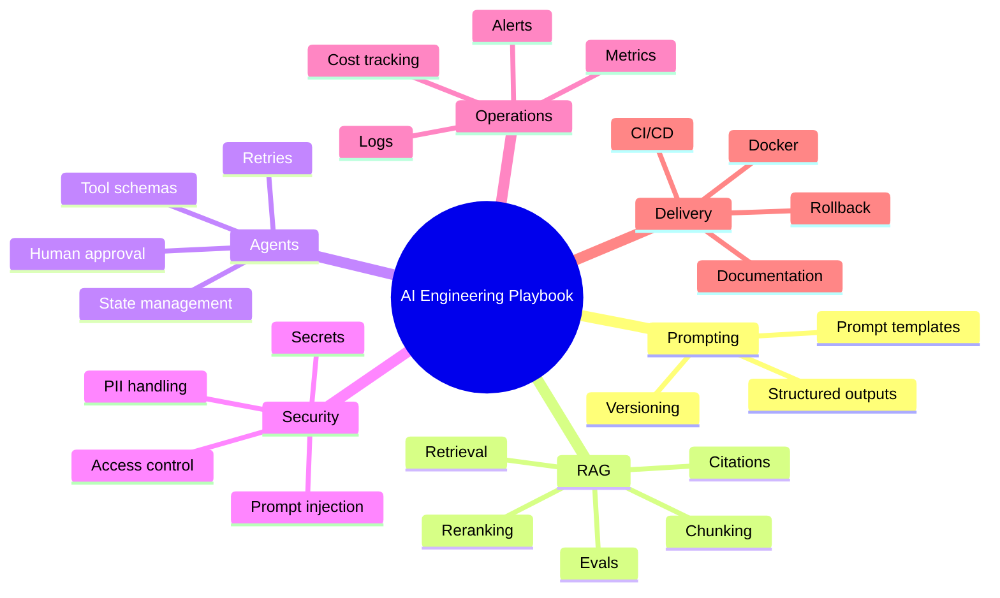
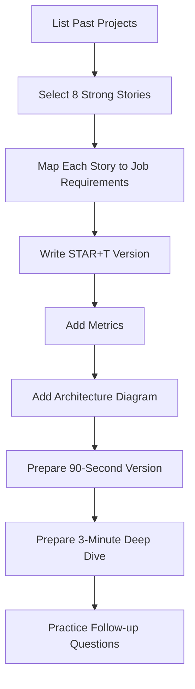

# STAR Stories Preparation Guide for AI Engineer / Agentic AI / LLMOps Roles

> Purpose: Use this as a practical interview reference for roles involving LLM applications, RAG, agents, LangGraph/LangChain, MCP, AI coding tools, production deployment, evaluations, observability, and guardrails.

---

## 1. Why STAR Stories Matter for These Roles

For these jobs, interviewers are looking for proof that you can:

- Build production-grade LLM applications, not just demos.
- Own systems end-to-end: architecture, coding, debugging, deployment, monitoring, and iteration.
- Handle ambiguity, failures, latency, cost, and quality issues.
- Communicate tradeoffs clearly to engineering, product, and leadership.
- Use AI tools responsibly in enterprise or startup environments.

A strong STAR story should prove one or more of these signals:

```text
Ownership + Technical Depth + Production Reliability + Measurable Impact
```

---

## 2. STAR Format for AI/LLM Roles

Classic STAR means:

- **S — Situation:** What was the business/product/technical context?
- **T — Task:** What were you responsible for?
- **A — Action:** What exactly did you design, build, debug, or improve?
- **R — Result:** What changed? Use metrics where possible.

For AI engineering roles, extend STAR into **STAR+T**:

- **T — Tradeoffs:** What alternatives did you consider and why did you choose your approach?

### STAR+T Structure

```text
Situation:
  What was the context? What problem existed?

Task:
  What was your responsibility? What did success look like?

Action:
  What architecture, tools, code, workflows, evals, or processes did you implement?

Result:
  What measurable impact happened? Reliability, cost, latency, quality, adoption, revenue, retention?

Tradeoffs:
  What options did you reject? What constraints shaped your decision?
```

---

## 3. STAR Story Selection Matrix

Prepare at least **8 reusable stories**. Each story should map to multiple interview questions.

| Story Type | What It Proves | Typical Interview Question |
|---|---|---|
| Built an LLM/RAG app | Hands-on GenAI development | Tell me about an AI system you built. |
| Debugged bad AI output | Reliability mindset | How do you debug hallucinations or bad retrieval? |
| Built an agent/tool workflow | Agentic AI skill | How have you used tool calling or agents? |
| Improved latency/cost | Production maturity | How do you optimize LLM systems? |
| Created evals/monitoring | LLMOps maturity | How do you measure quality? |
| Deployed to production | Engineering depth | How do you ship AI systems? |
| Used AI coding tools/MCP | Modern AI engineering | How do you use Cursor/Copilot/Claude Code safely? |
| Led standards/playbooks | Leadership/governance | How do you enable teams with AI best practices? |

---

## 4. Mermaid Diagram: How STAR Stories Map to Interview Signals



---

## 5. The 8 Most Useful STAR Stories to Prepare

---

# Story 1: Built a RAG-Based Knowledge Assistant

## Use this for questions like:

- Tell me about an LLM application you built.
- How do you implement RAG?
- How do you reduce hallucination?
- How do you evaluate retrieval quality?

## STAR Template

```text
Situation:
  The team needed a way to answer questions from internal documents / policies / product docs / support tickets.
  Existing search was slow, keyword-based, and users often received incomplete answers.

Task:
  I was responsible for designing and implementing a RAG-based assistant that could retrieve relevant context and generate grounded answers with citations.

Action:
  I built a document ingestion pipeline, chunked documents by semantic sections, generated embeddings, stored them in a vector database, and created a retrieval flow.
  I added metadata filtering, top-k retrieval, prompt grounding, structured output, citations, and fallback behavior when confidence was low.
  I created a small eval set of representative questions to test retrieval hit rate, answer faithfulness, and hallucination cases.

Result:
  The assistant improved answer quality, reduced manual lookup time, and created a repeatable pattern for future knowledge-assistant use cases.
  If metrics are available, mention them: retrieval accuracy, latency, reduction in support tickets, user adoption, or time saved.

Tradeoffs:
  I chose RAG over fine-tuning because the knowledge changed frequently and needed source-grounded answers.
  I used chunking plus metadata filtering instead of only raw vector search because enterprise documents often require access control and domain-specific filtering.
```

## Architecture Diagram



## Code Talking Point

```python
# Simplified RAG flow pseudo-code
query = "What is the refund policy for enterprise customers?"

query_embedding = embedding_model.embed(query)
retrieved_chunks = vector_db.search(
    embedding=query_embedding,
    top_k=5,
    filters={"department": "policy", "region": "US"}
)

prompt = build_grounded_prompt(query, retrieved_chunks)
response = llm.generate(prompt)

validated = validate_answer_has_citations(response)
log_trace(query, retrieved_chunks, response, validated)
```

---

# Story 2: Debugged a Poor-Quality RAG or LLM System

## Use this for questions like:

- Your RAG system gives wrong answers. What do you do?
- How do you debug hallucinations?
- How do you improve AI quality?

## STAR Template

```text
Situation:
  Users reported that the AI assistant gave incomplete or incorrect answers for certain questions.

Task:
  I needed to identify whether the issue was caused by retrieval, prompting, model behavior, or missing source data.

Action:
  I inspected traces and separated the pipeline into stages: document availability, chunking, retrieval, reranking, prompt construction, LLM output, and validation.
  I discovered that relevant information was split across chunks or not retrieved due to weak metadata and poor chunk boundaries.
  I adjusted chunking, added metadata filters, improved query rewriting, added reranking, and updated prompts to require citations and refusal when context was insufficient.
  I created regression tests so the same failures would not reappear.

Result:
  Retrieval quality improved, hallucinations reduced, and the system became easier to debug because each stage had logs and eval checks.

Tradeoffs:
  I avoided solving the issue only through prompt changes because the root cause was retrieval quality.
  I preferred pipeline-level fixes over manual prompt patching.
```

## Debugging Flow



---

# Story 3: Built an Agentic Workflow with Tool Calling

## Use this for questions like:

- Tell me about your experience with agents.
- How do you design tool-calling workflows?
- How do you make agents reliable?

## STAR Template

```text
Situation:
  A business process required multiple steps across systems, such as classifying a request, retrieving context, calling an API, verifying the action, and notifying the user.

Task:
  I was responsible for designing an AI-assisted workflow that could reason over the request but execute actions safely and reliably.

Action:
  I designed a hybrid workflow where deterministic code handled state transitions, permissions, retries, and validation, while the LLM handled classification, summarization, and reasoning.
  I defined tool schemas, added input/output validation, implemented retry limits, and logged every tool call.
  For high-risk actions, I added human approval or dry-run mode.

Result:
  The system automated a multi-step workflow while maintaining control, auditability, and reliability.

Tradeoffs:
  I avoided a fully autonomous agent because it was harder to test and control.
  I used a constrained state-machine approach to make behavior more predictable.
```

## Agent Workflow Diagram



## Tool Schema Example

```python
from pydantic import BaseModel, Field
from typing import Literal

class CreateTicketInput(BaseModel):
    user_id: str
    issue_summary: str
    priority: Literal["low", "medium", "high"]
    category: Literal["billing", "technical", "account", "other"]


def create_ticket_tool(payload: CreateTicketInput):
    """Create a support ticket after validating user request."""
    # Validate permissions
    # Call ticketing API
    # Return ticket ID and status
    return {"ticket_id": "TCK-12345", "status": "created"}
```

---

# Story 4: Improved Latency and Cost of an LLM System

## Use this for questions like:

- How do you optimize LLM cost?
- How do you reduce latency?
- How do you handle model routing?

## STAR Template

```text
Situation:
  An LLM workflow was useful but too slow or expensive for production usage.

Task:
  I needed to reduce cost and latency without significantly degrading quality.

Action:
  I analyzed traces and token usage to identify expensive steps.
  I introduced model routing: small/cheap models for classification and extraction, stronger models for complex reasoning.
  I reduced prompt size, compressed context, cached repeated results, streamed responses, and added timeouts/fallbacks.
  I tracked cost per successful task, not just cost per request.

Result:
  The workflow became faster and more cost-effective while preserving quality for high-value tasks.

Tradeoffs:
  I did not use the strongest model for every step because many tasks did not require deep reasoning.
  I balanced quality, cost, and latency based on task criticality.
```

## Model Routing Diagram



---

# Story 5: Created Evaluation and Monitoring for LLM Apps

## Use this for questions like:

- How do you evaluate LLM applications?
- How do you know a prompt change improved the system?
- How do you monitor agent quality?

## STAR Template

```text
Situation:
  The AI system was being updated frequently, but quality was hard to measure consistently.

Task:
  I needed to create a repeatable evaluation and monitoring process.

Action:
  I created a golden dataset with representative queries, expected sources, expected behavior, and failure cases.
  I added evaluation checks for retrieval hit rate, faithfulness, answer relevance, structured-output validity, tool-call accuracy, latency, and cost.
  I logged traces for prompt, model, retrieved context, tool calls, outputs, and user feedback.
  I used regression tests before deploying prompt/model/retriever changes.

Result:
  The team could compare changes objectively and catch regressions before production.

Tradeoffs:
  I combined automated evals with human review because LLM quality is partly subjective and task-specific.
```

## Evaluation Pipeline



## Eval Config Example

```yaml
rag_eval:
  dataset: golden_questions_v1.jsonl
  metrics:
    - retrieval_hit_rate
    - context_precision
    - faithfulness
    - answer_relevance
    - citation_accuracy
  thresholds:
    retrieval_hit_rate: 0.85
    faithfulness: 0.90
    citation_accuracy: 0.90

agent_eval:
  metrics:
    - task_success_rate
    - tool_call_accuracy
    - retry_rate
    - average_steps
    - cost_per_successful_task
```

---

# Story 6: Deployed an AI System to Production

## Use this for questions like:

- How do you deploy LLM apps?
- What production concerns do you consider?
- How do you handle secrets, monitoring, and failures?

## STAR Template

```text
Situation:
  A prototype LLM application needed to be turned into a reliable production service.

Task:
  I was responsible for productionizing the system and making it maintainable.

Action:
  I wrapped the AI workflow in a FastAPI service, containerized it with Docker, configured secrets through a secret manager, added structured logs, health checks, retries, timeouts, and error handling.
  I separated configuration from code, created CI/CD checks, added evaluation gates, and documented deployment and rollback steps.

Result:
  The system moved from demo stage to a deployable service with monitoring, versioning, and operational controls.

Tradeoffs:
  I avoided putting too much orchestration logic inside prompts and kept critical business rules in deterministic code.
```

## Production Deployment Diagram



## FastAPI Skeleton

```python
from fastapi import FastAPI, HTTPException
from pydantic import BaseModel

app = FastAPI(title="AI Workflow Service")

class QueryRequest(BaseModel):
    user_id: str
    question: str

@app.post("/ask")
async def ask(request: QueryRequest):
    try:
        result = await run_ai_workflow(
            user_id=request.user_id,
            question=request.question
        )
        return result
    except TimeoutError:
        raise HTTPException(status_code=504, detail="AI workflow timed out")
    except Exception as e:
        # Log exception with trace ID
        raise HTTPException(status_code=500, detail="Internal error")
```

---

# Story 7: Used AI Coding Tools Safely in Engineering Workflows

## Use this for questions like:

- How do you use Cursor, Claude Code, or Copilot?
- How would you lead an AI coding pilot?
- What guardrails are needed for AI-assisted development?
- What is MCP used for?

## STAR Template

```text
Situation:
  The engineering team wanted to use AI coding tools to improve productivity, but there were concerns around security, quality, and consistency.

Task:
  I was responsible for designing a pilot workflow and defining standards for safe usage.

Action:
  I identified high-value use cases: test generation, refactoring, documentation, code explanation, and migration assistance.
  I configured tool access, repo context, and approved usage patterns.
  I defined guardrails: no secrets in prompts, mandatory code review, tests required for AI-generated changes, license/security checks, and auditability.
  I created quick-start guides, prompt templates, and examples for developers.

Result:
  The pilot helped developers use AI tools more consistently while reducing risk.

Tradeoffs:
  I positioned AI coding tools as accelerators, not replacements for engineering judgment.
  I required human review for production changes.
```

## AI Coding Pilot Diagram



## AI Coding Guardrails Checklist

```markdown
- [ ] Do not paste secrets, credentials, customer data, or sensitive code into unapproved tools.
- [ ] Use approved enterprise accounts and configured IDE extensions only.
- [ ] Require human review for all AI-generated code.
- [ ] Require tests for generated or refactored logic.
- [ ] Run static analysis and security scans.
- [ ] Track productivity and quality metrics.
- [ ] Document successful prompts and workflows.
- [ ] Use MCP/context tools with least-privilege access.
```

---

# Story 8: Created Engineering Standards, Guardrails, or Playbooks

## Use this for questions like:

- How do you enable teams with AI best practices?
- How do you create GenAI governance?
- How do you mentor engineers in AI adoption?

## STAR Template

```text
Situation:
  Multiple teams were experimenting with LLMs, but practices were inconsistent and risk controls were unclear.

Task:
  I needed to create reusable standards and playbooks that helped teams build safely and faster.

Action:
  I created templates for prompt design, RAG architecture, tool calling, evaluation, observability, deployment, and security review.
  I defined approval criteria for production readiness and created examples for common workflows.
  I held enablement sessions and gathered feedback from developers using the playbooks.

Result:
  Teams had a repeatable approach for building AI systems, reducing duplicated effort and improving quality.

Tradeoffs:
  I kept standards lightweight enough for fast-moving teams while requiring stricter controls for high-risk use cases.
```

## Playbook Structure



---

## 6. Metrics You Can Use in STAR Stories

Use numbers wherever possible. If you do not have exact numbers, use conservative phrasing like “approximately,” “reduced by around,” or “improved from X to Y in internal testing.”

### Technical Metrics

- Latency reduced by X%
- Cost per task reduced by X%
- Retrieval hit rate improved from X to Y
- Hallucination/error rate reduced by X%
- Tool-call success rate improved by X%
- Regression pass rate improved to X%
- Deployment frequency increased
- Incident count reduced

### Product/Business Metrics

- Support tickets reduced by X%
- Manual review time reduced by X hours/week
- User adoption increased
- Conversion or retention improved
- Content generation throughput increased
- Internal developer productivity improved

### Quality Metrics

- Faithfulness score
- Answer relevance
- Citation accuracy
- Task completion rate
- Human approval/rejection rate
- Escalation rate

---

## 7. Mermaid Diagram: STAR Story Preparation Workflow



---

## 8. 90-Second Answer Formula

Use this when the interviewer asks a broad question.

```text
One project that is relevant is [project name].
The problem was [business/technical problem].
My role was [specific ownership].
I designed/built [architecture/components].
The difficult part was [failure mode/tradeoff].
I handled it by [specific technical actions].
The result was [metric/impact].
The main lesson was [production insight].
```

### Example

```text
One project that is relevant is a RAG-based internal knowledge assistant.
The problem was that users had to manually search policy documents and often got incomplete answers.
My role was to design the retrieval and answer-generation pipeline.
I built ingestion, chunking, embeddings, vector search, metadata filters, grounded prompting, and citations.
The difficult part was that answers were sometimes wrong even when the data existed, so I debugged retrieval separately from generation.
I improved chunking, added metadata filtering and reranking, and created regression evals.
The result was a more reliable assistant with measurable improvements in answer quality and faster information lookup.
The main lesson was that RAG quality depends as much on retrieval and evaluation as on the LLM prompt.
```

---

## 9. Follow-Up Questions to Prepare for Each Story

For every STAR story, prepare answers to these:

```text
1. What was your exact contribution?
2. What architecture did you choose and why?
3. What were the biggest failure modes?
4. How did you evaluate quality?
5. How did you handle latency and cost?
6. How did you make it secure?
7. What would you improve if you had more time?
8. What tradeoffs did you make?
9. How would you scale it?
10. What did you learn?
```

---

## 10. Red Flags to Avoid in STAR Answers

Avoid saying:

```text
- I just used ChatGPT with a prompt.
- I built a demo but did not test it.
- I did not measure quality.
- I did not handle failures.
- I did not log tool calls or outputs.
- I used agents for everything.
- I fine-tuned because RAG was hard.
- I do not know how it behaved in production.
```

Say instead:

```text
- I separated deterministic workflow logic from LLM reasoning.
- I added evals and traces to understand failures.
- I used guardrails for tool execution.
- I measured latency, cost, quality, and task success.
- I treated prompts as versioned artifacts.
- I designed for retries, fallbacks, and observability.
```

---

## 11. Quick Checklist Before Interviews

```markdown
- [ ] I have 8 STAR+T stories ready.
- [ ] Each story has a metric or measurable impact.
- [ ] Each story has a technical architecture explanation.
- [ ] I can explain RAG debugging clearly.
- [ ] I can explain agent reliability clearly.
- [ ] I can explain evals and monitoring clearly.
- [ ] I can discuss LangGraph/LangChain/CrewAI at a practical level.
- [ ] I can discuss AI coding tools and MCP guardrails.
- [ ] I have one portfolio project or GitHub example to reference.
- [ ] I can answer “what would you improve?” for every story.
```

---

## 12. Best Story Bank for These Specific Job Descriptions

Prioritize your stories in this order:

```text
1. Production-style RAG application
2. Agentic workflow with tool calling
3. LangGraph/state-machine orchestration
4. Evaluation and observability framework
5. Cost/latency optimization
6. AI coding tools pilot with Cursor/Claude Code/Copilot
7. MCP/context-injection setup or design
8. Engineering standards/playbooks and guardrails
```

If you lack direct production experience, frame personal or home projects professionally:

```text
I built this as a production-style project, with Docker, FastAPI, evals, logging, and failure handling, to mirror how I would ship it in an enterprise/startup environment.
```

---

## 13. Final Positioning Statement

Use this as your high-level interview positioning:

```text
My strength is building practical LLM systems around real engineering constraints.
I understand the model layer, but I focus heavily on the production system around it: RAG, tool calling, orchestration, state, evals, observability, guardrails, deployment, and cost/reliability tradeoffs.
I try to design AI systems that are useful, measurable, and safe to operate—not just impressive in a demo.
```
